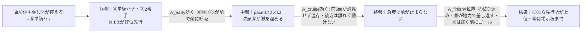
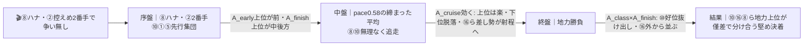
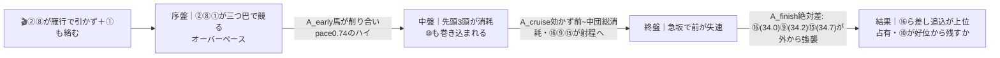

# 🏇 洲本特別（2026-06-07 阪神 ダート1400m 馬場=当日確定）分析

**モデル: scoring-model v5.0（論理ファースト・相変位再帰を因果骨格として使用）** ／ 使用観点: 10観点（A〜I, K）／ 出走 16頭
> 着順の並びは論理で決め、印で示す（%は出さない）。枠順は確定済み（draw_fixed=true）→ §2-1/§2-2/§3 本文に織り込み済み。

## 1. サマリ（結論）

- **予想本命 ◎**: **5-10 マイティマイティー** — 本field最速級の持ち時計（1:22.8〜直近1:23.9）×先行力×坂井瑠星でダ1400短縮が完全フィット。**展開不問**で全パターン上位＝最も安定して買える地力馬。
- **対抗 ◯**: **4-8 カナタコナタ** — テン速の3歳逃げ、阪神ダ1400勝ち実績。**単騎で行けば楽逃げ最有力**だが、内の②と先手争いになると消耗＝展開の鍵を握る当事者。
- **単穴 ▲**: **8-16 ポッドドンナー** — 出走中最速の上り34.0＋持ち時計1:22.3、M.デムーロ、最外8枠。**ハイ寄り（潰し合い）展開で本領**、前残りだと届かないのが唯一の懸念。
- **連下 △**: **1-1 ジュルナール**（先行・1勝クラス完勝で連勝中・内前残り恩恵／昇級未知）、**3-5 レイワサンサン**（先行堅実・前残り受益／決め手と詰めの甘さ）
- **注意 ×**: **3-6 コスモストーム**（時計は最速級1:23.0台連発・近走凡走）、**2-4 リサシテーション**（直近ダ1400を2連勝で一変・データ矛盾・ハイ展開なら一発）
- **最有力展開**: **P1 単騎楽逃げ・前残り（本線★★★）**（鍵馬: ⑧②）。対抗 **P3 平均・地力決着★★** と **P2 二枚看板潰し合い・外差し★★**、伏線 P5 / P4。
- **展開を分ける一点**: ⏱ **②ポッドデスペアと⑧カナタコナタの先手争いが「単騎で収まる」か「雁行で潰し合う」か**。単騎→前残り（◎◯△有利）、雁行→ハイで外差し（▲台頭）。当日の出脚で即判定。

> 馬券（何をどう買うか）はユーザー判断。本レポートは展開と着順の予測のみを提示する。

## 0. 当日アップデート・ボード（当日更新枠 ⏱）

### 0-1. 当日の参考レース（バイアス採取用・同日阪神ダート）

| R | 発走 | コース | 一致度 | 何を読むか |
|---|------|--------|:-----:|-----------|
| 4R | 11:20 | ダ・右・**1400** | ★★★ | 同距離同コース＝前残りか外差し届くか・内外どちらが伸びるか（最重要） |
| 7R | 13:10 | ダ・右・1800（1勝クラス） | ★★☆ | 直前の砂の脚抜け・決まり手と伸び位置のみ流用（距離違いで割引） |
| 3R | 10:50 | ダ・右・1800（未勝利） | ★☆☆ | 朝の馬場の質（高速/タフ）の初期把握 |

→ **観察結果（当日記入）**: ペース層 ___／内外バイアス ___／決まり手（逃先差追）___／伸びる位置 ___
> この行が埋まったら **§2-3 当日修正**へ。②⑧の先手争いの帰趨で P1↔P2 のティアを付け替える。

### 0-2. 馬場（当日確定）
| 項目 | 値（当日記入） | 質の読み |
|------|----------------|----------|
| 馬場状態 | 良/稍/重/不 | 乾いた高速良→前残り増幅（◎◯△有利）／渋り→前のオーバーペース化で差し（▲）の振れ |
| クッション値 | ___ | 高い=高速 / 低い=力要る |
| 含水率（ゴール前/4角） | ___ / ___ | ダ:低い=時計かかる＝差し届きやすい |

### 0-3. パドック・返し馬・馬体重（注目馬）
| 印 枠-馬番 馬名 | 馬体重(増減) | パドック/返し馬（当日記入） | 気配 |
|------------|--------------|------------------------------|:----:|
| ◎ 5-10 マイティマイティー | ___ (±__) | | ↑/→/↓ |
| ◯ 4-8 カナタコナタ | ___ (±__) | （逃げ馬＝気合乗り・チャカつきを確認） | ↑/→/↓ |
| ▲ 8-16 ポッドドンナー | ___ (±__) | （デムーロ初コンビ・落ち着き） | ↑/→/↓ |
| △ 1-1 ジュルナール | ___ (±__) | | ↑/→/↓ |

### 0-4. その他当日情報（分析時点で未確定のものだけ）
- 当日発表の乗り替わり／取消・除外: ___
- 天候推移（朝→発走時）: ___
- **②⑧①の出脚（気合乗り）**: ___（先手争いの当事者＝最重要観察ポイント）

## 2. 展開予想【成果物1】（STEP4a 展開合成）

> **検証契約**: 脚質別有利不利・隊列・各パターンの段階フロー（序盤→中盤→終盤）を馬番・符号・可能性ティアで固定する。

### 2-1. 脚質分類表（全馬・観点E証拠／確定枠を反映）

| 枠-馬番 | 馬名 | 騎手 | 脚質 | テン速 | 近走1角(位置/頭数) | 想定位置 |
|--------|------|------|------|--------|--------------------|----------|
| 4-8 | カナタコナタ | 西村淳也 | 逃 | 速 | 1,2,1,3 | **ハナ最有力**（争いの核） |
| 1-2 | ポッドデスペア | 中井裕二 | 逃 | 速 | 1 | ハナ主張のもう一方（止まる型・先手必須） |
| 1-1 | ジュルナール | 田山旺佑 | 先 | 中 | 4,10,2,1 | 逃げ2頭直後・好位イン（ハナ争い加担も） |
| 5-10 | マイティマイティー | 坂井瑠星 | 先 | 中 | 2,1,9,2 | 先行集団の中心・3番手前後・自在 |
| 3-5 | レイワサンサン | 鮫島克駿 | 先 | 中 | 2,3,5,6 | 先行集団の一角・好位イン |
| 6-11 | ホウオウゴールド | 小沢大仁 | 追 | 遅 | 10,11,12,9 | 後方（外目枠） |
| 3-6 | コスモストーム | 秋山稔樹 | 追 | 遅 | 11,11,9,6 | 中後方（位置上げ傾向） |
| 4-7 | ハリウッドブルース | 渡辺竜也 | 追 | 遅 | 11,10,14,11 | 後方固定 |
| 5-9 | ハリウッドパーク | 富田暁 | 追 | 遅 | 7,6,2,13 | 後方待機（展開待ち） |
| 7-14 | ラヴオントップ | 吉村誠之助 | 追 | 遅 | 14,13,14,5 | 後方〜中団（外枠） |
| 8-15 | テラステラ | 団野大成 | 追 | 遅 | 10,4,10,10 | 中後方（**最外で外回せる**） |
| 8-16 | ポッドドンナー | M.デムーロ | 差 | 遅 | 8,7,8,11 | 中団〜後方（**最外・絶好枠**） |
| 2-3 | キングツェッペリン | 松若風馬 | 追 | 遅 | 12,8,12,7 | 後方〜中後（内枠・揉まれ） |
| 2-4 | リサシテーション | 菱田裕二 | 追 | 遅 | 13,13,14,16 | 最後方（内枠不利・展開頼み） |
| 7-13 | ロードオルデン | 酒井学 | 追 | 遅 | 10,13,9,14 | 後方（7歳・外枠） |
| 6-12 | マーゴットレーヴ | 古川奈穂 | 追 | 遅 | 12,13,12,15 | 最後方常連 |

> **構図**: テン速の逃げ2頭（②④枠と⑧）以外はほぼテン遅の追込勢＝**前少数・後方大密集**。阪神ダ1400は1角まで約540m・芝150mスタートで**外枠（7-8枠）が構造有利**、内1-2枠は砂被り・揉まれリスク。

### 2-2. 展開パターン（複数・可能性ティア）

| id | パターン名 | 可能性 | 発動トリガー | 有利脚質（符号） | 浮上馬 | 沈む馬 |
|----|-----------|:-----:|--------------|------------------|--------|--------|
| P1 | 単騎楽逃げ・前残り | 本線★★★ | ⑧が主張し②が控える→⑧単騎ハナ（乾いた高速良で増幅） | 逃+2 先+1 差-1 追-2 | 8 10 1 5 | 16 9 4 |
| P3 | 平均流れ・地力決着 | 対抗★★ | ⑧ハナ・②控えめ2番手で過度な争い無し | 逃0 先+1 差0 追-1 | 10 16 8 6 | 11 13 12 |
| P2 | 二枚看板潰し合い・外差し台頭 | 対抗★★ | ②⑧が雁行で引かず＋①も絡む（渋り馬場で増幅） | 逃-2 先-1 差+2 追+1 | 16 9 15 14 | 2 8 1 |
| P4 | 超ハイ総崩れ・大波乱 | 伏線★ | ②⑧①に⑩まで先行争い参加 | 逃-2 先-2 差+2 追+2 | 16 9 4 14 15 | 2 8 1 10 |
| P5 | ②主張・⑧控え変則前残り | 伏線★ | ②が強く行き⑧が2番手控え | 逃0 先+1 差0 追-1 | 8 10 1 | 2(失速) |

> 可能性ティア = 本線★★★ / 対抗★★ / 伏線★（%は使わない）。内部確率はログ保持（P1=.30, P3=.25, P2=.27, P4=.10, P5=.08）。
> **前残り系（P1+P3+P5≒6割）が本線、差し系（P2+P4≒4割）が対抗**。馬場が渋れば差し系へ全体が振れる。

#### 各パターンの段階フロー

**P1 単騎楽逃げ・前残り（本線★★★）**

> 1行要約: **⑧単騎マイペース → 前5頭が脚を溜める → 急坂で前が止まらず、地力上位の⑩が好位から差し返す前残り**。

**P3 平均流れ・地力決着（対抗★★）**

> 1行要約: **締まった平均ペース → 能力本位 → 地力の⑩と決め手の⑯が拮抗、地力＋決め手を兼ねた馬が抜ける**。

**P2 二枚看板潰し合い・外差し台頭（対抗★★）**

> 1行要約: **②⑧①の先手争いでハイ → 前が中盤で力尽き → 上り最速の⑯⑨⑮が外から差し切る**。

- **隊列（最有力P1）**: 序盤先頭 `⑧②` → 好位先行 `⑩①⑤` → 最終コーナー前方 `⑧②⑩①⑤` ＋外から `⑯⑨⑮` 追い上げ開始 → 後方大密集
- **馬場バイアス**: 前残りベース（逃複33-36%/先行32-39%）。ただし②⑧潰し合いなら外差し（⑯⑮⑨）台頭の二面性。**枠は外8枠の⑯⑮が利大、内2枠の④③は不利**。当日 §0-1 で上書き前提。
- **反証条件**: ②が行き切らず先手争い不発なら→**P1へ一層収束**（P2/P4 格下げ）。①が前走ハナ（1/9）を本気主張し三つ巴なら→**P2/P4 格上げ**。馬場が稍重以上なら→**P2/P4 を合算本線へ付け替え**。

### 2-3. 当日修正（あれば）
> STEP6 で当日情報（4R/7Rの参考R・馬場・②⑧の出脚）を受けたら、ここで可能性ティアを付け替え、§3 の展開感度と並びを論理で再評価する。

## （展開→着順の伝達）
最有力 **P1（⑧単騎・前残り）** では、序盤A_early上位の⑩が好位を確保→中盤スローで温存→終盤急坂で**地力A_class最上位の⑩が好位から抜け出す**＝◎が最も自然に上位へ。⑯（▲）はP1だと届かず掲示板止まりだが、P2/P4（潰し合い）に振れれば**A_finish最速で一気に主役**＝展開で着順が最も動く。◯⑧は単騎なら勝ち負け・雁行なら共倒れの振れ。

## 3. 着順予想表【成果物2】（メイン出力）

> **検証契約**: 並び（印＋行順）＋各馬の展開感度・好材料・懸念点を固定。レース後に実着順と照合し、並びの順位相関と能力読みを別個採点。**%は出さない**。

| 印 | 枠-馬番 | 馬名 | 騎手(乗替) | 展開感度 | 好材料 | 懸念点 |
|----|--------|------|-----------|---------|--------|--------|
| ◎ | 5-10 | マイティマイティー | 坂井瑠星(継続想定) | **展開不問**。P1/P3/P5(前残り)で好位抜け出し本線・P2(ハイ)でも好位から地力で残す | ・[A]ダ1400で1:22.8、直近も1:23.9・2着＝**本field最速級の持ち時計**で地力(A_class)最上位 ・[K]坂井瑠星はダ短距離勝率20%・逃げ時勝率54%・京ダ1400複勝50%＝**脚質と騎手の最得意条件が完全一致** ・[B]近4走[2,1,9,2]＋ダ1400短縮で復調＝先行(A_early)で位置を取れる | ・[A/I]近4走に9/16の凡走あり、先行争い激化(P2/P4)に巻き込まれると好位で脚を使わされ共倒れの振れ ・[B]2着続きで勝ち切れない詰めの甘さ |
| ◯ | 4-8 | カナタコナタ | 西村淳也(継続想定) | **P1単騎で最有力**・P5でも漁夫の利／P2(②と雁行)で消耗し沈む側 | ・[C]父ゴールドドリーム×母父キンカメ＝ダ短距離ど真ん中の配合 ・[D]**阪神ダ1400で複数勝ち**＝当該条件の実績裏付け ・[E]近4走[1,2,1,3]一貫先手・テン速＝A_early最上位でハナ濃厚 | ・[E]②ポッドデスペアと先手争いになると上り37.6で消耗して止まる逃げ馬リスク ・[A]3歳・別定で古馬相手の強化、絶対時計は1:24.2と一枚下 |
| ▲ | 8-16 | ポッドドンナー | M.デムーロ(継続想定) | **P2/P4(潰し合い)で主役**・P3でも能力上位／P1(前残り)だと届かず掲示板止まり | ・[A]マンリョウ賞1:22.3＋上り34.1、**持ち時計と上り最速(34.0)を両立**＝決め手(A_finish)随一 ・[K]M.デムーロ騎乗で仕掛け判断・最外8枠で外々スムーズ＝絶好枠 ・[B]長浜特別で2勝クラス突破済み＝クラス通用の裏付け | ・[E/I]近4走[8,7,8,11]と差し一手で**展開がハマらないと自分で動けず不発** ・[E]前残り(P1本線)では物理的に届かない |
| △ | 1-1 | ジュルナール | 田山旺佑(継続想定) | P1/P3/P5(前残り)で内前の恩恵大／P2(潰し合い)に巻き込まれると危険 | ・[B]前走京都ダ1400・1勝クラスを差し切り完勝＝**連勝中で勢い** ・[E]先行・テン中で逃げ2頭直後の好位インを取れる＝前残り受益 ・[C]父ロードカナロアで砂の追走力に不安少 | ・[B]2勝クラス初挑戦で**昇級通用度が未知**(底見せ無し) ・[E]最内1枠で砂被り・前の潰し合いに包まれるリスク |
| △ | 3-5 | レイワサンサン | 鮫島克駿(継続想定) | P1/P3(前残り)で先行残り／ハイ・差し決着では詰め甘く沈む | ・[B]京都ダ1400・1勝クラスを先行抜け出し完勝、近4走[2,3,5,6]と**堅実で大崩れ無し**(A_cruise確か) ・[K]鮫島の堅実なペース判断と先行脚質が合致 | ・[B]前走東京ダ1600・2勝クラスで2番手から失速12着＝**2勝クラスで底を見せた** ・[A]上り37秒で決め手地味、勝ち切れず展開待ち |
| × | 3-6 | コスモストーム | 秋山稔樹(継続想定) | P2/P3(平均〜ハイ)で位置を上げハマれば浮上／前残りなら届かず | ・[A]京都ダ1400で1:23.0台連発＝**当該クラス最速級の走破時計**、阪神ダ1400でも1:23.9・2着 ・[B]近4走で6着まで位置を上げ上向き | ・[B/I]近4走の大半が二桁着順＝崩れ頻度高く状態の裏取り当日要 ・[E]追込テン遅で展開依存 |
| × | 2-4 | リサシテーション | 菱田裕二(継続想定) | P2/P4(ハイ・差し決着)でのみ一発／前残り・平均では位置取り最悪で届かず | ・[A/B]**直近ダ1400を2連勝(阪神1:23.8・中京1:24.9)で一変**、上り34.7と差し脚鋭い（netkeiba実績＝seedの後方大敗と矛盾、一変が本物なら穴） ・[K]菱田で後方一気を演出できる | ・[I]seed近4走[13,13,14,16]と最後方常連の評価も残り**データ矛盾＝確信中** ・[E]内2枠で砂被り・追込×ダ1400で位置取り最悪、ハイ展開頼み |

- **印**: ◎本命／◯対抗／▲単穴／△連下／×注意。並びと印だけで強弱を表す（%は出さない）。
- 8番手以下（②③⑦⑨⑪⑫⑬⑭⑮）は近走不振・脚質×コース不利が重なり今回は印を回さず。⑨ハリウッドパーク（上り34.2）・⑮テラステラ（34.7外枠）は**P4超ハイ総崩れ時のみ**警戒する差し穴。

## 4. 観点別ハイライト（横断的補足）

- **A 指数/時計**: 最上位は⑯ポッドドンナー(1:22.3＋上り34.1)と⑩マイティマイティー(1:22.8〜直近1:23.9)。次点⑥コスモストーム(1:23.0台連発)・④リサシテーション(直近2連勝一変・seedと矛盾で確信中)。②⑫は当該クラスに時計不足。
- **B 近走**: 昇級即通用が見込めるのは⑩(勝ち含む安定)・⑯(2勝突破)。①は1勝クラス完勝も2勝クラス未知。⑤は2勝クラスで底見せ済み。
- **C 血統**: ダ1400適性の配合上位は③⑦⑧⑭。芝血統で砂に不安が⑬⑮。
- **D 適性/コース**: 阪神ダ1400は**外枠有利・前残り（逃19.7%/先14.1%、差4%/追1.3%）**。距離フィット良好は①⑧⑩。
- **E 展開（※詳細§2）**: 核は**②④枠⑧の先手争い**。テン速2頭以外ほぼテン遅＝前少数・後方密集。単騎なら前残り、雁行ならハイで外差し。馬場で振れる。
- **F/G 状態**: 調教・ローテ上位は⑧⑩①。⑫⑬は総崩れで上昇気配乏しい。
- **H 気配/コメント（確信度低）**: ①〜③のみコメント実取得（③牧田師「適度に流れて差し脚が生きれば」＝ハイ歓迎の差し宣言）。**④番以降は当日パドック・馬体重を人間が直前確認推奨**。
- **K 騎手**: ⑩坂井が条件完全一致で最高評価。⑯デムーロ・⑧西村は騎手力高だが脚質/コース面で留保。追込×ダ1400の馬群は腕でも位置取り不利が支配的。
- **I リスク**: ④⑫が最後方常連で減点最大。⑨は出遅れ/コーナーワークの不安＋着順の振れ大。

## 5. データの確かさ・補強のお願い

- **確信度が低かった観点**: H（当日気配・関係者コメント）＝④番以降のコメント・パドックは web 未取得。K（騎手）＝継続/テン乗りの区分が全馬未確認（seed騎手名を採用）。
- **データ矛盾の明示**: ④リサシテーションは seed（近4走後方大敗）と netkeiba 実績（直近ダ1400・2連勝で一変）が矛盾。A/B は実績を優先、D/F/G/I は seed 基準で減点＝**評価が割れている**。当日の気配で一変継続かを確認推奨。
- **ユーザー補強推奨**: ④以降のパドック評・確定馬体重・厩舎コメントの URL or 貼り付け。あれば該当観点を再調査→再合成。

## 6. 免責
予測であり的中を保証しない。賭けは自己責任で、馬券選択・実ベットは人間判断。市場（オッズ・人気）は一切参照していない。
