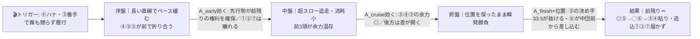
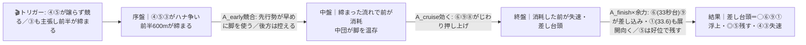
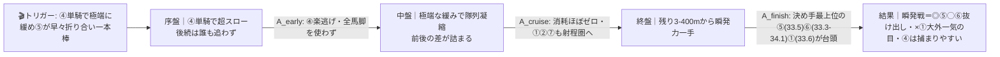

# 🏇 三木特別（2026-06-07 阪神 芝1800m外回り 馬場:当日確定）分析

**モデル: scoring-model v5.0（論理ファースト・相変位再帰を因果骨格として使用）** ／ 使用観点: 7観点（地力AB／血統C／適性D／展開E／状態FGH／騎手K／リスクI）／ 出走 9頭
> 着順の並びは論理で決め、印で示す（%は出さない）。`score_race.py` の並び＝**◎⑤＞◯⑥＞▲⑧＞△⑨＞④＞③＞×①** は論理の並びと整合（engine_check agree=true）。
> **クラスに関する重要注記**: 出走表上は「3勝クラス想定」だが、複数観点の調査で全9頭が現2勝クラス級在籍と判明＝**実態は3歳上2勝クラス**の可能性が高い。地力評価は2勝クラス内の相対で行った。

## 1. サマリ（結論）

- **予想本命 ◎**: 5-5 ジョイエッロ — スロー前残りの本線で**先行力×当メンバー最速級の決め手(33.5)×抜けた地力**が全展開で恵まれる。川田騎乗・阪神連対実績も後押し。軸性が突出。
- **対抗 ◯**: 6 エバーグルーヴ — 決め手上位＋阪神1800勝ち＋ドゥラ×ディープの好配合。流れが締まる対抗βでは最上位、緩い本線でも食い込める展開不問型。
- **単穴 ▲**: 8 ヤマニンガラッシア — 直近中山芝1800で2着、坂井騎乗で強化、テン中で前々に取り付ける器用さ。9歳の天井のみ割引。
- **連下 △**: 9 ツーエムクロノス（地力上位だが外枠差し・コース不向き）／ 4 ハイディージェン（前残り本線の番手最有力だが状態下降・騎手経験浅）／ 3 ユメハハテシナク（前付けで本線粘り込み・ただし地力決め手で見劣り）
- **注意 ×**: 1 ウインリベラシオン — 当メンバー最速の上がり33.6。前残り本線では1枠追込で届かないが、**ペースが締まる/超スローの瞬発戦になれば大外一気の一発**。
- **最有力展開**: **α スロー流れ込み・前残り瞬発（本線★★★）**（鍵馬: 4・5・3）。対抗 **β 先行争い発生・差し台頭★★**、伏線 **γ 超スロー・後続瞬発一気★**
- **展開を分ける一点**: **④ハイディージェンと⑤ジョイエッロ（＋内③）の先行3頭が競り合うか折り合うか**。誰も競らず雁行ならα前残り、譲らず締まればβ差し台頭。

> 馬券（何をどう買うか）はユーザー判断。本レポートは展開と着順の予測のみを提示する。

## 0. 当日アップデート・ボード（当日更新枠 ⏱）

> 枠順・騎手は確定済みで §2・§3 本文に織り込み済み。ここには分析時点で未知の当日情報のみを残す。

### 0-1. 当日の参考レース（バイアス採取用）
> 阪神芝は **1800/2400 が外回り**、**1200/1400/2000 が内回り**。本レースと同じ「芝・外回り・中距離」の前半Rは限られる。

| R | 発走 | コース（芝/ダ・回り・距離） | 一致度 | 何を読むか |
|---|------|----------------------------|:-----:|-----------|
| 2R | 10:20 | 芝・外回り・1800（3歳未勝利） | ★★★ | **同一コース**＝内外どちらが伸びるか・前残りか差し届くか（ただし午前・低クラスで割引） |
| 6R | 12:40 | 芝・内回り・2000（3歳未勝利） | ★★☆ | 回り違い→前後傾向（前残り/差し）と直線の伸び位置のみ流用 |
| 8R | 13:40 | 芝・内回り・1400（1勝クラス） | ★☆☆ | 直前帯の芝の脚の使いどころ・前後傾向の参考のみ |

→ **観察結果（当日記入）**: ペース層 ___／内外バイアス ___／決まり手（逃先差追）___／伸びる位置 ___
> この行が埋まったら **§2-3 当日修正**へ。④⑤③の先行争いが起きているかを §2-2 トリガーで判定しティアを付け替える。

### 0-2. 馬場（当日確定）
| 項目 | 値（当日記入） | 質の読み |
|------|----------------|----------|
| 馬場状態 | 良/稍/重/不 | 渋れば道悪巧者血統（④ファインニードル・③ダイワメジャー・②アメリカンペイトリオット）が前残り方向に浮上 |
| クッション値 | ___ | 9.0+=高速(硬) / 7前後=標準 / 6未満=軟(力要る) |
| 含水率（ゴール前/4角） | ___ / ___ | 芝:高い=渋り |
| コース替わり | A/B/C/D 柵 | 内荒れ隠しの替わり=内有利に戻る場合あり |

### 0-3. パドック・返し馬・馬体重（注目馬）
| 印 枠-馬番 馬名 | 馬体重(増減) | パドック/返し馬（当日記入） | 気配 |
|------------|--------------|------------------------------|:----:|
| ◎ 5-5 ジョイエッロ | ___ (±__) | | ↑/→/↓ |
| ◯ 6-6 エバーグルーヴ | ___ (±__) | 前走3/29から約2ヶ月半の放牧明け＝**仕上がり/馬体回復が最重要チェック** | ↑/→/↓ |
| ▲ 8-8 ヤマニンガラッシア | ___ (±__) | 9歳・気配の余裕度を確認 | ↑/→/↓ |

### 0-4. その他当日情報（分析時点で未確定のものだけ）
- 当日発表の乗り替わり／取消・除外: ___（確定済みは §3 騎手列に反映済み）
- 天候推移（朝→発走時）: ___

## 2. 展開予想【成果物1】（STEP4a 展開合成）

> **検証契約**: 脚質別有利不利・隊列・各パターンの段階フローを馬番・符号・可能性ティアで固定。レース後に通過順・上がりから復元したペース層と照合し展開精度を独立採点する。

### 2-1. 脚質分類表（全馬・観点E証拠／確定枠反映）

| 枠-馬番 | 馬名 | 騎手 | 脚質 | テン速 | 近走1角(位置/頭数) | 想定位置 |
|--------|------|------|------|--------|--------------------|----------|
| 4-4 | ハイディージェン | 西塚洸二 | 先 | 中 | 2-2-10-2 | **ハナ最有力**（逃げ血統・近走2,2,2） |
| 5-5 | ジョイエッロ | 川田将雅 | 先 | 中 | 3-2-2-3 | 番手〜ハナ右翼（自在・先行争いの軸） |
| 3-3 | ユメハハテシナク | 松若風馬 | 差→先 | 中 | 6-4-2-3 | 内3枠から好位（伏兵的先行当事者） |
| 8-8 | ヤマニンガラッシア | 坂井瑠星 | 差 | 中 | 1-7-5-7 | 中団（緩めば前へ・器用） |
| 8-9 | ツーエムクロノス | 酒井学 | 差 | 遅 | 6-9-4-4 | 中団後め（外枠で位置取りロス懸念） |
| 6-6 | エバーグルーヴ | 西村淳也 | 差 | 遅 | 4-4-7-11 | 中団前め（少頭数なら前め・流動的） |
| 1-1 | ウインリベラシオン | 田口貫太 | 追 | 遅 | 11-8-12-3 | 後方（上がり最速33.6の一発型） |
| 7-7 | ラーテル | 城戸義政 | 追 | 遅 | 11-10-7-9 | 後方（追込専・展開待ち） |
| 2-2 | リュキア | 国分恭介 | 追 | 遅 | 12-13-10 | 後方〜最後方（決め手も鈍い） |

> 先行2（④⑤）＋伏兵的先行2（③⑧）＋後方追込3（①②⑦）。阪神芝1800外は1角まで約640mで構造的スロー、9頭少頭数で一層緩みやすい（コース傾向 逃20%/先10%/差6%/追1-4%＝前残りベース）。

### 2-2. 展開パターン（複数・可能性ティア）

| id | パターン名 | 可能性 | 発動トリガー | 有利脚質（符号） | 浮上馬 | 沈む馬 |
|----|-----------|:-----:|--------------|------------------|--------|--------|
| α | スロー流れ込み・前残り瞬発 | 本線★★★ | ④ハナ・⑤番手で誰も競らず先行勢が雁行で折り合う | 逃+2 先+2 差0 追-2 | 5 4 3 8 | 1 2 7 |
| β | 先行争い発生・差し台頭 | 対抗★★ | ④⑤がハナを譲らず競る／③が内から主張し前半が締まる | 逃-1 先0 差+2 追0 | 6 9 5 1 8 | 4 3 |
| γ | ④単騎超スロー・後続瞬発一気 | 伏線★ | ④単騎で極端に緩め⑤が早々折り合い一本棒 | 逃+2 先+1 差+1 追-1 | 5 6 1 | 2 7 |

> 可能性ティア = 本線★★★ / 対抗★★ / 伏線★（%は出さない）。`有利脚質（符号）`と`浮上馬/沈む馬`が展開検証の正本。

#### 各パターンの段階フロー

**α スロー流れ込み・前残り瞬発（本線★★★）**

> 1行要約: **超スローで前3頭が脚を温存 → 直線は位置をリードした⑤が最速級の決め手で抜け出し、決め手上位の⑥が前めから食い込む。後方一気は届かない。**

**β 先行争い発生・差し台頭（対抗★★）**

> 1行要約: **先行争いで前が締まり脚を使う → 中盤温存した中団が押し上げ → 終盤は決め手上位の⑥⑨と一発の①が差し込み、逃げた④・前付け③は沈む。⑤は好位から粘る。**

**γ ④単騎超スロー・後続瞬発一気（伏線★）**

> 1行要約: **④単騎の超スローで全馬団子 → 直線だけの瞬発比べになり、決め手最上位の⑤⑥が抜け、後方の①にも大外一気の目が開く。**

- **隊列（最有力α）**: 序盤先頭 `④⑤③` → 最終コーナー前方 `④⑤③⑧` ＋中団前め `⑥⑨`
- **馬場バイアス**: 良馬場なら前・内有利。渋れば道悪巧者血統（④③②）が前残り方向に浮上 ＝ §0-1/0-2 で当日確認。
- **反証条件**: ④⑤が明確に競る／③が内からハナ主張 → **β を本線★★★へ格上げ・α を対抗へ**（前半600mが35秒を切ればβ実現）。④単騎で楽逃げ＋⑤即折り合い → **γ を本線へ**（前半600mが37秒超でγ実現）。当日馬場が渋り前残りが強まれば α を確定固定。

### 2-3. 当日修正（あれば）
> STEP6 で当日情報（参考R観察・馬場・パドック等）を受けた場合のみここに追記。

## （展開→着順の伝達）
最有力αの段階フロー＝「超スローで前3頭が脚を温存→直線は位置×決め手」だから、**先行力と最速級の決め手を併せ持つ◎⑤が位置リードのまま抜ける**のが本線の着順。⑥は中団前めから決め手で2列目を確保。一方、対抗β（締まる）になると前付けの④③が崩れ、決め手型の⑥⑨と一発の①が台頭する＝**並びは「⑤を軸に、展開が緩むほど④③が浮き、締まるほど⑥⑨①が浮く」**という感度で動く。

## 3. 着順予想表【成果物2】（メイン出力）

> **検証契約**: 並び（印＋行順）＋各馬の展開感度・好材料・懸念点を固定。レース後に実着順と照合し、(a)順位相関＝総合、(b)実現パターンの段階フローと展開感度の的中＝純粋な能力読み、を別個採点。**%は出さない。**

| 印 | 枠-馬番 | 馬名 | 騎手(乗替) | 展開感度 | 好材料 | 懸念点 |
|----|--------|------|-----------|---------|--------|--------|
| ◎ | 5-5 | ジョイエッロ | 川田将雅(継続) | **全展開で恵まれ最強**。α本線で位置×決め手が盤石／β締まりでも好位で残す／γ瞬発戦でも決め手最上位 | ・[A/B]近5走4勝＋OP級India Trophy3着＝当メンバー随一の充実・地力 ・[E/B]上がり最速33.5＋先行自在(通過3,2,2,3)＝展開不問で自力勝負できる ・[D]阪神蓬莱峡特別2着・阪神勝ち＝当コース連対実績 ・[C]ドゥラメンテ×ディープで阪神外回り中距離ど真ん中 ・[K]川田＝当メンバー最強格の騎手力 | ・[I/B]2025/8以降未勝利で「善戦マン」化の兆候（勝ち切れず2-3着続き） ・[I]斤量58で常に格上挑戦の立場 |
| ◯ | 6-6 | エバーグルーヴ | 西村淳也(継続) | **β締まりで最上位**(差し台頭の本命格)／α本線でも中団前めから差し込み圏内／γ瞬発戦でも決め手上位 | ・[A/B]上がり33.3-34.1を芝1800で連発＝決め手指数は当メンバー上位 ・[D]阪神芝1800で勝ち鞍あり＝当条件適性が明確 ・[C]ドゥラメンテ×ディープの好配合・牝馬56kgの斤量恩恵 ・[I]不安要素少なく条件安定 | ・[G/H]前走3/29から約2ヶ月半の放牧明け＝仕上がり・馬体回復が当日要確認 ・[E]テン遅・差しで前残り本線αだと展開待ちになりやすい |
| ▲ | 8-8 | ヤマニンガラッシア | 坂井瑠星(強化) | α本線でテン中から前々に取り付き粘る／β締まりでも中団から押し上げ可 | ・[B]直近2026/4/12 中山芝1800で2着(0.1差)＝当クラス通用を直近で証明 ・[K]坂井瑠星＝川田と並ぶ最強格、関西遠征での上位騎手確保＝勝負気配 ・[E]テン中で前に行ける器用さ（過去1角1番手歴）＝前残り本線で位置を取れる ・[C]ディープ×タイキシャトルで当コース血統適性は上位 | ・[I/G]9歳と高齢でピーク過ぎ・上積み期待薄 ・[B]好走と凡走(ダ15着等)の差が激しく安定度を欠く |
| △ | 8-9 | ツーエムクロノス | 酒井学(継続) | β締まりで差し込み台頭／α本線・前残りだと外枠差しで届きにくい | ・[A/B]2026年5月に2勝クラス勝ち上がりの上り馬＝勢い・地力は上位 ・[B]芝1600-1800主戦で上がり34.2＝距離適性◎ | ・[D]8枠外で差し脚質＝前優位コースで位置取りロス大 ・[B/I]直近5/24は8着で下降基調・テン遅で展開依存 |
| △ | 4-4 | ハイディージェン | 西塚洸二(継続) | **α本線の番手最有力**＝前残りで粘り込む／β締まりだと先行で脚を使い失速のハイリスク | ・[E]逃げ血統(父ファインニードル)＋近走1角2,2,2＝ハナ最有力で前残り本線の恩恵 ・[B]2026/5/17 2勝クラス2000mで4着＝掲示板級の地力は示す | ・[G/H]4/5に馬体-14→減少基調＋中止明け立て直し途上で状態に不安 ・[K]西塚は若手で経験浅く外回りのペース判断が未知数 ・[D]阪神2戦大敗・決め手34.5止まりで詰めが甘い |
| △ | 3-3 | ユメハハテシナク | 松若風馬(継続) | α本線で内3枠から前付けし粘り込み／β締まり・γ瞬発だと決め手で見劣り沈む | ・[E]差し表記だが実走は前付け(2,4,3,6)＝内枠から好位を取れる ・[C]ダイワメジャーで渋れば道悪巧者として浮上余地 | ・[A/B]2勝クラスで6-9-14-11-5着と頭打ち・地力で見劣り ・[A]決め手35.0で瞬発戦になると分が悪い |
| × | 1-1 | ウインリベラシオン | 田口貫太(継続) | α本線では1枠追込で届かず／**β締まり・γ瞬発戦になれば大外一気の一発**(決め手は最上位級) | ・[A/E]上がり最速33.6＝当メンバー最速級の決め手 ・[C]ブリックスアンドモルタル×ダンスインザダークで芝1800は守備範囲 | ・[D/E]追込・テン遅・1枠＝前残り本線とは構造的ミスマッチ、届かないリスク大 ・[B/I]近走6-7-7着と下降基調・自力で勝ちにいけない |
| 無 | 7-7 | ラーテル | 城戸義政(継続) | どの展開でも届きにくい（追込×距離不安） | ・[B]芝マイル前後の経験量は豊富 | ・[A/B]43戦2勝・近走総崩れで底を見せ切る ・[C]ビッグアーサーで芝1800は距離適性外 |
| 無 | 2-2 | リュキア | 国分恭介(継続) | 展開問わず厳しい（適性外＋決め手最下位） | ・[B]中山ダ1200勝ちでスピード自体はある | ・[D/C]主戦ダ1200-1400で芝1800は距離・馬場とも適性外 ・[A]上がり36.5で決め手が当メンバー最低 |

- **印**: ◎本命／◯対抗／▲単穴／△連下／×注意。並びと印で強弱を表す（%は出さない）。
- ◎⑤は3展開すべてで上位＝軸性が突出。展開が緩むほど④③が、締まるほど⑥⑨①が相対浮上する感度。

## 4. 観点別ハイライト（横断）

- **A/B 指数・近走**: 地力序列は ⑤(近5走4勝＋OP3着で抜け)＞⑨(5月勝ち上がりの上り馬)≒⑥(決め手連発・牝馬恩恵)＞⑧④(掲示板級)＞①③＞②⑦。⑤と⑨は直近勝ち上がりで本来1クラス上の可能性。
- **C 血統**: 阪神芝1800外（瞬発力大箱）への父系フィットは ⑤⑥(ドゥラ×ディープ)＞⑧(ディープ)＞①③＞⑨(欧州スタミナ型・キレ不足)＞④(短距離血)＞⑦(純スプリント・最不適)。渋れば④③②が浮上。
- **D 適性**: コースは前優位・坂でパワー要求・3枠最良/8枠不利。最適合は⑤(先行×ドゥラ×阪神連対)。⑥は阪神1800勝ちだが差し脚質で展開依存。⑨は外枠差しで減点。
- **E 展開＋STEP4a**: 構造的スロー＋少頭数で前残りα本線。鍵は④⑤③の先行争い。締まればβ差し台頭、④単騎超スローならγ瞬発戦。
- **F/G/H 状態**: ⑤(高位安定)＞⑧(中山2着で復調)＞⑨⑥＞…。⑥は放牧明けで当日気配が重要。④は馬体減＆中止明けで下降サイン。**追い切り・パドック・関係者コメントはweb取得不可＝確信度低**（要当日補強）。
- **K 騎手**: 川田(⑤)≧坂井(⑧)＞西村(⑥)＞松若(③)・酒井(⑨)＞田口(①)・国分(②)＞城戸(⑦)・西塚(④)。⑤⑧は鞍上強化が明確、④は若手起用で先行馬の折り合い・ラップ作りに不安。
- **I リスク**: 致命的減点は⑦(低勝率・距離不安・総崩れ)が突出。⑧は9歳だが現状維持で-1止まり。割引最少は⑤、次いで⑥。多くが「勝ち切れない/未勝利継続」型の中程度減点で横一線。

## 5. データの確かさ・補強のお願い

- **確信度が低かった点**:
  - **当日気配（H）・追い切り（F）・関係者/騎手コメント**: 日本語版netkeiba/競馬ラボ/JRAがWAF・捏造で取得不可。全頭で空欄＝当日補強を強く推奨。
  - **馬場状態・クッション値・含水率**: 当日未公表（§0-2）。渋れば道悪巧者血統④③②を上方修正。
  - **クラス前提**: 出走表「3勝クラス想定」だが実態は**2勝クラス**の可能性が高い（全頭2勝クラス級在籍）。
- **ユーザー補強推奨**: パドック評価／確定馬体重／追い切り評価／関係者コメントのURL・貼り付け。前半参考R（特に2R 芝1800外）の結果が出たら内外・前後バイアスを §0-1 へ。

## 6. 免責
予測であり的中を保証しない。賭けは自己責任で、馬券選択・実ベットは人間判断。市場（オッズ・人気）は一切参照していない。
