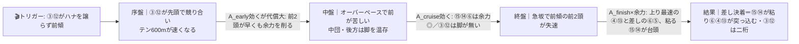
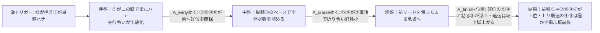
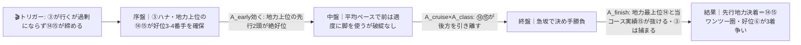

# 🏇 水無月ステークス（2026-06-07 阪神 ダート1200m 馬場：当日確定）分析

**モデル: scoring-model v5.0（論理ファースト・相変位再帰を因果骨格として使用）** ／ 使用観点: 10観点（A〜I,K） ／ 出走 16頭
> 着順の並びは論理（序盤A_early→中盤A_cruise→終盤A_finish）で決め、印 ◎◯▲△× と行順で示す（%は出さない）。枠順は確定済みのため本文に織り込み済み。`score_race.py` は並びの整合チェックに使用（下の engine_check）。

## 1. サマリ（結論）

- **予想本命 ◎**: 8-15 コンクイスタ — 阪神ダ1200そのものでOP勝ち（令月S）。**全展開で好位を取れる先行＝最も展開ロバスト**。充実期の西村淳也。
- **対抗 ◯**: 7-14 サンライズアムール — 時計・血統・適性すべて**地力最上位**（JBCスプリント勝ち級）。自在で展開不問。ただし斤量59.5（最重量）と決め手不足が割引。
- **単穴 ▲**: 3-6 アンズアメ — 川田起用＝陣営の勝負気配、ドレフォン産駒で砂替わり好転濃厚。中団差しで展開不問。**ダート初挑戦**が唯一にして最大の未知。
- **連下 △**: 7-13 ペプチドヤマト（上り32.9＝ハイペース差しの切り札）、3-5 ショウナンアビアス（阪神ダ1200勝ち鞍・堅実差し）
- **注意 ×**: 2-4 フリームファクシ（破格の決め手だが条件不適リスク）、1-1 ムーヴ（ハイ消耗戦の追込一発）
- **最有力展開**: 拮抗する2本線 — **β 3・12ハナ争い→ハイペース差し台頭（本線★★★）** と **α 3単騎楽逃げ・前残り（本線★★★）**。鍵馬は逃げ当事者の③⑫。
- **展開を分ける一点**: **③プレゼンティーアと⑫ロードフロンティアがハナを譲るか競るか**。競ればβ（差し台頭）、③単騎に収まればα（前残り）。ここが全着順を左右する。

> 馬券（何をどう買うか）はユーザー判断。本レポートは展開と着順の予測のみを提示する。

## 0. 当日アップデート・ボード（当日更新枠 ⏱）

> 枠順は確定済みで本文反映済み。ここには分析時点で本当に未知のもの（当日馬場・参考R観察・パドック・馬体重）だけを残す。

### 0-1. 当日の参考レース（バイアス採取用）
> 同日にダ1200の前半Rは無い。直前のダート短距離（1400）で「前残りか差し届くか」を採取し、1200へ割り引いて流用する。

| R | 発走 | コース（芝/ダ・回り・距離） | 一致度 | 何を読むか |
|---|------|----------------------------|:-----:|-----------|
| 9R 洲本特別 | 14:10 | ダ・右・1400 | ★★☆ | **直前のダート短距離**＝前/差しバイアスと砂の効き。1200より少し前残りしにくい点を割引 |
| 4R | 11:20 | ダ・右・1400 | ★★☆ | 同条件の午前傾向。馬場の経時変化（乾き/締まり）の確認 |
| 7R | 13:10 | ダ・右・1800 | ★☆☆ | 中距離だが当日ダートの前残り度の参考 |

→ **観察結果（当日記入）**: ペース層 ___／内外バイアス ___／決まり手（逃先差追）___／伸びる位置 ___
> 9Rで「前残り・内有利」なら**αを本線★★★に固定**／「外差し決着」なら**βを本線★★★に固定し13・1・4を引き上げ**。§2-3で付け替える。

### 0-2. 馬場（当日確定）
| 項目 | 値（当日記入） | 質の読み |
|------|----------------|----------|
| 馬場状態 | 良/稍/重/不 | 重〜不良なら前残り強化＝α・γへ寄る |
| クッション値 | ___ | 9.0+=高速 / 7前後=標準 / 6未満=軟 |
| 含水率（ゴール前/4角） | ___ / ___ | ダ:低い=時計かかる＝パワー型有利 |
| コース替わり | A/B/C/D 柵 | — |

### 0-3. パドック・返し馬・馬体重（注目馬）
| 印 枠-馬番 馬名 | 馬体重(増減) | パドック/返し馬（当日記入） | 気配 |
|------------|--------------|------------------------------|:----:|
| ◎ 8-15 コンクイスタ | ___ (±__) | | ↑/→/↓ |
| ◯ 7-14 サンライズアムール | ___ (±__) | **斤量59.5・7歳→馬体の余裕度を最重要チェック** | ↑/→/↓ |
| ▲ 3-6 アンズアメ | ___ (±__) | **ダート初＝砂への気負い/落ち着きを確認** | ↑/→/↓ |

### 0-4. その他当日情報
- 当日発表の乗替／取消: ___
- 天候推移（朝→発走時）: ___

## 2. 展開予想【成果物1】（STEP4a 展開合成）

> **検証契約**: 脚質別有利不利・隊列・各パターンの段階フローを馬番・符号・可能性ティアで固定。レース後に通過順・上がりから復元したペース層と照合し展開精度を独立採点する。

### 2-1. 脚質分類表（全馬・観点E証拠／確定枠反映）

| 枠-馬番 | 馬名 | 騎手 | 脚質 | テン速 | 近走1角(位置/頭数) | 想定位置 |
|--------|------|------|------|--------|--------------------|----------|
| 2-3 | プレゼンティーア | 松本大輝 | 逃 | 速 | 2/11,1/16,6/16,1/16 | **ハナ筆頭**（最内2枠＝砂被り懸念同居） |
| 6-12 | ロードフロンティア | 川須栄彦 | 逃/自在 | 中 | 14/16,1/16,1/16,5/16 | **ハナ争い当事者**（外目でスッと出れば③と先頭争い） |
| 7-14 | サンライズアムール | 斎藤新 | 先(自在) | 中 | 4/16 | 好位〜番手（斤量59.5で番手寄り、状況で逃げ可） |
| 8-15 | コンクイスタ | 西村淳也 | 先 | 中 | 3/15,4/12,4/16,8/16 | 好位3〜4番手（二の脚で確保・好枠） |
| 5-10 | リジル | 渡辺竜也 | 差/自在(伏) | 中 | 13/16,1/16,7/16,2/16 | 中団〜時に前付け（前付け実績混在の伏線） |
| 3-5 | ショウナンアビアス | 池添謙一 | 差 | 中 | 9/15,8/16,5/15,6/16 | 中団 |
| 3-6 | アンズアメ | 川田将雅 | 差 | 中 | 9/14,4/13,3/16,6/16 | 中団（位置取れる差し） |
| 4-7 | スマートフォルス | 鮫島克駿 | 差 | 遅 | 7/15,12/16,7/16,14/16 | 中団後方 |
| 2-4 | フリームファクシ | 酒井学 | 追 | 遅 | 13/18,15/16,3/16,12/16 | 後方（上り最速級33.0） |
| 7-13 | ペプチドヤマト | 高倉稜 | 追 | 遅 | 8/12,7/16,14/15,7/16 | 後方（上り最速32.9） |
| 6-11 | アガシ | 田口貫太 | 追 | 遅 | 12/16,9/16,9/12,8/16 | 後方 |
| 1-1 | ムーヴ | 坂井瑠星 | 追 | 遅 | 10/15,16/16,16/16,15/16 | 最後方近辺 |
| 1-2 | マルモリスペシャル | 西塚洸二 | 追 | 遅 | 7/13,10/12,14/16,14/16 | 後方 |
| 4-8 | クロジシジョー | 菱田裕二 | 追 | 遅 | 14/16,8/16,15/16 | 後方 |
| 5-9 | ケイアイドリー | 松若風馬 | 追 | 遅 | 15/16,8/16 | 後方 |
| 8-16 | ジュンウィンダム | 国分優作 | 追 | 遅 | 11/12,13/15,7/16,9/16 | 後方 |

> 阪神ダ1200は**逃げ先行が強く機能**（逃げ連対50%超／追込ほぼ届かず）かつ**直線急坂（高低差約1.8m）で差しも一定届く**特殊コース。前に行けるのは実質③⑫⑭⑮の4頭＋伏線⑩。枠は**7〜8枠が最良・最内1枠が最不利**＝外の⑭⑮に枠の利、③は最内で砂被り不安。

### 2-2. 展開パターン（複数・可能性ティア）

| id | パターン名 | 可能性 | 発動トリガー | 有利脚質（符号） | 浮上馬 | 沈む馬 |
|----|-----------|:-----:|--------------|------------------|--------|--------|
| β | 3・12ハナ争い→ハイ・差し台頭 | 本線★★★ | ③と⑫が共にハナを主張し譲らず、テン600mが速くなる | 逃-2 先-1 差+1 追+2 | 15 14 6 13 4 5 1 | 3 12 |
| α | 3単騎楽逃げ・前残り | 本線★★★ | ⑫が砂を被って控え③が単騎ハナ、⑭は斤量で番手 | 逃+2 先+1 差-1 追-2 | 3 15 14 6 | 13 4 1 16 |
| γ | 14・15先行主導の平均ペース | 対抗★★ | ③が行くが過剰にならず、地力上位の⑭⑮が好位を締める | 逃0 先+2 差0 追-1 | 14 15 6 | 1 16 13 |
| δ | 超スロー・瞬発の前総崩れなし | 伏線★ | 誰もハナを主張せずテンが緩む | 逃+1 先+2 差0 追-2 | 3 15 14 6 | 4 13 1 16 |

> 可能性ティア = 本線★★★ / 対抗★★ / 伏線★。**β（差し）とα（前残り）がほぼ拮抗する二本線**＝この展開の本質的な不確実性。内部確率はログ参照（β.32/α.30/γ.26/δ.12）。

#### 各パターンの段階フロー（序盤→能力→中盤→能力→終盤→能力→結果）

> mermaid はターミナルでは図にならない → 各図の直後に1行要約を併記。report.md を GitHub/プレビューで開けば図が出る。

**β 3・12ハナ争い→ハイ・差し台頭（本線★★★）**

> 1行要約: **③⑫がハナを譲らず前傾 → 中盤で逃げ2頭が脚を使い果たし → 終盤は余力を残した好位先行⑮⑭＋差し⑥と上り最速④⑬が差し込む**。

**α 3単騎楽逃げ・前残り（本線★★★）**

> 1行要約: **③が単騎で楽逃げ → 誰も脚を使わず → 前にいた③⑮⑭⑥が余力満タンで残り、後方一気は急坂で届かない**。

**γ 14・15先行主導の平均ペース（対抗★★）**

> 1行要約: **③が無理せず行き⑭⑮が好位を締める平均ペース → 地力で勝る⑭⑮が後方を離し → 終盤に先行2頭が抜け出す標準形**。

- **隊列（最有力β/α共通の前段）**: 序盤先頭 `③⑫` →（β）競って縦長／（α）`③`単騎で密集。最終コーナー前方 `③⑮⑭⑫` ＋好位 `⑥⑤`
- **馬場バイアス**: 前・先行有利が地。7〜8枠（⑭⑮⑯）に枠の利、最内1枠（①②）と2枠③は揉まれ・砂被り注意。**当日 §0-1 で上書き前提**。
- **反証条件**: ⑫が当日明確に控え③単騎濃厚なら→**α本線・β対抗へ**。③⑫が明確に競るなら→**β本線固定で⑬①④を引き上げ**。馬場が重〜不良なら→α・γへ寄せ追込（④⑬①）を下げる。

### 2-3. 当日修正（あれば）
> §0-1の9R観察を受けてから記入。例:「9Rが外差し決着＋③⑫が競る → βを本線★★★固定、⑬①④を1段引き上げ、③を消し」。

## （展開→着順の伝達）
最有力が**β（差し）とα（前残り）の二本線拮抗**であるため、着順は「**どちらの本線でも崩れない馬**」を上に置いた。◎⑮はα（好位で前残り）でもβ（先行のまま粘り込み）でも圏内＝展開ロバスト。◯⑭は地力最上位でα/γ◎だがβでは決め手不足・斤量で交わされる穴。▲⑥は中団差しで両本線とも+。△⑬はβ専用の切り札（αでは沈む）＝展開が振れたとき用。

## 3. 着順予想表【成果物2】（メイン出力・表が主役）

> **検証契約**: 並び（印＋行順）＋各馬の展開感度・好材料・懸念点を固定。レース後に実着順と照合し (a)並びの順位相関、(b)実現パターンの段階フローと展開感度の的中、を別個採点。%は出さない。

| 印 | 枠-馬番 | 馬名 | 騎手(乗替) | 展開感度 | 好材料 | 懸念点 |
|----|--------|------|-----------|---------|--------|--------|
| ◎ | 8-15 | コンクイスタ | 西村淳也(継続) | **α/β/γ/δ全パターンで好位を取れる＝最も展開ロバスト**。前残りでも差し決着でも先行から粘り込み圏内 | ・[D]令月S＝**阪神ダ1200そのものでOP勝ち**＋当コース実績、前残りバイアスに最適 ・[B]近2走58〜59kg背負って令月S1着・中山ダ1200で2着＝**斤量克服済み**で現級上位の安定 ・[K]西村淳也は充実期トップ騎手で先行馬の好位押し上げ＋粘らせる騎乗が脚質に噛む ・[E]8枠＝最良枠帯で二の脚により好位確保しやすい | ・[I]『砂を被らず・もまれない競馬』が条件で、16頭の混戦で内に包まれ砂を被ると崩れるリスク ・[A]上り36.0と決め手は平凡＝極端な瞬発戦になると一線級にキレで譲る |
| ◯ | 7-14 | サンライズアムール | 斎藤新(継続) | α/γ/δ（前残り〜平均）で地力が炸裂し**最上位**。β（ハイ消耗戦）では番手から決め手不足で交わされる側 | ・[A]JBCスプリント勝ち級＝**時計・スピード指数が出走馬中最上位**、当該条件1:09台を常時計時 ・[C]血統・適性とも当条件最上位、自在で展開不問の地力 ・[E]7枠＝最良枠帯、先行〜番手で位置を取れる | ・[I]**斤量59.5は全頭最重量**（近走は54〜58kgで好走）＝負荷大で終盤に堪える ・[A]上りbest36.9＝決め手は鈍く、止まると差し込まれる ・[G]7歳・休み明け気味で馬体の余裕度が当日の鍵 |
| ▲ | 3-6 | アンズアメ | 川田将雅(継続) | 中団差しで**α/β/γ/δ全てで+**＝展開不問。位置を取れれば前残りでも届く距離 | ・[K]**川田将雅起用＝陣営の勝負気配**（全頭中最高の騎手信頼）、好位〜中団の位置取りが精緻 ・[C]ドレフォン産駒＝阪神ダ1200は父の主戦場で**砂替わり好転濃厚**、牝4で53kg最軽量級 ・[B]近4走ダ1200で1-2-3-3着と上昇基調・得意距離 | ・[A]**ダート出走歴ゼロ**＝走破時計の裏付けが一切なく、OPダート初挑戦が最大の未知数 ・[G]今回がダート初＝砂を被った時の気負い・馬体面が読めない |
| △ | 7-13 | ペプチドヤマト | 高倉稜(継続) | **β（ハイ消耗戦）専用の切り札**。前が止まる流れで上り最速が炸裂。α/δ（前残り）では届かず沈む | ・[A]上り32.9＝**出走馬最速級の決め手**、OP1200で1:08.1の破壊力 ・[F]uma-jin特注馬＝陣営の仕上げ評価が高い ・[C]ドレフォン産駒で砂短距離の地力 | ・[E]追込テン遅で**前残り展開だと持ち味を完全に殺される**＝展開依存度が極大 ・[B]近走8→12→10着と低迷気味で安定感を欠く |
| △ | 3-5 | ショウナンアビアス | 池添謙一(継続) | β/γで中団差しが届く。α（超前残り）では一歩届かない | ・[B]越後S3着・浪速S1着・江戸川S3着＝**直近ダ1200で堅実**、阪神ダ1200に勝ち鞍 ・[C]ドレフォン産駒で適性○ ・[K]池添はダ短距離の流れを読む経験値が高い | ・[B]OPでは勝ち切れず3着止まり＝決め手の絶対値がワンパンチ足りない ・[B]リステッド級は実質格上げで相手強化の壁 |
| × | 2-4 | フリームファクシ | 酒井学(継続) | **β（ハイ消耗戦）でのみ一発**。上り33.0が前崩れで届く。前残り展開は全滅 | ・[A]ダ1400で1:07秒台＋上り33.0の**破格の決め手**、根岸S6着の重賞級地力 | ・[B]直近は芝重賞で13〜14着・**ダ1200は実質ぶっつけ**で条件適性が未証明 ・[I]58.5kgの準トップハンデ＋追込テン遅で位置を取れず展開待ち |
| × | 1-1 | ムーヴ | 坂井瑠星(継続) | **β（ハイ消耗戦）で最後方一発**。千葉S2着型の追込が前崩れで突っ込む。前残りは届かない | ・[B]千葉S（OPダ1200）で16番手→2着＝**現級で末脚通用を証明**、ハイ展開で浮上余地 ・[K]坂井瑠星のトップ騎乗 | ・[E]近走1角16/16・15/16の**最後方常連で展開依存が極端**、自分から動けない ・[E]1枠＝最内最不利枠で揉まれリスク |

- **印**: ◎本命／◯対抗／▲単穴／△連下／×注意。並びと印で強弱を表す（%は出さない）。
- **engine_check（任意サニティ）**: `score_race.py` の並びは **15→14→13→6→5→7→3→1**。論理の並び（15→14→6→13→5→4→1）と**上位2頭が完全一致**。差は▲/△での **6と13の入れ替えのみ**（エンジンは⑬のβ高ペース感応＝上り最速を重く評価し⑬>⑥、論理は⑥の展開ロバスト性＋川田の内在シグナルで⑥>⑬）。**論理側を正**とし⑥を▲、⑬を△の筆頭に置く。食い違いは「βを本線と信じるなら⑬を引き上げよ」という当日の点検シグナルとして残す。

## 4. 観点別ハイライト（横断）

- **A 指数/時計 / B 近走 / C 血統 / D 適性**: 地力（時計）最上位は⑭サンライズアムール、次列に⑮⑤⑦⑬⑧。**当該コース・距離の適性**では⑮（令月S＝阪神ダ1200OP勝ち）と⑭（当条件最上位）が双璧、⑥はドレフォン産駒で血統適性◎だが**ダート実績ゼロ**。逃げ筆頭③と⑫は近走の実脚質は前だが時計・近走内容が現級で一枚足りない（③は条件戦連勝＝格上げ初挑戦、⑫は近走二桁惨敗続き）。
- **E 展開証拠＋STEP4a 合成**: 前に行けるのは実質③⑫⑭⑮の4頭。**③（テン速・逃げ意欲明確）と⑫（自在・砂被ると控える）のハナ争いが起きるか否か**が全展開の分岐。起きればβ（差し台頭）、③単騎ならα（前残り）。⑭⑮はこの争いに乗らず好位を取る賢い立ち回りが可能＝どちらに転んでも崩れにくい。
- **F/G/H 状態 / K 騎手**: 調教評価で名前が挙がった上位は⑥⑭⑮（次点①⑧）、⑬は特注馬扱い。Hの当日気配は**発走前で取得不能＝全頭未反映**（要補強）。騎手は⑥川田・⑮西村・①坂井が信頼上位、③松本・⑫川須は逃げ意欲とは噛むが大舞台経験に課題。
- **I リスク（取りこぼし要因）**: 重ハンデ勢（⑭59.5・⑧59.0・④⑨58.5・⑮58.0）の斤量負荷、⑥のダート初、⑩⑨の休み明け、③の格上げ初挑戦と最内枠、⑫の近走不振が主な減点。

## 5. データの確かさ・補強のお願い

- **確信度が低かった観点**: **H（当日気配・パドック・関係者コメント）は発走前で取得不能＝全頭未反映**。F（調教）も詳細時計が非公開で一部のみ。
- **ユーザー補強推奨**: ①パドック評価・確定馬体重（特に◯⑭の馬体の余裕度、▲⑥のダート初の気負い）、②**9R洲本特別（14:10ダ1400）の前/差しバイアスと砂の効き**（→§2-3で本線を1つに固定できる）、③当日馬場・クッション値。
- **欠損・推定箇所**: 下位人気馬の個別コース成績はseed＋コースバイアスからの推定。③⑫⑩の一部時計データに行ズレ疑いがあり割引済み。

## 6. 免責
予測であり的中を保証しない。賭けは自己責任で、馬券選択・実ベットは人間判断。市場は一切参照していない。
