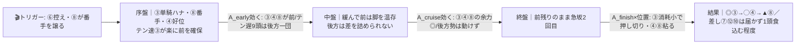
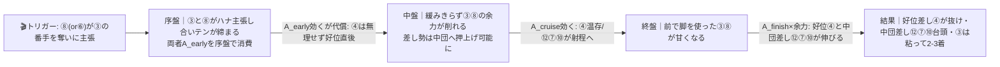
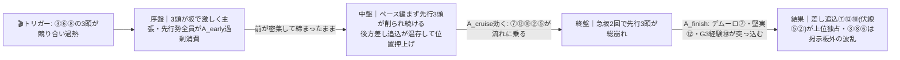

# 🏇 阪神12R サラ系3歳上1勝クラス（2026/6/7 阪神 ダート1800m・右回り／馬場=当日確定）分析

**モデル: scoring-model v5.0（論理ファースト・相変位再帰を因果骨格として使用）** ／ 使用観点: 7観点（AB / C / D / E / FGK / H / I） ／ 出走 12頭
> 着順の並びは論理（序盤A_early→中盤A_cruise→終盤A_finish）で決め、印で示す（%は出さない）。`score_race.py` は未実行（任意のサニティチェック・論理を正本）。
> **確定材料の先取り**: 枠順は確定済み（JRA出馬表 draw_fixed=true）→ §2-1/§3 本文へ織り込み済み。**騎手未確定2頭（①ガーデンカメリア・⑤グロリアスグレイス）**は §0 当日記入。

## 1. サマリ（結論）

- **予想本命 ◎**: 3-3 チェリヴェント — 当組唯一のテン速＝単騎逃げ濃厚。阪神ダ1800で〔未勝利1着→1勝クラス2着(重)〕と当舞台適性が出走馬中最上位級。**本線スロー前残りで最も恵まれる**。
- **対抗 ◯**: 4-4 アーサーバローズ（阪神ダ1800で1着＆2着・好位差しで前々につけられ前残りに対応）
- **単穴 ▲**: 6-8 バートラガッツ（新馬1勝の素質先行馬・前々で粘る／ただし1戦サンプル・阪神未経験）
- **連下 △**: 6-7 オーレアミスト（地力＆適性トップ級＋M.デムーロ強化。後方・斤量58で本線スローは展開待ち＝流れれば最浮上）、8-12 メイショウコナン（ダ1800連続3着の堅実・団野／阪神未経験・58・差し）
- **注意 ×**: 7-10 ガウラディスコ（ユニコーンS6着の地力最上位候補だが差し・阪神未経験＝ハイ流れ待ち）
- **最有力展開**: **P1 チェリヴェント単騎・前残りスロー（本線★★★）**（鍵馬: ③）。対抗 **P2 ③⑧先行争いのやや速（★★）**、伏線 **P3 ハイ・差し総取り（★）** / **P4 超スロー（★）**
- **展開を分ける一点**: ⑥フラワームーン（初ダート・テン遅だが脚質"先"）と⑧バートラガッツが③の前を主張するか。**主張すればペースが上がり差し勢（⑦⑫⑩）台頭、誰も行かなければ③単騎で前総取り**。

> 馬券（何をどう買うか）はユーザー判断。本レポートは展開と着順の予測のみを提示する。

## 0. 当日アップデート・ボード（当日更新枠 ⏱）

> ここには*分析時点で本当に未知のものだけ*を残す。枠順は確定済みで本文へ反映済み。

### 0-1. 当日の参考レース（バイアス採取用・ダートのみ）
> 採用優先順位: ダート（必須）＞ 同日・直前ほど重い ＞ 右回り ＞ 距離帯。芝Rは混ぜない。

| R | 発走 | コース（ダ・右・距離） | 一致度 | 何を読むか |
|---|------|----------------------------|:-----:|-----------|
| 9R 洲本特別 | 14:10 | ダ・右・1400 | ★★☆ | 前残りか差し届くか・内外どちらが伸びるか（距離違い→決まり手と伸び位置のみ流用） |
| 11R 水無月S | 15:20 | ダ・右・1200 | ★★☆ | 直前のダート馬場の速さ・先行有利の強弱（短距離→ペース層は割引） |
| 7R 3歳上1勝 | 13:10 | ダ・右・1800 | ★★★ | **同距離同クラス＝隊列・前残り/差し・脚質有利不利をそのまま流用** |
| 3R 3歳未勝利 | 10:50 | ダ・右・1800 | ★★☆ | 同距離・序盤の位置取りと最終直線の伸び位置 |

→ **観察結果（当日記入）**: ペース層 ___／内外バイアス ___／決まり手（逃先差追）___／伸びる位置 ___
> この行が埋まったら §2-3 当日修正へ。⑦R（同距離同クラス）の前残り/差し結果が最重要。

### 0-2. 馬場（当日確定）
| 項目 | 値（当日記入） | 質の読み |
|------|----------------|----------|
| 馬場状態 | 良/稍/重/不 | 渋れば前残り＆パワー型強化（③④⑦に追い風）／高速なら差しの決め手も活きる |
| 含水率（ゴール前/4角） | ___ / ___ | ダは低い=時計かかる＝パワー要求 |

### 0-3. パドック・馬体重（注目馬・当日記入）
| 印 枠-馬番 馬名 | 馬体重(増減) | パドック/返し馬 | 気配 |
|------------|--------------|------------------|:----:|
| ◎ 3-3 チェリヴェント | ___ | | ↑/→/↓ |
| ◯ 4-4 アーサーバローズ | ___ | | ↑/→/↓ |
| ▲ 6-8 バートラガッツ | ___ | | ↑/→/↓ |
| △ 6-7 オーレアミスト | ___ | | ↑/→/↓ |

### 0-4. その他当日情報（分析時点で未確定のものだけ）
- **騎乗者の確定（最優先）**: ①ガーデンカメリア・⑤グロリアスグレイスは出馬表で騎手未取得 → 当日確認（騎乗者次第で評価変動）。
- 当日発表の乗替／取消・除外: ___
- 天候推移（朝→発走）: ___

## 2. 展開予想【成果物1】（STEP4a 展開合成）

> **検証契約**: 脚質別有利不利・隊列・各パターンの段階フローを馬番・符号・可能性ティアで固定する。レース後に着順・通過順から復元したペース層と照合し展開精度を独立採点。

### 2-1. 脚質分類表（全馬・観点E証拠／確定枠反映）

| 枠-馬番 | 馬名 | 騎手 | 脚質 | テン速 | 近走1角(位置/頭数) | 想定位置 |
|--------|------|------|------|--------|--------------------|----------|
| 3-3 | チェリヴェント | 吉村誠之助 | 先(逃可) | 速 | 3-2-2-1 | **単騎ハナ〜2番手・隊列のキー** |
| 5-6 | フラワームーン | 小沢大仁 | 先(不安定) | 遅 | 4-2-7-14 | 前を主張するか当日次第・分岐の鍵 |
| 6-8 | バートラガッツ | 北村友一 | 先 | 中 | 3(新馬1戦) | 前〜2列目・③の番手争い候補 |
| 4-4 | アーサーバローズ | 渡辺竜也 | 差(好位) | 中 | 8-4-4-2 | 先行集団直後〜中団前目 |
| 7-10 | ガウラディスコ | 鮫島克駿 | 差 | 遅 | 11-5-10-3 | 中団後方 |
| 8-12 | メイショウコナン | 団野大成 | 差 | 遅 | 9-4-8-15 | 中団後方〜後方(斤量58) |
| 7-9 | ブレスドナイル | 斎藤新 | 差 | 遅 | 9-13-6-11 | 中団後方〜後方 |
| 6-7 | オーレアミスト | M.デムーロ | 追 | 遅 | 3-10-11-9 | 後方(近走後退・斤量58) |
| 2-2 | ココロヅヨサ | 浜中俊 | 追 | 遅 | 11-13-10-13 | 後方・末脚型(上りbest35.6) |
| 5-5 | グロリアスグレイス | （当日確認） | 追 | 遅 | 9(1戦) | 後方・末脚型(上りbest35.0) |
| 1-1 | ガーデンカメリア | （当日確認） | 追 | 遅 | 12-6-14-11 | 後方 |
| 8-11 | ウルフ | 松本大輝 | 追 | 遅 | 14-4 | 後方 |

> **構成の要点**: テン速は③のみ。残り11頭中9頭がテン遅で、前を取れる馬が極端に少ない。先行争いの当事者候補は③(本命)・⑥(出方不安定)・⑧(テン中・1戦)。**③が単騎の形を作れるかが全ての分岐点**。
> **コース形状**: 1コーナーまで約300mと短く序盤から上り坂→先行争いが激化しやすい形。直線約353m(ダートでは長め)＋ゴール前急坂(高低差1.8m)を2回。脚質傾向は逃げ約39%・先行約36%・差し約16%・追込約11%＝**先行有利**。

### 2-2. 展開パターン（複数・可能性ティア）

| id | パターン名 | 可能性 | 発動トリガー | 有利脚質（符号 逃/先/差/追） | 浮上馬 | 沈む馬 |
|----|-----------|:-----:|--------------|------------------|--------|--------|
| P1 | チェリヴェント単騎・前残りスロー | 本線★★★ | ⑥が前を主張せず控え・⑧が③に番手を譲る。③が坂で無理なく単騎の形 | +2 / +1 / -1 / -2 | 3 4 8 | 7 10 12 9 |
| P2 | ③⑧先行争いのやや速 | 対抗★★ | ⑧(or⑥)が③の番手に甘んじず外から主張＝当事者2頭でテンが締まる | 0 / +1 / +1 / 0 | 4 12 7 10 | 6 9 |
| P3 | ハイ・差し総取り | 伏線★ | ③⑥⑧の3頭が前を譲らず先行争い過熱（テン遅⑥が無理に行く＝低確率） | -2 / -1 / +1 / +2 | 7 12 10 2 5 | 3 8 6 |
| P4 | ③控える・超スロー | 伏線★ | テン速③が陣営方針で控え、テン遅勢ばかりで誰も行かず前が空く | +2 / +1 / -2 / -2 | 3 4 8 | 7 10 12 |

> 可能性ティア = 本線★★★ / 対抗★★ / 伏線★。`有利脚質`と`浮上/沈む馬`が着順・通過順から検証できる展開検証の正本。
> P1とP4はどちらも前残りで浮上馬は同じ（③④⑧）。違いはペースの緩さ＝差し勢が完全に死ぬ(P4)か僅かに食い込む(P1)か。

#### 各パターンの段階フロー（序盤→能力→中盤→能力→終盤→能力→結果）

> 読み方: トリガーが起点。矢印ラベルが「その相でどの能力が効いて誰が浮く/沈むか」。mermaidは端末では描画されない→各図の直後に1行要約を併記。

**P1 チェリヴェント単騎・前残りスロー（本線★★★）**

> 1行要約: **③が単騎で楽に逃げ→中盤緩んで前が温存→急坂2回でも③が押し切り、好位④⑧が残る。後方差しは展開不利で取りこぼし**。

**P2 ③⑧先行争いのやや速（対抗★★）**

> 1行要約: **③⑧が競ってテンが締まる→中盤で先行勢の脚が削れる→終盤は溜めた好位差し④と中団差し⑫⑦⑩が台頭、③は粘り込み圏内**。

**P3 ハイ・差し総取り（伏線★）**

> 1行要約: **3頭の先行争いでハイ→前が中盤で力尽き→急坂2回で総崩れ、脚を溜めた差し⑦⑫⑩が一気に差し切る波乱**。

- **隊列（最有力P1）**: 序盤先頭 `③⑧④` → 最終コーナー前方 `③⑧④⑥⑫⑩⑦` → 後方 `②⑨①⑪⑤`
- **馬場バイアス**: 阪神ダ1800は先行有利（逃39/先36/差16/追11）。当日馬場が渋れば前残り＆パワー型がさらに強化（③④⑦に追い風）。**当日 §0-1 で上書き前提**。
- **反証条件**: ⑥or⑧が明確に③へ競りかける→P2を本線へ格上げ・P1対抗へ。3頭が競る/⑭まくり相当の激化→P3本線（差し総取り）。③が完全に控える→P4（超スロー前残り）。

### 2-3. 当日修正（あれば）
> STEP6 で当日情報（参考⑦R/⑨R/⑪Rのバイアス・馬場・騎乗者確定）を受けたら、ここで可能性ティアを付け替え＋§3の展開感度と並びを論理再評価。

## （展開→着順の伝達）
最有力P1（③単騎・前残りスロー）では「前を取れる③④⑧が余力を残して粘り、テン遅の後方差し勢は届かない」因果が働く。よって**◎③・◯④・▲⑧は展開で浮く組、地力上位の△⑦・△⑫・×⑩は展開が向かず流れ（P2/P3）待ち**。この能力×展開のトレードオフが本レースの核＝レビュー時もここで A/B/C を仕分ける。

## 3. 着順予想表【成果物2】（メイン出力・表が主役）

> **検証契約**: 並び（印＋行順）＋各馬の展開感度・好材料・懸念点を固定。レース後に(a)並びの順位相関、(b)実現パターンの段階フローと展開感度の的中、を別個採点。**%は出さない**。

| 印 | 枠-馬番 | 馬名 | 騎手(乗替) | 展開感度 | 好材料 | 懸念点 |
|----|--------|------|-----------|---------|--------|--------|
| ◎ | 3-3 | チェリヴェント | 吉村誠之助(継続想定) | **P1/P4(前残り)で盤石**・単騎なら最恵／P3(ハイ3頭競り)なら唯一の自爆リスク | ・[D]26/2阪神ダ1800・未勝利1着＋26/4阪神ダ1800・1勝クラス2着(重)＝当舞台適性が出走馬中最上位級 ・[E]当組唯一のテン速・全4走で通過1〜3番手＝単騎ハナを主導できる立場 ・[C]コントレイル産駒は4角3番手以内で勝率29.5%＝先行脚質と父系傾向が合致 ・[I]近走3着→2着→2着→1着と上昇基調で崩れリスク小 | ・[B]3走前に上り42.1・中山ダ15着の大敗あり＝流れが速いと終い甘い ・[E]②⑧が競りP3(ハイ)化すれば先頭で脚を使い総崩れ側に回る |
| ◯ | 4-4 | アーサーバローズ | 渡辺竜也(継続想定) | P1(前残り)で②番手評価・前々につけ粘る／P2(やや速)では好位差しで最浮上 | ・[D]26/3阪神ダ1800・未勝利1着＋25/9阪神ダ1800・2着＝当舞台で複数好走 ・[B]近走8→4→4→2着と着実に上昇、通過順も2番手まで押し上げ＝位置取り安定 ・[E]テン中で先行集団直後につけられ、前残り展開に対応 | ・[D]26/4阪神ダ1800・1勝クラスは13着大敗(馬場"重")＝道悪適性に疑問符 ・[A]上りbest37.5と決め手は平凡、速い上り勝負だと見劣り |
| ▲ | 6-8 | バートラガッツ | 北村友一(継続想定) | P1/P2(前残り〜やや速)で前々粘り＝展開で浮く組／P3(ハイ)なら先行争い当事者で消耗側 | ・[B]25/11京都ダ1800・新馬を1番人気1着(勝ち時計1:53.8)＝距離適性を初戦で証明、底を見せていない上昇馬 ・[E]テン中・先行表記で③の番手を取れる位置取り＝先行有利コースに合致 ・[C]父リアルスティール×母父クロフネのダ向き配合 | ・[B]キャリア新馬1戦のみで1勝クラスの通用度・底力サンプルが乏しい ・[D]阪神ダ1800・右回りダート未経験(京都左回り新馬1走のみ) |
| △ | 6-7 | オーレアミスト | M.デムーロ(強化) | **P2/P3(流れる)で最浮上**＝地力・適性・鞍上の真価／P1(本線スロー前残り)では後方58で展開待ちの割引 | ・[D]26/3阪神ダ1800・2着＋25/6阪神ダ1800・3着(重)＝当舞台＆道悪を複数経験し連対 ・[A/B]通算[1-1-3-4]・京都ダ1900で1着3着＝ダ中距離の堅実な地力上位 ・[K]M.デムーロ＝当組屈指のトップ騎手、進路取りと位置押上げで上積み大（強化乗替） ・[C]ゴールドドリーム産駒のダート王道血統 | ・[I]斤量58.0と最重量級＝急坂2回で負担 ・[E]近走通過3→10→11→9と後方化・追込質＝前残りスローだと届かない構造リスク ・[B]勝ち切れず3着が多い詰めの甘さ |
| △ | 8-12 | メイショウコナン | 団野大成(継続想定) | P2/P3(流れる)で中団差し台頭／P1(スロー前残り)では差し・58で取りこぼし | ・[D/B]直近3走が京都ダ1800/1900で連続3着＝本距離ドンピシャの堅実派、状態上向き ・[A]19戦[1-3-5-10]・京都/中京ダ中距離で掲示板多数＝1勝クラス級の安定地力 ・[I]58kgは近走5走すべて経験済みで斤量増は新規リスクではない | ・[D]阪神ダ1800自体の実績は確認できず(主戦は京都・中京)＝右回り・坂2回への対応は推定 ・[A]19戦1勝と勝ち切れない詰めの甘さ、差し脚質で前残りだと届かない |
| × | 7-10 | ガウラディスコ | 鮫島克駿(継続想定) | **P3(ハイ・差し総取り)で突き抜け候補**＝地力最上位／P1(前残り)は差し・阪神未経験で割引 | ・[B]ユニコーンS(G3)6着＝この番組では断然のクラス経験、相手強化に揉まれた地力 ・[D]26/2京都ダ1800・武豊で未勝利快勝＝本距離に勝ち鞍 ・[C]父クリソベリル×母父フリオーソのダート王道配合 | ・[D]全6戦が京都・中京で阪神ダ1800・右回り未経験＝坂2回への対応未知 ・[E]テン遅・差しで位置取り不安定(通過11-5-10-3)＝前残り展開だと届かない |
| 無 | 2-2 | ココロヅヨサ | 浜中俊(継続想定) | P3(ハイ)なら末脚一閃の可能性／前残りなら後方で届かず | ・[A]上りbest35.6・36.2→36.1→35.6と末脚上向き、26/5京都ダ1800・1着で距離実証 | ・[D]阪神右回りダート未経験(ダート実績は京都左回り1走のみ) ・[E]追込テン遅・通過一貫後方＝展開依存度が高い |
| 無 | 5-5 | グロリアスグレイス | （当日確認） | P3(ハイ)で末脚最速級が活きる伏線／騎手未確定で確信度低 | ・[A/D]ダート【4勝】・25/4ダ1700"重"で勝利＝道悪巧者、上りbest35.0は出走馬最速級 | ・[D]ダ1800未経験(主戦ダ1400-1700)＋阪神当舞台未経験 ・[K/I]騎手未確定・近走サンプル僅少で状態不透明 |
| 無 | 5-6 | フラワームーン | 小沢大仁(継続想定) | 前を主張するか当日次第＝展開の鍵だが自身は割引／初ダートで読み困難 | ・[A]上りbest33.4は全馬中突出した決め手の数値 | ・[D]**全7戦が芝＝初ダート**、阪神ダ1800のパワー・砂適性が完全に未知 ・[I]前走14着・近走2→7→14と明確な下降基調、テン遅で先行争いに脚を使う |
| 無 | 8-11 | ウルフ | 松本大輝(継続想定) | 展開非依存に近い・後方追込で展開待ち | ・[C]父ナダル×母父RomanRulerの米国スピード型ダ配合、25/12中京ダ1800新馬1着 | ・[D]右回りダート未経験 ・[A/E]上りbest37.9と決め手が当組最低クラス・追込テン遅＝差し切る根拠が薄い |
| 無 | 1-1 | ガーデンカメリア | （当日確認） | 後方追込で展開待ち・前残りなら埋没 | ・[B]ダ1700-1900を幅広く使われ26/5京都ダ1900で2着など距離守備範囲は広い | ・[D]20/12・20/9阪神ダ1800で11着・7着＝当舞台適性マイナス ・[K/I]騎手未確定・牝5で頭打ち感、通過一貫後方 |
| 無 | 7-9 | ブレスドナイル | 斎藤新(継続想定) | 展開不問で劣勢・最下位評価 | ・[C]父GunRunner×母父Pioneerof the Nileの米国型ダ配合で砂は合う | ・[D]26/2阪神ダ1800で12着＝当舞台大敗、右回りダ中距離も凡走続き ・[I]近走二桁着順続き・上りbest37.3も非力＝現級劣勢 |

- **印**: ◎本命／◯対抗／▲単穴／△連下／×注意。並びと印で強弱を表す（%は出さない）。
- **行順の論理**: P1（本線・前残りスロー）で前を取れる③④⑧を上位、地力・適性上位だが後方差しで本線では展開待ちの⑦⑫⑩を中位（流れれば最浮上）に据えた。⑥は初ダート、①⑨は当舞台適性マイナスで下位。

## 4. 観点別ハイライト（横断補足）

- **A指数/B近走/C血統/D適性**: D（適性）の精密web検証が最重要。出馬表seedの脚質ラベル（keibalab由来）より、各馬の**阪神ダ1800の実走記録**を優先採用した。③④⑦が阪神ダ1800で連対実績、⑩⑫⑧⑤は距離は合うが阪神右回り未経験、⑥は初ダート、①⑨は阪神ダ1800で着外。⑦⑩⑫は地力（クラス経験）上位だが脚質が後方差しで展開依存。確信度=中（馬場当日未知のため道悪適性は未反映）。
- **E展開証拠＋STEP4a合成**（詳細§2）: テン速が③のみ・テン遅9頭という偏った構成が「単騎前残り（本線）」の根拠。先行争いの当事者は③⑥⑧で、⑥（テン遅・初ダート・下降）が無理に行くかが分岐。
- **F/G/H 状態**: 追い切り時計・当日気配・パドック・関係者コメントは**分析時点(=事実上レース当日)でweb未掲載のため全頭で取得不可**＝確信度低。Fは全頭ニュートラル（差を付けられず）。差はG（ローテ・近走着順トレンド）とK（騎手格・乗替方向）で付けた。
- **K騎手**: ⑦オーレアミストのM.デムーロは当組屈指の強化材料（後方化を進路取りで補える）。②浜中・⑧北村友・⑩鮫島・⑫団野・⑨斎藤新は関西実績騎手で継続想定＝減点小。**①⑤は騎乗者未確定が最大の欠損**（当日確認必須）。
- **Iリスク**: 58kg組（⑦⑫）は両馬とも58kg経験済み＝斤量"増"は新規リスクではなく、絶対値の負担のみ計上。⑨は近走総崩れ＋位置取り中途半端で最大の割引。⑥は初ダート＋下降基調。少データ馬（⑤1走/⑧1走/⑪2走）は不確実性で確信度減。

## 5. データの確かさ・補強のお願い

- **確信度が低かった観点**: F調教・H当日気配・パドック（当日レースのためweb未掲載）。①⑤の騎乗者。
- **ユーザー補強推奨**: ①ガーデンカメリア・⑤グロリアスグレイスの**確定騎手**、注目馬の**追い切り評価・確定馬体重・パドック寸評**、当日の**馬場状態（含水率）**と**参考⑦R（同距離同クラス）の前残り/差し結果**。
- **欠損・推定箇所**: seedの近走通過順と一部馬でweb実データに不一致（⑧は1戦1勝の新馬勝ち、⑫の直近は連続3着等）→ **web実データを優先採用**。脚質は通過順から精密化。馬場当日未知のため道悪適性は割引に未反映。

## 6. 免責
予測であり的中を保証しない。賭けは自己責任で、馬券選択・実ベットは人間判断。市場（オッズ・人気・妙味・買い目）は一切参照していない。
