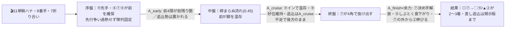
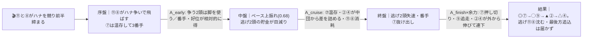
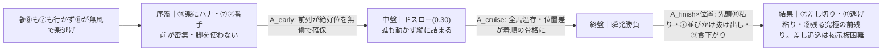

# 🏇 早池峰賞（M2重賞）（2026-06-07 水沢 ダート1400m 良）分析

**モデル: scoring-model v5.0（論理ファースト・相変位再帰を因果骨格として使用）** ／ 使用観点: 7観点 ／ 出走 11頭（5番リトルサムシング取消）
> 着順の並びは論理で決め、印で示す（%は出さない）。市場（オッズ・人気・他人の予想印）は一切参照していない。
> 確定材料（枠順・5番取消）は本文に織り込み済み。

## 1. サマリ（結論）

- **予想本命 ◎**: 7 ルコルセール — 同条件・栗駒賞(4/28水沢ダ1400)を通過4-1-1で完勝＋シアンモア記念(M1)連勝。**全展開パターンで番手の絶好位**を取れ、地力・状態ともトップ。死角の少ない軸。
- **対抗 ◯**: 9 スプラウティング — 水沢ダ1400で**4戦連続3着以内**の鉄板コース実績。好位自在で展開不問。勝ち切りの一押し不足だけが課題。
- **単穴 ▲**: 2 ウラヤ — 栗駒賞2着＋中央ダ1400×3勝の地力2番手。**先行争いが激化（P2）すれば好位差しで最も浮上**。
- **連下 △**: 4 タイセイウォリアー — 直近1200勝ちの上昇基調＋栗駒賞4着。ペースが上がれば差しが届く。
- **注意 ×**: 10 スターシューター — 水沢ダ1400・白嶺賞勝ちのコース実績。ただし追込質で前残りコースは逆風、ハイ化(伏線崩壊)で台頭。
- **最有力展開**: **P1 ルコルセール番手支配・締まらない先行流れ（本線★★★）**（鍵馬: 7・11・8）。対抗 P2 先行争い共倒れ・好位差し台頭（★★）、伏線 P3 サンエイ単騎超スロー前残り（★）。
- **展開を分ける一点**: **11サンエイウイング・8クリダーム・7ルコルセールの三つ巴**。11が単騎で行き8が引けばP1（前残り）、11と8が競ればP2（差し台頭）。7はハナに拘らず番手＝どの形でも得をする。

> 馬券（何をどう買うか）はユーザー判断。本レポートは展開と着順の予測のみを提示する。

## 0. 当日アップデート・ボード（当日更新枠 ⏱）

### 0-1. 当日の参考レース（バイアス採取用）
> 採用優先順位: ダート（必須）＞ 同日・時間帯（直前ほど重い）＞ 右回り ＞ 距離帯。本日は全レース水沢ダート＝同条件の前半Rで前残り/差しの効きを採取。

| R | 発走 | コース | 一致度 | 何を読むか |
|---|------|--------|:-----:|-----------|
| 水沢9〜11R | 当日確認 | ダ・右・1300〜1600 | ★★★ | 逃げ先行が止まるか／差しが届くか・伸びる位置 |
| 水沢前半R(1400近辺) | 当日確認 | ダ・右・1400前後 | ★★★ | 同距離の前残り度・内外バイアス |

→ **観察結果（当日記入）**: ペース層 ___／内外バイアス ___／決まり手（逃先差追）___／伸びる位置 ___
> 差しが届く馬場と判明したら → §2-3 で **P2 を本線★★★に格上げ**（▲2・△4の評価を引き上げ、×10を浮上候補へ）。前残りが継続なら P1 を堅持。

### 0-2. 馬場（当日確定）
| 項目 | 値（当日記入） | 質の読み |
|------|----------------|----------|
| 馬場状態 | 良（分析時点。当日確認） | 良ならパワー＋持続力決着 |
| 砂厚 | 約10〜11cm（公式調整値・当日確認） | 厚め=時計かかり前は止まりやすい→差し余地 / 締まれば先行強化 |
| 天候推移 | ___ | 雨で渋れば先行有利がさらに強化＝差し評価を一段割引 |

### 0-3. パドック・返し馬・馬体重（注目馬）
| 印 枠-馬番 馬名 | 馬体重(増減) | パドック/返し馬（当日記入） | 気配 |
|------------|--------------|------------------------------|:----:|
| ◎ 7 ルコルセール | 前走517kg級（当日確認） | | ↑/→/↓ |
| ◯ 9 スプラウティング | 前走529kg級（当日確認） | | ↑/→/↓ |
| × 10 スターシューター | 前走472kg級（やや小柄・波あり） | | ↑/→/↓ |

> **特に10スターシューターは「好不調の波」があるタイプ**＝当日気配で評価が最も動く。パドック確認推奨。

### 0-4. その他当日情報
- 当日発表の乗替／騎乗変更: ___
- 追加の取消・競走除外: ___（5番リトルサムシングは既に取消反映済み）

## 2. 展開予想【成果物1】（STEP4a 展開合成）

> **検証契約**: 脚質別有利不利・隊列・各パターンの段階フローを馬番・符号・可能性ティアで固定。レース後に通過順・上がりから復元したペース層と照合し展開精度を独立採点する。

### 2-1. 脚質分類表（全馬・観点E証拠／確定枠を反映）

| 枠-馬番 | 馬名 | 騎手 | 脚質 | テン速 | 近走通過(核=栗駒賞4/28) | 想定位置 |
|--------|------|------|------|--------|--------------------|----------|
| 7-7 | ルコルセール | 石川倭 | 先(番手抜け出し) | 速〜中 | 4-1-1（1着） | 好位2〜3番手・支配役 |
| 11-11 | サンエイウイング | 岩本怜 | 逃(ハナ必須) | 速 | 1-1-1常習 | 単騎ハナ最有力 |
| 8-8 | クリダーム | 山本政 | 先(逃げも可・消耗型) | 速 | 2-1-2（7着失速） | ハナ〜2番手 |
| 9-9 | スプラウティング | 塚本涼 | 先〜好位 | 速〜中 | 3-4-3（3着） | 2〜4番手 |
| 2-2 | ウラヤ | 山本聡 | 差し(好位差し可) | 中〜やや遅 | 7-7-6（2着） | 中団 |
| 12-12 | テーオースパロー | 村上忍 | 可変(好位〜差し) | 中(出せば速) | — | 好位〜中団 |
| 3-3 | エスクマ | 佐々志 | 先(現状不安定) | 本来速・現状不安定 | 10-11-12（11着） | 好位〜中後方 |
| 4-4 | タイセイウォリアー | 高橋悠 | 差し〜追込 | 中〜やや遅 | （栗駒賞4着） | 中後方 |
| 10-10 | スターシューター | 高松亮 | 追込〜差し | 中〜遅 | （栗駒賞5着・上り最速級） | 中後方 |
| 1-1 | ルクスディライト | 齋藤友 | 追込 | 遅 | 11-11-11（10着） | 後方 |
| 6-6 | ブラックストーム | 落合玄 | 追込 | 遅 | （名古屋から転入初戦） | 後方 |

> 脚質はnetkeiba seedをoddspark/db.netkeibaの実通過順で裏取り。**seedとの主な差異**: 7ルコルセールは「逃げ」seedだが実態は番手抜け出し型(4-1-1)、11サンエイが真の逃げ(1-1-1)、2ウラヤは先行seedだが実態は中団差し、9スプは好位先行。

### 2-2. 展開パターン（複数・可能性ティア）

| id | パターン名 | 可能性 | 発動トリガー | 有利脚質（逃/先/差/追） | 浮上馬 | 沈む馬 |
|----|-----------|:-----:|--------------|------------------|--------|--------|
| P1 | ルコルセール番手支配・締まらない先行流れ | 本線★★★ | 11単騎ハナ・8が競らず番手・7が2〜3番手で折り合い | +1/+2/-1/-2 | 7 9 2 | 1 6 10 12 |
| P2 | 先行争い共倒れ・好位差し台頭 | 対抗★★ | 11と8がハナを競り前半締まる | -2/+1/+1/0 | 7 9 2 4 | 11 8 |
| P3 | サンエイ単騎超スロー前残り | 伏線★ | 8も7も主張せず11が無風で楽逃げ | +2/+2/-2/-2 | 11 7 9 | 1 4 6 10 12 |

> 可能性ティア = 本線★★★ / 対抗★★ / 伏線★。**3パターンとも前残り基調**（水沢ダ1400は逃げ勝率~23%/追込~2%の前有利コース）。差は前半の締まり具合のみ。
> **共通の受益者は 7・9・2**＝この3頭の上位は全パターンで揺るがない。可変要素は差し勢（2・4）の着位がP2でどれだけ浮くか。

#### 各パターンの段階フロー（序盤→能力→中盤→能力→終盤→能力→結果）

**P1 ルコルセール番手支配（本線★★★）**

> 1行要約: **11単騎で締まらず → 中盤も前が脚を温存 → 終盤に番手の7が抜け出し、好位の9・好位差しの2が続く前残り**。

**P2 先行争い共倒れ・好位差し台頭（対抗★★）**

> 1行要約: **11と8が競って前が締まる → 逃げ2頭が中盤で消耗 → 番手7はそのまま、好位差しの2・4が浮上**。

**P3 サンエイ単騎超スロー前残り（伏線★）**

> 1行要約: **誰も競らず超スロー → 全馬脚を残すが位置差が固定 → 前にいた7・11・9が止まらず、後方は届かない**。

- **隊列（最有力P1）**: 序盤先頭 `⑪⑧⑦⑨` → 最終コーナー前方 `⑦⑪⑨⑧②`
- **馬場バイアス**: 前残り・先行有利・内枠やや有利（直線約245mと短い）。当日 §0-1 で上書き前提。
- **反証条件**: ①11が被されて競る／前半3F速め（pace_level0.6超）→ **P2 を本線へ**。②7が大きく後方に置かれる→軸の前提が崩れ全体再評価。③雨で渋り→差し評価を一段割引（P3寄り）。④参考Rで明確な外差し馬場→P2格上げ＋×10浮上。

### 2-3. 当日修正（あれば）
> STEP6 で当日情報（参考R・パドック・馬場）を受けた場合のみ追記。

## （展開→着順の伝達）
最有力P1では「11が締めない先行流れ→中盤も前が温存→終盤に番手の7が抜ける」因果のため、◎7は**位置・余力・決め手すべてが噛み合い盤石**。◯9・▲2は前残り圏内で2〜3着を分け合う。P2（先行争い）に振れた場合のみ▲2・△4の差し勢が一段浮く＝当日のハナ争いが着順の最大の分岐。

## 3. 着順予想表【成果物2】（メイン出力・表が主役）

> **検証契約**: 並び（印＋行順）＋各馬の展開感度・好材料・懸念点を固定。レース後に実着順と照合し、(a)並びの順位相関、(b)実現パターンの段階フローと展開感度の的中、を別個採点。**%は出さない**。

| 印 | 枠-馬番 | 馬名 | 騎手(乗替) | 展開感度 | 好材料 | 懸念点 |
|----|--------|------|-----------|---------|--------|--------|
| ◎ | 7-7 | ルコルセール | 石川倭(継続) | **全パターンで番手の絶好位＝展開非依存に近い**。P1/P3前残りで盤石、P2共倒れでも争いに加わらず受益 | ・[B]同条件・栗駒賞(4/28水沢ダ1400)を通過4-1-1・1:27.9で完勝＝当条件現役No.1を直接証明 ・[A]シアンモア記念(M1)勝ちで地力トップ級＋転入後連勝の充実 ・[E]ハナに拘らぬ番手抜け出し型(4-1-1)＝先行争いの外で絶好位を取れる ・[K]石川倭と重賞2連勝でコンビ完成 | ・[I]8歳の年齢（衰え兆候は無し） ・[E]11と競る形に巻き込まれ脚を使うと甘くなる（反証条件） |
| ◯ | 9-9 | スプラウティング | 塚本涼(継続) | **全パターンで好位2〜4番手＝前残り基調で堅実に上位**。決め手の一押し不足で勝ち切りは展開待ち | ・[D]水沢ダ1400で**4戦連続3着以内**の鉄板コース実績 ・[B]栗駒賞3着・白嶺賞2着(ハナ差)・絆カップ(M2)2着の安定地力 ・[E]好位自在(3-4-3,3-1-1)で展開不問の安定感 ・[G]前走529kg級の好馬体で連続好走 | ・[B]勝ち切りに欠け2〜3着が多い＝決め手の一押し不足 ・[K]塚本涼人はリーディング中位でルコルセールの鞍上力に一歩 |
| ▲ | 2-2 | ウラヤ | 山本聡(継続) | **P2(先行争い共倒れ・好位差し台頭)で最も浮上**。P3超スローだと中団差しで届きにくく割引 | ・[B]栗駒賞2着(+0.4・7-7-6)で当条件現役2番手を直接証明 ・[A]絆カップ(M2)勝ち＋中央ダ1400×3勝の地力 ・[K]山本聡哉=リーディング3位の継続騎乗＋中6週の余裕ローテ | ・[I]出遅れ癖(あおる)＝発馬リスク ・[D]盛岡型で水沢は1枚割引・1200ベストで1400は限界寄り |
| △ | 4-4 | タイセイウォリアー | 高橋悠(継続) | **P2でペースが上がれば差しが届く**。P1/P3前残りだと差し質で展開待ち | ・[B]前走5/12スプリント特別1着で岩手初勝利＝上昇基調 ・[B]栗駒賞4着(+0.9)で上位接近・距離短縮で良化 ・[K]高橋悠里=リーディング4位の継続 | ・[E]差し脚質×前残りコースは展開頼み ・[D]1600以上は大敗続きで1400が距離上限の可能性 |
| × | 10-10 | スターシューター | 高松亮(継続) | **P2/ハイ化(反証条件)で追込が生きる**。P1/P3前残りだと届かずコース逆風 | ・[D]水沢ダ1400・白嶺賞(1:27.7)差し切り勝ち＝コース×距離の勝ち切り実績 ・[B]栗駒賞5着で上り最速級の瞬発力 ・[K]高松亮=リーディング5位 | ・[E]追込×前残りコース(追込勝率~2%)が構造的逆風 ・[I]8歳・近走勝ち切れず頭打ち＋「好不調の波」で当日気配次第 |

**印無しの評価（参考）**
- **8 クリダーム**(山本政2位): 先行でコース順方向だが、栗駒賞7着＝1400は長く、消耗型で先行争いの当事者＝脚を使うと総崩れリスク。
- **11 サンエイウイング**(岩本怜): 逃げで自分の形だが9歳・重賞では足りず(白嶺賞11着)、7との先行争いで消耗の懸念。展開の鍵馬だが上位は難しい。
- **6 ブラックストーム/12 テーオースパロー/1 ルクスディライト/3 エスクマ**: 追込or地力下位＋前残りコース逆風で評価薄。3エスクマは近3走大敗で巻き返し材料乏しい。

- **印**: ◎本命／◯対抗／▲単穴／△連下／×注意。並びと印だけで強弱を表す（%は出さない）。
- 観点タグ＝ A指数 / B近走 / C血統 / D適性 / E展開 / F調教 / G馬体ローテ / H気配 / K騎手 / I リスク。

## 4. 観点別ハイライト（横断）

- **A 指数/B 近走**: 地力序列 **7≧2≧9（本線3頭が明確に抜け）> 4 > 10 >（8/11/6）>（1/3/12）**。同条件・栗駒賞(4/28)＋シアンモア記念(5/10)に主力が同居＝最良の比較材料。前にいける質が高く追込勢の地力が低い→前残り示唆。
- **C 血統**: 7ルコルセール(父ロードカナロア)が1400持続血統の最上位。11(シニスターミニスター)・8(母父サクラバクシンオー)・9(ダイワメジャー)も岩手砂×1400に好相性。差し追込×小回り1400は血統が良くても展開待ち。
- **D 適性**: 水沢ダ1400は**前残り・先行・内枠有利が複数ソースで強く一致**（逃げ勝率~23%/追込~2%）。同条件栗駒賞の着順が最強指標＝7・2・9が上位、追込6/10/12は逆風。
- **E 展開＋STEP4a**: 逃げ11・消耗型先行8・番手型7の三つ巴が分岐軸。**7がハナに拘らない**読み（実通過4-1-1）がP1本線の核。3パターンとも前残り基調。
- **F/G/H 状態/K 騎手**: 状態トップは7(重賞連勝・コンビ完成)。騎手は全体に岩手上位陣（村上1位/山本政2位/山本聡3位/高橋4位/高松5位）が騎乗。**H当日気配はweb未公表＝確信度低**。
- **I リスク**: 減点が重いのは 6(8歳追込)・11(9歳・1400半端)・8(移籍後不振・距離長い)・12(大幅格上挑戦)。◎7はリスク要因が年齢のみで最小。

## 5. データの確かさ・補強のお願い

- **確信度が低い観点**: **H 当日気配（馬体重増減・パドック・厩舎/騎手談話）はweb未公表**で未反映。F調教時計も地方非公開で近走内容を代替指標とした。
- **ユーザー補強推奨**: 当日のパドック/確定馬体重（特に**10スターシューター＝波あり、7ルコルセール、2ウラヤ＝出遅れ癖**）、前半参考Rの馬場バイアス。
- **欠損・推定箇所**: 8クリダームの水沢ダ1400実績、一部馬の血統表段の読取ブレ（複数照合で補正済）。

## 6. 免責
予測であり的中を保証しない。賭けは自己責任で、馬券選択・実ベットは人間判断。市場は一切参照していない。
