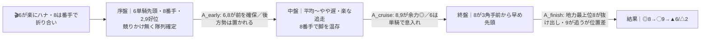
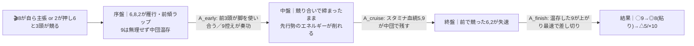

# 🏇 佐賀7R 佐賀王冠賞（2026-06-07 佐賀 ダ2000m右 稍重）分析

**モデル: scoring-model v5.0（論理ファースト・相変位再帰を因果骨格として使用）** ／ 使用観点: 6観点(A/B/C/D/E/K) ／ 出走 **8頭**（馬番1 オオイチョウ＝競走除外・馬番3 ベネロングポイント＝出走取消は非出走）
> 着順の並びは論理で決め、印で示す（%は出さない）。市場（オッズ・人気）は一切参照していない。

## 1. サマリ（結論）

- **予想本命 ◎**: **8 ビキニボーイ（山口勲・継続）** — 前年同レース（2025佐賀王冠賞ダ2000m）勝ち馬。地力最上位＋稍重2000m実績（鏡山特別重1着）＋本舞台巧者の山口勲。先行〜まくり差しの自在脚質で**どの展開でも崩れない**。
- **対抗 ◯**: **9 コスモファルネーゼ（飛田愛斗）** — 九州大賞典（佐賀の長距離重賞）勝ち。差し決め手はメンバー最速級。流れれば◎を逆転する。
- **単穴 ▲**: **6 ソイジャガー** — ハナ筆頭・最軽量54kg・佐賀巧者。前残りなら3着圏。
- **連下 △**: **2 エイシンアンヴァル**（スロー逃げ残り）／**5 ダノンターキッシュ**（ハイ消耗戦の地力スタミナ）
- **注意 ×**: **10 アクラシア** — 稍重で内が深く外伸び馬場になった時だけ浮上する変則ヒモ。
- **最有力展開**: **P1「ソイ単騎→ビキニ番手 緩み前残り」（本線★★★）**（鍵馬: 6・8）。対抗 **P2「先行争いハイ→差し台頭」★★**、伏線 **P3 超スロー瞬発／P4 外差し馬場 ★**
- **展開を分ける一点**: **8ビキニボーイが「番手で折り合う」か「自ら競りに行く」か**。折り合えば前残りで◎盤石、競れば前傾化して◯コスモの差しが届く。

> 馬券（何をどう買うか）はユーザー判断。本レポートは展開と着順の予測のみを提示する。

## 0. 当日アップデート・ボード（当日更新枠 ⏱）

### 0-1. 当日の参考レース（バイアス採取用）
> 佐賀は地方競馬のためスクレイパ未対応。**同日・佐賀のダート（必須）／本馬の直前（18:05発走＝後半）に近いダ1800〜2000mの前半R**を当日名指しで拾い、内外・前残り/差し届くを採取する。

| R | 発走 | コース | 一致度 | 何を読むか |
|---|------|--------|:-----:|-----------|
| 当日特定（同日佐賀ダ1800〜2000） | — | ダ・右・1800-2000 | ★★★ | 内/外どちらが伸びるか・前残りか差し届くか |
| 当日特定（同日佐賀ダ・本馬直前R） | — | ダ・右 | ★★☆ | 馬場進行（稍重→重/良へ）と先行残りの可否 |

→ **観察結果（当日記入）**: ペース層 ___／内外バイアス ___／決まり手（逃先差追）___／伸びる位置 ___
> この行が埋まったら §2-3 当日修正へ。**「内が深く外伸び」なら P4 を格上げ／「前残り顕著」なら P1 を確信**。

### 0-2. 馬場（当日確定）
| 項目 | 値（当日記入） | 質の読み |
|------|----------------|----------|
| 馬場状態 | 稍重（要再確認） | 進行で重/良へ動くと先行残りの度合いが変わる |
| 含水率 | ___ | ダ:内ラチ沿いが砂深いほど外差し浮上 |

### 0-3. パドック・返し馬・馬体重（注目馬）
| 印 馬番 馬名 | 馬体重(増減) | パドック/返し馬（当日記入） | 気配 |
|------------|--------------|------------------------------|:----:|
| ◎ 8 ビキニボーイ | ___ | | ↑/→/↓ |
| ◯ 9 コスモファルネーゼ | ___ | | ↑/→/↓ |
| ▲ 6 ソイジャガー | ___ | | ↑/→/↓ |

### 0-4. その他当日情報
- 当日発表の乗替／取消・除外: 馬番1除外・馬番3取消は反映済み。追加があれば記入。
- 天候推移: ___

## 2. 展開予想【成果物1】（STEP4a 展開合成）

> **検証契約**: 脚質別有利不利・隊列・各パターンの段階フローを馬番・符号・可能性ティアで固定する。レース後に通過順・上がりから復元したペースと照合し、展開精度を独立採点する。

### 2-1. 脚質分類表（全馬・観点E証拠）

| 馬番 | 馬名 | 騎手 | 脚質 | テン速 | 想定位置 |
|:--:|------|------|:--:|:--:|----------|
| 6 | ソイジャガー | 石川慎将 | 逃・先 | 速 | **ハナ最有力**（最軽量54・佐賀6-1-1-1） |
| 8 | ビキニボーイ | 山口勲 | 先〜差(自在) | 速〜中 | **隊列の基準**。番手 or 自らハナ |
| 2 | エイシンアンヴァル | 長谷川蓮 | 逃〜先 | 中 | 好位〜先行（距離延長で押し上げ） |
| 9 | コスモファルネーゼ | 飛田愛斗 | 差(自在) | 遅め | 中団、展開待ち（前走は逃げ勝ちも） |
| 5 | ダノンターキッシュ | 出水拓人 | 中団(自在) | 中 | 中団 |
| 7 | ダンツドール | 川島拓 | 中団 | 中 | 中団（脚質確証薄・確信度低） |
| 4 | ハディア | 金山昇馬 | 先〜中団 | 遅め | 中団後方（稍重2000m先行実績はあり） |
| 10 | アクラシア | 竹吉徹 | 差・後方 | 遅め | 後方（最外） |

### 2-2. 展開パターン（複数・可能性ティア）

| id | パターン名 | 可能性 | 発動トリガー | 有利脚質（符号） | 浮上馬 | 沈む馬 |
|----|-----------|:-----:|--------------|------------------|--------|--------|
| P1 | ソイ単騎→ビキニ番手 緩み前残り | **本線★★★** | 6が楽にハナ・8が前走同様番手で折り合う | 逃+1 先+1 差0 追-2 | 8 9 6 2 | 10 7 4 |
| P2 | 先行争い→締まってハイ | 対抗★★ | 8が自らハナ or 2が押して6と3頭が競る | 逃-2 先-1 差+2 追+1 | 9 5 10 8 | 6 2 4 |
| P3 | 全頭控え→超スロー瞬発 | 伏線★ | 誰もハナを強く主張せず緩む | 逃+1 先+1 差0 追-2 | 8 9 2 6 | 4 10 7 |
| P4 | 稍重で内深→外差し変則馬場 | 伏線★ | 当日内ラチ砂深く外伸び確認 | 逃-1 先0 差+1 追+1 | 8 9 10 | 6 2 4 |

> 内部確率（ログ用）: P1=.42 / P2=.30 / P3=.16 / P4=.12。**前残り基調（P1+P3=.58）が主**、ハイ前崩れ（P2）が次点。

#### 各パターンの段階フロー

**P1 ソイ単騎→ビキニ番手 緩み前残り（本線★★★）**

> 1行要約: **6が単騎で緩く逃げ8が番手 → 中盤誰も脚を使わず → 終盤は地力上位の8が番手から抜け、差しの9は位置差で2着、前の6が粘る**。

**P2 先行争い→締まってハイ（対抗★★）**

> 1行要約: **先行3頭が競ってハイ → 中盤で前が消耗 → 終盤は脚を溜めた9が差し切り、8は競った分目減りも地力で2着、消耗戦で5・10の差しが食い込む**。

**P3 超スロー瞬発（伏線★）** ／ **P4 内深→外差し変則馬場（伏線★）**
> P3要約: **誰も行かず超スロー → 全馬余力満タンで直線ヨーイドン → 地力＋瞬発の8、上がり最速の9が抜け、好位の2・6が粘る（後方10・4は密集で不発）**。
> P4要約: **稍重進行で内ラチが砂深く外伸び → 外を回す8（外枠が利点に反転）・9・10が台頭、内先行の6・2は砂を被り失速**。佐賀王冠賞は「外枠の先行が好成績」のデータもあり外目8に追い風。

- **隊列（最有力P1）**: 序盤先頭 `6→8→2・9` → 最終6角前方 `6 8 2` ＋好位差し `9`、後方 `5 7 4 10`
- **馬場バイアス**: 佐賀ダ2000は**前々有利**（逃連対41.7%/先33.1%/差16.1%/追4.9%、5枠最良、外枠＝8枠不利）。**少頭数＋馬番1除外で隊列が縦長になりにくく外枠ペナルティ緩和・前残りリスク上昇**。稍重で内ラチ砂深→外差しやや浮上の余地（→P4）。
- **反証条件**: 6が前走9着の反動で行き脚つかず誰も主張しない→**P3を格上げ**。8が自ら競りに行く／2が距離延長で強く押して3頭雁行→**P2を本線へ格上げ・P1格下げ**（◯9の差しが届く）。当日内が深く外伸び→**P4格上げ**（×10が浮上）。

### 2-3. 当日修正（あれば）
> 当日 §0-1 参考Rのバイアスと先行争いの実形を受けてティアを付け替える。「外伸び馬場＋前傾」なら P2/P4 を上げ ◯9・×10 を見直し、「前残り顕著＋6単騎」なら P1 確信で ◎8 盤石。

## （展開→着順の伝達）
最有力P1では「8が番手→終盤A_finish最上位で抜け、9は差すが位置差で届かず」が骨格。ゆえに**◎8→◯9**が基本の並び。前傾化（P2）すれば9が逆転、超スロー（P3）でも地力の8が頭。**8はどのパターンでも1〜2着圏＝軸の信頼度が高い**のが本レースの核。

## 3. 着順予想表【成果物2】（メイン出力）

> **検証契約**: 並び（印＋行順）＋各馬の展開感度・好材料・懸念点を固定。レース後に実着順・通過順と照合し、(a)並びの順位相関、(b)展開感度の的中を別個採点。

| 印 | 馬番 | 馬名 | 騎手(乗替) | 展開感度 | 好材料 | 懸念点 |
|----|:--:|------|-----------|---------|--------|--------|
| ◎ | 8 | ビキニボーイ | 山口勲(継続) | **全パターンで1〜2着圏＝展開不問**。P1番手抜けで盤石／P2でも地力で粘り2着／P3瞬発でも頭 | ・[A]前年同レース(2025佐賀王冠賞ダ2000)勝ち＝当条件のクラス直接実証 ・[B]鏡山特別2000m重で1着＝**稍重2000mの実績が本日条件と同質** ・[B]前走佐賀スプリングC(重賞)を先行抜け出しで快勝＝好調持続 ・[K]山口勲(通算5,657勝)継続＝本舞台巧者・前走重賞連覇コンビ | ・[C]父ビーチパトロールは芝寄り・道悪ダートに血統的逆風（地力で相殺の範囲） ・[I]はがくれ大賞典(良)で6着＝極端な高速上がり勝負だとキレ負けの余地 |
| ◯ | 9 | コスモファルネーゼ | 飛田愛斗 | **流れれば◎を逆転**。P2(ハイ前崩れ)で最強・P4外差しでも台頭／P1緩みだと位置差で2着止まり | ・[A]2025九州大賞典(佐賀の長距離重賞)勝ち＝ダ2000級重賞を勝ち切る地力 ・[B]前走スプリングC差して3着・**上がり最速級**＝決め手はメンバー最上位 ・[C]父アイルハヴアナザーはダ中距離＋道悪◎で稍重は血統的プラス ・[K]飛田愛斗(2026全国リーディング7位)＝騎手力2番手 | ・[E]差し主体ゆえ前々有利の佐賀2000では**前残り(P1)だと届かないリスク** ・[B]佐賀記念2000mで10着＝相手強化の2000で取りこぼし歴 |
| ▲ | 6 | ソイジャガー | 石川慎将 | **前残り(P1/P3)で3着圏**。ハナを取り切れば粘り込み／ハイ(P2)・外差し(P4)では失速 | ・[E]ハナ最有力・佐賀の通過/着順が「6-1-1-1」＝**先行して残せる生データ** ・[B]斤量54kg(牝4軽量)で消耗戦の終盤に余力 ・[C]父ホッコータルマエ×母父ハーツクライ＝ダ2000スタミナ最良配合 | ・[A]中央未勝利・勝ち鞍はC級〜条件級＝**重賞は実質初挑戦の格上挑戦** ・[B]前走スプリングC9着＝古馬オープン上位で力不足を露呈 |
| △ | 2 | エイシンアンヴァル | 長谷川蓮 | **スロー(P1/P3)逃げ残り限定**。単騎で楽に行ければ好位の利／ハイ・外差しでは真っ先に止まる | ・[E]メンバー唯一のハナ宣言級＝ペースを自在に作れる ・[B]白山大賞典2000m等を走り切った距離経験あり ・[B]近走崩れず状態は安定 | ・[B]前走1-1-1で逃げて4着＝**A_finish(決め手)不足が明確** ・[A]牡9・近走軸は1300-1400m＝2000mは長く高齢の消耗戦不安 |
| △ | 5 | ダノンターキッシュ | 出水拓人 | **ハイ消耗戦(P2)で浮上**。前崩れに乗じて差し込み／前残り(P1)では届かず | ・[A]前年同レース3着＝当条件でコスモに先着の地力 ・[C]父ルーラーシップ×母父Sinndar＝重厚スタミナで稍重消耗戦◎ ・[A]中央獲得賞金5799万＝素地はメンバー上位 | ・[B]佐賀移籍後16戦未勝利＝**勝ち切れない決め手不足が顕著** ・[B]前走8着・8歳でピーク超えの懸念 |
| × | 10 | アクラシア | 竹吉徹 | **変則馬場(P4)限定で浮上**。内深→外伸びなら最外＋差しが噛み合う／通常バイアスでは最不利 | ・[A]通算勝率.347の勝ち星量産タイプ・1300〜2000m融通 ・[C]父ホッコータルマエでダ2000長丁場のスタミナ適性 | ・[D/E]**最外＋差し脚質＝前々有利の佐賀2000でバイアス最悪**(6角累積距離損最大) ・[A]地方賞金最低水準＋前走7着＝重賞通用の証拠なし |
| 無 | 4 | ハディア | 金山昇馬 | 稍重2000m先行で粘った伏線はあるが現状フォーム不安。圏外 | ・[B]鏡山特別2000m重で2着＝稍重2000m先行の地肌 | ・[B]前走スプリングC11着(3.0秒差)＝フォーム不安定・9歳衰え |
| 無 | 7 | ダンツドール | 川島拓 | 先行力の主張薄く前残り馬場で取りこぼし。圏外 | ・[B]牝54kg軽量で展開が向けば食い込み余地 | ・[A]重賞/オープン実績の痕跡なし＝**地力は本メンバー最低クラス**(情報欠損・確信度低) |

- **印**: ◎本命／◯対抗／▲単穴／△連下／×注意。並びと印だけで強弱を表す（%は出さない）。
- **並びの論理**: 8はどの展開でも1〜2着＝軸信頼度が突出 → ◎。9は決め手最上位で流れれば逆転だが前残りだと2着止まり → ◯。6は前残り3着の権利、2・5は展開ハマり時の連下、10は変則馬場の押さえ。

## 4. 観点別ハイライト（横断補足）

- **A 地力**: 前年同レース直接対決（**8→5→9**着）＋9の九州大賞典勝ちが最強のクラス証拠。8>9>5が明確に上位、6・7・10は格上挑戦。
- **B 近走/脚質**: 8は鏡山特別2000m重1着で**稍重2000m適性が直接実証**＝本日条件と同質で最重要。9は上がり最速級の差し、2は逃げてA_finish不足。
- **C 血統**: 稍重ダ2000はホッコータルマエ(6,7,10)・ルーラーシップ(5)・アイルハヴアナザー道悪◎(9)に追い風。8の父ビーチパトロールのみ血統的に逆風だが地力で相殺。
- **D 適性/コース**: 佐賀ダ2000は6角通過の前々有利。**5枠最良・外枠不利**。少頭数＋1番除外で外枠ペナルティ緩和。
- **E 展開**: 先行争いの当事者は6(ハナ筆頭)と8(自在)、2が距離延長で絡む可能性。8が番手で折り合うか競るかが最大の分岐。
- **K 騎手**: 山口勲(8)＞飛田愛斗(9)＞その他6名。上位2頭の鞍上力が地力序列を一段押し上げる。
- **I リスク**: ◎8は極端高速の上がり勝負だとキレ負け／◯9は前残り展開での取りこぼし／▲6は格上挑戦の地力差。

## 5. データの確かさ・補強のお願い

- **確信度が低かった箇所**: ダノンターキッシュ・ダンツドール・アクラシア・ハディアの**精密な通過順（脚質）データが欠損**（地方DBのスニペット制約）。中団〜後方は暫定。
- **当日バイアス未採取**: 佐賀はスクレイパ未対応のため §0-1 参考Rは当日特定。**同日佐賀ダ1800〜2000の前半Rで内外・前残り/差しを確認**いただけると P1↔P2↔P4 のティアを確定できます。
- **補強推奨**: パドック・返し馬・確定馬体重（特に◎8◯9▲6）／当日の馬場進行（稍重→重/良）のURL or 貼り付け。

## 6. 免責
予測であり的中を保証しない。賭けは自己責任で、馬券選択・実ベットは人間判断。市場（オッズ・人気・他人の予想）は一切参照していない。
