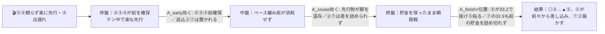
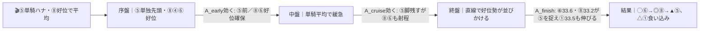

# 🏇 香港ジョッキークラブトロフィー（2026-06-07 東京 芝2000m・左 / 良想定）分析

**モデル: scoring-model v5.0（論理ファースト・相変位再帰を因果骨格として使用）** ／ 使用観点: 6観点（AB/CD/E/FGH/K/I）／ 出走 8頭
> 3歳以上2勝クラス・東京9R・14:25発走・8頭立て・枠確定済み。着順の並びは論理で決め、印で示す（%は出さない）。市場（オッズ・人気）は一切参照していない。

## 1. サマリ（結論）

- **予想本命 ◎**: 8-8 サラスヴァティー — 本線P1(前残り)に最適合する先行力＋東京芝2000m勝ち鞍。横山武史継続で取りこぼしが最も小さい「展開不問の核」。
- **対抗 ◯**: 6-6 ゴーラッキー — 地力・騎手（ルメール）・斤量3kg減が全馬最上位級。好位差しで全パターン上位、唯一の不安は2000m初・古馬初戦。
- **単穴 ▲**: 5-5 マイネルアレス — 連勝の勢い＋スクリーンヒーロー＝東京2000鬼血統。前残りP1/P2なら粘り込むが、前崩れだと上がり最遅で沈む展開依存。
- **連下 △**: 1-1 コンフォルツァ — 最内好枠＋上り33.5。平均〜やや速(P2/P3)に振れれば差し込む。
- **注意 ×**: 7-7 ビーオンザカバー — 上り最速32.9（戸崎）。前崩れ(P3/P4)が起きれば一発、本線P1なら脚を余して届かず。
- **最有力展開**: P1 少頭数スロー・前残り（本線★★★、鍵馬: ⑧⑤の先行）。対抗 P2 平均・好位差し（★★）、伏線 P3 やや速・差し届く（★）。
- **展開を分ける一点**: ⑤マイネルアレス(丹内)と⑧サラスヴァティー(横山武)が**ハナを競るか／どちらかが控えるか**。競ればP3(差し台頭)、譲り合えばP1(前残り)。

> 馬券（何をどう買うか）はユーザー判断。本レポートは展開と着順の予測のみを提示する。

## 0. 当日アップデート・ボード（当日更新枠 ⏱）

> ここには*分析時点で本当に未知のものだけ*を残す。確定材料（枠・騎手・クラス）は §2/§3 本文へ織り込み済み。

### 0-1. 当日の参考レース（バイアス採取用）
> 採用優先: 芝/ダ（必須・絶対混ぜない）＞ 同日・時間帯（直前ほど重い）＞ 回り内外 ＞ 距離帯。芝2000m完全一致は当日カードに無し → 芝の前残り/差し傾向を流用し割引。

| R | 発走 | コース（芝/ダ・回り・距離） | 一致度 | 何を読むか |
|---|------|----------------------------|:-----:|-----------|
| 8R | 13:55 | 芝・左・1600 | ★★☆ | **直前・芝の前後バイアス**。前残りか差し届くか（距離違い→決まり手と伸び位置のみ流用） |
| 5R | 12:25 | 芝・左・1800 | ★★☆ | 距離が最も近い芝。内外どちらが伸びるか（2歳新馬でレベルは別物） |
| 4R | 11:35 | 芝・左・1600 | ★☆☆ | 多頭数芝で内外バイアスを早めに採取（時間帯は遠い） |

→ **観察結果（当日記入）**: ペース層 ___／内外バイアス ___／決まり手（逃先差追）___／伸びる位置 ___
> 8R/5Rで「前残り・内有利」が出れば → P1本線を維持・⑧⑤評価据え置き。「外差し決着」が複数Rで出れば → P3を本線★★★へ格上げ、⑦①⑥を引き上げ（§2-3へ）。

### 0-2. 馬場（当日確定）
| 項目 | 値（当日記入） | 質の読み |
|------|----------------|----------|
| 馬場状態 | 良/稍/重/不 | 渋れば②⑥(道悪巧者血統)上げ・⑤(重△)下げ |
| クッション値 | ___ | 9.0+=高速(硬) / 7前後=標準 / 6未満=軟 |
| 含水率（ゴール前/4角） | ___ / ___ | 芝:高い=渋り＝差し台頭 |

### 0-3. パドック・返し馬・馬体重（注目馬）
| 印 枠-馬番 馬名 | 馬体重(増減) | パドック/返し馬（当日記入） | 気配 |
|------------|--------------|------------------------------|:----:|
| ◎ 8-8 サラスヴァティー | ___ (前走474) | | ↑/→/↓ |
| ◯ 6-6 ゴーラッキー | ___ (放牧明け484) | 約2ヶ月明け＝仕上がり8分目か要確認 | ↑/→/↓ |
| ▲ 5-5 マイネルアレス | ___ | 中1週・連闘気味＝反動の有無 | ↑/→/↓ |

### 0-4. その他当日情報
- ⑤⑧の先行意思（返し馬の行き脚・テンの主張）＝ P1/P3 の分岐点。要観察。
- ④エボルヴィング(M.ディー)のスタート（近走1角12/18の出遅れ走あり）＝出ればP3寄りに締まる。

## 2. 展開予想【成果物1】（STEP4a 展開合成）

> **検証契約**: 脚質別有利不利・隊列・各パターンの段階フローを馬番・符号・可能性ティアで固定。レース後に復元ペース層と照合して展開精度を独立採点する。

### 2-1. 脚質分類表（全馬・観点E証拠／確定枠反映）

| 枠-馬番 | 馬名 | 騎手 | 脚質 | テン速 | 近走1角(位置/頭数) | 上り最速 | 想定位置 |
|--------|------|------|------|--------|--------------------|:-------:|----------|
| 8-8 | サラスヴァティー | 横山武史 | 先 | 中 | 3/17,3/12,2/10,4/12 | 33.2 | **先行争い筆頭**・前2〜3番手 |
| 5-5 | マイネルアレス | 丹内祐次 | 先(ハナ含) | 中 | 2/14,4/12,2/14,5/12 | 34.2 | **ハナ主張**・番手〜2列目 |
| 4-4 | エボルヴィング | M.ディー | 先 | 中 | 4/9,3/18,12/18,3/10 | 34.0 | 先行3番手前後（出脚不安定） |
| 6-6 | ゴーラッキー | C.ルメール | 差(好位) | 中 | 5/15,5/12,2/12 | 33.6 | 好位〜中団4〜5番手 |
| 3-3 | クロシェットノエル | 武藤雅 | 差(位置取れる) | 中 | 4/16,7/11,4/9,4/8 | 33.9 | 中団前め4〜5番手 |
| 1-1 | コンフォルツァ | 丸山元気 | 差 | 遅 | 5/16,11/15,8/8,5/13 | 33.5 | 中団5〜6番手・最内 |
| 7-7 | ビーオンザカバー | 戸崎圭太 | 追 | 遅 | 9/9,9/15,8/9,6/9 | **32.9** | 後方6〜8番手 |
| 2-2 | ズイウンゴサイ | 津村明秀 | 追 | 遅 | 11/16,10/10,7/8,16/16 | 33.2 | 後方一手・最後方 |

> コース: 1角奥ポケット発走→2角まで約130mと短い／直線約525m・残り1Fに高低差約2.7mの急坂。脚質別実績は逃15.9%・先13.3%・差6.7%・追3.7%で**前有利**。ただしクラスが上がると上がり勝負で差し台頭。

### 2-2. 展開パターン（複数・可能性ティア）

| id | パターン名 | 可能性 | 発動トリガー | 有利脚質（符号） | 浮上馬 | 沈む馬 |
|----|-----------|:-----:|--------------|------------------|--------|--------|
| P1 | 少頭数スロー・前残り | 本線★★★ | ⑤⑧が競らず楽に先行・④出遅れ | 逃◎ 先◎ 好位差○ 差△ 追× | 8 5 6 | 7 2 |
| P2 | 平均・好位差し台頭 | 対抗★★ | ⑤単騎ハナ・⑧好位で平均 | 逃○ 先◎ 好位差◎ 差○ 追△ | 6 8 5 1 | 2 |
| P3 | やや速・差し届く | 伏線★ | ⑤⑧競り合い＋④絡む三つ巴 | 逃△ 先○ 好位差◎ 差◎ 追○ | 6 8 7 1 | 5 4 |
| P4 | 超スロー瞬発・前総崩れ | 伏線★ | 誰もハナを取らず団子 | 位置消滅・上り最速一本 | 7 6 1 | 5 4 |

> 可能性ティア＝本線★★★/対抗★★/伏線★（%は出さない）。`有利脚質`と`浮上/沈む馬`は着順・通過順から検証できる展開検証の正本。
> **核の感度**: ⑥⑧は全パターン上位＝展開不問。⑤は前残り(P1/P2)依存。⑦②は前崩れ(P3/P4)依存。これが並びの分岐点。

#### 各パターンの段階フロー

**P1 少頭数スロー・前残り（本線★★★）**

> 1行要約: **誰も競らずスロー → 前が脚を温存 → ⑧が好位から抜け⑤粘り、最速上がりの⑦も貯金を詰め切れず脚を余す**。

**P2 平均・好位差し台頭（対抗★★）**

> 1行要約: **⑤単騎で平均 → 好位の⑥⑧が射程に取り付き → 直線で⑥⑧が差し切り⑤粘る、最内①も上がりで食い込む**。

**P3 やや速・差し届く（伏線★）**

> 1行要約: **⑤⑧④の競り合いでやや速 → 先行勢が坂で垂れ → 溜めた⑥⑧と最速上がりの⑦①が差し込む**。

- **隊列（最有力P1）**: 序盤先頭 `⑧⑤④` → 最終コーナー前方 `⑧⑤④⑥③①⑦②`
- **馬場バイアス**: 良想定で前有利（東京2000の逃先優位が少頭数で増幅）。当日 §0-1 で上書き前提。渋れば差し方向へ。
- **反証条件**: ⑤⑧が明確に競る→P3を本線へ格上げ・⑦①⑥上げ・⑤④下げ。8Rで外差し決着が出れば同様。馬場急速乾燥で更に前残り→P1強化。

### 2-3. 当日修正（あれば）
> STEP6 で当日情報（参考R・パドック・馬場）を受けた場合のみ追記。現時点は空。

## （展開→着順の伝達）
最有力P1(前残り)では先行の⑧が貯金を活かして抜け、⑤が粘る。⑥は展開不問の地力で好位から差し込み常に上位。⑦②の最速上がりは本線では届かず＝買えるのは前崩れP3/P4が起きた時のみ。この「⑥⑧=核／⑤=前残り依存／⑦=前崩れ依存」の感度差が並びの骨格。

## 3. 着順予想表【成果物2】（メイン出力・表が主役）

> **検証契約**: 並び（印＋行順）＋各馬の展開感度・好材料・懸念点を固定。レース後に実着順と照合し、(a)並びの順位相関＝総合、(b)展開感度＝純粋な能力読み、を別個採点。**%は出さない**。

| 印 | 枠-馬番 | 馬名 | 騎手(乗替) | 展開感度 | 好材料 | 懸念点 |
|----|--------|------|-----------|---------|--------|--------|
| ◎ | 8-8 | サラスヴァティー | 横山武(継続) | **展開不問の核**。本線P1(前残り)で先行力が最大化／P2でも好位差しで盤石／P3でも先行勢で唯一33.2を使え連対圏。前崩れP4だけ切れ負け懸念 | ・[D]2025/10東京芝2000で1着(上り33.2,-0.0)＝当舞台巧者で距離コース実証 ・[E]先行争い筆頭・近走1角2〜4番手で安定＝少頭数前残りの恩恵を最も受ける ・[K]横山武3走連続1-2-1着＝コンビ完璧で位置取り巧者 ・[A]6戦2勝2着2回で連対率高く堅実 | ・[B]2勝クラス初戦＝古馬上位との対戦経験は限定的 ・[E]⑤④と先行争いが激化すると楽はできない |
| ◯ | 6-6 | ゴーラッキー | ルメール(強化・黄金復帰) | **展開不問の核**。好位差しで全パターン上位(P2/P3/P4で最上位級)。本線P1でも前々から差し込み圏内。極端な前残りだけ取りこぼしの薄い懸念 | ・[A/D]東京芝1600を1:33.2・上り34.3で圧勝＝高速左回り適性は出走馬トップクラス、底を見せていない3歳上がり馬 ・[C]父キタサンブラック＝東京芝2000鬼血統 ・[K]ルメール再騎乗(横山武→トップ騎手強化)＝この馬で新馬・1勝Cを2連勝した黄金コンビ復活 ・[I-]3歳55kgで古馬58kgに斤量3kg有利 | ・[B]芝2000m初・古馬混合初戦＝距離延長と相手強化が同時、揉まれ慣れ薄い ・[G]約2ヶ月放牧明け初戦＝仕上がり8分目の可能性 |
| ▲ | 5-5 | マイネルアレス | 丹内(継続・連勝中) | 前残りP1/P2で粘り込む本線級／やや速・前崩れP3/P4だと上り最遅で真っ先に垂れる**前残り依存**が最大の振れ | ・[C]父スクリーンヒーロー＝東京芝2000が最も得意なコース血統(回収値突出) ・[F/状態]追い切りS評価＋二王子特別完勝で連勝中＝勢い・気配が全馬最上位 ・[E/K]丹内の先手必勝型×先行力で楽な先行を取れる、8頭少頭数で立ち回り優位 | ・[A]上り最速34.2はメンバー最遅クラス＝瞬発・高速決着だと見劣り ・[G]前走から中1週の急ローテ＝反動・疲労残りのリスク ・[B]2勝クラス初戦・2000m替わり(好走は新潟1800偏重) |
| △ | 1-1 | コンフォルツァ | 丸山(継続) | 平均〜やや速(P2/P3)で最内から差し込む／本線P1(超前残り)だとテン遅で届かない。展開が少しでも流れれば台頭 | ・[A]2勝クラスで信濃川3着・胎内川2着と通用済みで底が深い、上り最速33.5の決め手 ・[E]1枠1番＝東京芝2000で勝率13.4%/複勝31.7%の全枠最良データ枠・脚を溜めやすい ・[C]父ドゥラメンテ左回り重賞勝ちは全て東京＝コース射程内 | ・[E]テン遅・近走1角5〜11番手＝最内で包まれ出しどころを失うリスク ・[A]2勝クラスで勝ち切れず2-3着止まり＝決定力一枚不足 ・[D]東京2000は実績なし(東京は1800で3着) |
| × | 7-7 | ビーオンザカバー | 戸崎(継続・トップ) | **前崩れ依存の一発**。やや速・超スロー前総崩れ(P3/P4)なら上り最速32.9が炸裂し突き抜ける／本線P1(前残り)では脚を余して届かず＝買うなら展開待ち | ・[A]上り最速32.9はメンバー随一の決め手 ・[D]2025/11東京芝2000で2着(0.1差,上り33.7)＝当舞台好走実績 ・[K]戸崎圭太継続で末脚を最大限引き出せる手 | ・[E]追込・テン遅・近走1角9/9等で後方一手＝8頭少頭数で隊列が締まり最も届きにくい構成(リスク-2) ・[C]父ハービンジャー牡馬は左回り大幅減(複勝右23%vs左8%) ・[B]13戦2勝・近走勝ち切れず詰めの甘さ |
| △ | 3-3 | クロシェットノエル | 武藤(継続) | 平均〜やや速で堅実に中団から拾うが詰めは甘い。展開の上下どちらでも大穴にも消しにもなりにくい中位安定 | ・[B]信濃川4着・東京2000で4着続きと崩れない堅実さ ・[C]母父ハービンジャー牝馬は東京左回り得意 | ・[A]上り33.9は上位陣(32.9〜33.5)に決め手で劣る ・[B]直近4戦連続4着＝勝ち味に遠い頭打ち |

> ↓以下は印を持たないが評価を残す下位2頭（参考）。

| (無) | 4-4 | エボルヴィング | M.ディー(強化) | P1で先行できれば粘るがP3だと競り負けて後退・出脚次第で立ち位置不安定 | ・[クラス]前走阪神2000の1勝C完勝で勢い・距離実績 ・[K]M.デムーロでトップ騎手継続＝陣営の勝負気配 | ・[A]上り34.0と末脚平凡・前々走18着等で安定性欠く ・[E]近走1角12/18の出遅れ走あり＝先行できないと持ち味消失 |
| (無) | 2-2 | ズイウンゴサイ | 津村(テン乗り) | 全パターンで最も恵まれない。前崩れP4で上り33.2を活かす一縷のみ | ・[A]信濃川で上り33.2の末脚自体は持つ | ・[B]近5走すべて6着以下・前走16/16大敗で底見せ(リスク-2) ・[D]好走は2200〜2400で2000m短縮は追走負荷増 ・[K]毎走乗替の常態化＝今回もテン乗りで信頼薄 |

- **印**: ◎本命／◯対抗／▲単穴／△連下／×注意。並びと印で強弱を表す（%は出さない）。
- **展開感度**: §2-2 のパターンを参照し「どの展開で浮上/沈むか」を因果で記述。

## 4. 観点別ハイライト（横断的根拠）

- **A 指数/B 近走**: 地力上位は⑧⑥①⑦。⑧は連対率・東京2000実績、⑥は3歳上がり馬の伸びしろと高速適性。①⑦は決め手上位だが勝ち切れない停滞。②は底を見せ最下位。
- **C 血統/D 適性**: 東京芝2000鬼血統＝⑤スクリーンヒーロー・⑥キタサンブラックが最上位。左回り牡馬で逆風＝⑦ハービンジャー・④ハーツクライ。⑧レイデオロは東京巧者でコース実績の裏付けあり。
- **E 展開＋STEP4a 合成**: 先行当事者は⑧⑤(＋④)。8頭少頭数で本線は前残りP1。鍵は⑤⑧が競るか否か＝競ればP3(差し台頭)へ分岐。上り最速⑦32.9・①33.5は前崩れ時のみ届く。
- **F/G/H 状態/K 騎手**: 状態最上位は⑤(S追い・連勝)・⑥(放牧明けでも余力・ルメール)。騎手強化は⑥(黄金コンビ復帰)・④(デムーロ)。継続好コンビは⑧⑤⑦①。テン乗り不安は②のみ。
- **I リスク**: 最大割引は②(大敗+距離短縮+少頭数で追込不利)と⑦(極端な追込×少頭数の展開待ち)。⑥は相手強化・休み明け・距離初で-1。⑧は割引最小。

## 5. データの確かさ・補強のお願い

- **確信度が低かった点**: H当日気配・最終追い切り時計の一次情報は大半未取得（全観点confidence=中）。タイム指数(スピード指数)は公開DB終了(netkeiba 2026/4)で取得不可、走破時計・上がり・着差で代替評価。
- **ユーザー補強推奨**: ①パドック/返し馬評価、②確定馬体重（特に⑥放牧明け・⑤中1週の反動）、③⑤丹内・⑧横山武の先行意思（返し馬の行き脚）、④当日の8R/5R芝の前後バイアス。
- **欠損・推定**: ⑤マイネルアレスの公開DB近走が2歳止まりで最新4歳戦績の裏取りが薄い（seed通過順で補完）。当日開催の生バイアスは未確定（通算データに依拠）。

## 6. 免責
予測であり的中を保証しない。賭けは自己責任で、馬券選択・実ベットは人間判断。市場は一切参照していない。
