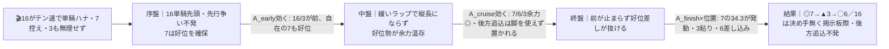
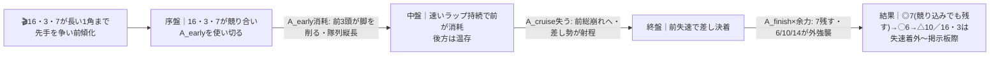
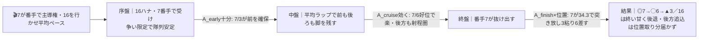

# 🏇 東京10R 八王子特別（2026-06-07 東京 ダ1400m 馬場=当日確定）分析

**モデル: scoring-model v5.0（論理ファースト・相変位再帰を因果骨格として使用）** ／ 使用観点: 10観点 ／ 出走 16頭・15:00発走
> 着順の並びは論理で決め、印で示す（%は出さない）。`score_race.py` は任意のサニティチェック（今回は未実行・論理で確定）。
> **確定材料の先取り**: 枠順は確定済み（JRA経路）。§2-1/§2-2/§3 本文に最初から織り込み済み。

## 1. サマリ（結論）

- **予想本命 ◎ 4-7 シホノペルフェット（F.ゴンサルベス）** — 当馬群で突出した決め手（上り最速 **34.3**）＋ **東京ダ1400で1:22.7勝ち**の実証。逃げ／控えどちらも選べる自在性で、本線の前残りでも対抗のハイ差しでも崩れにくい唯一の馬。
- **対抗 ◯ 3-6 ポッドベル** — 昇級即連続好走（東京ダ1400で4/26・3着、5/16立川特別・4着）。agari35.2の好位差しに松山強化で全パターン対応。
- **単穴 ▲ 2-3 エムティエスターテ** — 前走・東京ダ1400勝ちの上がり馬。先行で本線（前残り）の主役、取りこぼしリスク最小。
- **連下 △ 5-10 マジッククッキー／7-14 ホウオウプレミア** — 10は唯一のOP経験＝地力最上位＋戸崎＋55kg（ハイ前崩れで一気）。14は2勝クラス2着9回の堅実な地力（前崩れで複勝）。
- **注意 × 2-4 メッエフアパラ／8-16 ライジンマル** — 4は本線で中団前めの好位置だが決め手不足。16はペースの起点＝単騎なら粘り、競れば崩壊。
- **最有力展開**: 「**16単騎スロー・前残り**（本線★★★／鍵馬16・3・7）」。対抗「**3頭競り合いハイ・差し台頭**（★★）」、同「**7主導ミドル**（★★）」。
- **展開を分ける一点**: **16ライジンマルが単騎で行けるか／7・3が絡んで競るか**。当日この一点で前残り（本線）⇄ 差し（対抗）が振れる。

> 馬券（何をどう買うか）はユーザー判断。本レポートは展開と着順の予測のみを提示する。

## 0. 当日アップデート・ボード（当日更新枠 ⏱）

### 0-1. 当日の参考レース（バイアス採取用）

| R | 発走 | コース（芝/ダ・回り・距離） | 一致度 | 何を読むか |
|---|------|----------------------------|:-----:|-----------|
| 東京1R | 10:05 | ダ・左・1400（3歳未勝利） | ★★★ | 同コース。内外どちらが伸びるか・前残りか差し届くか |
| 東京7R | 13:25 | ダ・左・1400（3歳上1勝クラス） | ★★★ | 同コース・直前・近クラス。ペース層と伸び位置（最重視） |
| 東京6R | 12:55 | ダ・左・1300（3歳未勝利） | ★★☆ | 距離違い→決まり手と伸び位置のみ流用 |

→ **観察結果（当日記入）**: ペース層 ___／内外バイアス ___／決まり手（逃先差追）___／伸びる位置 ___
> 当日この行が埋まったら **§2-3 当日修正**へ。16が単騎で行けたか・前残りか外差しかで可能性ティアを付け替える。

### 0-2. 馬場（当日確定）
| 項目 | 値（当日記入） | 質の読み |
|------|----------------|----------|
| 馬場状態 | 良/稍/重/不 | 渋れば前残り父系（2ストロングリターン/7マジェ/11デクラ）を上方修正 |
| クッション値 | ___ | 9.0+=高速 / 7前後=標準 / 6未満=軟 |
| 含水率（ゴール前/4角） | ___ / ___ | ダ:低い=時計かかる→消耗戦で差し台頭(対抗P2)寄り |

### 0-3. パドック・返し馬・馬体重（注目馬）
| 印 枠-馬番 馬名 | 馬体重(増減) | パドック/返し馬（当日記入） | 気配 |
|------------|--------------|------------------------------|:----:|
| ◎ 4-7 シホノペルフェット | ___ (±__) | （※近走崩れ＝状態を最重要チェック） | ↑/→/↓ |
| ◯ 3-6 ポッドベル | ___ (±__) | | ↑/→/↓ |
| ▲ 2-3 エムティエスターテ | ___ (±__) | | ↑/→/↓ |

### 0-4. その他当日情報（分析時点で未確定のものだけ）
- 当日発表の乗り替わり／取消・除外: ___（枠・騎手は §2-1/§3 に反映済み）
- 天候推移（朝→発走時）: ___
- **当日の最重要確認**: ①7シホノの気配（近走14・9・16着＝状態が戻ったか）②16が単騎で行けるか③馬場の質（高速⇄タフ）

## 2. 展開予想【成果物1】（STEP4a 展開合成）

> **検証契約**: 脚質別有利不利・隊列・各パターンの段階フローを馬番・符号・可能性ティアで固定。レース後に復元ペース層と照合し展開精度を独立採点する。

### 2-1. 脚質分類表（全馬・観点E証拠／確定枠を反映）

| 枠-馬番 | 馬名 | 騎手 | 脚質 | テン速 | 近4走1角(位置/頭数) | 想定位置 |
|--------|------|------|------|--------|--------------------|----------|
| 8-16 | ライジンマル | 木幡初也 | 逃 | 速 | 1/15 2/13 1/16 2/10 | **単騎ハナ最有力** |
| 4-7 | シホノペルフェット | F.ゴンサルベス | 逃/自在 | 中 | 1/14 15/16 7/12 3/10 | ハナ〜番手・控えも可 |
| 2-3 | エムティエスターテ | 大野拓弥 | 先 | 速 | 3/16 1/16 | 内2枠から先行〜番手 |
| 3-6 | ポッドベル | 松山弘平 | 差 | 中 | 8/12 7/16 3/16 7/16 | 中団好位 |
| 2-4 | メッエフアパラ | 石橋脩 | 差 | 中 | 11/16 5/16 5/16 4/16 | 中団前め |
| 4-8 | レイアポポ | 丹内祐次 | 差 | 中 | 5/15 4/16 9/15 2/16 | 中団 |
| 6-12 | ミスエル | 菊沢一樹 | 追 | 遅 | 3/15 12/15 13/16 6/13 | 中団（前づけ歴あり） |
| 7-13 | キョウエイカンセ | 菅原明良 | 差 | 遅 | 8/15 9/16 11/16 10/16 | 中団後ろ |
| 6-11 | クインズシフォン | 津村明秀 | 差 | 遅 | 12/16 6/13 8/16 9/16 | 中団後ろ |
| 5-10 | マジッククッキー | 戸崎圭太 | 追 | 遅 | 8/12 8/12 8/14 14/16 | 中後方 |
| 1-1 | リリージェーン | 原優介 | 追 | 遅 | 16/16 15/16 10/13 2/16 | 後方 |
| 1-2 | フクチャントウメイ | 吉田豊 | 追 | 遅 | 14/16 13/16 9/16 7/12 | 後方 |
| 3-5 | ケープアグラス | 舟山瑠泉 | 追 | 遅 | 11/16 13/16 4/16 9/13 | 後方 |
| 7-14 | ホウオウプレミア | 岩田康誠 | 追 | 遅 | 10/13 13/16 11/16 10/15 | 後方 |
| 8-15 | プチブール | 三浦皇成 | 追 | 遅 | 12/16 9/15 16/16 7/15 | 後方 |
| 5-9 | レヴィテーション | 黛弘人 | 追 | 遅 | 13/16 12/13 14/14 15/16 | 最後方 |

> 東京ダ1400はスタンド前発走＋最初のコーナーまで約442mと長く、**先行争いが激化しやすい**。逃げ16・自在7・先行3の出方が全パターンの分岐点。

### 2-2. 展開パターン（複数・可能性ティア）

| id | パターン名 | 可能性 | 発動トリガー | 有利脚質（符号） | 浮上馬 | 沈む馬 |
|----|-----------|:-----:|--------------|------------------|--------|--------|
| P1 | 16単騎スロー・前残り | 本線★★★ | 16がテン速で単騎ハナ、7控え・3も内で無理せず先行争い不発 | 逃+1 先+1 差0 追-2 | 7 3 6 | 9 14 15 1 |
| P2 | 3頭競り合いハイ・差し台頭 | 対抗★★ | 16・3・7が長い1角まで先手を譲らず前傾化 | 逃-2 先-1 差+1 追+2 | 7 6 10 14 | 16 3 |
| P3 | 7主導ミドル・先行決め手 | 対抗★★ | 7が番手で主導権、16を行かせ締まりすぎない平均 | 逃0 先+1 差+1 追-1 | 7 6 3 | 16 9 |
| P4 | 3逃げ主張（伏線） | 伏線★ | 3が内2枠から二の脚でハナ奪取、16が番手に回る | 不確実 | 3 7 6 | 16 |
| P5 | 消耗総崩れ・大穴差し（伏線） | 伏線★ | 16・3・7が三つ巴＋馬場が時計の出る状態 | 逃-2 先-2 差+1 追+2 | 10 14 6 7 | 16 3 |

> 可能性ティア＝本線★★★／対抗★★／伏線★（%は出さない）。内部確率はログに保持（P1 .34 / P2 .27 / P3 .21 / P4 .10 / P5 .08）。

#### 各パターンの段階フロー（序盤→能力→中盤→能力→終盤→能力→結果）

**P1 16単騎スロー・前残り（本線★★★）**

> 1行要約: **16が単騎で緩めて前残り → 好位で脚をタメた7が34.3の決め手で抜け、先行3粘り・6差し込み。後方一気は届かない**。

**P2 3頭競り合いハイ・差し台頭（対抗★★）**

> 1行要約: **先行3頭が競ってハイ → 前が中盤で力尽き → 決め手上位の7が残し、6・10・14が外から差す**。

**P3 7主導ミドル・先行決め手（対抗★★）**

> 1行要約: **7が番手で流れを支配する平均ペース → 直線で7が抜け、6・3が続く総合力決着**。

- **隊列（最有力P1）**: 序盤先頭 `16` → 番手〜2列目 `7 3` → 好位 `6 4 8` → 中団以降に追込13頭の大半が一団。
- **馬場バイアス**: 良想定では東京ダ1400は前・内やや有利。渋れば前残り強化（→P1）、時計が出れば差し台頭（→P2/P5）。**当日 §0-1 で上書き前提**。
- **反証条件**: ①7が**明確に逃げる**指示なら7・16の競りで **P2（ハイ差し）を本線へ格上げ**。②3が二の脚でハナ奪取なら **P4 顕在化**・16が持ち味を消す。③馬場が時計の出る状態＋三つ巴なら **P5（大穴差し）**へ。**馬場未発表が最大の不確実源**。

### 2-3. 当日修正（あれば）
> 当日情報を受けた場合のみ。例:「参考7Rで外差し馬場＋16が競られる形 → P2/P5 を本線★★★へ格上げ、P1 を対抗へ。§3 の展開感度と並びを論理で再評価（10・14・6を引き上げ、3・16を引き下げ）」。

## （展開→着順の伝達）
最有力P1（16単騎スロー・前残り）では「好位で脚をタメた**7が34.3の決め手で抜ける**」が骨子。だから◎7は本線で盤石、▲3が前残り粘り、◯6が差し込む。一方ハイのP2に振れても**7だけは決め手で残せる**＝展開非依存に近い◎。対して10・14は**ハイ前崩れが来て初めて**浮上する条件付き△。

## 3. 着順予想表【成果物2】（メイン出力・表が主役）

> **検証契約**: 並び（印＋行順）＋各馬の展開感度・好材料・懸念点を固定。レース後に実着順と照合し、(a)並びの順位相関、(b)実現パターンの段階フローと展開感度の的中、を別個採点。**%は出さない**。

| 印 | 枠-馬番 | 馬名 | 騎手(乗替) | 展開感度 | 好材料 | 懸念点 |
|----|--------|------|-----------|---------|--------|--------|
| ◎ | 4-7 | シホノペルフェット | F.ゴンサルベス(乗替不明・短期免許) | P1本線で好位抜け出しの主役／P2ハイでも決め手で残す＝**全展開に強い** | ・[A]上り最速**34.3**は当馬群で突出＝決め手の質が一枚上 ・[D]**東京ダ1400で1:22.7勝ち**＝当コース距離の持ち時計を実証 ・[E]逃げも控えも選べる自在性＝先行争いの当事者にも好位差しにもなれ展開不問に近い ・[K]ダート好調の短期免許ゴンサルベスがタメを活かせる | ・[B]近走14・9・16着と総崩れ＝**状態の下降が最大の不安** ・[I]逃げ→控えと戦法不安定・京都ダ1800で14着など条件が定まらず ・[H]当日気配で状態回復を要確認（パドック最重要） |
| ◯ | 3-6 | ポッドベル | 松山弘平(乗替不明・強化級) | P1〜P3すべてで好位差し圏／前が止まる展開ほど確実に伸びる | ・[B]昇級即連続好走（東京ダ1400で4/26・3着、5/16立川・4着）＝2勝クラス通用を証明 ・[A]agari**35.2**は当馬群2番手の決め手 ・[D]近走すべて東京ダ1400＝コース実績がそのまま生きる ・[K]全国区トップ松山で末脚を引き出す強化 | ・[B]2勝クラスで3〜4着止まり＝勝ち切る詰めの甘さ ・[E]差し中心ゆえ極端なスロー単騎残りだと位置取りで割を食う |
| ▲ | 2-3 | エムティエスターテ | 大野拓弥(継続) | P1本線（前残り）の主役・前々で粘り込み／P2ハイ競りだと消耗して甘くなる | ・[B]**前走・東京ダ1400を勝利**の上がり馬＝当コース距離実績ありリスク最小 ・[A]先行/速＋agari35.3でテンと決め手を兼備 ・[I]近走崩れ少なく下降の兆候なし＝取りこぼし要因が最小 | ・[B]2勝クラスは実質初挑戦で底力未証明（3/21・1勝クラスで11着大敗歴） ・[E]16と競り合うと2戦のみの底が見えず失速余地 |
| △ | 5-10 | マジッククッキー | 戸崎圭太(強化) | P2/P5の**ハイ前崩れで一気**／P1スローだと後方位置取りで脚を余す | ・[B]近2走OP（バイオレットS3着・昇竜S5着）＝出走馬で**唯一の格上経験＝地力最上位** ・[A]agari**35.2**＋3歳**55kg**斤量利で末脚の伸びしろ大 ・[K]戸崎で位置取り改善＋決め手を直線で引き出す | ・[E]追/遅で近走8〜14番手と後方ままが続き**展開待ち** ・[I]古馬2勝クラスは実質的な相手強化（世代限定戦からの格上挑戦） |
| △ | 7-14 | ホウオウプレミア | 岩田康誠(継続) | P2/P5の前崩れで複勝圏／P1前残りには最も不向き | ・[B]2勝クラスで**2着9回**の常連＝確実に上位争いできる地力 ・[A]agari35.4＝決め手のポテンシャルは残す | ・[B]29戦2勝の典型的善戦止まり＝頭を取れない決め手不足 ・[I]7歳高齢で上昇余地乏しく近走1200中心＝1400延長は未知 ・[K]岩田は5/17京都で落馬負傷から復帰直後で本来の冴えに不安 |
| × | 2-4 | メッエフアパラ | 石橋脩(乗替不明) | P1本線で中団前めの好位置は取れるが詰めが甘い | ・[D]昨秋の**東京ダ1400で3着**＝当コース実績あり ・[E]差/中で近走1角4〜5番手と立ち回り安定＝本線で位置取り○ | ・[A]agari36.6で決め手平凡＝長い直線で見劣り ・[B]前走・中京ダ1200で9着と着順を落とし勝ち味遅い |
| × | 8-16 | ライジンマル | 木幡初也(継続) | **ペースの起点**。単騎P1なら粘り掲示板際／競るP2・P5なら総崩れ | ・[E]テン速で近走ほぼ1〜2番手＝**単騎ハナを主張できる**逃げ脚質 ・[D]近走1800→1400の距離短縮でテンの速さが活きる条件好転 | ・[A]agari**38.3**で決め手皆無＝差されると粘れない逃げ構造 ・[E]3・7とテンが被ると消耗し止まる＝競られた瞬間に崩壊 |

- **印**: ◎本命／◯対抗／▲単穴／△連下／×注意。並びと印だけで強弱を表す（%は出さない）。
- **行順の論理**: 全展開で崩れにくい決め手の7を頭に、course実証で安定の6、前残り本線の主役3、ハイ条件付きの地力10・14、本線位置取りだが詰め甘い4、ペース起点の16の順。
- **印を持たない9頭**（1・2・5・8・9・11・12・13・15）: いずれも追/差の後方脚質＋2勝クラスで時計が伴わず（特に9レヴィテーションは約6か月の休み明け＋慢性不振で最大割引、15プチブールは近走16/16の大敗歴）。本線の前残りでは位置取りで届かず、ハイでも決め手の絶対値で上位7・6・10・14に一歩譲ると判断。

## 4. 観点別ハイライト（補足・横断）

- **A 指数/時計**: 決め手指数の序列が明確＝7シホノ(34.3) ＞ 6ポッド/10マジック(35.2) ＞ 3エムティ(35.3)。具体タイム確証は7の東京ダ1400・1:22.7のみ（他はseedの上り最速で相対評価）。
- **B 近走/クラス通用度**: 上昇度＝10（唯一OP経験）＞3（前走勝ち）・6（昇級即掲示板）＞14（2勝クラス2着9回）。底を見せた組＝9・5・2・15・1。**7はクラス上位だが近走崩れ＝能力と状態の乖離が最大の読みどころ**。
- **C 血統 / D 適性**: 東京ダ1400向きのスピード／決め手父系は3・6・7・8。16・3・7はコース替わり・距離短縮がプラス。渋れば前残り父系（2・7・11）を上方修正。
- **E 展開＋STEP4a 合成（詳細は §2）**: 逃げ16・自在7・先行3の三者の出方が全パターンの分岐。本線は16単騎の前残り、対抗はハイ差しとミドル。**当日の16の単騎可否がティア決定の鍵**。
- **F/G/H 状態・K 騎手**: F調教は当該レースの一次情報が取得できず全馬確信度低（未反映）。Kは松山・戸崎・三浦＝強化材料、岩田＝負傷明けで不安、ゴンサルベス＝ダート好調短期免許。乗替方向は前走騎手が特定できず確信度低。
- **I リスク**: 最大割引＝9（休み明け＋慢性不振）。下降基調＝5・2・7（戦法不安定）・14（高齢）。リスク最小＝3（前走当該コース勝ち）・6（順調ローテ）。

## 5. データの確かさ・補強のお願い

- **確信度が低かった観点**: F 調教（一次情報取得不可・全馬未反映）／H 当日気配・関係者コメント（2026年当該レースの記事が索引化されておらず取得不可）／K 乗替方向（前走騎手を特定できず）。
- **ユーザー補強推奨**: ①**7シホノペルフェットの当日気配・パドック**（近走崩れからの状態回復可否＝◎の最大の前提）②16・3・7の陣営の戦法コメント（逃げ/控えの確定＝ティアが即変わる）③確定馬体重。URL指定 or 貼り付けで補強いただければ該当観点のみ再調査→再合成します。
- **当日の前半参考R（東京1R・7R ダ1400）**でペース層・内外バイアスを採取いただければ §2-3 で可能性ティアを付け替えます。

## 6. 免責
予測であり的中を保証しない。賭けは自己責任で、馬券選択・実ベットは人間判断。市場（オッズ・人気・妙味・EV・買い目）は一切参照していない。
