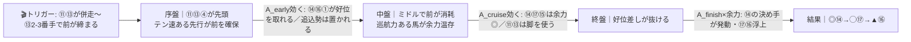
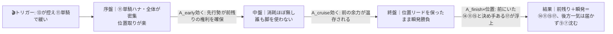
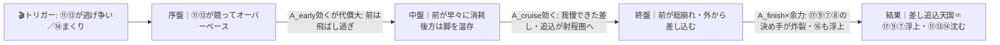

# 🏇 第76回 安田記念（GI）（2026-06-07 東京 芝1600m 馬場:未確定）分析

**モデル: scoring-model v5.0（論理ファースト・相変位再帰を因果骨格として使用）** ／ 使用観点: 10観点（A〜I, K）／ 出走 17頭
（アドマイヤズーム=右前肢蹄不安で回避／ロングラン在籍。**枠順確定 2026-06-05＋JRA前走通過順で脚質精密化 2026-06-06 を本文へ織り込み済み**）
> 並びは論理（相別能力 A_early/A_cruise/A_finish/A_class ＋最有力パターンの段階フロー）で決め、印 ◎◯▲△× と行順で示す。**% は出さない**。

## 1. サマリ（結論）

- **予想本命 ◎**: 7-14 ガイアフォース — **β本線（ミドル・好位差し）で盤石**。テン中庸でクリーンな好枠から好位を取り、A_class（地力）が現役マイル最上位。前が止まる流れの恩恵をまっすぐ受ける。
- **対抗 ◯**: 8-17 トロヴァトーレ（連勝中・A_finish最強だが最外でロス・掛かり潜在）／**単穴 ▲**: 8-16 パンジャタワー（当舞台NHKマイル馬・近走前めでγ浮上）。
- **連下 △**: 3-6 ステレンボッシュ（牝56kg・3枠経済枠・好位差し）／8-15 ドラゴンブースト（マイラーズC2着・自在で展開非依存）。**注意 ×**: 5-9 ウォーターリヒト（γ待ち大外一気）。
- **最有力展開**: **β 平均ミドル・好位差し（本線★★★）**（鍵馬: ⑪⑬）。対抗 **α 超スロー・瞬発戦★★**、伏線 **γ ハイ・差し追込天国★**（=安田の歴史的本質）。
- **展開を分ける一点**: **⑪ワールズエンドと⑬セイウンハーデスの先行争い**。⑬が控えれば⑪単騎でα寄り、両者が競ればγ寄り。＋当日の内外バイアス（安田週はA〜D内柵替わりで振れる）。

> 馬券（何をどう買うか）はユーザー判断。本レポートは展開と着順の予測のみを提示する。

## 0. 当日アップデート・ボード（当日更新枠 ⏱）

> **運用**: ここには*分析時点で本当に未知のものだけ*を残す（当日馬場・クッション値・含水率・パドック・馬体重・前半参考Rの観察値）。確定済みの枠順・乗替・回避は §2-1/§2-2/§3 本文へ織り込み済み。
> 本命は11R。前半の東京・芝レースで当日バイアスを採取してから本命を確定する。

### 0-1. 当日の参考レース（バイアス採取用）
> **採用優先順位**: 芝（必須・ダートと混ぜない）＞ 同日・時間帯（直前ほど重い）＞ 回り（東京＝左で自動一致）＞ 距離帯（マイル±＝1400/1600/1800芝を優先）。

| R | 発走 | コース（芝/ダ・回り・距離） | 一致度 | 何を読むか |
|---|------|----------------------------|:-----:|-----------|
| **8R** 3歳上1勝 | 13:55 | 芝・左・1600 | ★★★ | **同舞台・同距離＝最重要**。内/外どちらが伸び・前残りか差し届くか |
| **9R** 香港JCT | 14:25 | 芝・左・2000 | ★★☆ | **安田直前の最後の芝**。決まり手・伸びる位置を流用（距離長→ペース質は割引） |
| **4R** 3歳未勝利 | 11:35 | 芝・左・1600 | ★★☆ | 同距離だが午前＝内外の初期値。午後は乾き/荒れで動く前提 |
| **5R** 2歳新馬 | 12:25 | 芝・左・1800 | ★☆☆ | 2歳新馬でペース特殊。内外の伸びる位置のみ参考 |

> ※10R(15:00)はダ1400＝11R直前だが芝バイアスには使わない。安田前の最後の芝は**9R(14:25)**。当日の芝は 4・5・8・9・11R の5鞍。
> 推奨の見方: **8R（同距離）で内外＋決まり手 → 9R（直前・最新）で上書き**。4Rは朝の初期値で午後は動く前提。

→ **観察結果（当日記入）**: ペース層 ___／内外バイアス ___／決まり手（逃先差追）___／伸びる位置 ___
> 埋まったら §2-3 へ。高速内有利ならα/β前付け↑、外差し馬場ならγ↑（→§2-2の発動トリガーでティア付け替え）。

### 0-2. 馬場（当日確定）
| 項目 | 値（当日記入） | 質の読み |
|------|----------------|----------|
| 馬場状態 | 良/稍/重/不 | 同じ「良」でも高速かタフかは値で見る |
| クッション値 | ___ | 9.0+=高速(硬)→前/軽い馬場巧者 / 6未満=軟→パワー型 |
| 含水率（ゴール前/4角） | ___ / ___ | 芝は高いほど渋り＝力の要る馬場 |
| コース替わり | A/B/C/D 柵 | 内荒れ隠しなら内有利に戻る場合あり |

### 0-3. パドック・返し馬・馬体重（注目馬）
| 印 枠-馬番 馬名 | 馬体重(増減) | パドック/返し馬（当日記入） | 気配 |
|------------|--------------|------------------------------|:----:|
| ◎ 7-14 ガイアフォース | ___ (±__) | | ↑/→/↓ |
| ◯ 8-17 トロヴァトーレ | ___ (±__) | （前年安田で掛かり再発・折り合い注視） | ↑/→/↓ |
| ▲ 8-16 パンジャタワー | ___ (±__) | | ↑/→/↓ |

### 0-4. その他当日情報（分析時点で未確定のものだけ）
- 当日発表の乗り替わり／騎乗変更: ___（確定済みは §3 騎手列に反映済み）
- 当日の取消・競走除外: ___（アドマイヤズームは既に回避済）
- 天候推移（朝→発走時）: ___

> ↑ 埋め切ったら §2-3 へ。馬場の質が「高速⇄タフ」で想定と違ったときのみ §4 適性（観点D）を部分見直し。

## 2. 展開予想【成果物1】（STEP4a 展開合成・確定枠反映）

> **検証契約**: 脚質別有利不利・隊列・各パターンの段階フロー（序盤→中盤→終盤）を馬番・符号・可能性ティアで固定する。レース後に通過順・上がりから復元したペース層と照合し、展開精度を独立採点する。

### 2-1. 脚質分類表（全馬・★JRA前走通過順で精密化 2026-06-06／確定馬番）

> 脚質・テン速・近走1角は **JRA出馬表の近走コーナー通過順**から算出（web読みの粗い脚質を更新。⑬逃／⑯①先 等を訂正）。

| 枠-馬番 | 馬名 | 騎手 | 脚質 | テン速 | 近走1角(位置) | 想定位置 |
|------|------|------|------|--------|--------|----------|
| 6-11 | ワールズエンド | 津村 | **逃** | 速 | 1-3-1-1 | **逃げ実績明瞭・テン速＝ハナ最有力** |
| 7-13 | セイウンハーデス | 幸 | **逃** | 中 | 3-1-1-9 | **⚠️逃げ実績あり＝⑪と先行争いの可能性** |
| 7-14 | ガイアフォース | 横山武 | 先 | 中 | 4-2-8 | 好枠から先行〜中団、まくり可 |
| 6-12 | シリウスコルト | 横山和 | 先 | 中 | 5-7-4 | 好位 |
| 8-16 | パンジャタワー | 松山 | **先** | 中 | 4-8 | ⚠️近走前め。前々で運べる |
| 1-1 | レーベンスティール | 戸崎 | **先** | 中 | 11-3-10-3 | ⚠️前に出られる脚あり・最内 |
| 2-4 | シックスペンス | 武豊 | 差 | 中 | 9-1-2 | 機動力あり好位差し |
| 8-15 | ドラゴンブースト | 丹内 | 差 | 中 | 6-7-2-1 | 中団・前走逃げ勝ち＝自在 |
| 5-10 | ルクソールカフェ | 岩田望 | 差 | 中 | 5-4 | 好位差し（米国産・芝マイル未知） |
| 8-17 | トロヴァトーレ | ルメール | 差 | 遅 | 8-10-14 | 最外から差し（掛かり潜在・ロス大） |
| 3-6 | ステレンボッシュ | レーン | 差 | 遅 | 3-14-9 | 好位差し（3角3番手の前走あり） |
| 3-5 | サクラトゥジュール | 佐々木 | 差 | 遅 | 10-12-12 | 中団（確信低） |
| 4-8 | シャンパンカラー | 岩田康 | 差 | 遅 | 6-9-14 | 後方差し（出遅れ覚悟） |
| 5-9 | ウォーターリヒト | 高杉 | 追 | 遅 | 12-10-7 | 後方・大外一気 |
| 4-7 | スズハローム | 藤懸 | 追 | 遅 | 14-11-14 | 後方〜大外一気 |
| 2-3 | オフトレイル | 菅原明 | 追 | 遅 | 12-7-13 | 最後方一気 |
| 1-2 | ロングラン | ゴンサル | 追 | 遅 | 12-13-18 | 後方（near回避級不振） |

**⚠️ 重要: 逃げ実績は⑪ワールズエンド＋⑬セイウンハーデスの2頭**。**先行勢も⑯①が前め**で前は手薄でない＝「単騎スロー」前提は崩れ、ミドル〜ハイ化の確度が上がる（→β本線）。

### 2-2. 展開パターン（複数・可能性ティア）

各パターンは「誰がハナを取り、ペースがどうなり、**どの相の能力が効いて**着順が創発するか」の筋書き。%は出さず3段ティアで示す。

| id | パターン名 | 可能性 | 発動トリガー | 有利脚質（符号） | 浮上馬 | 沈む馬 |
|----|-----------|:-----:|--------------|------------------|--------|--------|
| β | 平均ミドル・好位差し | **本線★★★** | ⑪⑬が併走〜⑬が2-3番手で前が締まる（王道） | 逃0 先+1 差+1 追-1 | 14 17 15 6 16 | 3 7 |
| α | 超スロー・瞬発戦 | **対抗★★** | ⑪⑬とも行き脚なく⑪単騎で緩い（⑬が控える） | 逃+1 先+1 差0 追-2 | 11 14 17 15 6 | 9 3 7 |
| γ | ハイ・差し追込天国 | **伏線★** | ⑪⑬が逃げ争い／⑭がまくり | 逃-2 先-1 差+1 追+2 | 9 3 7 8 16 6 17 | 11 13 4 14 |

> 可能性ティア = 本線★★★ / 対抗★★ / 伏線★（偽の精度を出さないため%は使わない）。
> `有利脚質（符号）` と `浮上馬/沈む馬` はラップが取れなくても着順・通過順から検証できる**展開検証の正本**。

#### 各パターンの段階フロー（序盤→能力→中盤→能力→終盤→能力→結果）

> **読み方**: トリガーが起点。矢印ラベルが「その相でどの能力が効いて誰が浮く/沈むか」。mermaid は端末では描画されないので各図の直後に1行要約を併記。

**β 平均ミドル・好位差し（本線★★★）**

> 1行要約: **⑪⑬が締めるミドル → 中盤で逃げ・先行が脚を使い → 終盤は余力を残した好位差しの⑭⑰⑯が抜ける**。

**α 超スロー・瞬発戦（対抗★★）**

> 1行要約: **超スローで誰も脚を使わず → 前にいた馬が余力満タンで直線 → 前残り＋瞬発、後方一気は届かない**。

**γ ハイ・差し追込天国（伏線★／安田の歴史的本質）**

> 1行要約: **逃げ争いでハイ → 前が中盤で力尽き → 終盤は脚を残した差し・追込が外から差し切る**。

- **隊列（最有力β）**: 序盤先頭 `⑪⑬④` → 最終コーナー前方 `⑪⑬⑭⑫⑯` ＋好位 `⑰⑥①`
- **馬場バイアス**: 一般傾向は前・内やや有利だが、**安田記念固有は差し・追込優勢**（過去20年逃げ切り1例）。**外枠勢（⑭⑯⑰）は近年良績、最内①②は割引**。安田週はA〜D内柵替わりで内外差が大きく振れる＝当日上書き必須。
- **反証条件**: ⑬が当日控えて⑪単騎濃厚なら→α を本線へ格上げ・β を対抗へ。⑪⑬が明確に競る/⑭まくりなら→γ を本線へ。高速内有利馬場なら前残り側(α/β前付け)↑、外差し馬場ならγ↑。

### 2-3. 当日修正（あれば）
> STEP6 で当日情報を受けた場合のみ記入。参考R(8R→9R)で外差し馬場＋⑪⑬が競る形なら→γ を本線★★★へ・β を対抗へ格下げし、§3の展開感度と並びを論理で再評価（素の能力読み＝好材料/懸念点は再調査不要）。

## （展開→着順の伝達）

最有力βの段階フローでは、**序盤に⑪⑬④が前を締め（A_early）→中盤で逃げ・先行が脚を使い（A_cruise差）→終盤は余力を残した好位差しが抜ける（A_finish×余力）**。この因果で、好枠から好位を取れA_classが突出する**◎⑭がまっすぐ恩恵を受ける**。γ（安田の本質＝ハイ）が出れば前総崩れで◎は沈み、A_finish最強の**◯⑰と後方の×⑨・⑦が浮上**＝ここが本命の最大リスク。当日の先行争いと内外バイアスが、βとγのどちらに寄るかを決める。

## 3. 着順予想表【成果物2】（メイン出力・表が主役）

> **検証契約**: 並び（印＋行順）＋各馬の展開感度・好材料・懸念点を固定する。レース後に実着順と照合し、(a)並びの順位相関＝総合、(b)実現パターンの段階フローと展開感度が当たったか＝純粋な能力読み、を別個に採点。**%は出さない**。

| 印 | 枠-馬番 | 馬名 | 騎手(乗替) | 展開感度 | 好材料 | 懸念点 |
|----|------|------|-----------|---------|--------|--------|
| ◎ | 7-14 | ガイアフォース | 横山武(継続) | β本線で盤石／α前残りでも好位で恩恵／γ(極端ハイ)では決め手上位に一歩譲る | ・[A]昨年安田2着(1:32.7)・MCS2着(1:31.3)＝A_class現役マイル最上位 ・[D]当舞台巧者で東京左回り◎ ・[E]クリーンな好枠＋テン中庸でA_early十分＝前が止まる展開の本命 | ・[H]休み明け2戦目想定で上積み未知 ・[E]γ極端高速の差し決着ならA_finishで⑰に譲る（条件付で割引大） |
| ◯ | 8-17 | トロヴァトーレ | ルメール(継続) | γ(ハイ・差し決着)で最強／β本線でも終盤台頭／α(超スロー)は前不利で割引 | ・[B]東京新聞杯→エプソムC連勝の充実度 ・[C]東京マイル実証の血統(父レイデオロ)＝A_finish最強格 ・[K]ルメール継続で東京マイルGI最上位 | ・[E]最外8枠でコーナーロス大＝A_early不利 ・[I]前年安田で掛かり再発＝折り合い懸念 |
| ▲ | 8-16 | パンジャタワー | 松山(継続) | γ(ハイ)で浮上／β本線でも前めにつけられ圏内 | ・[D]当舞台NHKマイルC勝ち＝コース実績 ・[E]近走前め(4-8番手)でA_early改善＝立ち回れる | ・[C]前走高松宮記念4着(1200)からの距離延長 ・[A]GIマイル上位相手はA_classで半枚劣る |
| △ | 3-6 | ステレンボッシュ | レーン(強化) | β/α好位差しで安定／γでも牝馬の脚で台頭余地 | ・[G]牝馬56kgの斤量利＋3枠経済枠 ・[K]レーン強化＋宮田師「1週前素晴らしい」 | ・[I]首の硬さ矯正中で折り合い未知 ・[A]牡馬GI上位相手にA_classやや不足 |
| △ | 8-15 | ドラゴンブースト | 丹内(継続) | 展開非依存（自在）／前残りでも差しでも対応 | ・[B]マイラーズC2着・前走逃げ勝ちで脚質自在＝A_early/A_cruise両立 ・[E]中団から動ける立ち回り | ・[C]純マイルの切れ(A_finish)が上位相手に未知 ・[A]4歳GI格上挑戦でA_class実証不足 |
| × | 5-9 | ウォーターリヒト | 高杉(継続) | γ(ハイ)待ち大外一気のみ／β・αでは届かず沈む | ・[E]A_finish型の追込＝前総崩れ展開で一発 ・[D]安田の差し追込本質に合致 | ・[I]過去ゲート癖＝A_early欠如で展開待ち ・[B]前走マイラーズC13着で近走不振 |
| | 6-11 | ワールズエンド | 津村(継続) | 逃げ＝ペースの鍵馬だが地力(A_class)不足 | ・[E]テン速・逃げ実績明瞭＝展開を作る当事者 | ・[A]GI格でA_class不足・単騎でも残り目薄 |
| | 7-13 | セイウンハーデス | 幸(継続) | ★逃げ実績＝ペースの鍵。先行争いの主役だが地力不足 | ・[E]近走3-1-1で逃げ実績＝βγの引き金 | ・[A]A_class不足・1600短縮もマイナス |
| | 2-4 | シックスペンス | 武豊(強化) | β好位差し向きだが近走不振 | ・[K]武豊強化(ズーム回避で騎乗) | ・[B]5連敗・復調待ちでA_cruise低下 |
| | 8-15 以下は印外 | — | — | — | — | — |

> ▲以下の連下・注意は β/γ どちらに転んでも複勝圏を脅かし得る範囲。印外でペースの鍵となる⑪⑬は地力不足で着は望み薄だが**展開の引き金**として要警戒。
> **展開感度**（核）: §2-2の名前付きパターンを参照し「どの展開で浮上/沈むか」を因果で。`—`は展開非依存。
> **好材料/懸念点**: 各項は [観点タグ]＋事実＋なぜそう読んだか。タグ＝A指数/B近走/C血統/D適性/E展開/F調教/G馬体ローテ/H気配/K騎手/Iリスク。

## 4. 観点別ハイライト（補足・横断）

- **A 指数/時計**: ⑭が頭一つ（25安田2着1:32.7・MCS2着1:31.3）＝A_class最上位。⑰⑯⑨が次群。高速決着1:31〜33・上がり33秒前半が連対鍵。生指数は取得不可→実走時計で評価。
- **B 近走**: ⑰が連勝(東京新聞杯→エプソムC)で勢い最上位。⑭はドバイT6着も力負けせず。⑮⑥が上昇。⑯は前走1200からマイル回帰。
- **C 血統/D 適性**: ⑭⑰が東京マイル実証。**安田記念固有は差し・追込天国**＋前走海外組好走（→γの裏付け）。⑩ルクソールは米国ダート型で芝マイル未知、⑬①は1600短縮マイナス。道悪適性データは欠損。
- **E 展開（※詳細§2）**: ★JRA前走通過順で**逃げ実績は⑪⑬の2頭**と判明（旧:⑪のみ誤読）→先行争いの可能性でβ(ミドル)本線。歴史的本質ハイ差し決着でγも伏線として厚め。
- **F/G/H 状態 / K 騎手**: 仕上げは⑭⑰が陣営最強気。⑥はレーン強化＋牝56kg＋宮田師高評価で上昇。強化騎乗=⑥(→レーン)・④(→武豊)・⑩(→岩田望)。明確な仕上げ不安の確報なし。
- **I リスク**: 気性/ゲート=⑧シャンパン(昨年大出遅れ)・⑰トロヴァ(掛かり再発)・⑥ステレン(首の硬さ矯正中)・⑨ウォーター(ゲート癖)。距離不安=①⑬⑫。

## 5. データの確かさ・補強のお願い

- **枠・脚質はJRA公式で全頭裏取り済み**（2026-06-06、`tools/fetch_racecard.py`）。前走コーナー通過順から脚質・テン速を精密化（⑬逃/⑯①先 等を訂正）。市場（オッズ・人気）はパース時に物理除去＝不参照。
- **当日馬場（内外差）が最後の未確定要素**。安田週はA〜D内柵替わりで内外が振れる。§0-1の参考R(8R→9R)で当日採取し、高速内有利ならα/β前付け↑、外差し馬場ならγ↑。
- **H 当日気配・パドック・馬体重**: 当日記入（§0-3）。1週前追い切り＋陣営談話ベース。当日のパドック・返し馬・最終テン争いで上書き可。
- **欠損**: 生スピード指数値（実走時計で代替）、⑩ルクソールの芝マイル適性、道悪適性データ、当日仕上げの確報。

## 6. 免責
予測であり的中を保証しない。賭けは自己責任で、馬券選択・実ベットは人間判断。市場（オッズ・人気）は一切参照していない。
