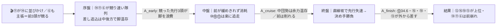
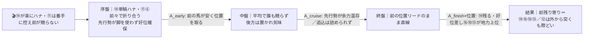
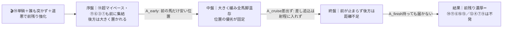

# 🏇 小金井特別（2026-06-07 東京 ダ1600m左 / 馬場:当日記入）分析

**モデル: scoring-model v5.0（論理ファースト・相変位再帰を因果骨格として使用）** ／ 使用観点: 10観点（A〜I, K）／ 出走 16頭
> 着順の並びは論理で決め、印で示す（%は出さない）。枠順は確定済みのため §2/§3 本文に最初から織り込む。
> **⚠クラス注記**: 見出しは「3歳上1勝クラス」だが、netkeiba/ウマニティ等の小金井特別表記・各馬の近走実態（前走青梅特別=2勝クラス組が複数）から **実態は2勝クラス**と判断して全評価を実施。人間側で要確認。

## 1. サマリ（結論）【当日更新済み ⏱ 参考R反映】

> **当日修正（参考R採取後）**: 3R(ダ1600距離一致)・7R(ダ1400同クラス)・10R八王子特別(ダ1400直前)がいずれも**前残り・先行有利**を示した → **展開ティアを付け替え（β前残り＝本線、α差し＝対抗）**。前で立ち回れる馬を格上げ、後方追込のα依存馬⑫を格下げ。◎◯は据え置き。

- **予想本命 ◎**: 5-10 マクリール — 当メンバー唯一の格上（青竜S・OP2着／雲取賞JpnⅢ3着）。東京ダ1600 [1-2-0-0]＋ルメール＋3歳55kg。**差しで中団を取れ前残り馬場でも崩れない展開不問性**で◎据え置き。
- **対抗 ◯**: 8-16 ヘリオトロープ — 東京ダ1600 [2-1-1-0]の鉄板。**好位差しで前にもつけられ＝今日の前残り基調にむしろ最適**。◎との差は僅差。
- **単穴 ▲**: 7-14 リベッチオ — 単騎逃げ＋同コース1-1のワイヤー実績。**参考Rの前残り基調がドンピシャで噛み合い△→▲へ昇格**。鍵は休み明け10週の出脚。
- **連下 △**: 7-13 ベラジオワールド（中団機動力で前残りでも立ち回れる）、3-6 トラヴェリンバンド（先行・前走同コース2着＝前残りでプラス、×→△昇格）、6-12 パイシャオピン（上がり34.6は断トツだが後方追込でα依存＝今日の前残り基調は逆風、▲→△降格）
- **注意 ×**: 4-8 セントラルヴァレー（α差し・距離延長が課題）
- **最有力展開**: **β 単騎逃げ・前残り（本線★★★）**（鍵馬: 14リベッチオ）。対抗 **α 先行争い→差し台頭★★**、伏線 **γ スロー瞬発★**
- **展開を分ける一点**: ⑪ホウキボシ（テン速）が⑭リベッチオに**並びかけるか／番手に控えるか**。参考Rの前残り基調を踏まえると⑭が単騎で残る β を本線視。⑪が突いて競ればα（差し複勝圏が開く）。

> 馬券（何をどう買うか）はユーザー判断。本レポートは展開と着順の予測のみを提示する。

## 0. 当日アップデート・ボード（当日更新枠 ⏱）

> 枠順は確定済みのため本文に反映済み。ここには分析時点で本当に未知のもの（当日馬場・気配・参考R観察値）だけを残す。

### 0-1. 当日の参考レース（バイアス採取用・ダート限定）
> 採用優先: 芝/ダ（必須）＞ 同日・時間帯（直前ほど重い）＞ 回り内外 ＞ 距離帯。芝Rは混ぜない。

| R | 発走 | コース | 一致度 | 何を読むか |
|---|------|--------|:-----:|-----------|
| 10R 八王子特別 | 15:00 | ダ・左・1400 | ★★★ | 1着⑥好位先行(⑥④)押し切り1:24.2／2着⑬・4着⑩は後方最速上り35.2で突っ込む → **前残り基調だが速い流れなら差しは複勝圏に届く** |
| 3R 未勝利 | 11:05 | ダ・左・1600 | ★★☆ | **距離一致**。上位5頭すべて前〜中団(③③/⑥④/⑧⑦/⑥⑦/④④)・後方⑫⑫は6着 → **明確な前残り・先行有利** |
| 7R 1勝クラス | 13:25 | ダ・左・1400 | ★★☆ | 逃げ⑭2着粘り＋先行が3〜5着独占・後方は上り最速級でも6〜7着 → **前/先行有利・後方不利** |

→ **観察結果（採取済み）**: ペース層 = 平均〜やや前傾だが**前が止まらない**／内外バイアス = 内〜中目有利（外枠の極端な不利は無し）／決まり手 = **逃げ・先行が基本、差しは速い流れで複勝圏まで**／伸びる位置 = **前〜中団**
> → §2-3 当日修正へ反映済み。前残り基調を確認したため **β を本線★★★・α を対抗★★へ付け替え**。ただし10Rで後方最速勢が2・4着に来た＝完全なγ超前残りではなく、差しの複勝圏は残す。

### 0-2. 馬場（当日確定）
| 項目 | 値（当日記入） | 質の読み |
|------|----------------|----------|
| 馬場状態 | 良/稍/重/不 | 道悪化（稍重〜重）で**前残りバイアス強化→β/γ格上げ・α格下げ** |
| クッション値 | ___ | — |
| 含水率（ゴール前/4角） | ___ / ___ | ダは低い=時計かかる |

### 0-3. パドック・返し馬・馬体重（注目馬・当日記入）
| 印 枠-馬番 馬名 | 馬体重(増減) | パドック/返し馬 | 気配 |
|------------|--------------|------------------------------|:----:|
| ◎ 5-10 マクリール | ___ | | ↑/→/↓ |
| ◯ 8-16 ヘリオトロープ | ___ ※web「放牧」表示＝間隔要確認 | | ↑/→/↓ |
| ▲ 6-12 パイシャオピン | ___ | | ↑/→/↓ |
| △ 7-14 リベッチオ | ___ ※約10週の休み明け | | ↑/→/↓ |

### 0-4. その他当日情報（分析時点で未確定）
- **⑫横山武史**: 左足負傷で他馬に乗替が出た報道あり。当週の騎乗可否を当日要確認（乗替なら⑫の評価を下げる）。
- 天候推移（朝→発走時）: ___

## 2. 展開予想【成果物1】（STEP4a 展開合成）

> **検証契約**: 脚質別有利不利・隊列・各パターンの段階フローを馬番・符号・可能性ティアで固定。レース後に通過順・上がりから復元したペース層と照合し展開精度を独立採点。

### 2-1. 脚質分類表（全馬・観点E証拠／確定枠反映）

| 枠-馬番 | 馬名 | 騎手 | 脚質 | テン速 | 近走1角(位置) | 想定位置 |
|--------|------|------|------|--------|---------------|----------|
| 7-14 | リベッチオ | 戸崎 | 逃 | 中 | 10-1-1-2 | **単騎ハナ最有力**（同コース1-1実績） |
| 6-11 | ホウキボシ | 松山 | 先 | **速** | 3-2-3-3 | 番手〜先行。**競るか控えるかが展開の鍵** |
| 3-6 | トラヴェリンバンド | ゴンサルベス | 先 | 中 | 2-4-8-2 | 外から前を主張しうる（気合付け） |
| 2-3 | エンファサイズ | 長浜 | 先 | 中 | 5-3-4 | 内から先行 |
| 1-1 | テンカムテキ | 丹内 | 先 | 中 | 4-4-3-8 | 好位先行 |
| 4-8 | セントラルヴァレー | 岩田望 | 差 | 中 | 6-5-6-9 | 中団前め |
| 8-15 | アスゴッド | 高杉 | 差 | 中 | 7-4-6-6 | 中団 |
| 8-16 | ヘリオトロープ | レーン | 差 | 中 | 6-8-3-2 | **好位差し（前にもつけられる）** |
| 7-13 | ベラジオワールド | 横山和 | 差 | 中 | 3-6-11-5 | 中団（機動力あり） |
| 5-10 | マクリール | ルメール | 差 | 遅 | 5-9-5 | **中団確保** |
| 3-5 | コパノエビータ | 嶋田 | 差 | 中 | 11-5-6-4 | 中団後め |
| 2-4 | フィーチャリング | 原 | 追 | 遅 | 12-11-12-8 | 後方 |
| 4-7 | グレイスザクラウン | 木幡巧 | 追 | 遅 | 10-10-8-12 | 後方 |
| 1-2 | トーホウキザン | 藤懸 | 追 | 遅 | 16-8-13 | 最後方 |
| 5-9 | アースイオス | 小林脩 | 追 | 遅 | 14-12-12-14 | 最後方 |
| 6-12 | パイシャオピン | 横山武 | 追 | 遅 | 14-10-9-11 | **後方（末脚特化）** |

> 逃げは事実上⑭リベッチオ1頭。テン速⑪ホウキボシ＋先行⑥⑬…ではなく⑥③①が前を伺う**先行密集**に対し、上がり最速級の差し追込（⑫34.6断トツ・④⑬⑧⑯⑨⑦⑩）が多数密集する構図。

### 2-2. 展開パターン（複数・可能性ティア）

| id | パターン名 | 可能性 | 発動トリガー | 有利脚質（符号） | 浮上馬 | 沈む馬 |
|----|-----------|:-----:|--------------|------------------|--------|--------|
| β | 単騎逃げ・平均〜前残り | **本線★★★** ⏱昇格 | ⑭が楽にハナ・⑪が番手に控え前が競らない | 逃+2 先+1 差0 追-1 | 14 11 16 13 | 12 9 2 |
| α | 先行争い・ハイ→差し台頭 | 対抗★★ ⏱降格 | ⑪が⑭に並びかけ引かない／⑥が外から主張＝前3頭が競る | 逃-1 先-1 差+2 追+1 | 12 16 10 13 8 | 14 11 6 |
| γ | 緩み逃げ・スロー瞬発 | 伏線★ | ⑭単騎＋誰も突かず＋道悪で前残り強化 | 逃+2 先+2 差-1 追-2 | 14 11 6 16 13 | 12 4 7 9 |

> **⏱当日更新（参考R反映）**: 3R/7R/10R がいずれも前残り・先行有利 → **β を本線へ昇格・α を対抗へ降格**。⑭リベッチオの単騎残りが今日の馬場でドンピシャ。ただし10Rで後方最速勢（35.2）が2・4着に届いた＝**完全なγ超前残りではなく、流れが速まれば差しの複勝圏は開く**（α対抗を残す根拠）。⑪が突いて競ればαへ振れる。

#### 各パターンの段階フロー

**α 先行争い・ハイ→差し台頭（本線★★★）**

> 1行要約: **⑪⑭⑥が競るハイ → 中盤で先行勢が削れ → 終盤は脚を残した上がり最速級⑫⑯⑩⑬が外から差し込む**。

**β 単騎逃げ・平均〜前残り（対抗★★）**

> 1行要約: **⑭が単騎で楽に逃げ平均ペース → 先行勢が脚を温存 → 前残り、好位差しの⑯⑩⑬が地力で続き、後方⑫は取りこぼしうる**。

**γ 緩み逃げ・スロー瞬発（伏線★）**

> 1行要約: **超スローで前残り濃厚 → 後方一気の⑫らは距離が足りず凡走、逃げ・先行が押し切る**。

- **隊列（最有力β ⏱）**: 序盤先頭 `⑭⑪⑥` → 最終コーナー前方 `⑭⑪⑥③⑯⑩⑬`
- **馬場バイアス ⏱当日確定**: 参考R(3R/7R/10R)で**前残り・先行有利・伸びは前〜中団、内〜中目**。事前想定の「東京ダ1600は基本差し>先行」を**今日は前寄りに補正済み**。
- **残る反証条件**: ⑪が⑭に並びかけ前3頭が競れば α（差し台頭）へ振れ⑫⑧の出番。⑭が休み明けで出脚鈍れば⑪⑥主導で隊列前倒し（前傾化＝αへ）。

### 2-3. 当日修正 ⏱（参考R採取済み・実施）
**採取結果**: 3R(ダ1600距離一致)＝明確な前残り／7R(ダ1400同クラス)＝前・先行有利で後方不利／10R八王子特別(ダ1400直前)＝好位先行押し切りだが後方最速勢が2・4着に突っ込む。**3鞍とも前残り・先行有利で一貫**。

**修正内容**:
1. **β（単騎逃げ・前残り）を本線★★★へ昇格、α（差し台頭）を対抗★★へ降格**。⑭リベッチオの単騎残りが今日の馬場に噛み合う。
2. **並びの重み調整**（§3 反映済み）: 前で立ち回れる ⑭(△→▲)・⑥(×→△) を昇格、後方追込でα依存の ⑫(▲→△) を降格。◎⑩・◯⑯は据え置き（⑯はむしろ前残りに好適）。
3. 10Rで後方最速が2・4着に来た＝差しは完全には死んでいない → α対抗を残し、⑫を消しにはせず△で複勝圏狙いに残す。
> 馬場の質は時計（10R 1:24.2／3R 1:39.2）から極端な道悪ではなく**良〜やや前有利**と判断。§4 適性の大幅見直しは不要（前残り補正のみ）。

## （展開→着順の伝達）⏱当日更新
参考Rで前残りが確認され**本線はβ（単騎逃げ・前残り）**。βでは⑭が楽に残り、好位差しの◯⑯と中団を取れる◎⑩が地力で続く。**前で立ち回れる▲⑭・△⑥が今日の馬場で浮上**。後方追込の△⑫はα（速い流れ）に振れた時だけ複勝圏が開く＝上下動が大きく評価は一枚下げる。◎⑩は前残りでもテン遅を地力でカバーし中団から差せる範囲で据え置き。

## 3. 着順予想表【成果物2】（メイン出力・表が主役）

> **検証契約**: 並び（印＋行順）＋各馬の展開感度・好材料・懸念点を固定。レース後に実着順と照合し、(a)並びの順位相関、(b)実現パターンの段階フロー＆展開感度の的中、を別個採点。**%は出さない**。

| 印 | 枠-馬番 | 馬名 | 騎手(乗替) | 展開感度 | 好材料 | 懸念点 |
|----|--------|------|-----------|---------|--------|--------|
| ◎ | 5-10 | マクリール | ルメール(継続) | **展開不問で据え置き**。β本線(前残り)でも中団から地力で差せる範囲／α差し決着なら盤石 | ・[B]青竜S(OP)2着・雲取賞JpnⅢ3着＝当メンバー唯一の格上で地力最上位 ・[D]東京ダ1600 [1-2-0-0]の鉄板コース適性 ・[K]ルメール継続(全騎乗)＝鞍上field最上位 ・[A]斤量3歳55kgの利 | ・[E]テン遅で前残り基調(本線β)だと位置がやや後ろ＝脚余しリスク（ただし参考10Rでも後方最速勢は複勝圏に届いた） ・[B]2勝クラスを経ずOP挑戦中＝現級は初 |
| ◯ | 8-16 | ヘリオトロープ | レーン(継続) | **据え置き・今日の前残り基調にむしろ最適**。好位差しで前にもつけられβでも上位／αでも差せる | ・[D/A]東京ダ1600 [2-1-1-0]＋自己最速1:36.1＝コース突出の鉄板 ・[E]好位差しで**前残り馬場に脚質ドンピシャ**(参考R基調と合致) ・[C]父ヘニーヒューズが東京ダ1600ドンピシャ ・[K]レーン継続・前走同コース12R2着 | ・[B]2勝級で2-3着続きの**勝ち切り力**が一枚劣る ・[G]web「放牧」表示＝間隔/状態に要確認(§0) ・[I]8枠外でコーナーロス |
| ▲ | 7-14 | リベッチオ | 戸崎(乗替) | **⏱△→▲昇格**。β本線(前残り)の主役＝単騎逃げが今日の馬場でドンピシャ／α(競り合い)なら失速 | ・[E]**参考R3鞍の前残り・先行有利が逃げ脚質にドンピシャ** ・[D/B]東京ダ1600を逃げ切り＝本舞台(同コース1-1のワイヤー) ・[K]川田→戸崎のトップ横スライド・関東首位級 ・[A]3歳55kg | ・[G]約10週の休み明けで出脚鈍れば主導権を渡す ・[E/I]テン速⑪に絡まれ競り合うと自滅 ・[B]前走OP福竜S8着で相手強化に未対応 |
| △ | 7-13 | ベラジオワールド | 横山和(継続) | α/β**両展開で上位**。機動力で中団〜前めを取れ前残りでも立ち回れる | ・[B]1勝C勝ち→2勝C 4着・3着・立川特別2着0.1差と急上昇 ・[A]上がり35.6で安定、57kgで他58より軽い ・[K]横山和3戦連続継続 | ・[D]ダ1600未経験で距離延長が未知数(1400のスピード質) ・[B]勝ち切り不足で複勝圏止まりが多い |
| △ | 3-6 | トラヴェリンバンド | ゴンサルベス(強化) | **⏱×→△昇格**。β/γ(前残り)で先行粘り＝今日の馬場でプラス／α自ら競ると共倒れ | ・[B/D]前走青梅特別(東京ダ1600・2勝)2着0.3差＝**最有力級の直接物差し** ・[E]先行脚質が前残り基調と合致 ・[K]剛腕ゴンサルベス強化・3枠先行と好相性 | ・[E/I]先行密集でハナ主張するとオーバーペース→終い失速 ・[A]決め手の絶対値が中位 |
| △ | 6-12 | パイシャオピン | 横山武(継続) | **⏱▲→△降格**。後方追込でα依存＝**今日の前残り基調は逆風**。流れが速まれば(α)複勝圏が開く | ・[A/B]上がり34.6はメンバー断トツ、後方0.4差4着＝展開不利でも脚を使えた ・[E]参考10Rで後方最速勢が2・4着＝**速い流れなら今日でも届く余地** ・[C]父ホッコータルマエ・牝56kg利 | ・[E]テン遅・後方でハイ必須＝**本線βでは届かない**(3R/7Rで後方は凡走) ・[I]他走は上がり38秒台でムラ大 ・[H]横山武に左足負傷の乗替報道＝当週騎乗可否要確認(§0) |
| × | 4-8 | セントラルヴァレー | 岩田望(強化) | α(ハイ・差し)で台頭／β前残りでは脚余し＝今日の馬場は向かない | ・[A/B]近走上がり35.7-35.9と終い堅実、東京ダ短距離2-2-3 ・[K]岩田望来を関東遠征で確保＝強化 | ・[D]ダ1600の実績薄く**距離延長が課題**(1400向きスピード質) ・[G]約3.5ヶ月の間隔 |

- **無印で言及**: ①テンカムテキ([C]父ナダルは良いが1800主体・距離短縮＋先行密集)、⑦グレイスザクラウン([D]東京ダ1600で2着多数も追込・16頭フルゲート初で揉まれ懸念)、④フィーチャリング([A]上がり35.5あるが追込・展開待ち)。⑨アースイオス・②トーホウキザンは[D]東京ダ1600不適＋後方一手で消し。③⑤⑮はクラス/距離/若手鞍上で割引。

## 4. 観点別ハイライト（横断）
- **A 指数/B 近走/D 適性**: 時計・コース適性で突出は**⑯ヘリオ(1:36.1)と⑩マクリール(OP級)**の2頭。直接物差しは前走青梅特別(東京ダ1600・2勝)組＝⑥2着/④6着/⑦9着。⑩は当メンバー唯一の格上。
- **C 血統**: ダ1600ドンピシャは①ナダル/④⑯ヘニーヒューズ/⑫ホッコータルマエ。⑩はロードカナロア×Galileoでやや芝寄り配合だが実績が補う。
- **E 展開＋STEP4a 合成（詳細§2）⏱**: 逃げ⑭1頭に差し追込密集。事前はα/β拮抗だったが、**参考R3鞍が前残り・先行有利で一貫→β(前残り)を本線へ確定**。⑪が突いて競った時のみα(差し台頭)に振れる。
- **F/G/H 状態・K 騎手**: **F調教・H当日気配はweb取得不可で全馬中立(確信度低)**＝§0で当日補強推奨。K騎手力は⑩ルメール突出、⑯レーン・⑭戸崎・⑬横山和・⑫横山武(負傷報道)・⑪松山が上位。
- **I リスク**: ⑪は先行争いの当事者で前崩れ筆頭リスク。⑫は末脚ムラが極端。⑭は休み明け＋競り負け自滅。後方一手の②④⑦⑨は展開待ちの取りこぼし。

## 5. データの確かさ・補強のお願い
- **確信度が低い観点**: F(調教)・H(当日気配)はweb取得できず全馬中立。クラス表記に矛盾あり（実態2勝クラスと判断）。
- **ユーザー補強推奨**: ①各社パドック評・確定馬体重 ②⑫横山武史の当週騎乗可否（負傷報道） ③⑯ヘリオトロープの間隔/放牧明け状態 ④当日の馬場状態・参考R(10R/3R)のバイアス。
- **欠損・推定箇所**: ⑤コパノエビータ・⑨アースイオスは個別戦績の確証が薄くseed主体の暫定評価。

## 6. 免責
予測であり的中を保証しない。賭けは自己責任で、馬券選択・実ベットは人間判断。市場（オッズ・人気・妙味・買い目）は一切参照していない。
