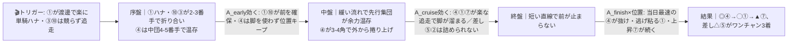
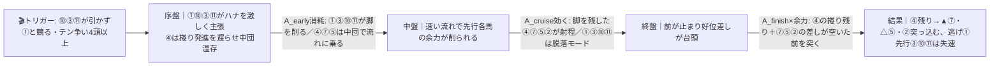
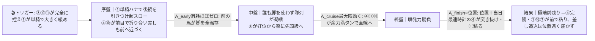

# 🏇 浪江祐次お誕生日記念C11（2026-06-10 笠松 ダ1400m右回り・馬場良）分析

**モデル: scoring-model v5.0（論理ファースト・相変位再帰を因果骨格として使用）** ／ 使用観点: 5観点（地力・近走AB／血統・適性CD／展開証拠E／状態・騎手FGHK／リスクI） ／ 出走 12頭
> 着順の並びは論理で決め、印で示す（%は出さない）。任意のサニティチェックで `score_race.py` を回し、上位4頭の並びがエンジンと一致（agree=true）したことを確認済み。
> 笠松はNAR地方競馬でスクレイパ非対応のため、近走・通過順・脚質は nar.netkeiba.com / keiba.go.jp の公開結果から各観点で取得・裏取りした。

## 1. サマリ（結論）

- **予想本命 ◎**: 4-④ バジガクチャモ — 3連勝中・前走C13を当日メンバー最速 **1:31.2** で1.4秒差圧勝。捲り先行で**全展開パターンで浮上**＝展開不問の本命。
- **対抗 ◯**: 1-① スヴァローグ — 完全逃げ＋笠松リーディング独走の渡邊竜也へ**強化乗替**。前残り本線で2番手最有力。
- **単穴 ▲**: 7-⑦ グロリアストップ — 好位差しで**どの展開にも対応**（差し台頭βで最も恵まれる）。上昇カーブ。
- **連下 △**: 5-⑤ ココロエ — 同条件C11で3着の堅実差し。前が締まれば突っ込む。
- **注意 ×**: 10-⑩ ニシノステディミキ — 最軽量53kg・先行で前残りに乗れる。ただしハナ争い消耗がリスク。
- **最有力展開**: **α 単騎制御・前残り（本線★★★）**（鍵馬: ①の出方と④の捲り発進）。対抗 **β 先行争い激化・差し台頭★★**、伏線 **γ 超スロー瞬発★**
- **展開を分ける一点**: **①スヴァローグが渡邊竜也の制御で楽に単騎ハナを取れるか**（取れれば前残りα／③⑩⑪が競りかければβ差し台頭へ）。

> 馬券（何をどう買うか）はユーザー判断。本レポートは展開と着順の予測のみを提示する。

## 0. 当日アップデート・ボード（当日更新枠 ⏱）

> ここには*分析時点で本当に未知のものだけ*を残す。枠順は確定済みのため §2-1/§3 本文に織り込み済み。

### 0-1. 当日の参考レース（バイアス採取用）
> 採用優先順位: ダート（笠松は全レースダート）＞ 同日・時間帯（直前ほど重い）＞ 距離帯1400近辺。本レースは4R(12:30)＝当日1〜3Rが直前の参考。

| R | 発走 | コース | 一致度 | 何を読むか |
|---|------|--------|:-----:|-----------|
| 笠松1〜3R | 〜12:00頃 | ダ右1400/1600近辺 | ★★☆ | 内/外どちらが伸びるか・先行が残るか差しが届くか・ペース層 |

> ※笠松はスクレイパ非対応のため day カードは自動充填できず。当日 keiba.go.jp で1〜3Rの結果（通過順・決まり手）を見て記入。

→ **観察結果（当日記入）**: ペース層 ___／内外バイアス ___／決まり手（逃先差追）___／伸びる位置 ___
> この行が埋まったら §2-3 当日修正へ。差しが目立つ馬場なら β を本線へ格上げ、前残り継続なら α 固定。

### 0-2. 馬場（当日確定）
| 項目 | 値（当日記入） | 質の読み |
|------|----------------|----------|
| 馬場状態 | 良/稍/重/不 | 良でも乾き切ってタフだと時計かかる |
| 含水率 | ___ | 笠松ダは乾くと時計かかり前有利が強まる傾向 |

### 0-3. パドック・馬体重（注目馬・当日記入）
| 印 枠-馬番 馬名 | 馬体重(増減) | パドック/返し馬 | 気配 |
|------------|--------------|------------------|:----:|
| ◎ 4-④ バジガクチャモ | 直近500kg(+3) | | ↑/→/↓ |
| ◯ 1-① スヴァローグ | 直近505kg(+5) | | ↑/→/↓ |
| × 6-⑥ カレンヒロ | 前走405kg(+9)太め残り懸念 → 絞れたか要確認 | | ↑/→/↓ |

### 0-4. その他当日情報（分析時点で未確定のものだけ）
- 当日発表の乗替／騎乗変更: ___（確定分は §3 騎手列に反映済み）
- 当日の取消・競走除外: ___
- 天候推移: ___

## 2. 展開予想【成果物1】（STEP4a 展開合成）

> **検証契約**: 脚質別有利不利・隊列・各パターンの段階フローを馬番・符号・可能性ティアで固定。レース後に通過順・上がりから復元したペース層と照合し展開精度を独立採点する。

### 2-1. 脚質分類表（全馬・観点E証拠／確定枠を反映）

| 枠-馬番 | 馬名 | 騎手 | 脚質 | テン速 | 近走1角(位置-…) | 想定位置 |
|--------|------|------|------|--------|------------------|----------|
| 1-① | スヴァローグ | 渡邊竜也 | 逃 | 速 | 1-1-1-1 | **ハナ主張の核**（枠1で内取りやすい） |
| 10-⑩ | ニシノステディミキ | 深澤杏花 | 逃〜先 | 速 | 1-1-3-3 | ハナ〜2番手（最軽量53kgで序盤楽・争いの当事者） |
| 3-③ | ウインクルホープ | 筒井勇介 | 逃〜先 | 速 | 1-1-3-6 | 前を争う（前走は逃げて失速10着） |
| 4-④ | バジガクチャモ | 井口裕貴 | 先〜捲り | 中 | 5-4-1-1 | 道中4-5番手→**3角で先頭級へ捲り** |
| 11-⑪ | クマサンアリガトウ | 松本一心 | 先 | 中 | 2-3-1-3 | 好位2-4番手（終い甘い） |
| 6-⑥ | カレンヒロ | 森島貴之 | 先 | 中 | 4-4-1-1 | 好位2-4番手（調子不透明） |
| 7-⑦ | グロリアストップ | 塚本征吾 | 先〜好位差 | 中 | 3-3-4-2 | 好位3-5番手 |
| 2-② | ヤマミウルフ | 加藤誓二 | 差 | 中〜遅 | 6-7-4-4 | 中団 |
| 9-⑨ | ガケップチー | 高木健 | 差 | 中 | 6-5-3-3 | 中団 |
| 5-⑤ | ココロエ | 東川慎 | 差 | 遅 | 7-7-6-4 | 中団後方（前が止まれば台頭） |
| 8-⑧ | カーボナード | 大原浩司 | 追 | 遅 | 9-9-10-8 | 後方 |
| 12-⑫ | ベラジオガール | 藤原幹生 | 追 | 遅 | 9-9-8-8 | 後方 |

> 脚質・テン速・近走1角は nar.netkeiba.com の公開結果（通過順）から取得。netkeiba自動マーク（③を先行/④を差し表記）は実走通過順と食い違うため**実走を優先**。⑥⑦⑨は出馬表の前走着順と拾えた通過順が一致せず（別開催/転入の可能性）＝脚質型は読めるが着順整合は中信頼。

### 2-2. 展開パターン（複数・可能性ティア）

| id | パターン名 | 可能性 | 発動トリガー | 有利脚質（符号） | 浮上馬 | 沈む馬 |
|----|-----------|:-----:|--------------|------------------|--------|--------|
| α | 単騎制御・前残り | 本線★★★ | ①が渡邊で楽に単騎ハナ→③⑩が競らず④が3-4角で捲り | 逃+1 先+2 差-1 追-2 | ④①⑦ | ⑧⑫⑤ |
| β | 先行争い激化・差し台頭 | 対抗★★ | ⑩(最軽量)③⑪が引かず①と競り、テン争いが4頭以上 | 逃-1 先-1 差+2 追+1 | ⑦⑤②④ | ①③⑩⑪ |
| γ | 超スロー瞬発・極端前残り | 伏線★ | ③⑩⑪が完全に控え①が単騎で大きく緩める | 逃+2 先+2 差-2 追-2 | ④①⑩⑦ | 差し追込全部 |

> 可能性ティア = 本線★★★ / 対抗★★ / 伏線★（%は使わない）。`有利脚質（符号）` と `浮上馬/沈む馬` がラップ無しでも着順・通過順から検証できる**展開検証の正本**。
> **全パターンで④バジガクチャモが浮上**＝展開不問。分岐の主役は「①が単騎で前を取れるか（α/γ）」vs「先行争いが過熱するか（β）」。

#### 各パターンの段階フロー（序盤→能力→中盤→能力→終盤→能力→結果）

> mermaid はターミナルでは描画されずコードのまま見える → 各図の直後に1行テキスト要約を併記。report.md を GitHub/プレビューで開けば図が出る。

**α 単騎制御・前残り（本線★★★）**

> 1行要約: **①が楽に単騎ハナ→緩い流れで前が余力温存→④が捲って抜け、①⑦が前残り。差し⑤は届けば3着まで**。

**β 先行争い激化・差し台頭（対抗★★）**

> 1行要約: **先行争いが過熱してハイ→前が中盤で力尽き→好位差しの④⑦⑤②が台頭、逃げ・先行勢は沈む**。

**γ 超スロー瞬発・極端前残り（伏線★）**

> 1行要約: **超スローで誰も脚を使わず→前にいた馬が余力満タン→位置と最速時計の④が瞬発で突き抜け、後方一気は届かない**。

- **隊列（最有力α）**: 序盤先頭 `①⑩④`（①ハナ・⑩③番手・④中団温存）→ 最終コーナー前方 `④①⑦⑤`
- **馬場バイアス**: 笠松ダ1400右回り・小回り平坦・直線約200-250mと短く**先行有利が基本**（連対率目安 逃60/先44/差16/追8）。スタート〜1角約337mで極端な枠差は出にくいが内〜中枠やや良。**当日 §0-1 で上書き前提**。
- **反証条件**: ⑩(最軽量・テン速)や③が引かず①と競る形が見えれば→**β（差し台頭）を本線へ格上げ・αを対抗へ**。逆に③⑩⑪が完全に控え①が単騎で大きく緩めれば→**γを対抗以上へ**。①が出脚つかずハナを叩かれ4角で下がる（前走5/27の負けパターン）なら④の捲り先頭が一層決定的に。

### 2-3. 当日修正（あれば）
> STEP6 で当日情報（参考R・パドック・馬場）を受けた場合のみ追記。可能性ティアの付け替えと展開感度・並びの論理再評価を行う。

## （展開→着順の伝達）
最有力αでは「①が楽に前を作り→緩い流れで前が余力温存→**当日最速の④が3-4角の捲りで抜け、①⑦が前残り**」。④は捲り先行ゆえβ(差し台頭)でも好位差しとして残り、γ(超スロー)でも瞬発で突き抜ける＝**全相で浮上する唯一の馬**。①は前残りα/γで強いがβで競られると沈む（◯だがβがリスク）。⑦は全パターン対応で安定。⑤は差し台頭βで浮上。

## 3. 着順予想表【成果物2】（メイン出力・表が主役）

> **検証契約**: 並び（印＋行順）＋各馬の展開感度・好材料・懸念点を固定。レース後に実着順と照合し、(a)並びの順位相関、(b)実現パターンの段階フローと展開感度の的中、を別個に採点。**%は出さない**。

| 印 | 枠-馬番 | 馬名 | 騎手(乗替) | 展開感度 | 好材料 | 懸念点 |
|----|--------|------|-----------|---------|--------|--------|
| ◎ | 4-④ | バジガクチャモ | 井口裕貴(継続) | **全パターンで浮上**＝展開不問。α/γ前残りで捲り抜け、β差し台頭でも好位差しで残る | ・[B/A]笠松1400で3連勝中、前走C13を**当日メンバー最速1:31.2(上38.1)で1.4秒差圧勝**＝同日のC11(1:31.8)C12(1:32.9)決着を上回る ・[E]5-4-1-1の捲り先行＝3-4角で先頭級へ取り付き先行有利バイアスに最合致 ・[I/G]斤量54と軽め＋馬体500kg(+3)で好調持続、脚質の幅で取りこぼしにくい | ・[B]C11上位は初の強敵、本気で追われた際の余力は未検証 ・[K]井口は2年目見習いで上位騎手相手の駆け引き経験は浅い |
| ◯ | 1-① | スヴァローグ | 渡邊竜也(強化) | α/γ(前残り)で2番手最有力／**β(先行争い激化)で競られると沈む** | ・[E/B]前走1-1-1-1の完全逃げ、笠松転入後[1-1-0]で自分の形を作れる ・[K]明星→**渡邊竜也(笠松リーディング独走の絶対エース)へ強化**＝逃げ馬に最上位騎手で単騎制御も可能 ・[A]持ち時計1:32.9-1:33.0はメンバー上位、枠1で内を取りやすい | ・[E/I]逃げ一手で③⑩⑪と競るとペース上昇で失速（前走5/27はハナを叩かれ4角2位に下がり甘くなった） ・[I]牡馬最重量タイ57.0の斤量割引 |
| ▲ | 7-⑦ | グロリアストップ | 塚本征吾(継続) | **どの展開にも対応**。α好位差しで好走、β差し台頭で最も恵まれる(fit+2)、γでも前々で粘る | ・[B]直近28May2着・28Apr2着と上昇カーブ、3-3-4-2で前々から4角で押し上げる先行＋末脚 ・[E]好位3-5番手で展開に左右されにくく前残り基調に合う ・[K]塚本を好走時から継続で鞍上プラス | ・[B]0勝[26-0-2-0]で勝ち切れず詰めが甘い ・[A]前走1:33.4は当日最速④(1:31.2)に見劣り |
| △ | 5-⑤ | ココロエ | 東川慎(継続) | β(差し台頭)で浮上(fit+2)／α前残りなら3着圏ワンチャン、γは位置遠く割引 | ・[B]前走は本条件C11で3着(1:33.1、着差0.1の僅差)、7-7-6-4で崩れない堅実さ ・[D]5/12-1580で5着→5/27-1400で3着＝1400向きで本条件合う ・[K]東川慎(リーディング4位)継続で安定 | ・[B]1勝の善戦タイプで決め手は平凡、勝ち切るには展開援護が要る ・[G]388kg前後と小柄で力勝負だと見劣り |
| × | 10-⑩ | ニシノステディミキ | 深澤杏花(継続/減量) | α/γ前残りで先行から粘り込みの目／**β先行争いに巻き込まれると共倒れ(fit-2)** | ・[I/K]当馬群**最軽量53kg**(約2kg減)で序盤が楽 ・[E/B]1-1-3-3の先行力、14Apr-2着の先行1着歴 | ・[B]0勝[24-0-1-0]で勝ち切れず善戦止まり ・[E]逃げ/先行志向で①③⑪とのハナ争いに巻き込まれ消耗リスク |

**▽ ボーダー（押さえの次点・印外）**: ⑥カレンヒロ（先行で前残り恩恵だが太め残り+9kg・極端ムラ＝エンジン5位だが信頼度低）／②ヤマミウルフ（β差し台頭で中団から、ただし弱化乗替・ムラ）／③ウインクルホープ（能力上位だが前走同条件10着・先行潰れリスク）。

- **印**: ◎本命／◯対抗／▲単穴／△連下／×注意。並びと印だけで強弱を表す（%は出さない）。
- **下位評価（印外）**: ⑧カーボナード・⑫ベラジオガール（追込一手で短直線・前残り基調では届きにくい）、⑨ガケップチー（万年善戦）、⑪クマサンアリガトウ（直近連続大敗・最重リスク）は本線では切り。

## 4. 観点別ハイライト（補足・横断）

- **A 指数/時計・B 近走**: 時計の絶対値で④(1:31.2)が突出、①(1:32.9)⑦⑤(1:33.1)が続く。差し勢③⑧⑪⑩⑫は同条件C11・1400で前走通用しておらず（③10着/⑧5着/⑪7着/⑫6着）前残り基調で割引。
- **C 血統・D 適性**: 全馬が右回り地方ダ短距離を回り続けており右回り懸念は小、馬場良で道悪要素は中立。スピード/先行で④①が上位、差し連対実績で⑦⑤。
- **E 展開証拠＋STEP4a 合成**（詳細§2）: ハナ争いは①(核)・⑩(最軽量テン速)・③(前走失速)＋捲りの④。**①が楽に単騎で行けるかが全分岐の鍵**。先行有利の笠松ダ1400で④の捲り先行が最も展開利を受ける構図。
- **F/G/H 状態・K 騎手**: ①の渡邊竜也(141勝差の独走エース)への強化が隊列主導力で大きなプラス。④井口・⑤東川・⑦塚本は継続。②加藤・⑪は弱化/下位騎手。**H当日気配・パドックはweb取得できず未反映（要当日補強）**。
- **I リスク**: 割引が軽い順=④⑫①⑩／中=⑤⑦／重=②⑨③⑧⑥／最重=⑪。④は脚質の幅で取りこぼしにくく、③⑥は乱高下・⑪は連続大敗が減点。

## 5. データの確かさ・補強のお願い

- **確信度が低かった点**: H当日気配・パドック・関係者コメントはweb取得できず未反映（地方C11は情報が薄い）。⑥⑦⑨は出馬表の前走着順と拾えた通過順が一致せず脚質型のみ中信頼。
- **ユーザー補強推奨**: ①当日のパドック/馬体重（◎④の上積み・×⑥が太め残りを絞れたか）、②笠松1〜3R(当日)の決まり手・内外バイアス→ §0-1 に記入で展開ティアを当日確定できる。
- **欠損・推定箇所**: db.netkeiba馬別ページはプレミアムマスクで時計/通過順取得不可だったため nar.netkeiba result.html の公開結果を一次真実に採用。一部古走の上がり3Fは未取得。

## 6. 免責
予測であり的中を保証しない。賭けは自己責任で、馬券選択・実ベットは人間判断。市場（オッズ・人気）は一切参照していない。
