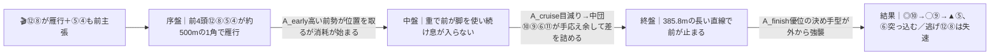
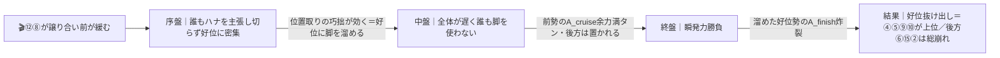

# 🏇 第72回 東京ダービー（ジャスティンミラノ賞）JpnI（2026-06-10 大井 ダ2000m・外回り・右 / 馬場:重）分析

**モデル: scoring-model v5.0（論理ファースト・相変位再帰を因果骨格として使用）** ／ 使用観点: 10観点（A〜I, K）／ 出走 16頭
> 着順の並びは論理で決め、印で示す（%は出さない）。score_race.py は任意のため未実行（並びは論理で確定）。
> 確定材料（枠順・乗替・馬場重・当日の前半参考R差し決着）は §2/§3 本文に織り込み済み。当日未知（パドック・馬体重・返し馬）は §0 に残す。

## 1. サマリ（結論）

- **予想本命 ◎**: 5-10 シルバーレシオ — 本線β（重・差し決着）で最大恩恵。JRAユニコーンS(G3)を上がり最速で差し切った**世代ダ中距離トップ級の地力＋決め手**、5枠も好枠。
- **対抗 ◯**: 5-9 ゲッドフェンサー（無敗の上昇度。**3パターン全てで恵まれる稀有な立ち回り**＝崩れにくい）
- **単穴 ▲**: 3-5 リアライズグリント（大井実証＋世代屈指の決め手37.1。前々から粘れる地力）
- **連下 △**: 6-12 フィンガー（α＝単騎逃げ前残りなら最強・地力最上位／本線βでは失速懸念で一段下げ）、2-4 ロックターミガン（京浜盃勝ちの堅実先行）、3-6 ロウリュ（羽田盃最速上がりの差し脚・強化乗替）
- **注意 ×**: 6-11 フォースメン（差し自在＋強化乗替、相手強化は未知）、8-15 モエレサワンミヤギ（追込で本線のみ大恩恵・父タルマエ×重◎）
- **最有力展開**: **β 先行争い加熱・ハイペース差し台頭（本線★★★）**（鍵馬: ⑫フィンガー・⑧ミルトイブニング）。対抗 **α 単騎逃げ・前残り寄り（★★）**、伏線 **γ スロー・好位差し瞬発（★）**
- **展開を分ける一点**: **⑧ミルトイブニングが⑫フィンガーにハナを主張するか**。競れば差し天国(β)、⑫単騎なら前残り寄り(α)。

> 馬券（何をどう買うか）はユーザー判断。本レポートは展開と着順の予測のみ。

## 0. 当日アップデート・ボード ⏱

### 0-1. 当日の参考レース（バイアス採取）— **採取済み**
| R | コース | 一致度 | 観察結果 |
|---|--------|:-----:|----------|
| 1R | ダ1600 重 | ★★☆ | **差し決着**（逃げ⑫番が直線先頭→好位差しに交わされ2着） |
| 3R | ダ1600 重 | ★★☆ | **差し決着**（先行勢を直線で差し切り、内1枠は3着まで） |
| 2/4/5R | ダ1200/1400 重 | ★☆☆ | 勝ち馬は中〜外枠(4〜7枠)中心、内枠は連下まで |
| 6R | **ダ2000 重** | ★★★ | 8-7-8の**外枠決着**（脚質不明・本レース同距離）2:11.6 |
| 7R | ダ1400 重 | ★★☆ | **前残り**(先行押し切り)・**1枠勝ち** 1:27.4 |
| 8R | ダ1600 重 | ★★☆ | **前残り**(先行押し切り)7-5-5枠 **1:41.7=時計大幅短縮** |

→ **観察結果【序盤→8R】**: 決まり手が**差し決着(1-5R)→前残り・先行押し切り(7-8R)へシフト**。マイル時計1:46.2→1:44.1→1:41.7で**脚抜き良化・高速化**。内外は外〜中枠優勢のままだが**内枠が巻き返し**フラット〜やや前残り。
> **→ §2-3 当日修正へ反映済み**: α(前残り寄り)を本線へ格上げ・β(差し台頭)を対抗へ。並びを論理再評価（◎を差し⑩→先行好位の⑤へ）。

### 0-2. 馬場（当日確定）: **重**（発表据え置き）。ただし**天候 曇→晴で乾き、時計が大幅短縮＝脚抜きの良い高速・前残り馬場へ変化**。発走時はさらに乾く可能性、直前の発表（重か稍重か）要確認。

### 0-3. パドック・返し馬・馬体重 ⏱（**ナイター20:05発走→分析時点で未公開＝当日記入**）
| 印 枠-馬番 | 馬体重 | パドック/返し馬 | 気配 |
|------------|--------|------------------|:----:|
| ◎ 5-10 シルバーレシオ | ___ | （初ナイター×初大井×輸送＝ソフト仕上げ、当日の状態が最重要チェック） | ↑/→/↓ |
| ◯ 5-9 ゴッドフェンサー | ___ | （初大井遠征・早朝調教へ切替で落ち着き良好と陣営） | ↑/→/↓ |
| ▲ 3-5 リアライズグリント | ___ | （一杯に追われ仕上がり・余力面は当日確認） | ↑/→/↓ |

### 0-4. その他: 天候推移・当日発表の変更は要確認。乗替・枠順は確定済み（本文反映）。

## 2. 展開予想【成果物1】（STEP4a 展開合成）

> **検証契約**: 脚質別有利不利・隊列・段階フローを馬番・符号・可能性ティアで固定。レース後に着順・通過順・上がりから復元したペース層と照合し展開精度を独立採点する。

### 2-1. 脚質分類表（全16頭・観点E証拠／確定枠反映）

| 枠-馬番 | 馬名 | 騎手(乗替) | 脚質 | テン速 | 想定位置 |
|--------|------|-----------|------|--------|----------|
| 6-12 | フィンガー | 戸崎圭太(継続) | **逃** | 最速 | **単騎ハナ最有力** |
| 4-8 | ミルトイブニング | 廣瀬航輝(乗替) | **逃** | 速 | ハナ争い（第2の逃げ） |
| 3-5 | リアライズグリント | 坂井瑠星(継続) | 先 | 速 | 前々2-3番手 |
| 2-4 | ロックターミガン | 西村淳也(継続) | 先(好位差) | 速 | 先行2-4(⑫直後) |
| 1-1 | サンラザール | 矢野貴之(継続) | 先 | 中〜速 | 好位〜先行3-5（最内で可変） |
| 4-7 | エンドレスソロウ | 石川倭(継続) | 先(好位差) | 中〜速 | 好位3-5 |
| 7-14 | ロードルーチェ | 藤本現暉(継続) | 先(自在) | 中 | 好位〜中団前目 |
| 2-3 | シーテープ | 本田重太郎(乗替) | 自在 | 中 | 中団前目 |
| 5-9 | ゴッドフェンサー | 吉村智洋(継続) | 差 | 中 | 中団 |
| 5-10 | シルバーレシオ | 岩田望来(継続) | 差 | 中 | 中団後方 |
| 6-11 | フォースメン | 笹川翼(乗替・強化) | 差(自在) | 中 | 中団 |
| 3-6 | ロウリュ | 吉原寛人(乗替・強化) | 差 | 中〜遅 | 中団後方 |
| 7-13 | コンヨバンコク | 岡村健司(乗替) | 差 | 中〜遅 | 中団後方 |
| 8-16 | デンテブリランテ | 藤田凌(継続) | 差(不安定) | 中〜遅 | 中団後方 |
| 8-15 | モエレサワンミヤギ | 本橋孝太(継続) | 差(追込) | 遅 | 後方一気 |
| 1-2 | モコパンチ | 秋元耕太郎(継続) | 追 | 遅 | 最後方 |

> 逃げ2（⑫⑧）＋実先行3〜4（⑤④①／⑦）で**前は非常に厚い**。鍵は⑧が⑫に競りかけるか、①が最内から前を取れるか。

### 2-2. 展開パターン（複数・可能性ティア）

| id | パターン名 | 可能性 | 発動トリガー | 有利脚質（符号） | 浮上馬 | 沈む馬 |
|----|-----------|:-----:|--------------|------------------|--------|--------|
| **β** | **先行争い加熱・ハイペース差し台頭** | **本線★★★** | ⑫⑧が雁行＋⑤④も前を主張（前4頭が約500mの1角で競る） | 逃-1 先0 **差+2 追+1** | 10 9 6 11 15 | 12 8 1 |
| α | フィンガー単騎逃げ・平均/前残り寄り | 対抗★★ | ⑧が初遠征で控え⑫が単独ハナ＝自分のペース | **逃+1 先+1** 差0 追-2 | 12 5 4 9 10 | 6 2 15 |
| γ | 前牽制スロー・好位差し瞬発 | 伏線★ | ⑫⑧が譲り合い前が大きく緩む | 逃+1 **先+2** 差0 追-2 | 4 5 9 10 | 6 2 15 |

> 可能性ティア＝本線★★★/対抗★★/伏線★（%は出さない）。`有利脚質(符号)`と`浮上馬/沈む馬`が着順・通過順から検証できる正本。

#### 各パターンの段階フロー

**β 先行争い加熱・ハイペース差し台頭（本線★★★）**

> 1行要約: **⑫⑧の競り合いでハイ → 重で前が消耗 → 長い直線で⑩⑨⑥の差し脚が前を捕え、前々の⑤④は掲示板で粘る**。

**α フィンガー単騎逃げ・前残り寄り（対抗★★）**

> 1行要約: **⑫が単騎で緩く逃げ → 前が脚を温存 → 前残り、ただし好位差しの⑨⑩は届く（後方⑥⑮②は割引）**。

**γ 前牽制スロー・好位差し瞬発（伏線★）**

> 1行要約: **牽制で超スロー → 誰も脚を使わず → 好位に構えた④⑤⑨⑩が瞬発勝負を制す、後方差しは脚を余す**。

- **隊列（最有力β）**: 序盤先頭 `⑫⑧⑤` → 最終コーナー前方 `⑫⑤④⑩⑨⑥`
- **馬場バイアス**: 本日重・差し決着・中〜外枠優勢・最内不振（前半参考Rで採取済み＝§0-1）。長い直線385.8m＋1角まで約500mで差しが届きやすい。
- **反証条件**: ⑧が園田同様にハナ主張で前4頭雁行→β確定。⑧控えて⑫単騎→**αを本線へ格上げ・βを対抗へ**（=◎⑩の取捨が変わる最重要分岐）。前が譲り合い超スロー→γを対抗へ。馬場が乾けば前残り寄りに補正。

### 2-3. 当日修正【8R終了時点・当日更新】⚡
**当日バイアスが「差し決着」→「前残り」へシフト**（反証条件が部分発動）。
- 馬場「重」据え置きだが**天候 曇→晴で乾き**、マイル勝ち時計が **1:46.2(R1)→1:44.1(R3)→1:41.7(R8)** と大幅短縮＝**脚抜きの良い高速馬場化**。
- 決まり手: **R7(1400)・R8(1600)とも先行押し切りの前残り**。R6(2000m=本レース同距離)は8-7-8の外枠決着。内枠もR7 1枠勝ち・R9 3枠で巻き返し＝**強い外有利は薄れフラット〜やや前残り**。
- **ティア付け替え**: **α(単騎逃げ・前残り寄り)を本線★★★へ格上げ／β(ハイ差し台頭)を対抗★★へ格下げ／γ伏線維持**。脚抜きの良い馬場は前が競ってもバテにくく、差し台頭(β)の確度が下がるため。
- **並び再評価（論理）**: 差しバイアス依存だった◎⑩(差し・初大井)を格下げ。前残り/好位化に最も恩恵の[大井実証＋先行好位＋決め手]**⑤を本命へ**、展開不問の**⑨**、前残り化が直接追い風の逃げ**⑫**を引き上げ。
- **更新後の並び**: ◎3-5リアライズグリント／◯5-9ゴッドフェンサー／▲6-12フィンガー／△2-4ロックターミガン／△5-10シルバーレシオ／△3-6ロウリュ／×6-11フォースメン／×8-15モエレサワンミヤギ
> ※ §3 の表は分析時点（β本線）の並び。**最終はこの §2-3 当日修正が優先**。素の能力読み（好材料/懸念点）は不変、展開感度と並びのみ前残り化で再評価した。

### （展開→着順の伝達）
**【当日更新後・α本線】** 「⑫が前を支配→脚抜き良い馬場で前が止まらない→好位勢が押し切り、好位差しが差し込む」が骨格。だから**好位から運べて決め手もある⑤、展開不問の⑨、前残り化が追い風の逃げ⑫**が上位。純差し・追込の⑩⑥⑪⑮は[届きにくさ]が増し評価を一段下げた。
**【分析時点・β本線（参考）】** 競り合い→消耗→差し決着なら◎⑩・◯⑨が直線で浮上、前々⑤④は粘り、逃げ⑫は失速余地。

## 3. 着順予想表【成果物2】（メイン出力）

> **検証契約**: 並び（印＋行順）＋各馬の展開感度・好材料・懸念点を固定。レース後に実着順と照合し、(a)並びの順位相関、(b)実現パターンの段階フロー的中を別個採点。%は出さない。

| 印 | 枠-馬番 | 馬名 | 騎手(乗替) | 展開感度 | 好材料 | 懸念点 |
|----|--------|------|-----------|---------|--------|--------|
| ◎ | 5-10 | シルバーレシオ | 岩田望来(継続) | **本線β(差し決着)で最大恩恵(fit+2)**／α前残り寄りでも好位差しで圏内(fit0)＝崩れにくい | ・[A/B]ユニコーンS(JRA・G3・ダ1900)を**上がり最速で差し切り2連勝**＝世代ダ中距離トップ級の地力 ・[E]中団から長く脚を使う持続力＝**385.8mの長い直線×差し馬場ど真ん中**、5枠も好枠 ・[C]父ルヴァンスレーヴ×母父クロフネ＝ダ中距離の持続力配合・道悪不問 | ・[I/H]**初大井・初ナイター・右回り初＋ソフト仕上げ・短期放牧明け**＝当日の状態と砂適応が最大の未知 ・[E]αが本線化(⑫単騎の前残り)に振れると決め手を余すリスク |
| ◯ | 5-9 | ゴッドフェンサー | 吉村智洋(継続) | **β/α/γ全てでfit+**＝隊列の中団から自在＝**3パターン全対応で最も崩れにくい** | ・[A/B]兵庫優駿6馬身差圧勝で**重賞4連勝・無敗の上昇度**、底を見せていない ・[C]父ルヴァンスレーヴ産駒は**稍重〜重で驚異的好走率**＝馬場重に最適、1700-1800m3戦3勝で距離延長◎ ・[E]中団差しでハナ争いに無関係＝前崩れの恩恵を素直に受ける | ・[B/I]連勝相手が**兵庫ローカル中心**＝JRA・南関トップとの直接対戦が薄く通用度に幅 ・[I]**初大井遠征＋夏場**、陣営の自己評価も控えめ |
| ▲ | 3-5 | リアライズグリント | 坂井瑠星(継続) | α/γ(前残り・好位)で前々から粘り(fit+1〜+2)／本線βは先行争い当事者で消耗側だが地力で掲示板 | ・[A]前走**雲取賞を上がり37.1で快勝＝世代屈指の決め手**、羽田盃4着も僅差 ・[D/B]大井実績豊富で**コース・道悪を実証済み**(初大井組への保険)、矢作厩舎×坂井 ・[E]前々で運べテンも速い＝展開が緩めば最も信頼できる | ・[E]本線β(前4頭雁行)では**先行争いに巻き込まれ共倒れ**の側 ・[F]一杯に追われ仕上げ＝余力面は当日確認 |
| △ | 6-12 | フィンガー | 戸崎圭太(継続) | **α(単騎逃げ前残り)が本線化なら最強(fit+2)**／本線β(競り合い)では失速懸念(fit-2)＝展開で大きく振れる | ・[A/B]**羽田盃(JpnI)を1-1-1-1で逃げ切り3馬身差**＝本路線最高指数の一角、5戦0着外 ・[F]美浦の追い切り最良・**仕上げは出走中トップ**、戸崎は大井で東京ダービー4勝 ・[C]父Gun Runner＝米ダート王道の地力(A_class)最上位 | ・[E]脚質が逃げで**東京ダービーは純逃げ勝率約10%＋当日重・差し決着は逆風** ・[I]2000m延長は初・上がり平凡で末脚比べだと分が悪い |
| △ | 2-4 | ロックターミガン | 西村淳也(継続) | γ(スロー好位)・α(前残り)で好位先行から粘る(fit+1〜+2)／本線βは先行で消耗も立ち回りで残る | ・[A/B]**京浜盃(JpnII)を3馬身圧勝・羽田盃2着**でフィンガーと1勝1敗のほぼ互角＝地力最上位級 ・[C]父シスキン産駒はダート複勝率46%と額面以上、母父ダイワメジャー | ・[A/E]羽田盃の上がり39.4＝**決め手型の馬場では一歩譲る** ・[D]2000m未経験で持続力の証明はこれから |
| △ | 3-6 | ロウリュ | 吉原寛人(乗替・強化) | **本線β(差し決着)でfit+2**＝展開ど真ん中／α・γ(前残り/スロー)は届かず(fit-2) | ・[A/E]羽田盃3着で**メンバー最速上がり38.3で大外強襲**＝差し脚の質は確か ・[K]御神本→**吉原寛人へ強化乗替**(交流重賞巧者)＝差し決着で腕がプラス、地元大井 | ・[A/I]通算1勝でムラ・**516kg大型＋金沢遠征**＝地力と消耗が懸念 ・[E]追込一辺倒で展開が向かないと届かない |
| × | 6-11 | フォースメン | 笹川翼(乗替・強化) | 本線β(差し台頭)で恩恵(fit+1)／前残り・スローでは届きにくい | ・[B]岩手3連勝で**ダイヤモンドC勝ち・シーテープに4馬身差**、上昇度◎ ・[K]山本→**笹川翼へ強化乗替**(大井トップ)、船橋2勝で南関の砂も走れる | ・[A/B]勝ち時計の絶対水準が**南関重賞勢に一枚見劣り・全国JpnIは未検証** ・[C]父サンダースノーは先行寄りで差し決着とは脚質ベクトルがやや逆 |
| × | 8-15 | モエレサワンミヤギ | 本橋孝太(継続) | **本線β(ハイ・差し決着)でのみ大恩恵(fit+1)**／α・γでは脚を余して総崩れ(fit-2) | ・[C]父ホッコータルマエは**最高成績がまさにダ2000m＋「雨のタルマエ」で道悪◎**＝距離・馬場が血統的にドンピシャ ・[E]後方一気の末脚＝前が崩れるβで突っ込み余地 | ・[A/B]東京湾カップ3着止まりで**JpnI級とは地力差が大きい** ・[E/I]最後方追込＋外枠＝展開最頼みで一発まで |

- **印**: ◎本命／◯対抗／▲単穴／△連下／×注意。並びと印で強弱を表す（%なし）。
- 無印（割引）: ①サンラザール（最内最不振枠＋前傾で末甘い）／③シーテープ（マイラーで2000m未知）／⑦エンドレスソロウ（相手強化未検証）／⑧ミルトイブニング（逃げで本線逆風・ゴッドフェンサーに完敗）／⑬⑭⑯②（地力/距離/枠で見劣り）。

## 4. 観点別ハイライト（横断）

- **A 指数/B 近走**: 羽田盃(4/29大井1800)着順=⑫フィンガー＞④ロックターミガン＞⑥ロウリュ＞⑤リアライズグリント＞①サンラザールが基幹データ。JRA組⑩シルバーレシオ(ユニコーンS)・兵庫⑨ゴッドフェンサー(無敗)が指数最上位に加わる。
- **C 血統（重・2000m適性）**: ルヴァンスレーヴ(⑨⑩)＝重×中距離に最適、ホッコータルマエ(⑮)＝ダ2000m＋道悪◎、クリソベリル(①)・ニューイヤーズデイ(⑦)も距離○。ミスターメロディ(②⑥)は距離過長、フォーウィールドライブ(⑭)は短距離血統で割引。
- **D 適性**: 2000mは世代ほぼ全頭が未知（最長経験1800-1900m）。**大井実証は⑤⑫④①⑭**＝初大井の⑨⑩⑦⑧⑪への保険軸。本日重・差し決着で通常の前有利が弱まり長い直線を活かす差しに追い風。
- **E 展開＋STEP4a**: 逃げ2(⑫⑧)＋先行厚い→ハイ必至。本線β（差し台頭）の根拠は「重・差し決着・外中枠優勢の生バイアス×純逃げ勝率10%×直線385.8m」。
- **F/H 状態**: 仕上げ最良⑫、次いで⑩⑤④。**ナイター20:05のため当日パドック・馬体重は未取得（H確信度低）**＝⑩⑨の初大井・初ナイター対応は当日要確認。
- **K 騎手**: 強化乗替の旨味は⑥(御神本→吉原寛)・⑪(山本→笹川)。上位は鞍上継続で安定（⑩岩田望/⑨吉村/⑤坂井/⑫戸崎/④西村淳）。差せる腕（吉原・岩田望・坂井）が差し決着でプラス。
- **I リスク**: 最重い減点は⑩(初ナイター+初大井+ソフト+放牧明け)・⑨(初大井遠征+夏)・⑥(516kg+遠征)。①最内不振枠+気性、⑯大外+距離。⑫は減点極小。

## 5. データの確かさ・補強のお願い
- **確信度が低い観点**: H 当日気配（ナイターで未公開）。⑩⑨の初大井×初ナイター適応は**当日のパドック・返し馬・馬体重で要確認**＝◎◯の信頼度を左右。
- **NAR(大井)は fetch_racecard.py 非対応**＝全観点 web 調査。通過順・テン速の生数値は一部記事ベース（脚質ラベルより通過順の生数字を優先採用）。
- **ユーザー補強推奨**: 発走前のパドック評価・確定馬体重・直前の馬場発表（重か不良か）。貼り付け or URL で頂ければ §0 を埋めて並びを論理再評価します。

## 6. 免責
予測であり的中を保証しない。賭けは自己責任、馬券選択・実ベットは人間判断。市場（オッズ・人気）は一切参照していない。
