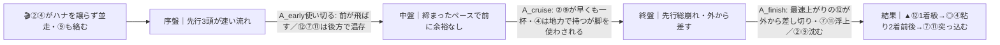

# 🏇 BSイレブン賞（B3二選抜特別）（2026-06-10 大井 ダ1600m内・重）分析

**モデル: scoring-model v5.0（論理ファースト・相変位再帰を因果骨格として使用）** ／ 使用観点: 8観点(AB,C,D,E,FG,H,K,I) ／ 出走 13頭
> 着順の並びは論理で決め、印で示す（%は出さない）。発走20:50ナイター。市場（オッズ・人気）は一切参照しない。

## 1. サマリ（結論）

- **予想本命 ◎**: 2-4 コスモマガラニカ — 近4走3勝の絶好調＋逃げ先行で前有利展開ど真ん中。展開合成4パターン中3つで1着想定。
- **対抗 ◯**: 1-2 トランジェント（ハナ最有力・最内・重馬場ダート巧者の血統）
- **単穴 ▲**: 6-12 セキトバシューズ（能力・上がり最速はメンバー最上位／後方差し外枠の展開待ち。前が崩れれば1着まで）
- **連下 △**: 5-9 ネポティズムベビー（矢野継続・先行できれば前有利の恩恵）／ 4-7 レペンテ（1600m勝率最高・吉原強化乗替の差し）
- **注意 ×**: 1-1 メイショウタビズキ（コース実績・内枠先行も血統道悪×・乗替弱化）
- **最有力展開**: P1「④単騎逃げ・前残り」本線★★★（鍵馬: 4）。対抗 P2「②④競りハイ→差し台頭」★★、伏線 P3「②主導・平均先行決着」★／P4「消耗戦・紛れ」★
- **展開を分ける一点**: 発走〜1コーナーの隊列が **4-2（④単騎＝前残りP1）** か **2-4並走（競り合い＝差し台頭P2）** か。④のテン乗り（吉井）＋遠征で二の脚が読めないのが分岐の核。

> 馬券（何をどう買うか）はユーザー判断。本レポートは展開と着順の予測のみを提示する。

## 0. 当日アップデート・ボード（当日更新枠 ⏱）

> 枠順・乗替は §2/§3 本文に織り込み済み。ここは分析時点で未知のものだけ。

### 0-2. 馬場（当日確定）
| 項目 | 値（当日記入） | 質の読み |
|------|----------------|----------|
| 馬場状態 | 重（分析時点）→当日確認 | 重なら前残り主流／**不良寄りに渡ると差し台頭(P2/P4)が上振れ** |
| 含水率/時計 | ___ | 前半600m通過と先行勢の3角手応えでペース層を判定 |

### 0-3. パドック・返し馬・馬体重（注目馬）※NARで事前未取得＝当日記入
| 印 枠-馬番 馬名 | 馬体重(増減) | パドック/返し馬 | 気配 |
|------------|--------------|------------------|:----:|
| ◎ 2-4 コスモマガラニカ | 476(-2) | | ↑/→/↓ |
| ◯ 1-2 トランジェント | 479(-6) | | ↑/→/↓ |
| ▲ 6-12 セキトバシューズ | 458(-5) | | ↑/→/↓ |

### 0-4. その他当日情報
- 当日の取消・乗替: ___（⑬ユーヒナタは前走取消明け＝状態要確認）
- 天候推移／馬場回復（重→稍/不）: ___

> この箱が埋まったら §2-3 当日修正へ。馬場が「不良寄り」に振れたら P2/P4（差し台頭）を本線へ格上げ＝▲⑫を上へ。

## 2. 展開予想【成果物1】（STEP4a 展開合成）

> **検証契約**: 脚質別有利不利・隊列・段階フローを馬番・符号・ティアで固定。レース後に着順・通過順から復元ペースと照合し展開精度を独立採点。

### 2-1. 脚質分類表（全馬・観点E証拠／確定枠を反映）

| 枠-馬番 | 馬名 | 騎手 | 脚質 | テン速 | 想定位置 |
|--------|------|------|------|--------|----------|
| 1-2 | トランジェント | 澤田龍 | 逃〜先 | 速 | ハナ〜2番手主張（最内＝最良の逃げ枠） |
| 2-4 | コスモマガラニカ | 吉井章 | 逃〜先 | 速 | ハナ〜3番手（逃げ主張最強候補の一頭） |
| 5-9 | ネポティズムベビー | 矢野貴 | 先 | 速 | 2〜4番手（先行争いに絡みうる） |
| 1-1 | メイショウタビズキ | 福原杏 | 先(控) | 中 | 2〜4番手・内確保 |
| 4-8 | ハーレムシャフル | 本田重 | 先〜中 | やや速 | 4〜7番手 |
| 7-13 | ユーヒナタ | 杉山海 | 先〜中 | やや速 | 3〜6番手（最外13番でロス大） |
| 3-6 | マムティプリンス | 石川倭 | 中 | やや遅 | 6〜9番手 |
| 6-11 | アウトビアンキ | 藤本現 | 中差 | やや遅 | 6〜9番手 |
| 2-3 | サトノエンパイア | 和田譲 | 差 | 遅 | 8〜11番手 |
| 4-7 | レペンテ | 吉原寛 | 差 | 遅 | 9〜12番手 |
| 6-12 | セキトバシューズ | 藤田凌 | 後方差 | 遅 | 9〜11番手（上がり最速） |
| 3-5 | リアルモハメド | 中山遥 | 追込 | 遅 | 10〜12番手 |
| 5-10 | イチニチショチョウ | 菅原涼 | 追込 | 遅 | 11〜13番手（最後方） |

> 大井ダ1600m内回りは前有利コース（逃22%/先14%/差7%/追5%）。重馬場で前残りがさらに強化されるのが主流。内枠(1-2枠)有利・外枠(6-7枠)はタイトコーナーでロス。

### 2-2. 展開パターン（複数・可能性ティア）

| id | パターン名 | 可能性 | 発動トリガー | 有利脚質（符号） | 浮上馬 | 沈む馬 |
|----|-----------|:-----:|--------------|------------------|--------|--------|
| P1 | ④単騎逃げ・前残り | 本線★★★ | 200mで④がハナ主張・②が無理せず2番手に控え隊列4-2-1で確定 | 逃+2 先+1 差-1 追-2 | 4 2 9 1 | 12 7 5 10 |
| P2 | ②④競りハイ→差し台頭 | 対抗★★ | ②④がハナを譲らず並走（＋⑨も絡む）・前半600m締まる | 逃-1 先0 差+2 追+1 | 12 7 11 | 2 4 9 |
| P3 | ②主導・平均先行決着 | 伏線★ | ②が最内からハナ・④が遠征/テン乗りで2番手に収まる | 逃+1 先+2 差0 追-1 | 4 2 1 9 | 12 7 5 |
| P4 | 消耗戦・伏兵紛れ | 伏線★ | 馬場が不良寄りに悪化し時計を要す消耗戦 | 逃0 先+1 差+1 追0 | 4 9 13 | 1 6 |

> 可能性ティア = 本線★★★ / 対抗★★ / 伏線★（%は出さない）。`有利脚質`と`浮上/沈む馬`は着順・通過順から検証できる展開検証の正本。

#### 各パターンの段階フロー

**P1 ④単騎逃げ・前残り（本線★★★）**

> 1行要約: **④が単騎で楽に逃げ→中盤誰も脚を使わず→前残りで④押し切り、②⑨が続き、差しの⑫は届かない**。

**P2 ②④競りハイ→差し台頭（対抗★★）**

> 1行要約: **②④が競ってハイ→中盤で前が苦しくなり→終盤は脚を残した⑫が外から差し切る（④は粘って2着前後）**。

**P3 ②主導・平均先行決着（伏線★）** / **P4 消耗戦・紛れ（伏線★）**
> P3: ②が最内からハナ→平均ペース→直線で2番手の④が交わして抜け出し、②粘り、⑨①続く（差しは4着以下）。
> P4: 馬場が不良寄りに悪化→消耗戦で道悪適性・軽量馬が紛れる。④は道悪B3勝ち実績でタフさ優位だが2〜5着がばらつく波乱含み。

- **隊列（最有力P1）**: 序盤先頭 `④②①⑨` → 最終コーナー前方 `④②①⑨⑧` ＋後方差し `⑫⑦`
- **馬場バイアス**: 前/内有利（重で強化）。外枠⑫⑬はコーナーロス。**不良寄りに渡れば外差し台頭でP2へ**。
- **反証条件**: ①発走で④が出負け／ハナ取れず②単騎→P3へ。②④が明確に競る→P2を本線へ（▲⑫を上げる）。③⑨が3番手以内で前を取りに行く動き→P2/P4へ重み移動。

### 2-3. 当日修正（あれば）
> 当日情報を受けたらここに追記。例:「馬場が不良＋②④競り→P2本線★★★へ格上げ、▲⑫を◎/◯近くへ昇格」。

## （展開→着順の伝達）
最有力P1（前残り）では、先行できる④②⑨が前で生き残り、後方差しの⑫は最速上がりでも届かず4着前後＝**◎④の押し切りが本線**。ただしP2（対抗★★・競り合い）が現実化すれば⑫が一変1着まで＝**⑫の取捨が着順予想最大の振れ幅**。A/B/C仕分けは「前残りで決まったか／差し台頭で決まったか」で一次判定する。

## 3. 着順予想表【成果物2】（メイン出力）

> **検証契約**: 並び（印＋行順）＋各馬の展開感度・好材料・懸念点を固定。レース後に実着順と照合し、(a)並びの順位相関、(b)実現パターンと展開感度の的中、を別個採点。%は出さない。

| 印 | 枠-馬番 | 馬名 | 騎手(乗替) | 展開感度 | 好材料 | 懸念点 |
|----|--------|------|-----------|---------|--------|--------|
| ◎ | 2-4 | コスモマガラニカ | 吉井章(乗替) | P1/P3の前残りでど真ん中・P4消耗戦も道悪適性で優位／P2(競りハイ)でも地力で2着前後を確保 | ・[B]近4走3勝・前走B3以下選抜を1-1-1で逃げ圧勝(着差1.2秒/1:40.1) ・[D]2枠の好枠＋重1600m2着・不良1600m1着で道悪実証(D観点+2/確信度高) ・[G]1着後44日の立て直しローテ・馬体476(-2)で状態最上位(FG最高評価) | ・[C]ダノンバラード産駒は本来芝向きでダート道悪の血統裏付けは薄い(近走実績で上書き) ・[K]勝ち乗り江里裕→吉井章のテン乗り＋笠松遠征で二の脚・折り合いが読めない（展開分岐の核） |
| ◯ | 1-2 | トランジェント | 澤田龍(再結成) | P1/P3前残りで2着争いに粘り込み・P2(競りハイ)だと失速して沈む | ・[E]ハナ主張最有力＋最内2番＝距離ロスなく逃げを打てる最良枠 ・[C]ニューイヤーズデイで重馬場ダート巧者・大井1600得意(C観点+2/確信度高) ・[B]先行を一貫(1-1-1/2-2-2)＝隊列の主役 | ・[B]先行して粘り切れず失速する癖(A_finish弱・行人坂賞も3着止まり) ・[D]大井1600勝率は11%とやや低く前走は不良6着 |
| ▲ | 6-12 | セキトバシューズ | 藤田凌(継続) | P2(競りハイ・差し台頭)なら1着まである本命格／P1・P3の前残りでは外+後方で4着前後に取りこぼす | ・[A]上がり36.8秒＝メンバー最速級・B3一選抜(一格上)で2着 ・[C]キタサンブラックで地方ダート優秀(平地AEI2.79)・重馬場で回収率向上(C観点+2/確信度高) ・[K]藤田凌継続の好コンビ・地方6戦4勝 | ・[E]後方差し×6枠外×内回り重の前有利＝三重苦(D観点では枠と脚質でマイナス) ・[B]前走1800→今回1600の短縮でスピード要求が増す |
| △ | 5-9 | ネポティズムベビー | 矢野貴(継続) | P1/P3で先行ポジション取れれば前有利の恩恵で2-3着圏／P2では競り負けて沈む | ・[K]矢野貴(本年勝率22%)継続＝鞍上最強格・前走1着(K観点+2) ・[D]重馬場2走2勝 ・[E]2-4番手で先行争いに加われる | ・[B]2000m専科でB3の1600m実績ほぼ無し ・[G]前走から76日ブランク＋馬体+5kgで仕上がり未知 |
| △ | 4-7 | レペンテ | 吉原寛(強化) | P2(ハイ・差し台頭)なら浮上／P1前残りでは届きにくい | ・[D]大井1600勝率20%(全距離中最高)・重馬場対応あり ・[K]金沢トップ吉原寛(勝率21%)への強化乗替 | ・[G]最軽量411kgで重馬場のパワー不足が深刻 ・[C]ダノンバラード×牝馬でダート道悪は二重マイナス |
| × | 1-1 | メイショウタビズキ | 福原杏(弱化) | P1/P3で先行して前残りなら一発・展開向かないと沈む | ・[D]地方転入後12戦7勝＋内枠1番でコース実績(D観点+1) ・[E]先行で内を確保できる | ・[C]レイデオロ産駒でダート道悪は最低評価(C観点-2) ・[K]矢野→福原杏の弱化乗替＋B3初挑戦の前走10着 |

- **印**: ◎本命／◯対抗／▲単穴／△連下／×注意。並びと印だけで強弱を表す（%は出さない）。
- 下位評価（無印）: ③サトノエンパイア(重馬場×・差し・格の壁)、⑥マムティプリンス(重馬場3走全着外)、⑪アウトビアンキ(6歳差し外枠・着外続き)、⑤リアルモハメド(追込専門・前走最後方)、⑧ハーレムシャフル(B3即大敗・1400専門)、⑩イチニチショチョウ(47戦0勝＝評価外)、⑬ユーヒナタ(前走取消・状態不明・最外枠・テン乗り)。

## 4. 観点別ハイライト（横断）

- **A/B 能力近走**: ④(近4走3勝)・⑫(上がり最速・B3一選抜2着)が能力2トップ。B3昇格即大敗組(⑧⑥⑤)は格の壁が明確。⑩は47戦0勝で評価外。
- **C 血統**: 重馬場ダートで②(ニューイヤーズデイ)・⑫(キタサンブラック)が最上位。①(レイデオロ)③(サトノクラウン)⑪(ベストウォーリア・短距離)が-2の最低。④はダノンバラードで血統は弱いが近走実績が上書き。
- **D 適性**: 大井ダ1600内・重は前有利＋内枠有利。④(2枠・重実証)が総合最上位。⑫⑬は外枠＋差しで割引。⑥は重馬場3走全着外が致命的。
- **E＋STEP4a 展開**: 前有利コース＋重馬場で本線は前残り(P1)。鍵は②④の主導権。④単騎なら前残り、競ればハイ→⑫差し台頭(P2・対抗★★)。
- **K 騎手**: ⑨矢野・⑫藤田の継続好コンビ、⑦⑥の強化乗替が加点。④は勝ち乗り交代のテン乗りが唯一の不安。①は弱化乗替。
- **I リスク**: ⑬(前走取消・状態不明)、⑥(重馬場不振)、⑧⑩(力不足)、⑪(6歳差し外枠)の取りこぼしリスク大。

## 5. データの確かさ・補強のお願い

- **確信度が低い観点**: H(当日気配・パドック・関係者コメント)はNARで事前web取得できず未反映（ワークフローでも該当データ無し）。
- **ユーザー補強推奨**: 当日の**馬場(重→稍/不の推移)・確定馬体重・パドック気配**。特に④の二の脚（ハナを取れるか）と②④の主導権争いが本線/対抗を分けるので、返し馬・テンの出脚情報があれば当日修正の精度が上がる。
- 欠損・推定: NARのため追い切りタイムは非公開。通過順はoddspark/nankankeiba/keiba.go.jp由来。

## 6. 免責
予測であり的中を保証しない。賭けは自己責任で、馬券選択・実ベットは人間判断。市場は一切参照していない。
