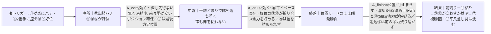
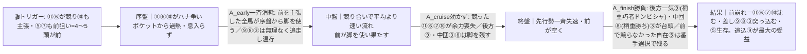
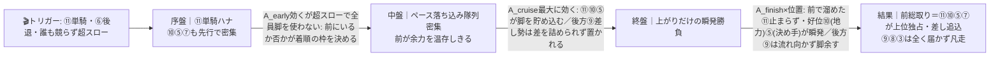

# 🏇 園田4R 青木7ハロンC2二4歳以上（2026-06-10 園田 ダ1400m 馬場:稍重）分析

**モデル: scoring-model v5.0（論理ファースト・相変位再帰を因果骨格として使用）** ／ 使用観点: 5観点（AB/CD/E/FGHK/I）／ 出走 12頭
> 着順の並びは論理で決め、印で示す（%は出さない）。`score_race.py` の並び（**5>10>7≈11≈9>1>3>8…**）と整合確認済み（7/11/9はほぼ同値の僅差クラスタ＝展開ロジックで内部順を確定）。
> **確定材料の先取り**: 枠は12頭→8枠の確定割当（①〜④=各1頭、⑤⑥/⑦⑧/⑨⑩/⑪⑫=2頭ずつ）を本文に反映。乗替（①⑧⑨が弱化方向）も §3 騎手列に織り込み済み。当日の馬場質・パドックのみ §0。

## 1. サマリ（結論）

- **予想本命 ◎**: 5-5 ジャスティントレノ — **地力最上位（園田1400自己最速1:31.4・C2一で2着2回）＋自在脚質で展開不問**。前残り(α)でも差し台頭(β)でも番手を選んで生き残れる唯一の馬。山本咲（好調）継続。
- **対抗 ◯**: 7-10 ノーブルライナー — **前走を園田1400・稍重で先行押し切り勝ち＝本日条件ど直結**。58kg背負い1:33.2楽勝の地力でC2上位。田野豊（前走勝利コンビ）継続。
- **単穴 ▲**: 8-11 ウクライナアイズ — **最有力α（前残り）の起点＝明確な逃げ**。単騎で楽にハナを切れれば粘り込む複勝の軸。ただしハナ争い(β)になると一気に沈む展開依存。
- **連下 △**: 9 テクノドラゴン（**差し台頭β＝対抗パターンの主役・稍重ドンピシャ**）、7 クツワノセキトリ（C2一→二の相手弱化・前残り系で浮上）
- **注意 ×**: 1 チャンピオンセーラ（園田1400で2勝の距離巧者だが昇級＋乗替弱化）、8 サクラグラシュー（稍重勝ち＋本格ダート血統の差し＝βの保険）
- **最有力展開**: **11単騎制圧・平均前残り（α 本線★★★）**（鍵馬: 11）。対抗 **先行馬過多・共倒れ差し台頭（β★★）**、伏線 **超スロー前総取り（γ★）**
- **展開を分ける一点**: **逃げの⑪に対し、もう1頭の逃げ⑥（と先行⑩⑤⑦）が競りかけるか**。⑪が単騎なら前残り（◎◯▲の前々有利）、⑥らが競れば差し台頭（△⑨・×⑧浮上）。

> 馬券（何をどう買うか）はユーザー判断。本レポートは展開と着順の予測のみを提示する。

## 0. 当日アップデート・ボード（当日更新枠 ⏱）

> 枠は確定割当・乗替は本文反映済み。ここには分析時点で本当に未知のものだけを残す（当日馬場質・パドック・馬体重・前半参考Rの観察値）。

### 0-1. 当日の参考レース（バイアス採取用）
> 園田は全レースがダート。**4R(12:10)より前の同距離1400R**で「逃げ・先行が残るか／差しが届くか」を採取してから最終判断。

| R | 発走 | コース（ダ・回り・距離） | 一致度 | 何を読むか |
|---|------|----------------------------|:-----:|-----------|
| 1R | 10:40 | ダ・右・1400 | ★★★ | 稍重で前残りか／差し届くか・伸びる位置（同距離・直前） |
| 2R | 11:10 | ダ・右・1400 | ★★★ | 同上（C3だが距離・馬場が完全一致＝最重要） |
| 6R(後) | 13:15 | ダ・右・1400 | ★★☆ | 4R後だが傾向の継続確認用 |

→ **観察結果【当日確定・1R/2R】**: ペース層 平均〜やや時計かかる稍重／決まり手 **逃げ（前残り）**／伸びる位置 **前々**。
>   - 1R（ダ1400・稍重）= ④が1角先頭→**そのまま逃げ切り**（単勝280円の人気馬）、2着⑥も先行。勝ち時計1:36.4。
>   - 2R（ダ1400・稍重）= ②が**逃げ切り勝ち**（前で粘る）、勝ち時計1:35.8で着差僅差の密集。
>   - 結論: **前残り（逃げ・先行天国）を確認**。差し・追込が前を捕まえられていない。ただし2鞍の早い段階につき、6R等で継続確認（開催進行で外差し反転の可能性は残す）。
> → **§2-3 当日修正へ反映済み**: α/γ（前残り系）を本線に固定、β（差し台頭）を伏線へ格下げ。

### 0-2. 馬場（当日確定）
| 項目 | 値（当日記入） | 質の読み |
|------|----------------|----------|
| 馬場状態 | 稍重（分析時点）→当日再確認 | 乾いて良へ＝高速前残り(α/γ寄り) ／ 渋って重へ＝時計かかり差し台頭(β寄り) |
| 含水・脚抜け | ___（当日） | 同じ稍重でも脚抜け良＝前残り増幅／重い砂＝先行消耗で差し有利 |

### 0-3. パドック・返し馬・馬体重（注目馬・当日記入）
| 印 枠-馬番 馬名 | 馬体重(増減) | パドック/返し馬 | 気配 |
|------------|--------------|------------------|:----:|
| ◎ 5-5 ジャスティントレノ | ___ | （続戦5/5→5/27→本日＝反動の有無を確認） | ↑/→/↓ |
| ◯ 7-10 ノーブルライナー | ___ | | ↑/→/↓ |
| ▲ 8-11 ウクライナアイズ | ___ | （逃げ馬＝気合乗り・チャカつきを確認） | ↑/→/↓ |
| △ 9 テクノドラゴン / 7 クツワノセキトリ | ___ | | ↑/→/↓ |

### 0-4. その他当日情報（分析時点で未確定のものだけ）
- 当日発表の乗替／騎乗変更: ___（①竹村達・⑧長尾翼・⑨大山真の乗替は確定済み＝§3反映）
- 当日の取消・競走除外: ___
- 天候推移（朝→発走時）: ___

> ↑ この箱（特に0-1の1R/2R観察）を埋めたら **§2-3 当日修正**へ。前残り⇄差しのどちらに振れたかで α/β の可能性ティアを付け替える。

## 2. 展開予想【成果物1】（STEP4a 展開合成）

> **検証契約**: 脚質別有利不利・隊列・各パターンの段階フローを馬番・符号・可能性ティアで固定。レース後に通過順・復元ペースと照合し展開精度を独立採点する。

### 2-1. 脚質分類表（全馬・観点E証拠／確定枠を反映）

| 枠-馬番 | 馬名 | 騎手 | 脚質 | テン速 | 近走1角(位置/頭数) | 想定位置 |
|--------|------|------|------|--------|--------------------|----------|
| 8-11 | ウクライナアイズ | 下原理 | **逃** | 速 | 1-1-1 | **ハナ主張最右翼・単騎なら楽逃げ** |
| 5-6 | ピロコギガマックス | 杉浦健 | 逃・先 | 速 | 1-1-1 | ハナ主張もう1頭・但し前で止まる消耗早め |
| 7-10 | ノーブルライナー | 田野豊 | 先 | 速 | 2-1-1 / 3-3-1 | 1角先頭級・外枠で⑪と競る可能性 |
| 5-5 | ジャスティントレノ | 山本咲 | **自在(先・ハナ可)** | 速 | 2-1-1 | ハナ〜番手を**自在に選択**＝展開不問 |
| 6-7 | クツワノセキトリ | 土方颯 | 先 | 速 | 1-1-3 / 3-1-1 | 先行2〜3番手 |
| 2-2 | ヒーローエフエー | 松木大 | 先・番手 | 中 | 3-3-3 | 先団直後3〜4番手・終い甘い |
| 4-4 | キモンニコラス | 永井孝 | 先・中団 | 中 | 2-3-3 | 番手〜中団 |
| 1-1 | チャンピオンセーラ | 竹村達 | 先(推定) | 中(推定) | 1-1-1(前走) | 前走単騎逃げだが今回は先行馬多数（脚質データ欠損） |
| 3-3 | コパノジャンピング | 笹田知 | 自在 | 中 | 3-3-3 / 8-9-8 | 3〜8番手と幅・勝ち星は差し |
| 6-8 | サクラグラシュー | 長尾翼 | 好位差し | 中 | 4-3-2 | 好位4〜6番手で先行集団直後 |
| 7-9 | テクノドラゴン | 大山真 | **追** | 遅 | 10-10-9 | **最後方一気・先行争いに無関係** |
| 8-12 | マッチョサスポ | 山本太 | 不明 | 不明 | (820m専門) | 1400延長で位置取り不明（データ欠損） |

> 脚質は keiba.go.jp/oddspark の近走通過順から判定（⑪⑨②は通過順実取得＝確信度高、①⑫はデータ欠損で前走着順のみ）。**園田1400は2角奥ポケット発走で1角まで約377mと長く、先行争いが起きやすい**。明確な逃げ＝⑪⑥の2頭、これに先行⑩⑤⑦が絡み**最大5頭が前を主張しうる先行馬過多**。明確な後方待機は⑨のみ。

### 2-2. 展開パターン（複数・可能性ティア）

| id | パターン名 | 可能性 | 発動トリガー | 有利脚質（符号） | 浮上馬 | 沈む馬 |
|----|-----------|:-----:|--------------|------------------|--------|--------|
| α | 11単騎制圧・平均前残り | 本線★★★ | ⑪が外枠から楽にハナ・⑥は無理せず2番手・⑩⑤が好位に収まる（行く保証無い先行が引く） | 逃+2 先+1 差0 追-2 | 11 5 10 7 | 9 差し追込勢 |
| β | 先行馬過多・共倒れ差し台頭 | 対抗★★ | ⑪⑥が互いに引かず競り、⑩も主導権主張、⑤⑦も前を狙う＝4〜5頭が前でテンが速くなる | 逃-2 先-1 差+2 追+1 | 9 8 3 5 | 11 6 7 10 |
| γ | 超スロー・前総取り瞬発 | 伏線★ | ⑪単騎・⑥出脚つかず後退・誰も競らず前が緩む（テン乗り/昇級馬が様子見） | 逃+2 先+2 差-1 追-2 | 11 10 5 7 | 9 8 3 |

> 可能性ティア = 本線★★★ / 対抗★★ / 伏線★（%は出さない）。**前残り系（α＋γ）が多数派・差し系（β）が強い対抗**。`有利脚質（符号）`と`浮上馬/沈む馬`は通過順・着順から検証できる展開検証の正本。
> 重要: ◎⑤は**自在脚質ゆえ α/β/γ いずれでも浮上側**（番手選択で共倒れを回避）＝展開不問の軸に置いた根拠。

#### 各パターンの段階フロー（序盤→能力→中盤→能力→終盤→能力→結果）

> **読み方**: トリガーが起点。矢印ラベルが「その相でどの能力（A_early=位置取り／A_cruise=楽な追走／A_finish=決め手）が効いて誰が浮く/沈むか」。端末では mermaid は描画されないので各図の直後に1行要約を併記。

**α 11単騎制圧・平均前残り（本線★★★）**

> 1行要約: **⑪が単騎マイペース → 中盤誰も脚を使わず → 前残りで⑪粘り、好位で溜めた◎⑤・◯⑩が伸びて上位、後方⑨は届かない**。

**β 先行馬過多・共倒れ差し台頭（対抗★★）**

> 1行要約: **先行5頭が競ってハイ → 前が中盤で力尽き → 終盤は脚を溜めた⑨が稍重◎の末脚で差し込み、⑧③も浮上、自在の⑤だけ前で残る**。

**γ 超スロー・前総取り瞬発（伏線★）**

> 1行要約: **超スローで全員温存 → 上がり勝負 → 前にいた⑪⑩⑤が瞬発力で独占、後方は出番なし**。

- **隊列（最有力α）**: 序盤先頭 `⑪⑥⑩` ＋好位 `⑤⑦` → 最終コーナー前方 `⑪⑤⑩⑥⑦`
- **馬場バイアス**: 一般傾向は園田1400＝前残りベース（逃げ有利）。外枠の逃げ・先行（⑪⑩）が長い1角入りで主導権を握りやすい。**当日の稍重→良/重への振れは §0-1 の1R/2Rで上書き前提**。
- **反証条件**: ⑥が⑪に競りかけ⑩も主導権を取りに行けば → **β を本線★★★へ格上げ・α を対抗へ**（差し⑨⑧③浮上）。⑥が出脚つかず⑪単騎で誰も競らなければ → **γ を本線へ**（前総取り⑪⑩⑤）。⑪がハナを取り切れず番手以下なら全パターンの前提が崩れ隊列を再評価。**⑤が前へ行くか控えるかは全パターンの分岐の鍵**（自在ゆえどちらでも生存）。

### 2-3. 当日修正【当日反映済み｜2026-06-10 1R/2R観察】
> **当日の園田1R・2R（ともにダ1400・稍重）が2鞍連続で逃げ切り決着**（1R=④が1角先頭→逃げ切り・2着⑥も先行／2R=②が逃げ切り）。**前残り傾向を確認**。
> → **可能性ティアを付け替え**: **α（11単騎・前残り）を本線★★★に固定／γ（超スロー前総取り）を対抗★★へ格上げ／β（先行馬過多・差し台頭）を伏線★へ格下げ**。
> → **§3 並びの論理再評価**: 印の順位は不変（元々前々重視）。ただし**◎⑤・◯⑩・▲⑪の前々勢を盤石化**、**△⑨（追込）・×⑧（差し）は差し一発の保険に降格**（β限定の出番が薄まる）。⑦（先行）の前残り浮上余地は増。
> → **残る分岐**: ⑪が⑥に競られず**単騎で行けるか**。今日の馬場なら単騎ハナ＝粘り込み濃厚。⑥⑩が競りかけ過剰な先行争いになった時だけ前残り馬場でも前崩れ→差しの出番（6Rで継続確認）。

## （展開→着順の伝達）
最有力α（11単騎・前残り）では、序盤A_earlyで⑪が単騎・前々勢が好位を確保、中盤A_cruiseで誰も脚を使わず、終盤は前の貯金で⑪が粘り**好位で溜めた◎⑤・◯⑩が決め手で抜ける**＝前々の地力上位決着。差し系βが起きた時だけ△⑨・×⑧が逆転し、⑤は自在で生き残る。だから印は**展開不問の⑤を頭に、前残り系で買える⑩⑪⑦を厚く、差しの保険で⑨⑧を置く**配置。A/B/C仕分けの起点＝「⑪が単騎で楽にハナを取れたか／⑥らに競られたか」。

## 3. 着順予想表【成果物2】（メイン出力・表が主役）

> **検証契約**: 並び（印 ◎◯▲△× と行順）＋各馬の展開感度・好材料・懸念点を固定。レース後に実着順・通過順と照合し、(a)並びの順位相関＝総合、(b)実現パターンの段階フローと展開感度が当たったか＝純粋な能力読み、を別個採点。%は出さない。
> エンジン(score_race.py)並び **5>10>7≈11≈9>1>3>8>4>2>6>12** と論理の並びは概ね整合（◎◯=完全一致）。7/11/9はほぼ同値の僅差クラスタで、展開ロジック（本線α＝前残りの起点⑪を▲、β対抗の差し主役⑨を△）で内部順を確定（論理側を正）。

| 印 | 枠-馬番 | 馬名 | 騎手(乗替) | 展開感度 | 好材料 | 懸念点 |
|----|--------|------|-----------|---------|--------|--------|
| ◎ | 5-5 | ジャスティントレノ | 山本咲(継続) | **α/β/γ いずれでも浮上＝展開不問の軸**。前残りなら好位差しで抜け、共倒れβでも自在に番手を選んで生き残る | ・[A]園田1400で自己最速1:31.4・各走1:33台前半＝当該クラス時計最上位 ・[B]C2一で2着2回・3着＝本メンバーで地力上位、昇級前走C2二も4着と崩れず ・[E]ハナも差しも可の自在脚質＝先行争いの当事者になっても番手選択で共倒れを回避 ・[K]好調山本咲(リーディング7位)継続コンビ・松浦聡厩舎安定 ・[I]出遅れ・大敗・距離不安いずれも無く割引最小 | ・[B]2着が多く勝ち味の遅さ＝展開ひと押しが要る面 ・[D]近走の馬場別詳細がweb欠損で**本日稍重の実績は未確認**(推定込み) ・[G]5/5→5/27→本日の続戦で軽微な反動に留意 |
| ◯ | 7-10 | ノーブルライナー | 田野豊(継続) | **前残り系(α本線・γ伏線)で買える本線**＝前走と同じ先行押し切り／共倒れβでは前で脚を使い割引 | ・[B/D]前走を園田1400・稍重で2-1-1の先行押し切り勝ち＝**本日条件ど直結** ・[A]今年1月C2一勝ち・前走58kgを背負い1:33.2楽勝＝C2上位の地力と時計 ・[E]テン速く1角先頭級＝前残り展開を自ら作れる ・[K]好調田野豊(リーディング5位)継続＝前走勝利コンビ | ・[B]昇級初戦・1月の園田C2二で9着の凡走歴ありムラの面 ・[E]ハナ〜2番手を取れないと甘い、⑪と競ると共倒れβで沈む ・[I]NAR個別データの裏取りが一部不能で確信度に幅 |
| ▲ | 8-11 | ウクライナアイズ | 下原理(継続) | **最有力α（前残り）の起点＝単騎逃げなら粘り込む複勝の軸**／ハナ争いβになると一気に沈む展開依存が極端 | ・[E]前走園田1400を1-1-1で逃げ切り完勝＝明確な逃げで展開の起点、自分の形なら粘る ・[K]好調下原理(リーディング4位)継続＝逃げ切りコンビ ・[E]外枠で長い1角入りを利し主導権を握りやすい配置 | ・[A]時計水準はC2標準ぎりぎり(勝ち時計1:33.5)・地力は◎◯に一歩劣る ・[E]同型⑥や先行⑩に競られると前々走4/22(逃げて9頭9着)の失速再現リスク＝βで-2 ・[C/G]元820m主体からの距離延長で1400実績薄く昇級初戦 |
| △ | 7-9 | テクノドラゴン | 大山真(乗替・弱化) | **差し台頭β（対抗パターン）の主役**＝先行5頭が競って前崩れなら稍重◎の末脚で突き抜け／前残りα・超スローγでは全く届かず沈む | ・[D]稍重で2着(姫路)・3着(園田)の道悪巧者＝**本日稍重がドンピシャ** ・[B]前走C2二4着で上昇基調・園田1400専門(10走中8走)で安定 ・[C]母父ハーツクライの確かな末脚(上り40前後) | ・[E]後方一気の追込一辺翼＝本線α(前残り)では構造的に届かない・自分から動けず展開頼み ・[K]小牧太(2位)→大山真(11位)へ乗替＝弱化方向 ・[B]勝ち鞍なしで詰めが甘い |
| △ | 6-7 | クツワノセキトリ | 土方颯(継続) | 前残り系(α/γ)で先行から浮上／共倒れβでは前で脚を使い後退 | ・[B]C2一→C2二への**相手弱化**が最大の好材料(上位クラスで2着経験) ・[A]4/23にC2一で1:31.9の好時計・前付けの堅実さ ・[C]母父ハーツクライ・道悪でも先行して大崩れしにくい(不良5着・稍重5着) | ・[I]8歳高齢＋前走C2一10着の大敗＋2-5-5-10と右肩下がりの下降 ・[K/A]好時計は54kg軽量時＝今回57.0で+3kgの再現性 ・[E]先行争い過多のβでは共倒れ側 |
| × | 1-1 | チャンピオンセーラ | 竹村達(乗替・弱化) | 単騎で楽な前に行ければα/γで粘り／先行馬過多でハナ争いに巻き込まれると脆い | ・[D]園田ダ1400で8走2勝＝当該距離ベストの巧者・稍重で1着/3着あり ・[B]前走C3二を1-1-1で逃げ切り完勝＝勢い | ・[K]前走勝利の山本咲→竹村達(リーディング圏外)へ乗替＝弱化方向のテン乗り ・[B]姫路C2時代は6-8-8-7着で力負け→C3降級して勝った口＝昇級の壁 ・[E]脚質データ欠損・前走は単騎逃げだが今回は先行馬多数 |
| × | 6-8 | サクラグラシュー | 長尾翼(乗替・弱化) | **差し台頭β（対抗）の保険**＝前崩れなら稍重◎血統で浮上／前残りα・γでは沈む | ・[D/C]園田1400稍重で勝ち鞍(3/24)＝本日条件に合致・コパノリッキー×ゴールドアリュールの本格ダート血統 ・[E]好位4〜6番手の差しで前崩れ展開に乗れる位置 | ・[B]C2で4-6着の掲示板止まりで勝ち味遅い・終い甘く取りこぼし常態 ・[K]主戦中田貴→長尾翼(圏外)へ乗替＝主戦離脱・弱化 ・[D]重まで悪化すると落ちる(5/21重6着) |

- **印**: ◎本命／◯対抗／▲単穴／△連下／×注意。並びと印で強弱を表す（%は出さない）。
- **無印（見送り）**: 3 コパノジャンピング（8歳・C2二5着安定の自在でβなら差し台頭余地はあるが決め手不足で勝ち負けは一段下）、2 ヒーローエフエー（先行できるが直近2走7着・終い甘く+2kg増）、4 キモンニコラス（高知道悪好走も園田は時計遅く52走0勝の善戦止まり）、6 ピロコギガマックス（昇級後8-10-10で力負け・ハナ争いの当事者だが共倒れ要員）、12 マッチョサスポ（820m専門→1400大幅延長＋10歳で適性外）。
> エンジンは 1・3 を 8 よりわずかに上に置くが（複勝率 0.197/0.153 vs 0.083）、8 は「**稍重勝ち＋本格ダート血統の差し**」という本日条件・β対抗での質的好材料で×に拾った（論理側を正）。1 は距離巧者だが乗替弱化で×止まり。

## 4. 観点別ハイライト（横断）

- **A 指数/B 近走/C 血統/D 適性**: 地力の核は⑤(園田1400で1:31.4・C2一2着2回)と⑩(前走稍重1400勝ち・58kgで1:33.2)の2頭で明確、ここに相手弱化の⑦が続く。本日**稍重の条件適合**で上位＝⑨(稍重2-3着の道悪巧者)・⑩(前走稍重勝ち)・⑧(稍重勝ち)・①(稍重1着/3着)。血統最上位は⑤(Into Mischief×Tapit)だが場別実績がweb欠損で確信度に幅。割引は⑫(820m→1400の距離大幅延長)・⑥(昇級後総崩れ)。
- **E 展開証拠＋STEP4a 合成**（詳細§2）: 園田1400はポケット発走で1角まで約377mと長く**先行争いが起きやすい**。明確な逃げは⑪⑥の2頭、先行⑩⑤⑦を含め最大5頭が前を主張しうる先行馬過多。核は「⑪が単騎で楽に行けるか／競られるか」。⑪⑨②の通過順は実取得で確信度【高】、①⑫はデータ欠損【低】。一般傾向の外枠有利・前残りは【中】で当日0-1で要上書き。
- **F/G/H 状態/K 騎手**: 状態最上位は⑤(続戦だが園田1400高安定)と⑩(前走完勝)。**乗替弱化が①(山本咲→竹村達)・⑧(主戦中田貴→長尾翼)・⑨(小牧太→大山真)の3頭**＝割引方向。逆に⑤⑩⑪は好調騎手の継続コンビで加点。H当日気配は全馬web取得不可＝確信度低（§0で当日補強）。
- **I リスク**: 最重は⑫(10歳・距離不適)・⑥(昇級後総崩れ)・⑦(8歳・前走10着・下降)。◎⑤はリスク要因なし(割引最小)。昇級初戦の①⑩⑪はクラス通用未知の不確実性。⑪⑥は先行依存ゆえハナ争い共倒れリスクを内包。

## 5. データの確かさ・補強のお願い

- **確信度が低かった点**: H 当日気配（パドック・返し馬・確定馬体重）は地方非公開で全馬未取得。①チャンピオンセーラ・⑫マッチョサスポは馬ページに到達できず**脚質・通過順が欠損**（前走着順のみ＝確信度低）。⑤ジャスティントレノは血統・地力は高いが**場別/馬場別の近走詳細がweb欠損**で稍重実績が推定込み。
- **ユーザー補強推奨**: ①当日の園田1R・2R（ダ1400・稍重）の結果＝前残りか差し届くか（§0-1の最重要バイアス）②パドック・確定馬体重 ③①⑫の近走脚質（通過順）が分かる出典。
- **欠損・推定箇所**: テン3F絶対秒は地方非公開で通過順代替。血統は keiba.go.jp 出馬表が父母父を取り違える馬が多く oddspark 馬本人ページを正本とした。出走表記載の前走と公式履歴が一部食い違う馬あり（例: ⑧の前走は榎列7ハロンでなく5/21 C2二6着、①の前走騎手は山本咲）＝公式履歴を正本に補正済み。枠は12頭→8枠の確定割当。

## 6. 免責
予測であり的中を保証しない。賭けは自己責任で、馬券選択・実ベットは人間判断。市場（オッズ・人気）は一切参照していない。
