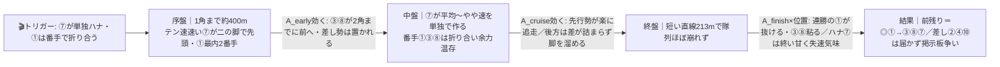
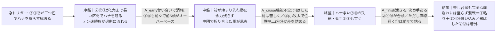
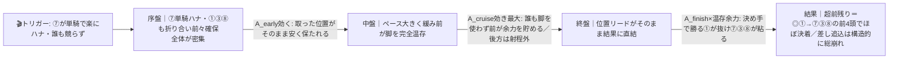

# 🏇 園田5R 敏馬(みぬめ)7ハロンC2一4歳以上（2026-06-10 園田 ダート1400m 稍重）分析

**モデル: scoring-model v5.0（論理ファースト・相変位再帰を因果骨格として使用）** ／ 使用観点: 7観点相当（A+B / C+D / E / F+G+H+K / I の5エージェントに集約） ／ 出走 12頭
> 着順の並びは論理で決め、印で示す（%は出さない）。`score_race.py` は今回未実行（任意のサニティチェック・降格）。
> **確定材料の先取り**: 枠順は確定済み（12頭/8枠制の標準配分）として §2-1/§3 本文に織り込み済み。乗替・回避は分析時点で異常なし。

## 1. サマリ（結論）

- **予想本命 ◎**: **1番 ワイドオルデン**（笹田知）— 園田1400専門×連勝中×先行＝**前残り本線のこのレースで全展開横断の軸**。稍重◎・最内ロスなしで隙が最も小さい。
- **対抗 ◯**: **8番 アスクヴレーヴモア** — ロードカナロアの良血＋園田1400複数勝＋前付け自在。先行有利を最も享受できる脚質で直近5/15に勝鞍。
- **単穴 ▲**: **3番 フレイムフォース** — メイショウボーラー産駒で稍重◎、2角先頭級に押し上げる先行力。8歳高齢が割引。
- **連下 △**: **7番 ノースグロリア**（ハナ最有力＝展開の鍵だが終い甘）／**9番 テーオーパーソナル**（園田1400で最安定の連対・番手）／**2番 クリムゾンレッド**（差しだが小牧太×園田1400勝ち＝ハイで台頭）
- **注意 ×**: **12番 ニネンエフグミ**（先行力・牝4上昇だが大外枠が痛い）／**10番 ナリタセレーノ**（軽量・道悪◎だが差し＋外枠で前残り不利）
- **最有力展開**: **α 平均〜やや速・前残り（本線★★★）**（鍵馬: 7のハナ）。対抗 **β ハイ・差し台頭（★★）**、伏線 **γ スロー超前残り（★）**
- **展開を分ける一点**: **7番がスムーズに単独ハナを取れるか／1番・12番が本気で競りかけるか**（＝先行争い当事者数がペースを決める）。当日は前半の同条件R（1R・2R・4R＝同じダ1400m）で前残り度合いを確認。

> 馬券（何をどう買うか）はユーザー判断。本レポートは展開と着順の予測のみを提示する。

## 0. 当日アップデート・ボード（当日更新枠 ⏱）

> ここには*分析時点で本当に未知のものだけ*を残す（当日馬場・パドック・馬体重・前半参考Rの観察値）。枠・脚質は §2/§3 本文へ織り込み済み。

### 0-1. 当日の参考レース（バイアス採取用）
> 採用優先順位: ダート（必須）＞ 同日・時間帯（直前ほど重い）＞ 距離帯。本5Rは前半Rのため、**直前の同条件1400mを観察してから印を確定**できる絶好の並び。

| R | 発走 | コース | 一致度 | 何を読むか |
|---|------|--------|:-----:|-----------|
| 1R | 10:40 | ダ・右・1400m（C3三） | ★★★ | 内/外どちらが伸びるか・前残りか差し届くか |
| 2R | 11:10 | ダ・右・1400m（C3二） | ★★★ | 同上（直近ほど重い） |
| 4R | 12:10 | ダ・右・1400m（C2二） | ★★★ | **最良**＝同クラス帯・5Rの直前・同距離。前残り/外内の伸びをそのまま流用 |
| 3R | 11:40 | ダ・右・820m（2歳） | ★☆ | 距離違いで参考度低（採用しない） |

→ **観察結果（当日記入）**: ペース層 ___／内外バイアス ___／決まり手（逃先差追）___／伸びる位置 ___
> 4Rで「明確な外差し馬場」と出れば → β（ハイ・差し台頭）を本線へ格上げ、②⑩を引き上げ。「前残り継続」なら → α/γを固めて①③⑧⑦を信頼。

### 0-2. 馬場（当日確定）
| 項目 | 値（当日記入） | 質の読み |
|------|----------------|----------|
| 馬場状態 | 良/稍/重/不 | 稍重→重で前残り増幅／稍重→良で差し台頭の余地拡大 |
| 含水率/時計水準 | ___ | ダ:時計かかる=前・内有利強まる。1R-4Rの勝ち時計で判断 |

### 0-3. パドック・返し馬・馬体重（注目馬）
| 印 馬番 馬名 | 馬体重(増減) | パドック/返し馬（当日記入） | 気配 |
|------------|--------------|------------------------------|:----:|
| ◎ 1 ワイドオルデン | ___ | | ↑/→/↓ |
| ◯ 8 アスクヴレーヴモア | ___ | | ↑/→/↓ |
| ▲ 3 フレイムフォース | ___ | | ↑/→/↓ |

### 0-4. その他当日情報（分析時点で未確定のものだけ）
- 当日発表の乗り替わり／取消・競走除外: ___（分析時点では異常なし）
- 天候推移（朝→発走時）: ___（雨で馬場が湿れば前残り増幅＝①③⑧⑦に追い風）

## 2. 展開予想【成果物1】（STEP4a 展開合成）

> **検証契約**: 脚質別有利不利・隊列・各パターンの段階フローを馬番・符号・可能性ティアで固定。レース後に通過順・上がりから復元したペース層と照合し展開精度を独立採点する。

### 2-1. 脚質分類表（全馬・観点E証拠／確定枠を反映）

| 枠-馬番 | 馬名 | 騎手 | 脚質 | テン速 | 近走通過順 | 想定位置 |
|--------|------|------|------|--------|-----------|----------|
| 1-1 | ワイドオルデン | 笹田知 | 逃・先（自在） | 速 | 1-1-1 / 2-2-2 | ハナ〜2番手（最内ロスなし） |
| 6-7 | ノースグロリア | 佐々世 | 逃・先（ハナ主張最右翼） | 速 | 1-1-2 / 1-1-1 | **ハナ最有力** |
| 8-12 | ニネンエフグミ | 下原理 | 自在（逃げ切り実績） | 速 | 1-1-1 / 3-2-2 | 1〜3番手（大外から主張可） |
| 3-3 | フレイムフォース | 井上幹 | 先・好位（2角先頭級） | やや速 | 3-1-1 / 4-1-1 | 2〜4番手 |
| 6-8 | アスクヴレーヴモア | 杉浦健 | 先〜差し自在 | やや速 | 1-1-1 / 2-2-2 | 1〜4番手 |
| 7-9 | テーオーパーソナル | 新庄海 | 先〜差し（終い甘） | やや速 | 2-2-2 / 5-1-1 | 2〜5番手 |
| 2-2 | クリムゾンレッド | 小牧太 | 差し・追込 | 遅 | 7-7-8-9 | 後方7〜9番手 |
| 4-4 | エコロアテナ | 大山真 | 差し・追込 | やや遅 | 10-10-9 | 中後方7〜10番手 |
| 5-5 | トモジャイブ | 田野豊 | 差し・追込 | 遅 | 6-5-6 / 10-10-7 | 後方6〜10番手 |
| 7-10 | ナリタセレーノ | 小谷哲 | 差し | 遅 | 5-5-5 / 6-6-6 | 中後方5〜7番手 |
| 5-6 | ジェッティー | 小谷周 | 追込一辺倒 | 遅 | 8-7-5 / 7-9-6 | 最後方8〜10番手 |
| 8-11 | ニシノオールマイト | 山本太 | 脚質ムラ（中長距離帰り） | 不安定 | 12-12-12 / 8-9-9 | 番手〜中団（読み難） |

> **コース形態（重要・複数ソースで訂正）**: 園田1400mは「4角付近ポケット発走→一度ゴール前を通過→1角へ。スタート〜最初のコーナーまで約350〜400mと長い／最後の直線は約213mと短い」。
> ＝1角まで長いので**枠の優劣は脚質ほど明瞭でなく外枠でも先行争いに加われる**が、直線が短く**逃げ・先行・前残りが圧倒的有利／差し追込は届きにくい**（出典の馬券絡み率 逃げ52〜61%>先行33〜40%>差し15〜21%>追込6〜11%）。稍重で時計かかり前残り増幅方向。

### 2-2. 展開パターン（複数・可能性ティア）

| id | パターン名 | 可能性 | 発動トリガー | 有利脚質（符号） | 浮上馬 | 沈む馬 |
|----|-----------|:-----:|--------------|------------------|--------|--------|
| α | 平均〜やや速・前残り | 本線★★★ | ⑦が単独ハナ＋①が無理せず番手、⑫は外から控える（ハナ争い2頭以内） | 逃+2 先+1 差-1 追-2 | 1 7 3 8 | 2 6 11 |
| β | ハイ・先行争い激化→差し台頭 | 対抗★★ | ⑦①⑫が三つ巴でハナを譲らず前半締まる／③⑧も前々を主張 | 逃-1 先0 差+2 追+1 | 2 10 4 1 | 7 12 3 |
| γ | スロー・超前残り | 伏線★ | ⑦が楽に単騎ハナ、誰も競らず前半大きく緩む | 逃+2 先+2 差-2 追-2 | 1 7 3 8 | 2 4 10 |

> 可能性ティア = 本線★★★ / 対抗★★ / 伏線★（%は出さない）。**前残り系（α＋γ）が支配的**＝この構造が並びの土台。
> `有利脚質（符号）`と`浮上馬/沈む馬`が展開検証の正本。

#### 各パターンの段階フロー（序盤→能力→中盤→能力→終盤→能力→結果）

**α 平均〜やや速・前残り（本線★★★）**

> 1行要約: **⑦が単独ハナで平均〜やや速 → 番手の①③⑧が余力温存 → 短い直線で前が止まらず、最内×先行×連勝の①が抜けて先行勢で決着。ハナの⑦は終い甘く2〜4着。**

**β ハイ・先行争い激化→差し台頭（対抗★★）**

> 1行要約: **⑦①⑫が競ってハイ → 前が中盤で苦しくなり → 決め手のある②④⑩が差して台頭。ただし直線が短く前崩れは限定的で、消耗を抑えた①は残る。**

**γ スロー・超前残り（伏線★）**

> 1行要約: **誰も競らず超スロー → 前の先行勢が脚を完全温存 → 短い直線で位置がそのまま結果、①が抜けて前4頭（①⑦③⑧）で決まる。差しは出番なし。**

- **隊列（最有力α）**: 序盤先頭 `⑦①③` → 最終コーナー前方 `⑦①③⑧` ＋好位 `⑨⑫`
- **馬場バイアス**: 前・内有利（前残り強め）。ただし1角まで長く外枠でも先行可＝枠より脚質。当日 §0-1（1R/2R/4R）で上書き前提。
- **反証条件**: ①と⑫が⑦のハナに本気で競りかければ → **β を本線★★★へ格上げ・α を対抗へ**（②④⑩を引き上げ）。⑦が単騎で楽逃げ・誰も主張しなければ → **γ を本線へ格上げ・前4頭固定**。①が自らハナを取り切れば α の前残りが一段強化され①の評価が頭一つ抜ける。

### 2-3. 当日修正（あれば）
> STEP6 で当日情報（前半参考R・馬場・パドック）を受けた場合のみ記入。現時点は分析値。

## （展開→着順の伝達）
最有力の **α（前残り）＋伏線 γ（超前残り）で前残り系が支配的（合算で本線級）**。この段階フローでは「序盤で前を取れる先行勢が中盤で余力を温存→短い直線で位置がそのまま結果」になるため、**先行力＋稍重◎＋連勝の①が全展開横断で最上位**、先行有利を享受する③⑧⑦⑨が続く。差し②④⑩はβ（対抗）でのみ浮上＝展開待ち。これがA（展開的中×並び）/B（展開外し）仕分けの起点。

## 3. 着順予想表【成果物2】（メイン出力・表が主役）

> **検証契約**: 並び（印＋行順）＋各馬の展開感度・好材料・懸念点を固定。レース後に実着順と照合し、(a)並びの順位相関、(b)実現パターンの段階フローと展開感度の的中、を別個採点。**%は出さない**。

| 印 | 枠-馬番 | 馬名 | 騎手(乗替) | 展開感度 | 好材料 | 懸念点 |
|----|--------|------|-----------|---------|--------|--------|
| ◎ | 1-1 | ワイドオルデン | 笹田知(継続) | α/γ(前残り)で展開ベスト・fit最大／βハイでも最内で消耗を抑え粘れる＝**全展開横断の軸** | ・[B]園田1400で連対量産＋前走1着で連勝中＝本クラス随一の充実度 ・[D]稍重2勝＋不良2着で道悪◎、父パイロ＝NAR短ダ向きで本日条件にハマる ・[E]通過1-1/2-2の先行＋最内ロスなし＝前残り本線で位置を最安で確保 | ・[I]連勝で斤量56.0は牝馬やや重め・使い詰めの疲労は未確認 ・[B]2着癖＝詰めの甘さがあり、超スローの瞬発戦だと差し返される余地 |
| ◯ | 6-8 | アスクヴレーヴモア | 杉浦健(継続) | α/γ(前残り)で先行有利を最も享受＝浮上／βハイは前々で消耗し甘くなる | ・[C]父ロードカナロア×母父キングカメハメハの超良血でスピード/パワー兼備 ・[B]5/15園田C2-1400を1着・2/27姫路も1着＝直近勝鞍で勢い ・[D]通過1-1-1/2-2-2の典型先行＋重1着で稍重◎＝展開最も向く脚質 | ・[I]着順1-4-4-2-4と不安定なムラ駆け・前走5着凡走 ・[B]C2二からの相手強化で一枚足りない日もある |
| ▲ | 3-3 | フレイムフォース | 井上幹(継続) | α/γ(前残り)で2角先頭級に押し上げ粘る／βハイは番手で甘くなり沈む | ・[C]父メイショウボーラー＝NAR短ダ優良で道悪無難、稍重1着(4/28)＋稍重2着(5/20)＝稍重◎ ・[E]通過3-1-1/4-1-1で2角までに前を取れる先行力＝前残りで武器 ・[D]園田1400を主戦場とする巧者で前走2着 | ・[I]牡8の高齢でタフな流れだと終い甘さ・反動が出やすい ・[A]主戦場C2二からの相手強化でC2一は半枚劣る可能性 |
| △ | 6-7 | ノースグロリア | 佐々世(継続) | **展開の鍵**＝ハナ最有力。α/γ(前残り)で粘るが終い甘く2〜4着の地力／βハイなら飛ばして失速し沈む | ・[E]直近1-1-2/1-1-1でテン速速くハナ主張最右翼＝前残り本線で序盤の権利を取る ・[D]園田1400に1勝(2-1-1)・道悪でも前で粘る | ・[B]前走6着・通算1勝で勝ち切り力が限定的、終い甘く差される ・[C]父サトノダイヤモンド＝本来中長距離寄りで短ダの決め手・スピードに疑問 |
| △ | 7-9 | テーオーパーソナル | 新庄海(継続) | γ(超前残り)で番手有利＝浮上／βハイは番手から沈む。前残り本線αでは好位で食い込み余地 | ・[D]園田1400専門で近10走1勝2着4回＝当舞台で最も安定した連対、父パイロで道悪無難 ・[B]4/21園田C3を1着・5/14園田特選C2で2着の上昇カーブ | ・[B]前走6着で位置を下げ凡走＝下降気味、同条件C2一で未結果 ・[I]情報薄く脚質確証が弱い・終い甘く後退するパターンあり |
| △ | 2-2 | クリムゾンレッド | 小牧太(継続) | **βハイ(差し台頭)で最強**＝per_horse_fit+2／α/γ(前残り)では後方から届かず沈む＝展開依存度が最も高い | ・[K]**小牧太**＝2025兵庫リーディング229勝の当地トップジョッキー、出方で位置を押し上げる人的アドバンテージ ・[B]2走前5/13に園田C2-1400を1着(上がり39.8)＝決め手は本クラス上位 | ・[I]前走10着・着差1.9秒の大敗＝勝った直後の急反動・下降サイン ・[E]通過7-8-9の後方差しで前残り馬場は構造的に展開待ち |
| × | 8-12 | ニネンエフグミ | 下原理(継続) | 先行力はあるがα/γで大外枠ロスが響き位置が一列下がる／βハイは飛ばして共倒れ側 | ・[B]5/22園田C2-1230を1着・12/10園田1400も1着(1-1-1逃げ切り)＝勝ち切れる ・[D]通過3-2-2/1-1-1の先行逃げ型・牝4で上昇余地 | ・[I]**最外12番**＝小回り園田で1角まで外々を回らされ最も不利な枠 ・[D]直近勝利は1230で1400延長(過去12/31は8着)に持続力不安 |
| × | 7-10 | ナリタセレーノ | 小谷哲(継続) | βハイ(差し台頭)でのみ浮上／α/γ(前残り)では差し＋外枠で届かず沈む | ・[D]父サンダースノー×母父ディープで道悪×決め手の下地・重2着/不良3着＝道悪◎ ・[G]牝5・54.0最軽量で終盤の伸びに有利 | ・[E]通過5-5-5の中団差しで前残り園田は展開依存 ・[I]園田近走7着6着6着で勝ち切れず・外枠10で外を回らされる |
| − | 5-5 | トモジャイブ | 田野豊(継続) | βハイで差しが向くが、α/γ(前残り)では後方差しで沈む | ・[D]5/7園田1400で1:31.7の好時計・重1着で湿りタフ◎ | ・[E]通過6-5-6/10-10-7の後方差しで前残りは逆風・C2二から相手強化 |
| − | 4-4 | エコロアテナ | 大山真(継続) | 前残り全般で後方差しが届かず沈む。βハイでのみ拾える | ・[D]園田1400で3着複数・道悪こなす地力 | ・[I]通算0-1-3-9で底見え・前走10着の連敗下降・後方ばかりで先行有利の園田は逆風 |
| − | 5-6 | ジェッティー | 小谷周(継続) | 全パターンで追込一辺倒＝前残り園田の短い直線で構造的に最不利 | ・[B]前走3着で掲示板は確保・実戦慣れ | ・[I]牡9＝出走馬中最高齢で衰え・終い甘化リスク最大・本年0勝／同名別馬疑いで近走確信度低 |
| − | 8-11 | ニシノオールマイト | 山本太(継続) | 全パターンで割引＝園田道悪総崩れ＋1400離れ＋外枠で展開向かず | ・[B]C1/B2を経験＝C2一は相対クラス緩和（地力の絶対値は低くない） | ・[I]**最大の地雷**＝3/26 C1特別を12-12-12の最後方12着大敗・近走8〜12着の下降／[D]園田稍重1400で6着・重1400で12着＝園田道悪総崩れ |

- **印**: ◎本命／◯対抗／▲単穴／△連下／×注意／−無印。並びと印で強弱を表す（%は出さない）。
- **展開感度**（核）: §2-2の名前付きパターンを参照し「どの展開で浮上/沈むか」を因果で。①は展開非感受的な軸、②⑩は β（ハイ・差し台頭）依存、⑦は前残りでハナを作るが終い甘。

## 4. 観点別ハイライト（補足・横断）

- **A 指数/B 近走**: ①が連勝中で本クラス随一の充実度＝頭一つ抜けた存在。勝ち上がり直後の上昇組⑧⑨⑫、近走勝鞍ある③が続く。割引は前走大敗の②（10着）、底見えの④（0-1-3-9）、格下げ帰り凡走の⑪。地方C2一は地力差が小さく、コース適性と先行力が着差を生む。
- **C 血統/D 適性**: 園田ダ1400稍重は**先行・前残り**が支配的。稍重実績＋先行力で①③⑧が好相性、道悪◎の⑤⑩は脚質（差し）が逆風。最割引は園田道悪総崩れの⑪。
- **E 展開証拠＋STEP4a 合成**（詳細は §2）: ハナ最有力＝⑦、競合に①⑫。前残り系（α＋γ）が本線級。**コース形態は当初記述を訂正**（1角まで長い・直線短い・脚質バイアスは前有利不変）。当日の前残り度合いは前半R（1R/2R/4R）で確定。
- **F/G/H 状態/K 騎手**: 定量戦で斤量差は性別差のみ＝着差要因小。**K最重要＝②に小牧太**（兵庫トップジョッキー）で差し馬を前めに運べる可能性＝βで台頭の後押し。H（当日気配・パドック・陣営コメント）は地方C2級で**ほぼ取得できず**＝確信度低、ユーザー補強推奨。
- **I リスク**: 最大地雷⑪（最後方大敗×格上挑戦帰り×外枠）。外枠⑩⑫は小回り園田で構造的不利。高齢③(8歳)⑥(9歳)は稍重消耗の割引。減点ほぼ無しは①のみ。

## 5. データの確かさ・補強のお願い

- **確信度が低かった観点**: H（当日気配・パドック・陣営コメント）は地方C2級でweb取得できず未反映。F（レース間隔の実日付）は中心4頭のみ確認。
- **データ注記（要注意）**: ①ワイドオルデンは公開DBが1月までで連勝内容は出走表で補完。⑥ジェッティー・⑦ノースグロリアはnetkeibaに同名異馬（盛岡）混入の疑いで近走詳細の確信度低。③⑥の母父はoddspark誤表示（タイキシャトル）→netkeiba英DBでサンデーサイレンスと訂正。⑩は出走表とnetkeibaで前走着順が不一致。調査で混入した一部騎手の誤名は出走表の騎手名で上書き済み。
- **ユーザー補強推奨**: 当日パドック評価・確定馬体重、**前半1R/2R/4R（同じダ1400m）の前残り/外内バイアス**を頂ければ §2-3/§3 を当日修正します（URL or 貼り付け）。

## 6. 免責
予測であり的中を保証しない。賭けは自己責任で、馬券選択・実ベットは人間判断。市場（オッズ・人気）は一切参照していない。
