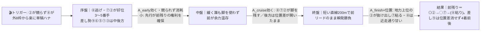
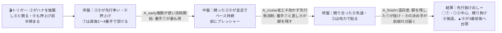
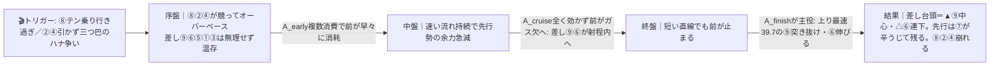

# 🏇 園田6R（2026/06/10 園田 ダート右1400m）分析

**モデル: scoring-model v5.0（論理ファースト・相変位再帰を因果骨格として使用）** ／ 使用観点: 5観点（AB/CD/E/FGHK/I）／ 出走 9頭
> 着順の並びは論理で決め、印で示す（%は出さない）。`score_race.py` の並び（②⑦⑨⑧…）は論理の背骨と上位4頭が一致＝整合チェック済み。
> **確定材料の先取り**: 枠順確定・乗替（⑧テン乗り山本咲／④▲南部楓へ弱化）は §2-1/§3 本文に織り込み済み。当日の馬場・パドック・参考Rのみ §0 に残す。

## 1. サマリ（結論）

- **予想本命 ◎**: **2-2 ラロワイヤル** — 園田右1400で2-6-4-25＝舞台実績No.1かつC2一勝ちの地力最上位。先行〜自在で前残り本線にどハマり、長尾翼継続。
- **対抗 ◯**: **7-7 アラモアナ** — 一貫先行（3〜5番手）で隊列のベスト位置、4歳上昇＋名手川原。全4パターンでプラスの“展開不問”枠。
- **単穴 ▲**: **8-9 ステラマリーナ** — 上り最速級39.7＝決め手の絶対値トップ。前崩れ（γ）なら主役、本線でも4着前後まで詰める保険。
- **連下 △**: **8-8 ミトロージア**（唯一の逃げ＝前残り構造で粘り目／ただしテン乗り）、**6-6 クライオブジアース**（上り安定・上位騎手継続・近走上向き）。
- **注意 ×**: **4-4 エルミラージュ**（軽量▲54＋自在で前残り一発の紐目だが近走総崩れ＝低信頼）。
- **最有力展開**: **α ⑧単騎スロー・前残り（本線★★★）**（鍵馬: ⑧⑦②）。対抗 **β ②競りやや速・好位抜け出し（★★）**、伏線 **γ 前崩れハイ・差し台頭（★）／δ 超スロー瞬発（★）**
- **展開を分ける一点**: **⑧（テン乗り山本咲）が外8枠から楽に単騎ハナを取れるか／②が前走同様ハナを競りに行くか。** ②が競れば締まってβ・γ寄り＝差し⑨⑥が浮上。⑧単騎ならα前残りで先行②⑦が抜ける。

> 馬券（何をどう買うか）はユーザー判断。本レポートは展開と着順の予測のみを提示する。

## 0. 当日アップデート・ボード（当日更新枠 ⏱）

> ここには*分析時点で本当に未知のものだけ*を残す（枠・乗替は §2/§3 へ反映済み）。

### 0-1. 当日の参考レース（バイアス採取用）
> **採用優先順位**: ダート（必須）＞ 同日・直前ほど重い ＞ 右回り ＞ 距離帯（1400近辺）。園田は当日カードのダ1400前後の前半Rで内外・前後を採る。

| R | 発走 | コース | 一致度 | 何を読むか |
|---|------|--------|:-----:|-----------|
| 当日特定（園田ダ1400/1230のC級前半R） | ― | 園田ダ右 | ★★★ | 逃げ残るか／差し届くか・内外どちらが伸びるか |
| 当日特定（園田ダ右の他距離前半R） | ― | 園田ダ右 | ★★☆ | 決まり手と伸び位置のみ流用（距離違いは割引） |

→ **観察結果（当日記入）**: ペース層 ___／内外バイアス ___／決まり手（逃先差追）___／伸びる位置 ___
> この行が埋まったら §2-3 当日修正へ。⑧が楽に単騎逃げなら α 固定、②⑧が競れば β/γ へ格上げ。

### 0-2. 馬場（当日確定）
| 項目 | 値（当日記入） | 質の読み |
|------|----------------|----------|
| 馬場状態 | 良/稍/重/不 | 湿れば前・内有利が一層強まる（α前残りへ傾斜） |
| 含水率/感触 | ___ | ダは乾くと時計かかり差し脚鈍化、湿ると前残り加速 |

> **道悪化したら**: ⑧（重で逃げ好走実績）・①（父トランセンド道悪○）・⑥（父ダンカーク重巧者）が相対浮上、⑤（父ハービンジャー不良大幅減）は割引拡大。

### 0-3. パドック・馬体重（注目馬・当日記入）
| 印 枠-馬番 馬名 | 馬体重(増減・前走比) | パドック/返し馬 | 気配 |
|------------|--------------|------------------|:----:|
| ◎ 2-2 ラロワイヤル | 521(+2想定) | | ↑/→/↓ |
| ◯ 7-7 アラモアナ | 486(+6) ←太め残りか成長か要確認 | | ↑/→/↓ |
| ▲ 8-9 ステラマリーナ | 467(+3) ←長期減後の下げ止まり確認 | | ↑/→/↓ |
| △ 8-8 ミトロージア | 445(+1) ←テン乗りの行き脚を返し馬で確認 | | ↑/→/↓ |

### 0-4. その他当日情報（分析時点で未確定のものだけ）
- 当日発表の乗替／騎乗変更: ___（⑧山本咲テン乗り・④▲南部楓は確定済みとして §3 反映）
- 当日の取消・除外: ___
- 天候推移（朝→発走）: ___

## 2. 展開予想【成果物1】（STEP4a 展開合成）

> **検証契約**: 脚質別有利不利・隊列・各パターンの段階フローを馬番・符号・可能性ティアで固定。レース後に復元ペース層と照合し展開精度を独立採点する。

### 2-1. 脚質分類表（全馬・観点E証拠／確定枠を反映）

| 枠-馬番 | 馬名 | 騎手 | 脚質 | テン速 | 近走1角(位置/頭数) | 想定位置 |
|--------|------|------|------|--------|--------------------|----------|
| 8-8 | ミトロージア | 山本咲(テン乗) | **逃** | 速 | 1-1-1（近2走ハナ） | **単騎ハナ最右翼**（8枠+377m長区間で楽に主導権） |
| 2-2 | ラロワイヤル | 長尾翼(継続) | **先〜自在** | 速(その気なら) | 3（前走ハナ強襲2着） | 1〜3番手（ハナを競りうる可変軸） |
| 7-7 | アラモアナ | 川原正(継続) | **先** | 速 | 5-3-3（一貫前々） | 2〜4番手（争いの直後で受ける） |
| 4-4 | エルミラージュ | 南部楓(▲弱化) | 先〜自在 | やや速(▲54軽量) | 6（5走前2-2-1-3逃げ実績） | 3〜5番手（押上げ可変） |
| 6-6 | クライオブジアース | 土方颯(継続) | 差 | 遅め | 6-7 | 中後方5〜7番手 |
| 9-9 | ステラマリーナ | 笹田知(継続) | 差 | 遅 | 6-5（上り最速39.7） | 中後方5〜7番手（大外発走でロス） |
| 1-1 | ガラデレオン | 新庄海(継続) | 差 | 遅め | 5-6 | 後方6〜8番手（最内・包まれ懸念） |
| 5-5 | ピエスダルジャン | 竹村達(継続) | 差〜追 | 遅 | 8 | 後方6〜9番手 |
| 3-3 | ワンダーアウメント | 井上幹(継続) | **追** | 遅 | 6-9（後方一辺倒） | 最後方7〜9番手 |

> 園田ダ右1400=小回り平坦ワンターン。スタート〜1角まで約377mと長く、最後の直線は約200m。**脚質バイアス（実数）: 逃げ複57%・先行複37%・差し複20%・追込複10%＝逃げ先行が構造的に圧倒的有利**。8枠データ最良・1枠最低。

### 2-2. 展開パターン（複数・可能性ティア）

| id | パターン名 | 可能性 | 発動トリガー | 有利脚質（符号） | 浮上馬 | 沈む馬 |
|----|-----------|:-----:|--------------|------------------|--------|--------|
| **α** | ⑧単騎スロー・前残り | **本線★★★** | ②が無理に競らず⑧が外8枠から楽に単騎ハナ・1角先頭で誰も競らない | 逃+1 先+2 差-1 追-2 | 2 7 (8) | 5 1 3 9(届かず) |
| **β** | ②競りやや速・好位抜け出し | **対抗★★** | ②が前走同様テン速でハナ強襲し⑧と競る／④も▲54で押上げ・前半締まる | 逃0 先+1 差0 追-1 | 7 2 9 | 8 1 3 5 |
| **γ** | 前崩れハイ・差し台頭 | **伏線★** | ⑧テン乗りが行き過ぎ or ②④が引かず三つ巴・前半オーバーペース | 逃-2 先-1 差+2 追+1 | 9 6 7 | 8 2 4 |
| **δ** | 総控え超スロー・瞬発戦 | **伏線★** | ⑧が行き脚付かず誰もハナを取りに行かない・緩み切った瞬発勝負 | 逃+1 先+1 差0 追-1 | 2 7 9 | 8 1 3 5 |

> 可能性ティア = 本線★★★ / 対抗★★ / 伏線★（%は使わない）。`有利脚質（符号）`と`浮上馬/沈む馬`が展開検証の正本。
> **α＋β＝先行有利が合計で多数**。前崩れ差し決着（γ）は約15%相当の伏線で、ここだけ⑨が主役に化ける。

#### 各パターンの段階フロー（序盤→能力→中盤→能力→終盤→能力→結果）

**α ⑧単騎スロー・前残り（本線★★★）**

> 1行要約: **⑧が楽に単騎逃げで超緩み → 前が余力満タン → 直線で地力最上位の②が抜け、先行⑦が粘る。上り最速の⑨も位置差を消し切れず差し損なう。**

**β ②競りやや速・好位抜け出し（対抗★★）**

> 1行要約: **②が競りに行って前半締まる → 番手で脚を温存した⑦が最も得をして抜け、②は地力で粘り、差し⑨が前崩れ分だけ3着圏に届く。**

**γ 前崩れハイ・差し台頭（伏線★）**

> 1行要約: **三つ巴のハナ争いでハイ → 前が中盤でガス欠 → 直線が短くても前が止まり、脚を残した⑨が突き抜け⑥が連下。先行は⑦だけ残る。**

- **δ 総控え超スロー・瞬発戦（伏線★）**: 誰も行かず超スロー凝縮 → 前にいた②⑦が位置の利で抜け、馬群凝縮分だけ⑨が3着前後へ食い込む。⑧は控えて主導権を失い凡走。**結果≒αの前残り型**（前が一層止まりにくい）。
- **隊列（最有力α）**: 序盤先頭 `⑧⑦②` → 最終コーナー前方 `⑧⑦②④` ＋差し構え `⑨⑥`
- **馬場バイアス**: 前・内有利（直線200mで前残り）。湿れば一層前残り（α強化）。当日 §0-1 で上書き前提。
- **反証条件**: **⑧の出方が全分岐の軸。**⑧楽逃げ単騎→α本線確定（前残り）。②がテン速でハナ強襲して競る→β格上げ（番手⑦・差し⑨浮上）。三つ巴でオーバーペース→γ本線へ（⑨差し台頭）。⑧不発で総控え→δ（前残り瞬発）。

### 2-3. 当日修正（あれば）
> STEP6 で当日情報を受けた場合のみ。例: 「参考Rで外差し馬場＋②⑧が競る → γ を本線★★★へ格上げ、⑨を◎へ再評価」。素の能力読み（好材料/懸念点）は再調査不要。

## （展開→着順の伝達）
最有力 **α前残りの段階フロー**では、序盤2〜3番手の②⑦が中盤で脚を温存し、短い直線で**地力最上位の②が抜け出し→先行の⑦が粘る**。上り最速の⑨は位置差を消せず4着前後＝**◎②／◯⑦の先行2頭が着順の芯**。前が競って崩れる伏線γ（約15%相当）に振れた時だけ**▲⑨が主役**へ反転する＝⑨は「展開保険」の単穴。これが A/B/C 仕分けの起点。

## 3. 着順予想表【成果物2】（メイン出力・表が主役）

> **検証契約**: 並び（印＋行順）＋各馬の展開感度・好材料・懸念点を固定。レース後に実着順と照合し、(a)並びの順位相関＝総合、(b)実現パターンの段階フロー＆展開感度の的中＝純粋な能力読み、を別個採点。**%は出さない**。

| 印 | 枠-馬番 | 馬名 | 騎手(乗替) | 展開感度 | 好材料 | 懸念点 |
|----|--------|------|-----------|---------|--------|--------|
| ◎ | 2-2 | ラロワイヤル | 長尾翼(継続) | α本線で抜け出し本線・δ瞬発も最上位／γ(競ってハイ)だけ消耗で割引 | ・[B/A]地方4勝・最高C2一勝ち＝**現級C3一は地力最上位**、格下げ感のある相手 ・[D]園田右1400で2-6-4-25＝**舞台実績9頭中No.1**・持時計1:31.2も上位 ・[E]先行〜自在（前走ハナ強襲0.3差2着）で前残り本線にどハマり ・[K/G]長尾翼6走連続継続＋馬体519〜523で安定 | ・[I]牡8高齢で勝ち切りは減少（近走2〜3着止まりの詰め甘） ・[E]γで⑧と競り合うと消耗し詰めが甘くなる ・[H]追い切り・当日気配はweb取得不可（確信度低） |
| ◯ | 7-7 | アラモアナ | 川原正(継続) | **全4パターンでプラスの“展開不問”**。α/βで番手抜け、γでも先行残り、δ前残り | ・[E]一貫して前々3〜5番手＝**先行有利の園田小回りに最も噛み合う脚質**・隊列ベスト位置 ・[B/G]4歳と最若・馬体+6kgで上昇余地、C2経験済みで現級は通用余地 ・[C]父ミッキーアイル×母父キンシャサノキセキ＝砂短距離適性上位（道悪なら一段強化） ・[K]名手川原正一が継続＝好位戦の出方安定 | ・[I/B]通算0勝（13戦）＝**勝ち切りの決め手が未証明**・詰め甘 ・[C]父系はダ1400“良馬場”だと複勝率二桁台＝速い良決着なら割引 ・[G]+6kgが成長か太め残りかパドック未確認 |
| ▲ | 8-9 | ステラマリーナ | 笹田知(継続) | **γ(前崩れハイ)で主役**・β/δで3着前後／α本線は前止まらず4着前後に届かず | ・[A/B]上り最速級39.7を再三＝**終盤の決め手の絶対値トップ**（A_finish最強） ・[D]園田右1400で2-0-4-19＝勝ち鞍あり・母父キンカメで砂万能 ・[K/G]笹田(兵庫9位好調)継続・長期減後+3で下げ止まり・牝55軽量 | ・[E]中団差しで**前が止まらない流れだと届かない**（本線αで割引） ・[D]父エピファネイアはダ短距離苦手＝走るのは母系と個体力 ・[I]差し一手で自分から動けず展開依存・大外発走でロス |
| △ | 8-8 | ミトロージア | 山本咲(テン乗) | **α本線で楽逃げ粘り目**（唯一の逃げ＝前残り構造の恩恵）／β・γで競られ崩れる | ・[E]**このメンバー唯一の明確な逃げ馬**・近2走ハナ（1-1-1）、8枠+377mで楽に主導権 ・[D/C]右1400で0-3-6-8（17走9回馬券圏）・近2走とも重で逃げ好走＝道悪なら前残り強化 ・[G]牝55軽量で先行の押し切りに利 | ・[K]**唯一の逃げ馬がテン乗り山本咲**＝行き脚・ペース判断の意思疎通に不安（先行争いが鍵で重い割引） ・[B/I]27戦0勝・前走1-1-1-3で逃げて失速5着＝粘り切れない天井 ・[B]ペースが上がると非力で先行押し切り不発 |
| △ | 6-6 | クライオブジアース | 土方颯(継続) | γ(前崩れ)で連下・β中立／α本線は決め手位置で届きにくい | ・[A/E]上り39.5〜39.9と安定し中団後方から差せる＝**崩れ幅が小さい堅実派** ・[K/G]土方颯(兵庫13位)継続・馬体488(0)で全頭最安定・近走5/13に3着と上向き ・[C]父ダンカーク＝道悪巧者で当日重なら相対浮上 | ・[D]園田右1400で0-0-3-14＝**当該条件で連対なし・勝ち切れない決め手不足** ・[I]77戦2勝の善戦止まり・自分から動けず展開待ち |
| × | 4-4 | エルミラージュ | 南部楓(▲弱化) | α前残り極端なら軽量自在で紐目／それ以外は地力不足で圏外（低信頼） | ・[K/E]▲54kgの軽量＋中団〜先行自在＝**前残り本線なら前に取り付ける紐目** ・[D]過去C3一勝ち・園田1400ベスト1:33.1＝本来は通用時計 | ・[B/I]**近5走すべて7〜9着・2.4〜3.7差の総崩れ**＝完全に底見せ（エンジン評価も最下位） ・[K]笹田→▲南部の弱化テン乗り＋馬体じわ減で上向きサイン乏しい |
| 無 | 1-1 | ガラデレオン | 新庄海(継続) | 後方差しで前残り本線は届かず・γでも直線短く間に合いにくい | ・[D]父トランセンド＝地方ダ巧者・道悪○、右1400経験豊富 | ・[I]牡9最高齢・84戦3勝・当距離未勝利＝決め手の絶対値頭打ち |
| 無 | 5-5 | ピエスダルジャン | 竹村達(継続) | 後方一辺倒で展開依存・園田小回りで届きにくい | ・[D]右1400で2勝の経験はあり噛み合えば下限届く | ・[A/C]父ハービンジャー＝ダート二重逆風・近5走総崩れ・最軽量で非力 |
| 無 | 3-3 | ワンダーアウメント | 井上幹(継続) | 最後方一辺倒＝前残り構造で最も届きにくい | ・[D]右1400で2-2-3＝勝ち鞍あり | ・[B/I]直近3走連続10着の明確な下降・後方一気は展開頼み・小柄で消耗戦不利 |

- **印**: ◎本命／◯対抗／▲単穴／△連下／×注意。並びと印だけで強弱を表す（%は出さない）。
- **展開感度**（核）: §2-2 の名前付きパターンを参照し「どの展開で浮上/沈むか」を因果で一言。
- **好材料/懸念点**: 各項 [観点タグ]＋事実＋なぜそう読んだか。タグ＝A指数/B近走/C血統/D適性/E展開/F調教/G馬体ローテ/H気配/K騎手/I リスク。

## 4. 観点別ハイライト（補足・横断）

- **A/B 地力**: ②が頭一つ抜けた地力（4勝・C2一勝ち、現級は格下げ感）。⑦⑨が次位（C2経験・上り最速）。底を見せている④⑤と連続大敗の③は地力で割引。
- **C/D 血統・適性**: 純ダ短距離血統で素直に買えるのは①⑦⑧。芝寄り血統でも**自身の右1400実績が上書き**するのが②（舞台No.1）・⑨（上り最速＋2勝）。⑤（ハービンジャー）はダート二重逆風。
- **E 展開証拠＋STEP4a合成（詳細§2）**: 逃げは⑧単独・先行は②⑦④。**鍵は⑧テン乗りの行き脚と②の可変**。先行有利の構造（逃複57%/先複37%）から α前残り（本線）を主軸に置いた。
- **F/G/H/K 状態**: 加点＝②⑥⑦⑨（継続騎乗＋馬体安定＋近走上向き）。減点＝③（連続大敗）④①⑤⑧（弱化乗替/細化/高齢/テン乗り）。**当日気配・追い切り・関係者コメントは地方C3ゆえ全頭web取得不可＝確信度低**。
- **I リスク**: 致命的な脚部不安・回避は検出されず。最重い割引は④（総崩れ）⑦①（未勝利天井/高齢）。⑨が最も割引が軽い。

## 5. データの確かさ・補強のお願い

- **確信度が低かった観点**: H（当日気配・パドック・返し馬・関係者コメント）は地方C3のため**全頭web取得不可**。F（追い切り時計）も同様に欠損。
- **ユーザー補強推奨**: ①当日の園田ダ前半Rの**バイアス**（内外・前残りか差し届くか）、②注目馬のパドック/返し馬・確定馬体重、③⑧山本咲の返し馬での行き脚。→ 受領後 §2-3 でティア付け替え・並び再評価。
- **欠損・推定箇所**: #3⑥⑨は個別DBページがweb取得不可で出走表seed（通過順）ベース評価＝確信度やや低。馬場状態は当日確定。

## 6. 免責
予測であり的中を保証しない。賭けは自己責任で、馬券選択・実ベットは人間判断。市場（オッズ・人気）は一切参照していない。
