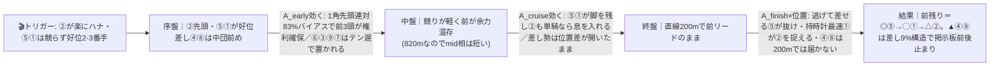
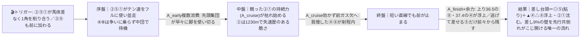
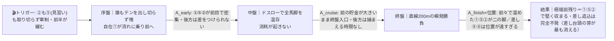

# 🏇 園田7R（2026/06/10 園田 ダート右820m）分析

**モデル: scoring-model v5.0（論理ファースト・相変位再帰を因果骨格として使用）** ／ 使用観点: 5観点（AB/CD/E/FGHK/I）／ 出走 9頭
> 着順の並びは論理で決め、印で示す（%は出さない）。`score_race.py` は今回未実行（任意サニティ）。
> **確定材料の先取り**: 枠順確定・乗替（①前走▲高橋洸→主戦田野復帰／⑧前走廣瀬航→★塩津復帰／③廣瀬航→杉浦）は §2-1/§3 本文に織り込み済み。当日の馬場・パドック・参考Rのみ §0 に残す。
> **STEP4b の論理オーバーライド**: 合成器は「差し台頭(α)」を本線(0.34)に置いたが、web実証の構造バイアス（**差し連対8〜12%／1角先頭連対83%**）＋⑤①が自在で*無理に競る必要がない*点から、**前残り系を本線**へ、差し台頭(α)を**対抗**へ格下げした（理由は §2-2 反証条件・末尾）。

## 1. サマリ（結論）

- **予想本命 ◎**: **5-5 キングバブルズ** — **全パターンで浮上する唯一の軸**。▲53kg軽量 × 820m持時計0:51.3 × 「逃げて差せる」(上り36.9・1230mで1-1-1-1の3着1:21.5)＝先行有利コースの理想形。0勝の詰め甘だけが死角。
- **対抗 ◯**: **1-1 フークホワリエン** — **メンバー唯一の820m勝ち馬**(0:51.1＝最速タイを勝利で計時)＋最内1枠で先手確保。主戦田野(L5位)復帰。前残り本線で②を捉えに行く一番手。
- **単穴 ▲**: **4-4 スマートフレイヤ** — 距820m**連対率100%**(2着0.0差/3着0.1差)＋下原(L4位)。3頭の先行争いが激化(対抗α)した時の**差し台頭No.1＝前崩れ保険の本線**。
- **連下 △**: **2-2 エイシンリール**（純逃げで1角先頭連対83%の権利は最大だが、競られると脆い＝楽逃げδなら粘り競れば沈む諸刃）、**8-9 ニシノガランテ**（上り36.5最速＋★51最軽量＝対抗α一発の筆頭だがムラ）。
- **注意 ×**: **6-6 メヘラーンガル**（1230mでは逃げるが820mは6-6でテン遅＝この距離で前に行けず善戦止まり）。
- **最有力展開**: **本線 締まった先行決着★★★**（鍵馬: ⑤②①）。対抗 **α ②⑤①競り合いオーバーペース・差し台頭★★**、伏線 **δ 超スロー瞬発・極端前残り★**
- **展開を分ける一点**: **②エイシンリールが楽にハナを取れるか／⑤①が本気で競りかけるか。** ②単騎or軽い競り→前残りで⑤①②が決める。3頭が馬体差なく競る→オーバーペースで差し④⑧が台頭し②が沈む。

> 馬券（何をどう買うか）はユーザー判断。本レポートは展開と着順の予測のみを提示する。

## 0. 当日アップデート・ボード（当日更新枠 ⏱）

> ここには*分析時点で本当に未知のものだけ*を残す（枠・乗替は §2/§3 へ反映済み）。

### 0-1. 当日の参考レース（バイアス採取用）
> **採用優先順位**: ダート（必須）＞ 同日・直前ほど重い ＞ 右回り ＞ 距離帯（820/1230近辺）。園田は当日カードのダ820/1230のC級前半Rで内外・前後を採る。

| R | 発走 | コース | 一致度 | 何を読むか |
|---|------|--------|:-----:|-----------|
| 当日特定（園田ダ820の前半C級R） | ― | 園田ダ右820 | ★★★ | 逃げが本当に残るか／競り合いで前崩れが出るか・テン速馬が何番手まで取れるか |
| 当日特定（園田ダ右1230の前半R） | ― | 園田ダ右 | ★★☆ | 決まり手と前残り度のみ流用（距離違いは割引） |

→ **観察結果（当日記入）**: ペース層 ___／内外バイアス ___／決まり手（逃先差追）___／伸びる位置 ___
> この行が埋まったら §2-3 当日修正へ。**前半Rで「競り合っても前が残る」なら本線/伏線(前残り)を固定**、「競ると前が崩れ差しが届く」なら**対抗αを本線★★★へ格上げし④⑧を引き上げる**。

### 0-2. 馬場（当日確定）
| 項目 | 値（当日記入） | 質の読み |
|------|----------------|----------|
| 馬場状態 | 良/稍/重/不（分析時点: 晴・降水0%→乾いた良想定） | 湿れば前・内有利が一層強まり前残り(本線/δ)へ傾斜 |
| 含水率/感触 | ___ | ダは乾くと時計かかり差し脚鈍化、湿ると前残り加速 |

> **道悪化したら**: ①（父ジョーカプチーノ＝ダ重複勝率+19.4%の道悪巧者）・⑧⑥（父ファインニードルは道悪芝で上昇）が相対浮上。ただし良想定では渋りボーナスは不発で各馬の820m自身実績が主証拠。

### 0-3. パドック・馬体重（注目馬・当日記入）
| 印 枠-馬番 馬名 | 馬体重(増減・前走比) | パドック/返し馬 | 気配 |
|------------|--------------|------------------|:----:|
| ◎ 5-5 キングバブルズ | ~450(-3想定) ←▲53の行き脚を返し馬で確認 | | ↑/→/↓ |
| ◯ 1-1 フークホワリエン | ~440(-1) | | ↑/→/↓ |
| ▲ 4-4 スマートフレイヤ | ~461(-4) ←大型461の幅維持か | | ↑/→/↓ |
| △ 8-9 ニシノガランテ | ~416(-9) ←大幅減＝絞れか細りかパドックで要確認 | | ↑/→/↓ |

### 0-4. その他当日情報（分析時点で未確定のものだけ）
- 当日発表の乗替／騎乗変更: ___（①田野復帰・⑧塩津復帰・③杉浦は確定済みとして §3 反映）
- 当日の取消・除外: ___
- 天候推移（朝→発走）: ___（tenki.jp 6/10 晴・降水0%）

## 2. 展開予想【成果物1】（STEP4a 展開合成）

> **検証契約**: 脚質別有利不利・隊列・各パターンの段階フローを馬番・符号・可能性ティアで固定。レース後に復元ペース層と照合し展開精度を独立採点する。

### 2-1. 脚質分類表（全馬・観点E証拠／確定枠を反映）

| 枠-馬番 | 馬名 | 騎手 | 脚質 | テン速 | 近走1角(位置/頭数) | 想定位置 |
|--------|------|------|------|--------|--------------------|----------|
| 2-2 | エイシンリール | 大山真(継続) | **逃** | 速 | 1-1（820mで常時ハナ） | **ハナ主張の筆頭**（純逃げ・1角先頭の権利最大／競られると脆い） |
| 5-5 | キングバブルズ | ▲高橋洸(継続) | **先〜逃** | 速 | 1-1（820m）/1-1-1-1（1230） | ハナ〜2番手（▲53で楽に前々・**逃げて差せる**＝争いの主役だが自滅しにくい） |
| 1-1 | フークホワリエン | 田野豊(乗替/主戦復帰) | **自在** | 中〜速 | 1-1（820m勝ち）/3-3 | ハナ次点〜好位2-3番手（最内1枠で先手も控えも可の可変軸） |
| 4-4 | スマートフレイヤ | 下原理(継続) | **差し** | 中 | 4-1 / 4-3（820mで中団から鋭伸） | 中団前め4-5番手（争いに乗らず差し構え） |
| 8-8 | ニシノガランテ | ★塩津璃(乗替/復帰) | **差し** | 中 | 3-3 / 6-6（上り36.5最速） | 中団5-6番手（★51最軽量・前崩れ待ちの差し） |
| 6-6 | メヘラーンガル | ☆小谷哲(継続) | 先（820mは遅） | 遅 | 6-6（820m）/1-1-1-1（1230） | 中団以降（1230では逃げるが820mはテン遅で前に行けない） |
| 3-3 | イレブンアップ | 杉浦健(乗替) | 先（820m未経験） | 中(不確実) | 1-1-2-2（1230） | 先行試みも820m未知・56kg＝行き切れるか不透明 |
| 8-9 | マスキュラー | ◇佐々世(継続) | 先〜差（820m未経験） | 中(不確実) | 3-3-3-2（1230転入初戦） | 前々試みるが820m未知＝中団濃厚 |
| 7-7 | リンリスゴー | 永井孝(継続) | 追 | 遅 | 7-7-10-9 | 最後方（2戦大敗・820m未経験＝最不向き） |

> 園田ダ右820m＝超短距離スプリント（テン〜1角約313m・直線約200m・コースレコード0:48.1）。**脚質バイアス（web実証・複数ソース）: 逃げ連対74〜84%・先行36〜45%・差し8〜12%・追込0〜2%、1角先頭連対83%＝テン速・位置取り(A_early)が支配的**。枠は中枠優位説/外枠有利説で両論あり確信度中だが、共通項は「**前に行ける脚質が正義**」。

### 2-2. 展開パターン（複数・可能性ティア）

| id | パターン名 | 可能性 | 発動トリガー | 有利脚質（符号） | 浮上馬 | 沈む馬 |
|----|-----------|:-----:|--------------|------------------|--------|--------|
| **本** | 締まった先行決着（②主張・⑤①が好位で受ける） | **本線★★★** | ②が楽にハナ or 軽い競り、⑤①は無理せず2-3番手＝1角先頭が②(or⑤)単独〜軽競り。前が壊れない | 逃+1 先+2 差-1 追-2 | 5 1 2 | 4 8(届かず) 6 3 7 9 |
| **α** | ②⑤①競り合いオーバーペース・差し台頭 | **対抗★★** | ②⑤①が馬体差なく1角を削り合う／③⑨も前に加わり当事者4頭＝先頭集団が早々に脚を使い切る | 逃-1 先0 差+2 追-1 | 5 8 4 | 2 1 |
| **δ** | 超スロー瞬発・極端前残り | **伏線★** | ②も⑤(見習い)も取り切らず牽制し合い前半が緩む＝誰も明確に主張しない塊 | 逃+2 先+1 差-1 追-2 | 1 5 2 | 8 4 6 9 7 3 |

> 可能性ティア = 本線★★★ / 対抗★★ / 伏線★（%は使わない）。`有利脚質（符号）`と`浮上馬/沈む馬`が展開検証の正本。
> **本線＋伏線＝前残り系（合計が多数）**。差し台頭(α)は約1/3相当の対抗で、ここだけ④⑧が主役に化け②が沈む。**⑤は本線・α・δの全てで浮上＝展開不問の軸**。

#### 各パターンの段階フロー（序盤→能力→中盤→能力→終盤→能力→結果）

> **読み方**: トリガーが起点。矢印ラベルが「その相でどの能力が効いて誰が浮く/沈むか」。mermaid は端末では図にならない→各図の直後に1行要約を併記。

**本 締まった先行決着（本線★★★）**

> 1行要約: **②が無理なく前を取り⑤①が好位で受ける → 競りが軽く前が余力を残す → 直線200mで逃げて差せる⑤が抜け、持時計最速①が②を差す。差し④⑧は短い直線で届かない。**

**α ②⑤①競り合いオーバーペース・差し台頭（対抗★★）**

> 1行要約: **②⑤①が本気で競ってオーバーペース → 前が中盤でガス欠 → 直線が短くても前が止まり、脚を残した⑧④が差し込む。逃げて差せる⑤だけ前々から踏ん張る。②①は共倒れ。**

**δ 超スロー瞬発・極端前残り（伏線★）**

> 1行要約: **誰も行かず超スロー → 全馬脚を温存し前の貯金が残る → 直線200mの瞬発戦で前々の①⑤②がそのまま抜け、差し④⑧は位置が遠く届かない。**

- **隊列（最有力＝本線）**: 序盤先頭 `②⑤①` → 最終コーナー前方 `②⑤①④` ＋差し構え `⑧`（⑥③⑨は中団以降・⑦最後方）
- **馬場バイアス**: 前・内有利（直線200m＋1角先頭連対83%で前残り）。乾いた良ならさらに前残り（本線/δ強化）。当日 §0-1 で上書き前提。
- **反証条件**: **②⑤①が実際に競るかが全分岐の核。**①1角通過で②が単騎or軽い競り→**本線確定**（前残り⑤①②）。②②⑤①が馬体差なく削り合う／③⑨が前に加勢して当事者4頭→**α本線へ格上げ**（④⑧台頭・②沈む）。③誰も主張せず緩む→**δ**（極端前残り）。**合成器がαを本線(0.34)に置いたのを本線(前残り系・計0.65相当)へ修正した根拠＝差し連対8〜12%/1角先頭連対83%の構造＋⑤①が自在で“無理に競る必要がない”こと。当日前半Rで「競っても前残り」を確認できれば本線維持、「競ると前崩れ」ならαを本線へ戻す。**

### 2-3. 当日修正（あれば）
> STEP6 で当日情報を受けた場合のみ。例: 「前半参考Rで*競り合うと前が崩れて差しが届く*と判明 → α を本線★★★へ格上げ、▲④・△⑧を引き上げ②を下げる」。素の能力読み（好材料/懸念点）は再調査不要。

## （展開→着順の伝達）
最有力 **本線（締まった先行決着）の段階フロー**では、序盤に前を取った⑤①②が中盤で脚を温存し、短い直線200mで**逃げて差せる⑤が抜け出し→持時計最速タイの①が②を差す**。差しの④⑧は差し連対8〜12%の構造を覆せず掲示板前後＝**◎⑤／◯①が着順の芯**。3頭が本気で競って前崩れになる対抗α（約1/3相当）に振れた時だけ**▲④・△⑧が主役**へ反転し②①が沈む＝④⑧は「前崩れ保険」。**⑤だけは本線・α・δの全相で浮上する展開不問の軸**。これが A/B/C 仕分けの起点。

## 3. 着順予想表【成果物2】（メイン出力・表が主役）

> **検証契約**: 並び（印＋行順）＋各馬の展開感度・好材料・懸念点を固定。レース後に実着順と照合し、(a)並びの順位相関＝総合、(b)実現パターンの段階フロー＆展開感度の的中＝純粋な能力読み、を別個採点。**%は出さない**。

| 印 | 枠-馬番 | 馬名 | 騎手(乗替) | 展開感度 | 好材料 | 懸念点 |
|----|--------|------|-----------|---------|--------|--------|
| ◎ | 5-5 | キングバブルズ | ▲高橋洸(継続) | **本線・α・δの全相で浮上＝展開不問の軸**。前残りなら抜け出し、前崩れαでも逃げて差せて残す | ・[A/D]820m持時計0:51.3＝メンバー2位級、1230mで1-1-1-1の3着(1:21.5・上り39.8)＝**テン速と地力が最上位グループ** ・[B/E]820mで1-1から2着0.1差を2度(うち上り36.9)＝「**逃げて差せる**」型で前残りも前崩れも対応＝相が変わっても崩れにくい ・[K/D]▲53kgの3kg減＝テン速勝負の820mで位置取りに直結、軽量×先行力の相乗で1角先頭連対83%バイアスに合致 | ・[B/I]全0-3-2-3で**未勝利＝2着3度・3着2度の詰め甘**が最大の死角(ここでも僅差負けの再現リスク) ・[K]鞍上高橋洸は兵庫上位20位外の見習い＝軽量利の反面、激しい先行争い・追い比べの経験値はトップ勢に一歩劣る ・[H]当日気配・馬体重はweb取得不可（確信度低） |
| ◯ | 1-1 | フークホワリエン | 田野豊(乗替/主戦復帰) | 本線で②を捉える一番手・δ極端前残りでも前々最上位／α(競ってハイ)だけ巻き込まれ割引 | ・[A/D]**メンバー唯一の820m勝ち馬**(0:51.1＝最速タイを1-1の逃げで勝利・上り36.7)＝距820m1-1-1-2と崩れず超短距離の絶対スピードと再現性が最上位 ・[E]最内1枠＋自在＝先手も好位2-3番手も選べる可変＝先行有利コースで先手を確保しやすい ・[K]前走見習い高橋から**主戦田野(兵庫L5位・複勝36.8%)へ復帰＝強化**、激しい追い比べを任せられる | ・[B/I]全1-2-2-10で着外10回＝崩れる時は二桁着まで落ちる**振れ幅**、勝ち切りは1度のみ ・[E]①②⑤のハナ争い当事者で、3頭競合のオーバーペース(α)に巻き込まれると先行総崩れの被害側 ・[D]核は820m短距離に偏り、1230mでは4-4-5-3の凡走歴 |
| ▲ | 4-4 | スマートフレイヤ | 下原理(継続) | **対抗α(前崩れ)で差し台頭No.1＝前崩れ保険の本線**／本線・δ(前残り)は差し9%構造で掲示板前後に割引 | ・[A/B/D]距820m**0-1-1-0＝連対率100%**(4-1から3着0.1差・上り37.4／4-3から2着0.0差)＝この距離で常に接戦に持ち込む差し脚＝A_finish上位 ・[K]鞍上下原理(兵庫L4位・複勝43.5%)＝**リーディング上位の主力継続**、展開待ちの仕掛けを任せられる ・[G]461kgの大型馬＝パワー要るダート820m・消耗戦で体力の裏付け、全0-2-1-1で4戦中3度馬券圏の堅実 | ・[E]差し脚質×差し連対8〜12%・直線200m＝**前崩れが来ないと地力を出し切れない**(本線・δでは構造的に届かない) ・[B]姫1400で1-1-1-1から11着失速の前歴＝逃げると脆く脚質の出し方次第で振れる ・[B/I]全0-2-1-1で**未勝利**＝あと一歩の詰め甘 |
| △ | 2-2 | エイシンリール | 大山真(継続) | δ(楽逃げ)・本線(軽い競り)なら1角先頭連対83%の権利で粘る／α(本気の競り)では共倒れの当事者で沈む | ・[A/B/E]直近820mで1-1から逃げ切り1着(0:51.5)＝**この距離・この型での勝利実績**＝純逃げのテン速で1角先頭の権利が最大 ・[D]距820m1-1-0-0＝820mでは崩れなし、別の820mも2着0.1差 | ・[B/E]1230mで1-1-1-1から8着失速＝**行き切った後の消耗に脆い**、①⑤と競ると共倒れで自滅(α沈む) ・[A]持時計0:51.5は①⑤⑧の0:51.1〜0:51.3に劣り、勝利は8頭立て＝**絶対スピードと底が一段下** ・[K]大山真(兵庫L11位・複勝22.1%)＝トップ勢との競り・追い比べでやや見劣り |
| △ | 8-8 | ニシノガランテ | ★塩津璃(乗替/復帰) | **対抗α(前崩れ)の一発筆頭**・本線/δ(前残り)は差し届かず／ムラで凡走の振れも大 | ・[A/B]820mで3-3から3着0.1差・0:51.1(**上り36.5＝メンバー最速の決め手**)＝持時計も最速タイで地力の絶対値は高い＝A_finish随一 ・[K/G]★51kg＝**出走馬中最軽量**(▲4kg級)＋416kgの絞れた機動力＝前崩れ時に軽さで差し込む ・[D]距820m0-0-1-1・姫800で3着など短距離連対のベースあり | ・[E]差し脚質×差し9%・直線200m＝**自分で勝ちに行けず前崩れ待ち**(本線・δでは届かない) ・[B/I]全0-0-2-6・前走は820mで6-6→8着の凡走＝**好走と凡走の落差が大きくムラ・再現性が低い** ・[G/K]416kg(-9)の大幅減は絞れか細りか当日確認要、鞍上塩津(L16位・複勝19.4%)は減量利あるも腕一枚落ち |
| × | 6-6 | メヘラーンガル | ☆小谷哲(継続) | 前残りでも820mでは前に行けず善戦止まり・α前崩れでも決め手不足で連下まで | ・[B]1230m・1400mで1-1-1-1の逃げ実績＝先行意欲はあり、☆減量で実質軽め ・[B]全0-0-5-8で3着5回＝大崩れしない下支え | ・[D/E]820mでは6-6で**テン遅7着＝この距離で前に行けない**(距820m0-0-1-3)＝位置取り支配のコースで致命的 ・[B/I]2着すら0回・**0勝の善戦止まり**＝勝ち負けの最後で力が足りない典型 |
| 無 | 3-3 | イレブンアップ | 杉浦健(乗替) | 先行試みも820m未知＝前に行き切れねば差し9%構造に飲まれる | ・[B/K]1230mで1-1-2-2の3着あり先行力自体は持つ、鞍上杉浦(L6位)は上位 | ・[D]**820m近走なし・56kg最重量級**＝超短距離のテン速対応が未知で割引大 ・[B]全1-0-1-9・1230mで10-9-9-8(11着)等の大敗多発＝持続力・底力ともC1で見劣り、持時計0:51.9は最遅級 |
| 無 | 8-9 | マスキュラー | ◇佐々世(継続) | 820m未経験で前々取れるか不透明・α前崩れでも地力不足 | ・[B]園田転入初戦1230mで3-3-3-2の5着＝高知大敗続きからの上昇気配、◇減量＋鞍上佐々木(L8位)は上位 | ・[D]**820m未経験**＝1230mの先行が820mのテン速で出るか不透明、持時計なし ・[B/I]全0-1-2-10・高知1300-1400で11/8/9/8着の連続大敗＝**地力の天井が低く、転入初戦好走の反動リスク**も定石 |
| 無 | 7-7 | リンリスゴー | 永井孝(継続) | 後方一辺倒＝前残り構造で最も届かない・全相で圏外 | ・[C]父モーリス×母父ルーラーシップと血統表は重厚（実戦未反映の薄い材料） | ・[B/D]全0-0-0-2で**2戦とも大敗**(1230m11着7-7-10-9／JRA芝1600m12着)・**820m未経験・持時計なし＝メンバー最弱** ・[C]血統は本来中距離指向で820m最短は方向違い、テン速の証拠ゼロ |

- **印**: ◎本命／◯対抗／▲単穴／△連下／×注意。並びと印だけで強弱を表す（%は出さない）。
- **展開感度**（核）: §2-2 の名前付きパターンを参照し「どの展開で浮上/沈むか」を因果で一言。
- **好材料/懸念点**: 各項 [観点タグ]＋事実＋なぜそう読んだか。タグ＝A指数/B近走/C血統/D適性/E展開/F調教/G馬体ローテ/H気配/K騎手/I リスク。

## 4. 観点別ハイライト（補足・横断）

- **A/B 地力**: ⑤①が抜けた地力（持時計0:51.1〜0:51.3＋僅差好走＋820m実績）。次位④⑧は**時計の質・上り(36.5/37.4)は最上位だが差し型でコース構造が逆風**。②は820m勝ち実績ありも絶対スピード・底が一段下。③⑥⑨⑦は820m不適/未経験/大敗で割引。
- **C/D 血統・適性**: このメンバーは父系の芝ダ傾向より「**自身の820m実績とテン速が遥かに上書き**」する。820m勝ち鞍/連対の①②④⑤⑧が上位、820m未経験/テン遅の③⑥⑦⑨は血統が後押しでも割引。良馬場想定で渋り得意血統(①⑥⑧)の上乗せは消える。
- **E 展開証拠＋STEP4a合成（詳細§2）**: ハナ争い当事者は②⑤①の3頭。**鍵は②が楽に行けるか／3頭が本気で競るか**。web実証の構造（逃げ連対74〜84%・1角先頭連対83%・差し8〜12%）から**前残り系を本線**に置き、差し台頭(α)を対抗(前崩れ保険)とした。⑥は1230mでは逃げるが820mはテン遅で前に行けず先行カウントから除外。
- **F/G/H/K 状態**: 加点＝⑤(▲53軽量×好調持続)①(主戦田野復帰=強化)④(下原L4位継続)。騎手の出方＝②大山・⑤高橋・①田野が先行当事者、差しは④下原・⑧塩津。**当日気配・追い切り・関係者コメントは地方3歳C1ゆえ全頭web取得不可＝確信度低**（騎手近況のみoddspark兵庫リーディングで裏取り）。
- **I リスク**: 致命的な脚部不安・回避は検出されず。最重い割引は⑦(最弱・未経験)⑨(連続大敗・未経験・初戦反動)③(820m薄・56kg)⑥(820mテン遅・0勝)。**差し④⑧は能力割引でなく「良馬場820mの差し9%構造リスク」を減点に織り込み**。⑤①は当該条件の割引が最小。

## 5. データの確かさ・補強のお願い

- **確信度が低かった観点**: H（当日気配・パドック・返し馬・関係者コメント）は地方3歳C1のため**全頭web取得不可**。F（追い切り時計）も同様に欠損。③⑨の820m適性・⑨の初戦反動は推定。
- **ユーザー補強推奨**: ①当日の園田ダ820/1230前半Rの**バイアス**（競り合っても前が残るか／差しが届くか）＝**αを本線へ戻すか本線維持かの最重要分岐**、②注目馬のパドック/返し馬・確定馬体重（特に⑧416kg(-9)・⑤の行き脚・④461の幅）、③②⑤①の出方（誰が単騎ハナを取るか）。→ 受領後 §2-3 でティア付け替え・並び再評価。
- **欠損・推定箇所**: 馬体重は前走比の概算（当日確定）。枠バイアスはソース間で中枠説/外枠説が不一致（確信度中・両論併記）。

## 6. 免責
予測であり的中を保証しない。賭けは自己責任で、馬券選択・実ベットは人間判断。市場（オッズ・人気）は一切参照していない。
