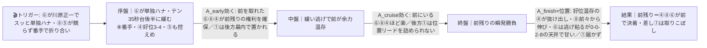

# 🏇 園田9R 3歳特別（2026/06/10 園田 ダート右1230m・馬場当日確定）分析

**モデル: scoring-model v5.0（論理ファースト・相変位再帰を因果骨格として使用）** ／ 使用観点: 5観点（AB/CD/E/FGHK/I）＋STEP4a展開合成 ／ 出走 9頭
> 着順の並びは論理で決め、印で示す（%は出さない）。距離は各馬の「距」成績で1230mと確定（同日10Rも同コース）。
> **確定材料の先取り**: 枠順・乗替は確定済みのため §2-1/§3 本文へ織り込み済み（⑥は竹村達→**川原正一へ強化乗替**、⑨は下原理→**小牧太へ復帰**）。

## 1. サマリ（結論）

- **予想本命 ◎**: **4 ブリオーニ** — 園田1230を3-4-1-1で勝利済みの**好位自在**。父ミスターメロディ(高松宮記念馬)×母父Curlinの短距離ダートパワー血統で、競っても緩んでも対応できる**展開ロバスト**。3パターン全てで上位＝この馬を軸に置ける唯一の馬。
- **対抗 ◯**: **8 ナムラパピ** — 出走馬中**最速持時計1:21.4**（しかも上位クラスで記録）、1230を2-2-1-1で勝ち切る本格先行。前残り・平均の流れで前々から押し切れる。
- **単穴 ▲**: **1 フューチャーライト** — 上がり最速39.0の**差しの主役**、1230は2-0-0-0。先行5頭が競る**ハイペース（本線）が向く一発**。ただしスロー前残りだと届かない振れ幅の大きい馬。
- **連下 △**: **6 ウインカグヤヒメ** — 1230で1-1-1-1完封×2の純逃げ＋川原正一。**単独ハナを取れれば前残りの主役**だが、全0-0-2-8の勝ち味薄が天井。
- **注意 ×**: **9 ブランベル** — 小牧太復帰＆素材は上位だが、**約5ヶ月の休み明け＋1230m初**の二重割引。一発警戒の消し寄り。
- **最有力展開**: **P1 先行争い過熱・差し/好位差し台頭（本線★★★）**（鍵馬: ⑥⑧⑤）。対抗 **P2 ⑥単騎スロー・前残り★★**、伏線 **P3 平均・実力決着★**。
- **展開を分ける一点**: **⑥ウインカグヤヒメが単独ハナを取れるか／⑧⑤③⑦に競られるか**。競れば①④の差し・好位差し有利、⑥が楽に行ければ④⑧⑥の前残り。

> 馬券（何をどう買うか）はユーザー判断。本レポートは展開と着順の予測のみを提示する。

## 0. 当日アップデート・ボード（当日更新枠 ⏱）

> ここには*分析時点で本当に未知のものだけ*を残す（枠順・乗替は §2-1/§3 へ反映済み）。本命は後半R中心 → **前半Rの参考レースで当日バイアスを採取**してから確定。

### 0-1. 当日の参考レース（バイアス採取用・同日同コース）
> 採用優先: 芝/ダ（必須＝全て園田ダ右）＞ 同日・時間帯 ＞ 回り ＞ 距離帯。1230mの完全一致は本9Rの後の10Rのみ＝事前は1400m/820mで距離を割り引いて採取。

| R | 発走(目安) | コース | 一致度 | 何を読むか |
|---|------|----------------------------|:-----:|-----------|
| 4R | 12:10 | 園田ダ右1400 | ★★☆ | 前残りか差し届くか・内外の伸び（距離違い→決まり手と伸び位置のみ流用） |
| 5R | 12:45 | 園田ダ右1400 | ★★☆ | 同上。複数Rで内有利→外有利の反転が出ていないか |
| 6R | （4-5R後） | 園田ダ右1400 C3一 | ★★☆ | 同上 |
| 7R | （6R後） | 園田ダ右820 | ★☆☆ | 超短距離のテン争いの激しさ・先行残り度（大きく割引） |
| 10R | （9R後・事後） | 園田ダ右1230 3歳特別 | ★★★ | ※本9Rの後＝事前バイアス採取には使えない（事後照合用） |

→ **観察結果（当日記入）**: ペース層 ___／内外バイアス ___／決まり手（逃先差追）___／伸びる位置 ___
> この行が埋まったら **§2-3 当日修正**へ。⑥が楽に行けてる/競られてるかで P1↔P2 のティアを付け替える。

### 0-2. 馬場（当日確定）
| 項目 | 値（当日記入） | 質の読み |
|------|----------------|----------|
| 馬場状態 | 良/稍/重/不 | 重〜不なら**前残り(P2)強化**・差し①は割引。乾いて軽い良なら先行争い過熱でP1寄り |
| 含水率（ゴール前/4角） | ___ / ___ | 高い＝渋り＝外伸び/前崩れ(P1寄り)／低い＝時計かかり前残り(P2寄り) |
| コース替わり（柵） | ___ | — |

### 0-3. パドック・返し馬・馬体重（注目馬）
| 印 枠-馬番 馬名 | 馬体重(増減) | パドック/返し馬（当日記入） | 気配 |
|------------|--------------|------------------------------|:----:|
| ◎ 4 ブリオーニ | ___ (前510) 大型の絞れ具合 | | ↑/→/↓ |
| ◯ 8 ナムラパピ | ___ (前428) 直近下降が一時的か | | ↑/→/↓ |
| ▲ 1 フューチャーライト | ___ (前476) | | ↑/→/↓ |
| △ 6 ウインカグヤヒメ | ___ (前432) | | ↑/→/↓ |
| × 9 ブランベル | ___ (休み明け＝太め残り要警戒) | | ↑/→/↓ |

### 0-4. その他当日情報（分析時点で未確定のものだけ）
- 当日発表の乗り替わり／取消・除外: ___（⑥川原正・⑨小牧太の確定乗替は §3 に反映済み）
- 天候推移（朝→発走時）: ___（雨で渋れば P2 前残りへ）
- ⑨ブランベルの実戦感（休み明け）: パドック・返し馬で要確認（位置取りが全パターンの先行頭数を左右）

## 2. 展開予想【成果物1】（STEP4a 展開合成）

> **検証契約**: 脚質別有利不利・隊列・各パターンの段階フローを馬番・符号・可能性ティアで固定。レース後に通過順・上がりから復元ペースと照合し展開精度を独立採点。

### 2-1. 脚質分類表（全馬・観点E証拠／確定枠を反映）

| 枠-馬番 | 馬名 | 騎手 | 脚質 | テン速 | 近走通過順(前走→) | 想定位置 |
|--------|------|------|------|--------|--------------------|----------|
| 1-1 | フューチャーライト | ◇佐々世 | 差し | 中(遅め) | 7-9-5-3 / 5-6-4-3 | 後方〜中後方・最内をロスなく差す |
| 2-2 | クオンタムゲート | 竹村達 | 差し(中団) | 中 | 6-7-8-8 / 6-6-6-10 | 中団〜中後方 |
| 3-3 | コモリボルダー | 大山真 | 先行〜逃げ | 速 | 5-5 / 1-2-3-3 | 番手を取りに行く（持続せず）＝過熱役 |
| 4-4 | **ブリオーニ** | 杉浦健 | **好位差し・自在** | 中速 | 8-8-5-4 / **3-4-1-1** | **好位3〜4番手（競りの外）** |
| 5-5 | ヤクモドリーム | ★塩津璃 | 逃げ〜先行 | 速 | 3-2-5-6 / 1-1-3-8 | ハナ〜2番手主張（★-4最軽量で行き脚／止まる） |
| 6-6 | **ウインカグヤヒメ** | **川原正一**(竹村達→強化) | **逃げ(純逃げ)** | 速 | **1-1-1-1 / 1-1-1-1** | **ハナ最有力** |
| 7-7 | ミスターエヌ | 松木大 | 先行(820型) | 速 | 4-4-8-10 / 1-1(820) | 序盤先行も1230は距離長く後退・撹乱役 |
| 8-8 | **ナムラパピ** | 田野豊 | **先行** | 速 | 5-5-4-5 / **2-2-1-1** | 番手〜先行（勝ち切れる本格先行） |
| 8-9 | ブランベル | **小牧太**(下原理→復帰) | 差し(自在) | 中 | 3-3-3-5 / 1-1-1-1(1400) | 中団差し想定（**1230初＝位置未知**・控える公算） |

> **先行争いの当事者が⑥⑤⑧③⑦の最大5頭**。園田1230mは**初角まで207m・スパイラルカーブ・直線短い前残り構造**で、脚質別連対率は**逃げ44%／先行24%／差し14%／追込7%**と前が圧倒的有利。よって「前で競り過ぎて自滅 → 好位・差しが浮上」か「⑥が楽に行って前残り」かの二択がペースの核。

### 2-2. 展開パターン（複数・可能性ティア）

| id | パターン名 | 可能性 | 発動トリガー | 有利脚質（符号） | 浮上馬 | 沈む馬 |
|----|-----------|:-----:|--------------|------------------|--------|--------|
| P1 | 先行争い過熱・差し/好位差し台頭 | **本線★★★** | ⑧が⑥のハナを譲らず＋⑤(★-4)が軽さで競りかけ③⑦も序盤絡む＝先行4〜5頭が207mで競りテン34秒台 | 逃-1 先0 **差+2** 追0 | **① ④** ⑧ | ⑥ ⑤ ③ ⑦ |
| P2 | ⑥単騎スロー・前残り | 対抗★★ | ⑥が川原正一でスッと単独ハナ・⑧⑤が無理に競らず番手で折り合いテン緩む | **逃+2 先+1** 差-1 追-2 | **④ ⑧ ⑥** | ① ② ⑨ |
| P3 | 平均・実力決着 | 伏線★ | ⑥⑧が前を分け⑤③⑦が競らず先行集団が締まる中盤の地力勝負 | 逃+1 **先+2** 差0 追-1 | **⑧ ④** ⑥ | ⑤ ③ ⑦ |

> 可能性ティア = 本線★★★ / 対抗★★ / 伏線★（%は使わない）。`有利脚質（符号）`と`浮上馬/沈む馬`が**展開検証の正本**。
> **注**: 課題は P1(0.40)とP2(0.35)が拮抗＝**ほぼ五分**。園田1230の強い前残りバイアスを踏まえると P2 は本線に近い対抗。だからこそ**両方で上位の④が◎**で、差し一本の①は▲（P1専用の一発）に置く。

#### 各パターンの段階フロー（序盤→能力→中盤→能力→終盤→能力→結果）

> mermaid はターミナルでは図にならずコードのまま見える → 各図の直後に1行要約を併記。report.md を GitHub/プレビューで開けば図が出る。

**P1 先行争い過熱・差し/好位差し台頭（本線★★★）**

> 1行要約: **先行5頭が207mで競り34秒台 → 前が中盤で脚を使い → 終盤は溜めた①(差し)と競りの外の④(好位)が抜ける。⑧は競り負け分だけ着を下げるが地力で踏ん張れるか**。

**P2 ⑥単騎スロー・前残り（対抗★★）**

> 1行要約: **⑥が楽に単騎逃げで誰も脚を使わず → 前の④⑧⑥が余力満タンで直線 → 前残り、上がり最速の①でも位置差を詰め切れない**。

**P3 平均・実力決着（伏線★）**

> 1行要約: **過熱もスローもならず締まった平均 → 中盤は地力勝負 → field最速時計の⑧が前々で押し切り、④が好位差しで詰め、①は届くか際どい**。

- **隊列（最有力P1）**: 序盤先頭 `⑥⑧⑤③` → 最終コーナー前方 `⑧④⑥①`（前で競った分①④が差し込む形）
- **馬場バイアス**: 園田1230は構造的に**前/内有利**（逃44/先24/差14/追7）。当日含水で渋れば前残り(P2)強化・乾いて軽ければ過熱(P1)寄り。§0-1で上書き前提。
- **反証条件**: ⑥が単独ハナ＝**P2を本線へ格上げ・P1を対抗へ**（pace≈0.35/前残り/④⑥⑧が正）。⑧⑤が⑥に明確に競る＝**P1本線確定**（34秒台/差し①好位差し④台頭が正）。⑨が小牧太で前に行けば先行頭数増でP1の過熱確率上昇。

### 2-3. 当日修正（あれば）
> STEP6で当日情報を受けた場合のみ。例:「参考4R/5Rで前残り顕著＋⑥が楽にハナ → P2を本線★★★へ格上げ、差し①を▲→△へ。§3の並びを論理再評価」。

## （展開→着順の伝達）
最有力P1（先行5頭が競る過熱）なら、前で competing した先行勢が中盤で脚を使い、**競りの外で好位を取れる④が抜け出し・溜めた①が一気**。ただし園田1230の前残りバイアスでP2（⑥単騎前残り）も拮抗＝**前と差しのどちらに転んでも上位に残る④を◎**、前々で残せる⑧を◯、P1専用に伸びる①を▲、単騎ハナ次第の⑥を△に置く。

## 3. 着順予想表【成果物2】（メイン出力・表が主役）

> **検証契約**: 並び（印＋行順）＋各馬の展開感度・好材料・懸念点を固定。レース後に実着順と照合し、(a)並びの順位相関＝総合、(b)実現パターンの段階フローと展開感度の的中＝純粋な能力読み、を別個採点。**%は出さない**。

| 印 | 枠-馬番 | 馬名 | 騎手(乗替) | 展開感度 | 好材料 | 懸念点 |
|----|--------|------|-----------|---------|--------|--------|
| ◎ | 4-4 | ブリオーニ | 杉浦健(継続) | **3パターン全てで上位＝展開ロバスト**。P1(過熱)は競りの外から好位差し抜け出し／P2(前残り)は好位先行で残す／P3でも好位差しで詰め | ・[D]園田1230を**3-4-1-1で勝利**＝好位抜け出しの形を現物で実証 ・[C]父ミスターメロディ(高松宮記念馬)×母父Curlin＝短距離スピード×米ダートパワーの理想配合、深砂園田に最適 ・[E]好位自在で先行争いの外＝競れば差し込み緩めば先行と**展開不問** ・[B]前走1400も8-8-5-4と崩れずまとめ状態安定、510kg大型のパワー型 | ・[I]JRA時代は2桁着順が並び絶対能力の天井は読み切れない ・[D]510kg大型で小回り園田の機動力・最終角の器用さにやや課題 ・[B]1230の好走サンプルが1勝のみで再現性は確証薄め |
| ◯ | 8-8 | ナムラパピ | 田野豊(継続) | P2(前残り)・P3(平均)で**前々から押し切り**＝本線に近い対抗で堅実／P1(過熱)はハナ争いに巻き込まれ消耗し甘くなるリスク | ・[A]出走馬中**最速持時計1:21.4**を上位クラス(3AB)で記録＝相手強化でも好時計を出せる地力 ・[B]園田1230を**2-2-1-1で勝利**、前に付けて勝ち切る再現性 ・[B]2走前5/7に1230を**2着**と巻き返し基調（直近は崩れだが完全不振ではない） ・[K]田野豊は兵庫リーディング上位級で先行策の手綱信頼 | ・[H]直近2走がやや崩れ＝状態のピークアウト/気配下降が最大の不確実(当日馬体重で要確認) ・[E]先行争い当事者でハナを⑥⑤③と奪い合うと消耗し本来の時計が出ない |
| ▲ | 1-1 | フューチャーライト | ◇佐々世(継続/-2) | **P1(過熱ハイ)が向く一発**＝先行5頭が競って前が止まれば後方一気で勝ち負け／P2(スロー前残り)は位置差を詰め切れず取りこぼし＝**振れ幅大** | ・[B]園田1230を**2-0-0-0**、7-9番手から**上がり最速39.0で差し切り**＝決め手が明確で底を見せていない ・[B]前走C1C2を2着と崩れず、昇級でも通用余地 ・[K]佐々世は2026年39勝・連対20.2%と明確に好調で**◇-2減量が腕と噛み合う** ・[E]最内枠でロスなく直線最内を突ける差し | ・[D]園田1230は**差し連対率14%**＝構造的に逆風、スロー前残りだと届かない ・[A]C1C2からの昇級組でB級相当の地力上限はやや未知 ・[K]見習いで激流で揉まれた時の捌きは未知数 |
| △ | 6-6 | ウインカグヤヒメ | **川原正一**(竹村達→**強化**) | P2(単騎スロー)で**前残りの主役**＝楽にハナなら粘る／P1(過熱)は⑤⑧③に競られ共倒れで後退／P3でも決め手の天井で甘い | ・[B]園田1230で**1-1-1-1完封×2**＝本field随一の純逃げ・テン速(A_early最上位) ・[K]竹村達→**川原正一(園田トップ級)への強化乗替**＝単騎逃げを作る出し方に最適 ・[D]純逃げ脚質が園田1230の最有利ゾーン(逃44%)に合致 | ・[A]全**0-0-2-8で勝ち無し3着止まり**＝勝ち切る決め手(A_finish)に明確な天井 ・[E]先行争い5頭でハナを奪い合うとオーバーペースで止まるリスク（P1で沈む） |
| × | 8-9 | ブランベル | **小牧太**(下原理→**復帰**) | どのパターンでも**割引**＝休み明け＋初距離で本来の位置取り・末脚が読めず、地力上位でも信頼しにくい（一発の警戒のみ） | ・[K]デビュー勝ちの**小牧太(兵庫上位)へ復帰＝強化乗替** ・[B]1400で1-1-1-1の逃げ勝ち実績＝素材は当クラス通用級、自在に位置を取れる | ・[G]前走2026/01/03から**約5ヶ月の休み明け**＝叩き台・太め残りリスク（当日馬体重必須） ・[D]**1230m初**(1400中心)で1ハロン短縮への対応未検証 ・[H]長期休養明けの仕上がりがweb取得不可＝下振れを抑えられない |

**消し（無印）**: ②クオンタムゲート（1230=0-0-0-1・近走9-6-9着不振・距離守備範囲外）／⑤ヤクモドリーム（1230=**0-0-0-7**好走皆無・先行も止まる・★騎手技術が減量利を相殺）／③コモリボルダー（近走8-10-9着の長期不振・1230で詰め甘い）／⑦ミスターエヌ（820型で1230は距離長・上がり43.0でfield最遅・撹乱役）。

- **印**: ◎本命／◯対抗／▲単穴／△連下／×注意。並びと印だけで強弱を表す（%は出さない）。
- **展開感度**: §2-2の名前付きパターン参照で「どの展開で浮上/沈むか」を一言。

## 4. 観点別ハイライト（横断の補足）

- **A 指数/時計 / B 近走**: 持時計は⑧1:21.4＞⑤1:21.6＞⑥1:21.7が上位。①は1:22.1だが**上がり最速39.0**で時計以上の決め手。⑧の最速時計は上位クラスで記録＝価値高。④は1230現物勝ち。
- **C 血統 / D 適性**: 園田1230は**砂厚12cm(地方最厚級)・初角207m・スパイラル・直線短**＝逃げ先行＆パワー血統が圧倒的有利。④(ミスターメロディ×Curlin)が血統適性最上位、③(ダノンプレミアム×ロードカナロア)もスピード血統。⑤(父ファインニードルは芝寄り)・②(キセキ×ノヴェリストは中長距離)は1230のパワースプリント適性が薄い。
- **E 展開（※詳細は §2）**: 先行当事者⑥⑤⑧③⑦の最大5頭でテンが緩みにくい一方、前残り構造が強く「過熱で差し台頭(P1)」と「⑥単騎で前残り(P2)」が拮抗。鍵は⑥が単独ハナを取れるか。
- **F/G/H 状態 / K 騎手**: 当日気配H・調教Fはweb取得不可で全馬欠損（確信度に反映）。騎手は①佐々世(好調＋減量)・⑥川原正一(強化乗替)・⑧田野豊(上位)・⑨小牧太(復帰=強化)が状態面の押し上げ材料。⑤塩津璃は最大減量(-4)だが技術が下位級で相殺。
- **I リスク**: 割引最重は⑨(休み明け＋初距離の二重)・③(長期不振)。⑦(距離・決め手不足)、②(距離・不振)、⑤(1230好走皆無)も構造的割引。◎④は1230現物勝ちで取りこぼしリスク最小級。

## 5. データの確かさ・補強のお願い

- **確信度が低い観点**: H当日気配・F調教時計は**全馬web取得不可**（地方3歳の個別データ未index）。各馬の確定出馬表＋通過順seedをfallback正本に採用。
- **ユーザー補強推奨**: ①当日の**馬場状態・含水率**（P1↔P2のティアを左右）、②**前半参考R(4R/5R/6R 1400m)の前後・内外バイアス**、③注目馬の**馬体重・パドック**（特に⑨ブランベルの休み明け仕上がり・⑧ナムラパピの直近下降が一時的か・④の510kg絞れ具合）。
- **欠損・推定**: ⑨の1230想定位置（初距離で未知）、③⑦の1230想定位置（他距離からの推定）。

## 6. 免責
予測であり的中を保証しない。賭けは自己責任で、馬券選択・実ベットは人間判断。市場（オッズ・人気）は一切参照していない。
