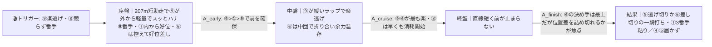
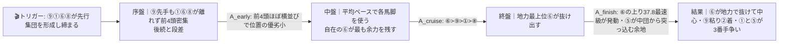
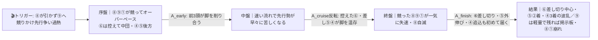

# 🏇 園田10R（2026/06/10 園田 ダート右1230m）３歳特別 分析

**モデル: scoring-model v5.0（論理ファースト・相変位再帰を因果骨格として使用）** ／ 使用観点: 5観点（AB／CD／E／FGHK／I）／ 出走 9頭
> 着順の並びは論理で決め、印で示す（%は出さない）。`score_race.py` は今回未実行（任意サニティ）。
> **確定材料の先取り**: 枠順確定・乗替（①竹村達→永井孝復帰／③杉浦健→下原理／⑦笹田知→竹村達／⑨吉村智→▲南部楓）は §2-1/§3 本文へ織り込み済み。当日の馬場・パドック・参考Rのみ §0 に残す。

## 1. サマリ（結論）

- **予想本命 ◎**: **6-6 アジムット** — **全展開で中心〜上位に来る唯一のオールラウンダー**。持時計1:20.2（メンバー最速）×上り37.8（最速級）×1230で0-2-1-0の鉄板安定。逃げても差しても好走する自在性で、前残りでも前崩れでも脚質を選べる＝**展開不問**。死角は「勝ち切り1勝のみの詰め甘」と「⑨に楽逃げされる超スロー」だけ。
- **対抗 ◯**: **8-9 ロングラスティング** — **1230逃げ切り勝ち（通過1-1-1-1・1:20.4）× ▲53kg最軽量**。前有利コースでハナを取れば最強の権利。本線（楽逃げ）で押し切り筆頭。競られると脆い諸刃。
- **単穴 ▲**: **1-1 シャークリュウセイ** — **1230で距3-0-1-1（コースで2勝級）**＋父ベストウォーリアは園田1230勝利数トップ3。内枠1番×先行で前有利と素直に噛む堅実な3番手軸。
- **連下 △**: **5-5 ココロネ**（メンバー2位時計1:20.8・上り38.5、小牧太で好位差しに幅＝差し勢の筆頭）、**4-4 ジューンキートス**（上り38.0＝最上位の決め手だが完全追込＝前崩れ伏線P3限定の刺客）。
- **注意 ×**: **2-2 アオイアルザード**（1230は0-0-0-5で距離の壁）、③⑦（1230未経験）、⑧（最遅時計・自滅型）。
- **最有力展開**: **本線 P1 ロング楽逃げ・前残りスロー★★★**（鍵馬: ⑨⑥⑧）。対抗 **P2 先行集団・平均ペース実力決着★★**、伏線 **P3 ハーティ撹乱ハイ・差し台頭★** ／ P4 やや速★
- **展開を分ける一点**: **⑧ハーティパーティが⑨に競りかけるか／⑥が前に行くか後ろか。** テン200〜400mの ⑨⑧① の隊列と ⑥ の位置で本線⇄対抗⇄伏線が即決まる。

> 馬券（何をどう買うか）はユーザー判断。本レポートは展開と着順の予測のみを提示する。

## 0. 当日アップデート・ボード（当日更新枠 ⏱）

> ここには*分析時点で本当に未知のものだけ*を残す（枠・乗替は §2/§3 へ反映済み）。

### 0-1. 当日の参考レース（バイアス採取用）
> **採用優先順位**: ダート（必須）＞ 同日・直前ほど重い ＞ 右回り ＞ 距離帯（1230/1400近辺）。

| R | 発走 | コース | 一致度 | 何を読むか |
|---|------|--------|:-----:|-----------|
| 当日特定（本日園田の前半〜中盤 ダ右1230R） | ― | 園田ダ右1230 | ★★★ | 逃げ・先行が本当に残るか／競り合いで前崩れが出るか・テン速馬が何番手まで取れるか |
| 当日特定（本日園田の ダ右1400R） | ― | 園田ダ右1400 | ★★☆ | 決まり手と前残り度のみ流用（距離違いは割引） |

→ **観察結果（当日確定 2026/06/10）**: 馬場 **稍重**／バイアス **前残り（前・内有利）**／決まり手 **逃・先**／伸びる位置 **前**
> この行が埋まったら §2-3 当日修正へ。**前半Rで「競っても前が残る」なら本線P1/対抗P2（前残り系）を固定**、「競ると前が崩れ差しが届く」なら**伏線P3を本線★★★へ格上げし④⑤を引き上げる**。

### 0-2. 馬場（当日確定）
| 項目 | 値（当日記入） | 質の読み |
|------|----------------|----------|
| 馬場状態 | **稍重（当日確定）** | 湿って前・内有利が一層強化＝**前残り本線P1を固定**。差し・追込はさらに割引 |
| バイアス | **前残り（前・内有利・決まり手は逃先）** | テン速い先行勢が止まらない。後方一気は構造的に届かない |

> **道悪化したら**: ②（父タリスマニックは道悪ダート一定）が相対浮上の余地。ただし良想定では各馬の1230自身実績が主証拠。

### 0-3. パドック・馬体重（**当日確定済み 2026/06/10**）
| 印 枠-馬番 馬名 | 馬体重(前走比) | 読み | パドック/返し馬（要確認） |
|------------|--------------|------|------------------|
| ◎ 6-6 アジムット | **464 (-4)** | 実戦級に絞れた程度＝良好 | ▲53の⑨を見ながらの折り合い |
| ◯ 8-9 ロングラスティング | **471 (-2)** | 逃げ馬として理想的・問題なし | ▲53の行き脚を返し馬で確認 |
| ▲ 1-1 シャークリュウセイ | **476 (+1)** | 順当・最大体重で実績体重圏 | 先行争いの気合い乗り |
| △ 5-5 ココロネ | **437 (+5)** | 適度な増で良好・地力上昇基調と整合 | 小牧太の促し具合 |
| △ 4-4 ジューンキートス | **426 (+10)** | **小柄馬の大幅増＝最注目**。馬体充実(終い強化)か太め残りか | +10が絞れ不足でないか最終確認 |
| （他）③455(+6・休明) ⑦459(-7やや大) ②440(±0) ⑧426(-1) | | ③は休み明け+6で太め残り懸念は小／⑦-7はやや気になるが評価×据置 | |

> **読み総括**: 上位陣（◎⑥-4・◯⑨-2・▲①+1・△⑤+5）はいずれも良好で**並び・ティア変更なし**。④の+10のみ大幅変動だが、完全追込でP3限定という位置づけは馬体重では動かない（充実なら終い強化の上ブレ／太めなら割引、パドック判断）。馬体重は展開（ペース・バイアス）を動かさないため、ティアは前半参考R（§0-1）の観察待ち。

### 0-4. その他当日情報（分析時点で未確定のものだけ）
- 当日発表の乗替／騎乗変更: ___（①永井孝復帰・③下原理・⑦竹村達・⑨南部楓は確定として §3 反映）
- 当日の取消・除外: ___
- 天候推移（朝→発走）: ___

## 2. 展開予想【成果物1】（STEP4a 展開合成）

> **検証契約**: 脚質別有利不利・隊列・各パターンの段階フローを馬番・符号・可能性ティアで固定。レース後に復元ペース層と照合し展開精度を独立採点する。

### 2-1. 脚質分類表（全馬・観点E証拠／確定枠を反映）

| 枠-馬番 | 馬名 | 騎手(乗替) | 脚質 | テン速 | 近走通過(1230中心) | 想定位置 |
|:--:|------|------|:--:|:--:|------|------|
| 8-9 | ロングラスティング | ▲南部楓(乗替) | 逃(自在) | 速 | 1-1-1-1(1230勝) / 8-8(820控) | **ハナ最有力**（控える選択肢も） |
| 8-8 | ハーティパーティ | 杉浦健(継続) | 先→失速 | 速 | 1-1-3-5 / 4-5-5-12（前で粘れず後退） | ハナ/番手に取り付くが撹乱・自滅 |
| 1-1 | シャークリュウセイ | 永井孝(乗替) | 先〜逃 | 速 | 1-1-1-1(1400逃3着) / 3-3(1230番手) | 番手〜ハナ（先行集団の前） |
| 6-6 | アジムット | 笹田知(継続) | 自在(逃〜差両刀) | 速 | 1-1-1-1(逃2着) / 10-10-5-3(差2着) | 番手〜先行、控えれば中団差しも |
| 7-7 | インパルスベラ | 竹村達(乗替) | 先(中距離) | 中 | 2-2-2-2(1400重2着0.0差)／1230初 | 先行〜中団（1230初・確信度中） |
| 2-2 | アオイアルザード | 新庄海(継続) | テンのみ/1230は中後方 | 中 | 7-8-12-8 / 9-9-10-9（1230は前に行けず） | 中後方（先行争いに絡まない公算） |
| 3-3 | パズー | 下原理(乗替) | 差し・先行(中長距離型) | 不明 | 1230通過実績ゼロ／1400-1870で5-7番手 | 中団（1230初・確信度低） |
| 5-5 | ココロネ | 小牧太(継続) | 差し(後方) | 中〜遅 | 9-8-10-8 / 7-6-7-7（後方差し） | 後方〜中団（展開待ち） |
| 4-4 | ジューンキートス | ☆小谷哲(継続) | 追込(決め手型) | 遅 | 11-11-11-11 / 11-11-9-7(上38.0) | 後方〜最後方 |

> 園田右1230は **1角まで約207mと短くテンのポジション争いが核**／直線も短く**前有利が鉄板**（集計: 逃げ連対44%・先行23%・差し14%・追込7%）。内外は概ねフラット（8枠は集計良好の事実あり＝⑨に逆風ではない）。3-4角スパイラルで先行が外に振られインの隙間差しが台頭する余地はある。

### 2-2. 展開パターン（複数・可能性ティア）

| id | パターン名 | 可能性 | 発動トリガー | 有利脚質（符号） | 浮上馬 | 沈む馬 |
|----|-----------|:-----:|--------------|------------------|--------|--------|
| P1 | ロング楽逃げ・前残りスロー | 本線★★★ | ⑨が外8枠から▲53の軽さで楽にハナ、⑧が競らず番手で収まる | 逃+2 先+1 差-1 追-2 | 9 6 1 | 4 5 2 |
| P2 | 先行集団・平均ペース実力決着 | 対抗★★ | ⑨ハナに①⑥⑧が離れず先行集団が締まる | 逃+1 先+2 差0 追-1 | 6 9 1 5 | 8 2 |
| P3 | ハーティ撹乱ハイ・差し台頭 | 伏線★ | ⑧が引かず⑨に競りかけ先行争い過熱→オーバーペース | 逃-1 先0 差+2 追+1 | 6 5 4 | 8 1 9 |
| P4 | ロング絡まれ・やや速 | 伏線★ | ⑨がハナも⑧①に張り付かれ単騎にならずやや速 | 逃0 先+1 差+1 追-1 | 6 9 1 5 | 8 |

> 可能性ティア = **本線★★★ / 対抗★★ / 伏線★**（%は使わない）。`有利脚質（符号）`と`浮上馬/沈む馬`はラップが取れなくても着順・通過順から検証できる**展開検証の正本**。
> **構造的偏り**: P1+P2+P4（前〜好位中心）でΣ0.84。差し追込が主役になるのは P3（⑧撹乱依存・確率小）のみ＝前残りが基準、差し台頭は例外イベント。

#### 各パターンの段階フロー（序盤→能力→中盤→能力→終盤→能力→結果）

> mermaid は端末では描画されずコードのまま見える → 各図の直後に1行要約を併記。report.md を GitHub/プレビューで開けば図が出る。

**P1 ロング楽逃げ・前残りスロー（本線★★★）**

> 1行要約: **⑨が楽に逃げて緩いラップ → 中盤誰も脚を使わず前が余力温存 → 直線短く前残り。⑨と地力⑥の一騎打ち、①が3番手、差し④⑤は届かない**。

**P2 先行集団・平均ペース実力決着（対抗★★）**

> 1行要約: **前4頭が締めた平均ペース → 中盤で各馬が脚を使い、自在の⑥が余力を残す → 終盤は地力最上の⑥が抜け、⑨粘り、①⑤が3番手争い**。

**P3 ハーティ撹乱ハイ・差し台頭（伏線★）**

> 1行要約: **⑧の撹乱で逃げ争いハイ → 前が中盤で力尽き → 終盤は控えた⑥と脚を残した⑤④が差し込む。④の追込はこの展開でのみ届く**。

- **隊列（最有力P1）**: 序盤先頭 `⑨⑧①⑥` → 最終コーナー前方 `⑨⑥①⑧`
- **隊列（対抗P2）**: 序盤先頭 `⑨①⑥⑧` → 最終コーナー前方 `⑥⑨①⑤`
- **馬場バイアス**: 前/内有利が基準（逃げ・先行が止まりにくい構造）。内外は概ねフラットで⑨の8枠も逆風ではない。当日 §0-1 で上書き前提。
- **反証条件**: ⑧が引かず先行争いを過熱させれば pace_level 0.3→0.65〜0.85 へ跳ね、本線は **P3/P4 へ即移行**（④⑤を引き上げ）。⑥が前付けを選べば **P2** へ寄る。⑨がスンナリ単騎なら **P1 を確定**。

### 2-3. 当日修正

**【当日更新 2026/06/10・馬体重確定】** 全馬の確定馬体重を反映（§0-3）。**上位陣は全頭良好**（◎⑥464(-4)・◯⑨471(-2)＝逃げ/自在馬として理想圏、▲①476(+1)・△⑤437(+5)＝順当）。④ジューンキートス426(+10)のみ小柄馬の大幅増で太め残り/充実の両面だがパドック判断。**馬体重はペース・バイアスを動かさないため、展開ティア（P1本線〜P3伏線）と着順の並び（◎⑥→◯⑨→▲①→△⑤→△④）は変更なし。** 残る当日判断は §0-1 の前半参考R（園田ダ1230/1400）でのペース層・前後バイアス採取のみ。

**【当日更新 2026/06/10・馬場確定＝稍重／前残り】** 参考バイアスが**前残り（前・内有利・決まり手は逃先）**で確定。pace-synthesis 当日手順に従い再評価：

- **展開ティア**: **P1（前残りスロー）を本線★★★に固定**。P2（平均・前4頭）対抗★★は維持（前残りでも好位先行が中心）。**P3（ハイ・差し台頭）は伏線→ほぼ否定（最も起きにくい馬場）**。leg_advantage を **逃+2 先+2 差-2 追-2** へ更新（差し・追込をさらに割引）。
- **並びの再評価（◎が移動）**:
  - **◎ ← 8-9 ロングラスティング**（◯から格上げ）。**前残り稍重で楽逃げ濃厚＝バイアス最大の受益馬**。1230逃げ切り実績×▲53最軽量×湿って止まらない馬場が三位一体。
  - **◯ ← 6-6 アジムット**（◎から一列）。地力最上で勝ち負け圏は不変だが、**近走は差し脚を使う形が多く、前残りで楽逃げ⑨を「差し切れるか」が課題に転じた**。笹田が**前付け**すれば即◎に戻る（◎◯は僅差）。
  - **▲ 1-1 シャークリュウセイ**（維持・むしろ上昇）。内枠1番×先行×1230コース実績＝**前残り稍重の恩恵が最も素直に出る**3番手最有力。
  - **△ 5-5 ココロネ**（差しのため割引、好位差しに動けた時のみ）／**△ 7-7 インパルスベラ（×→格上げ）**。**唯一の好走が1400「重」先行2着0.0差＝道悪×先行が向く**。1230でテンに置かれず前に行ければ伏線。置かれたら終わり。
  - **×（格下げ）4-4 ジューンキートス**。完全追込で頼みのP3（ハイ差し）が**馬場で消滅**＝最大の割引対象。②③⑧も据置×。
- **並び（当日）**: ◎⑨ → ◯⑥ → ▲① → △⑤ → △⑦ → ×④②③⑧

> 残る分岐: ⑥が**前付けを選べば◎◯入れ替わり**。⑨が①⑧に**強く競られて単騎を許されない**なら粘りに陰り＝①の浮上余地。テンの隊列で最終判断。

> （事前の更新トリガー: 参考Rで「競っても前が残る」→ P1/P2 固定し④⑤を下げる／「競ると前崩れ・外差し」→ P3 を本線へ格上げ。**今回は前者＝前残りが確定**したため上記を適用。）

## （展開→着順の伝達）

本線 P1（前残りスロー）では ⑨ が楽逃げで押し切りにかかり、地力最上の ⑥ が好位から詰め寄る一騎打ち、① が3番手で粘る。だが対抗 P2（平均）に振れれば ⑥ が地力で抜けて主役交代。**⑥ は P1 で2番手・P2/P3/P4 で1番手と全パターンで上位に来るため ◎**。⑨ の生死は ⑧ の出方（競るか否か）が握り、差し ④⑤ が主役になるのは伏線 P3（⑧撹乱ハイ）でのみ。

## 3. 着順予想表【成果物2】（メイン出力・表が主役）

> **検証契約**: 並び（印 ◎◯▲△× と行順）＋各馬の展開感度・好材料・懸念点を固定。レース後に実着順と照合し、(a)並びの順位相関＝総合、(b)実現パターンの段階フローと展開感度が当たったか＝純粋な能力読み、を別個採点。**%は出さない**。

| 印 | 枠-馬番 | 馬名 | 騎手(乗替) | 展開感度 | 好材料 | 懸念点 |
|----|--------|------|-----------|---------|--------|--------|
| ◎ | 6-6 | アジムット | 笹田知(継続) | **全展開で中心〜上位**＝展開不問／唯一P1超スローで⑨に楽逃げされると位置差を詰め切れず2番手評価 | ・[A]持時計1:20.2＝メンバー最速＋上り37.8最速級＝速い時計を差し脚で計時＝地力と決め手を両立 ・[B]1230で0-2-1-0＝3戦すべて連対圏の鉄板安定で底を見せていない ・[E]逃げ(1-1-1-1で0.1差2着)も後方差し(10-10-5-3で2着)も自在＝前有利でも前崩れでも脚質を選べる ・[C]父モーニン×母父パイロ＝ダート短距離を二重補強の好配合・牡3/1230がドンピシャ | ・[I]勝ち切りは全1勝で2着が多い＝接戦の最後の一押しに甘さ ・[E]P1超スローで⑨単騎楽逃げだと直線短く位置差を詰め切れない |
| ◯ | 8-9 | ロングラスティング | ▲南部楓(乗替) | **本線P1(楽逃げ)で押し切り筆頭**・P4でも接戦／P3で⑧に競られ過熱すると失速し掲示板まで | ・[B/E]1230は1戦1勝＝逃げ切り(通過1-1-1-1・1:20.4)。前有利コースでハナ＝最大の権利 ・[I]▲53kg＝メンバー最軽量。先行馬に軽量は明確な後押し ・[C]父ダノンレジェンド＝米ダートスピードの極み。良馬場×短距離×先行が真骨頂で条件一致 | ・[E]スンナリ単騎が前提。⑧①に競られる(P3/P4)と脆く1870逃げ失速例あり ・[B]全2-0-1-5でハナ以外では崩れる条件特化 ・[K]南部楓は▲見習いで信頼は限定的(軽量利が上回る範囲で評価) |
| ▲ | 1-1 | シャークリュウセイ | 永井孝(乗替) | 先行集団のどのパターンでも前圏＝**堅実な3番手軸**／前崩れP3だけは先行ごと沈むリスク | ・[D/B]1230で距3-0-1-1＝コースで2勝級の実績。前走1400も逃げて3着(1-1-1-1)で先行力健在 ・[C]父ベストウォーリア＝園田1230勝利数トップ3(20勝)のコース父系 ・[E]内枠1番＋先行＝前有利バイアスと素直に噛む | ・[B]全4-3-2-9で着外も多くムラ。1230で7着(3-3-9-10)の先行→後退例 ・[E]⑨とハナを激しく争うと粘り切れない過去／P3過熱なら共倒れ |
| △ | 5-5 | ココロネ | 小牧太(継続) | P2/P3/P4で台頭＝**差し勢の筆頭**／本線P1超スローだと届かず | ・[A]メンバー2位時計1:20.8(前走自己ベスト)・上り38.5＝地力上昇基調 ・[K]小牧太(2026全国上位)継続・前走で下原理から強化済み＝好位差しに幅 ・[C]父ドレフォンのパワー＋母父キンカメの底力 | ・[E/D]近走後方差し(9-8-10-8)で前有利1230は脚質逆風＝展開待ち ・[I]全1-0-0-5で1勝のみ・1230は0-0-0-2と未連対＝詰め甘 |
| △ | 4-4 | ジューンキートス | ☆小谷哲(継続) | **伏線P3(ハイペース)限定の刺客**＝前が崩れて初めて最速上りが届く／前残りなら着外 | ・[B/D]上り38.0(1230で3着)〜38.6/38.7＝メンバー最上位の決め手・ハマれば突き抜ける ・[C]父ミスチヴィアスアレックス＝ダート短距離特化・早熟で3歳前半が旬 ・[K]☆-1kgの軽量は終い型に追い風 | ・[E/D]通過11-11が常態の完全追込。園田1230は追込連対7〜12%で構造的に届きにくく展開必須 ・[B]直近10着・8着と凡走続きで安定感欠く |
| × | 2-2 | アオイアルザード | 新庄海(継続) | 1230では前に行けず沈むサイド | ・[B]820は逃げ2着0.1差・上36.1と短距離のテン速は本物 | ・[B/I]1230は0-0-0-5の全敗＝距離の壁が明確 |
| × | 3-3 | パズー | 下原理(乗替) | 1230初＋短縮で忙しく置かれる懸念 | ・[B]姫1800で3着など中距離は相手なりの地力 | ・[B/G]1230完全未経験＋約2.5ヶ月の休み明け＋中長距離型＝二重三重の割引 |
| × | 7-7 | インパルスベラ | 竹村達(乗替) | 1230初の距離短縮一変は裏付けなし | ・[B]1400重で先行2着(2-2-2-2・0.0差)＝条件合えば先行力 | ・[B]1230未経験＋近2走長距離(1700/1870)で大敗 |
| × | 8-8 | ハーティパーティ | 杉浦健(継続) | 撹乱役だが自身は沈む（前で粘れず失速） | ・[E]テン速くハナ/先行に行ける行き脚（P3の引き金） | ・[B/A]最遅時計1:21.8・1230着外続き・前で粘れず大失速する自滅型(4-5-5-12) |

- **印**: ◎本命／◯対抗／▲単穴／△連下／×注意。並びと印だけで強弱を表す（%は出さない）。
- **観点タグ**: A指数 / B近走 / C血統 / D適性 / E展開 / F調教 / G馬体ローテ / H気配 / K騎手 / I リスク。

## 4. 観点別ハイライト（補足・表で拾い切れない横断）

- **A 指数/時計・B 近走**: 時計上位は ⑥1:20.2 ＞ ⑨1:20.4 ＞ ⑤1:20.8 ＞ ①1:20.9 ＞ ④1:21.3 ＞ ②1:21.4 ＞ ⑧1:21.8。⑥は「速い時計を差し脚で計時」＝地力＋決め手の両立で頭一つ抜ける。底を見せていないのは ⑥（連対圏鉄板）。底を見せ切ったのが ⑧（最遅・自滅型）。
- **C 血統**: ⑥モーニン×パイロ・⑨ダノンレジェンド×Bernardini・①ベストウォーリアが園田ダ短距離にドンピシャ。逆に ③ビーチパトロール（芝中距離型）は短縮に逆風、⑤⑦ドレフォンは1200-1400やや苦手傾向（小割引）。
- **D 適性（コース構造）**: 園田1230は1角まで207m・直線短で**前有利が鉄板**（逃連対44%／追込7%）。これが ④（完全追込）の天井であり、① ⑥ ⑨（前で立ち回れる）の追い風。内外はフラットで⑨8枠も問題なし。
- **E 展開＋STEP4a 合成**（詳細§2）: ハナ最有力 ⑨。鍵は ⑧ の出方。前〜好位中心の P1/P2/P4 でΣ0.84＝**前残りが基準**、差し台頭 P3 は ⑧撹乱という不確実イベント依存で確率小。
- **F/G/H 状態・K 騎手**: 最大の状態材料は ⑨ の ▲53kg軽量。騎手は小牧太(⑤・全国上位)・下原理(③)・笹田知(⑥・好調継続)を確認。**地方3歳の調教・当日気配・馬体重は web 事前取得不能＝§0 で当日補強**（確信度の弱点）。③ は約2.5ヶ月の休み明け。
- **I リスク**: 後方脚質（④⑤や近走後方の②③⑦）は A_finish が本物でも**到達位置に上限**（追込連対7〜12%）＝展開待ちの減点。重い割引は ②（1230全敗）③⑦（1230未経験）⑧（自滅型）。

## 5. データの確かさ・補強のお願い

- **確信度が低かった点**: H 当日気配・パドック・馬体重（NAR・web取得不能で全馬空欄）／騎手の2026開催成績（小牧太・下原理・笹田知のみ確認、永井孝・新庄海・小谷哲・竹村達・杉浦健・南部楓は数値未取得＝確信度低）。
- **ユーザー補強推奨**: ①当日の前半 園田ダ1230/1400R の決まり手・伸び位置（§0-1）→ P1/P2/P3 のティア確定に直結。②パドック評価・確定馬体重（特に ⑥⑨ の気配、④の小柄が絞れ過ぎでないか）。③⑨ロングラスティングと⑧ハーティの陣営の出方コメント（ハナ宣言があれば隊列が確定）。
- **欠損・推定箇所**: ③⑦の1230適性は実績ゼロのため血統＋他距離からの推定。コースバイアス数値は集計ソース（umameshi/keibajo）に基づく。

## 6. 免責
予測であり的中を保証しない。賭けは自己責任で、馬券選択・実ベットは人間判断。市場は一切参照していない。
