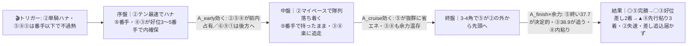
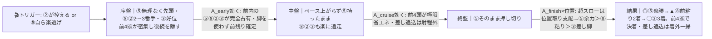
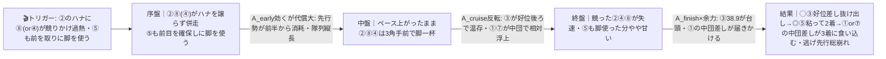

# 🏇 園田11R B1 ４歳以上特別（2026/06/10 園田 ダート右1400m 稍重・前残り）分析

**モデル: scoring-model v5.0（論理ファースト・相変位再帰を因果骨格として使用）** ／ 使用観点: 5観点（AB／CD／E／FGHK／I）／ 出走 9頭
> 着順の並びは論理で決め、印で示す（%は出さない）。`score_race.py` は今回未実行（任意サニティ）。
> **確定材料の先取り**: 枠順確定・**馬場=稍重／当日バイアス=前残り（前内有利）確定**を §2-1/§2-2/§3 本文へ織り込み済み。当日のパドック・馬体重・参考R観察値のみ §0 に残す。
> 乗替は地方のためweb個別確認不可＝出馬表記載の騎手をそのまま採用（騎手の2026成績は確認済、§5）。

## 1. サマリ（結論）

- **予想本命 ◎**: **5-5 ベラジオガルフ** — **園田1400で場6-1-0-0・近5走全勝**。番手から3角先頭に出る自在型（6-6-1-1/2-2-1-1/1-1-1-1）で**終い37.7はメンバー最速**。前残り稍重＝前内有利が「先行力×決め手」を二重に後押しし、本線・対抗・伏線の**全展開で連対圏を外さない唯一の馬**。鞍上小牧太（NAR全国9位）継続で人馬の手応えも一致。死角は連勝の反動（当日気配未確認）だけ。
- **対抗 ◯**: **3-3 アシャカデュメ** — **自己ベ1:30.3でメンバー最速級・父ホッコータルマエ＝園田1400コース最多勝血統**。好位差し自在（5-5-4-3で2着0.3／6-5-4-1で2着0.0）×終い38.9で、**⑤を差し切れる唯一の地力**。前が競って崩れる伏線P2では主役に回る。「2着続き＝勝ち味遠い」だけが懸念。
- **単穴 ▲**: **8-8 アイヤナ** — **場4-7-4-11級の複勝量産**＋先行堅実（2-2-1-1）で前残りに脚質ど合致。8枠は集計上もやや有利。終い性能（39前後）が一枚落ちるため勝ち切りより**前粘りの2〜3着**が現実的な刺さり方。
- **連下 △**: **4-4 ショウナンアトレ**（1230で先行好走連発・田野豊三好調＝先行力は前残り向きだが**1400は距0-0-0-0の距離延長未知**が天井）、**2-2 アグネスシュウ**（テン最速でハナ最有力＝展開の鍵だが**逃げ→失速型**で自身は沈むサイド）。
- **注意 ×**: **9-9 アストラッド**（芝→ダ初戦×追込×前残りの**三重逆風**）、**6-6 ピースマッチング**（後方一辺倒・場0-1-1-22）、**1-1 プレジールミノル**（牡8・中団後方・近走9着続き）、**7-7 サトノメドーサ**（岩手転入後大敗続き）。
- **最有力展開**: **本線 P1 前内残り・⑤抜け出し（スロー〜平均）★★★**（鍵馬: ②⑤）。対抗 **P3 ⑤楽逃げ超スロー前残り★★**、伏線 **P2 ②⑧競り合いハイ・差し台頭★** ／ P4 ⑤伸び欠き波乱★
- **展開を分ける一点**: **②アグネスシュウが単騎ハナを取れるか、⑧（or ④）が競りかけるか。** ②が単騎なら本線P1/対抗P3（前残り）に固定＝⑤◯③▲⑧。⑧④が引かず競れば伏線P2（ハイ）へ跳ね、**③が首位・①の中団差しが3着に紛れる**余地が出る。

> 馬券（何をどう買うか）はユーザー判断。本レポートは展開と着順の予測のみを提示する。市場（オッズ・人気）は一切参照していない。

## 0. 当日アップデート・ボード（当日更新枠 ⏱）

> ここには*分析時点で本当に未知のものだけ*を残す（枠・馬場バイアスは §2/§3 へ反映済み）。

### 0-1. 当日の参考レース（バイアス採取用）
> **採用優先順位**: ダート（必須）＞ 同日・直前ほど重い ＞ 右回り ＞ 距離帯（1400/1230近辺）。

| R | 発走 | コース | 一致度 | 何を読むか |
|---|------|--------|:-----:|-----------|
| 本日園田の前半〜中盤 ダ右1400R | 当日特定 | 園田ダ右1400 | ★★★ | 逃げ・先行が本当に残るか／競り合いで前崩れが出るか・テン速馬が何番手まで取れるか |
| 本日園田の ダ右1230R | 当日特定 | 園田ダ右1230 | ★★☆ | 決まり手と前残り度のみ流用（距離違いは割引） |

→ **観察結果（当日確定 2026/06/10）**: バイアス **前残り（前・内有利）＝ユーザー確定済**／馬場 **稍重**／決まり手（逃先差追）___／伸びる位置 ___
> 前残りは確定。残る観察は**「競っても前が残るか／競ると前崩れて差しが届くか」の一点**。前者なら本線P1・対抗P3を固定（⑤◎③◯⑧▲）、後者なら**伏線P2を本線★★★へ格上げし③を首位・①を引き上げる**。

### 0-2. 馬場（当日確定）
| 項目 | 値 | 質の読み |
|------|----|----------|
| 馬場状態 | **稍重（確定）** | 砂が締まりテンが速まる＝**前残りが一層強化**。差し・追込はさらに割引 |
| バイアス | **前残り（前・内有利・決まり手は逃先）＝確定** | 直線約200mと短く後方一気は構造的に届かない。逃げ連対45%／追込連対6%の集計とも一致 |

> **「重」へ悪化したら**: 父ドレフォン②・父ホッコータルマエ③など道悪巧者がさらに浮上、前残りはより極端化（差し追込はほぼ消滅）。逆に**「外差し・前止まり」へ転じたら**全パターンの leg_advantage が崩れ再合成が必要（§2-2 反証条件3）。

### 0-3. パドック・返し馬・馬体重（注目馬・当日記入）
| 印 枠-馬番 馬名 | 馬体重(増減) | パドック/返し馬 | 気配 |
|------------|--------------|------------------|:----:|
| ◎ 5-5 ベラジオガルフ | ___ (±__) | **連勝の反動が出ていないか（最重要・唯一の死角）** | ↑/→/↓ |
| ◯ 3-3 アシャカデュメ | ___ (±__) | 好調キープの気配か | ↑/→/↓ |
| ▲ 8-8 アイヤナ | ___ (±__) | テンの行き脚 | ↑/→/↓ |

### 0-4. その他当日情報（分析時点で未確定のものだけ）
- 当日発表の乗替／騎乗変更: ___（出馬表記載の騎手で評価。確定情報あれば §3 へ反映）
- 当日の取消・競走除外: ___
- 天候推移（朝→発走）: ___

> ↑ §0-3 の◎気配が「→/↑」なら本線どおり⑤中心。「↓（反動）」なら **P4（⑤伸び欠き）を引き上げ③を首位想定**へ（§2-3）。

## 2. 展開予想【成果物1】（STEP4a 展開合成）

> **検証契約**: 脚質別有利不利・隊列・各パターンの段階フローを馬番・符号・可能性ティアで固定。レース後に復元ペース層と照合し展開精度を独立採点する。

### 2-1. 脚質分類表（全馬・観点E証拠／確定枠を反映）

| 枠-馬番 | 馬名 | 騎手 | 脚質 | テン速 | 近走通過(1400中心) | 想定位置 |
|:--:|------|------|:--:|:--:|------|------|
| 2-2 | アグネスシュウ | 新庄海 | 逃(自滅型) | 最速級 | 1-1-1-3 / 1-1-1-5 | **ハナ最有力**（だが3-4角で失速） |
| 5-5 | ベラジオガルフ | 小牧太 | 自在(逃〜好位抜出) | 番手→3角先頭 | 6-6-1-1 / 2-2-1-1 / 1-1-1-1 | **番手〜先頭**（②が飛ばせば控え、緩めば自ら先頭） |
| 8-8 | アイヤナ | 永井孝 | 先行(堅実・ハナ可) | 速い | 2-2-1-1 / 2-2-2-2 | 2〜3番手先行（本来は番手で控える形） |
| 3-3 | アシャカデュメ | 川原正 | 好位差し(自在) | 速い〜中 | 5-5-4-3 / 6-5-4-1（昨11月は1-1-1-1逃切） | 好位4〜5番手（ハナ争いには回らない） |
| 4-4 | ショウナンアトレ | 田野豊 | 先行〜好位(1400未知) | 速い(1230基準) | 5-5-6-5 / 3-3-3-3（すべて1230） | 先行〜好位（**1400延長で前に行き切れるか未知**） |
| 7-7 | サトノメドーサ | 土方颯 | 中団(近走後退) | 平凡 | 5-5-5-5 / 5-6-8-8 | 中団（3-4角で後退） |
| 1-1 | プレジールミノル | 大山真 | 中団〜後方 | 平凡 | 6-5-5-5 / 9-9-10-9 | 中団後ろ〜後方 |
| 6-6 | ピースマッチング | 渡瀬和 | 後方一辺倒 | 遅い | 10-10-9-8 / 9-8-8-8 | 後方〜最後方 |
| 8-9 | アストラッド | 佐々世 | 追込(ダート初) | 遅い | 16-16-15-15(全JRA芝) | 後方〜最後方（**砂初・確信度低**） |

> 園田ダ右1400は**1角まで約377〜400mと長くテンで位置を作れる**一方、**直線は約200〜213mと短く差し・追込は届きにくい**（集計: 逃げ連対45%・先行27%・差し15%・追込6%）。稍重＋前残り確定で前有利がさらに強化。枠は概ねフラット〜大外8枠やや有利だが、当日の生条件は「前・内有利」確定。

### 2-2. 展開パターン（複数・可能性ティア）

| id | パターン名 | 可能性 | 発動トリガー | 有利脚質（符号） | 浮上馬 | 沈む馬 |
|----|-----------|:-----:|--------------|------------------|--------|--------|
| P1 | 前内残り・⑤抜け出し（スロー〜平均） | 本線★★★ | ②が単騎ハナ、⑤⑧③が無理せず番手以下＝先行争い不過熱 | 逃0 先+1 差0 追-2 | 5 3 8 | 2 6 9 |
| P3 | ⑤楽逃げ・超スロー前残り | 対抗★★ | ②が控え or ⑤自ら楽逃げ＝前4頭が後続を離す | 逃+2 先+1 差-2 追-2 | 5 8 3 | 6 9 1 7 |
| P2 | ②⑧競り合い→ハイ・差し台頭 | 伏線★ | ②のハナに⑧(or④)が競りかけ過熱、⑤も前を取りに脚を使う | 逃-2 先-1 差+1 追0 | 3 5 1 | 2 8 4 |
| P4 | ⑤伸び欠き・伏兵紛れ（波乱） | 伏線★ | ⑤が連勝反動・包まれ・出脚一息で自在さを欠く | 逃0 先+1 差0 追-2 | 3 8 5 | 2 |

> 可能性ティア = **本線★★★ / 対抗★★ / 伏線★**（%は使わない）。`有利脚質（符号）`と`浮上馬/沈む馬`は着順・通過順から検証できる**展開検証の正本**。
> **構造的偏り**: P1＋P3（前残り系）でΣ0.72＝**前残りが基準**。差しが主役になるのは P2（②⑧競り合い依存）のみ＝例外イベント。**⑤は P1/P3 で1着・P2/P4 で2〜3着＝全パターン連対圏**ゆえ ◎。③は P1/P3 で2〜3番手・P2/P4 で1着＝⑤の唯一の対抗。

#### 各パターンの段階フロー（序盤→能力→中盤→能力→終盤→能力→結果）

> mermaid は端末では描画されずコードのまま見える → 各図の直後に1行要約を併記。report.md を GitHub/プレビューで開けば図が出る。

**P1 前内残り・⑤抜け出し（本線★★★）**

> 1行要約: **②が単騎で緩く引っぱり → 中盤誰も脚を使わず前内が余力温存 → 終盤⑤が外から抜け出し、決め手で③が続き⑧が粘る。後方は前が止まらず届かない**。

**P3 ⑤楽逃げ・超スロー前残り（対抗★★）**

> 1行要約: **⑤が楽に先頭で超スロー → 誰も脚を使わず前4頭が後続を引き離す → 位置取り勝負で⑤楽勝、先行の⑧が2着に粘り込む。後方は完全に届かない**。

**P2 ②⑧競り合い→ハイ・差し台頭（伏線★）**

> 1行要約: **②⑧が競ってハイ → 前が中盤で脚を使い果たし → 脚を温存した③が抜け出し、⑤は粘るも2着、前残り馬場でも①の中団差しが3着に紛れる**。

- **隊列（本線P1）**: 序盤先頭 `②⑤⑧③` → 最終コーナー前方 `⑤③⑧②`
- **隊列（対抗P3）**: 序盤先頭 `⑤⑧②③` → 最終コーナー前方 `⑤⑧③`
- **馬場バイアス**: 前/内有利が基準（直線短く逃げ先行が止まりにくい）。当日確定の前残り稍重でさらに強化。後方一辺倒の⑥⑨①は構造的に届きにくい。
- **反証条件**: ①②が単騎ハナを取れず⑧④が競れば pace_level 0.42→0.72 へ跳ね **P2（ハイ・差し台頭）へ即移行**（③を首位・①を引き上げ）。②が控える/⑤が自ら楽逃げなら **P3 確定**。⑤が当日気配で出脚一息なら **P4（③主役）** へ。**馬場が「重」悪化なら前残り極端化、「外差し」転換なら全面再合成**。

### 2-3. 当日修正（あれば）

> STEP6 で当日情報を受けた場合のみ記入。現時点で確定済みは「稍重・前残り」のみ（§2-2 に織り込み済）。
> 残る当日判断: ①§0-1 前半参考R（園田ダ1400/1230）で**「競っても前残り」か「競ると前崩れ」か** → 前者は P1/P3 固定、後者は **P2 を本線★★★へ格上げし③首位・①浮上**。②§0-3 で**⑤の連勝反動の有無** → 反動あれば **P4 を引き上げ③首位想定**。

## （展開→着順の伝達）

本線P1（前内残り）では ② が緩く引っぱり、地力最上の ⑤ が番手から外に出て抜け出す。終い37.7が決定打で ③ が好位差しで続き、先行堅実の ⑧ が内で粘って3番手。**⑤ は P1/P3 で1着・P2/P4 で2〜3着と全パターンで連対圏を外さない**ため文句なしの ◎。⑤を唯一逆転し得るのは、前が競り崩れて好位差しが活きる伏線P2か、⑤が当日不発のP4で、**いずれも主役は ③**＝だから ◯ は ③。⑧ は終い性能が一枚落ちる分、勝ち切りより前粘りの2〜3着が現実的な刺さり方で ▲。

## 3. 着順予想表【成果物2】（メイン出力・表が主役）

> **検証契約**: 並び（印 ◎◯▲△× と行順）＋各馬の展開感度・好材料・懸念点を固定。レース後に実着順と照合し、(a)並びの順位相関＝総合、(b)実現パターンの段階フローと展開感度が当たったか＝純粋な能力読み、を別個採点。**%は出さない**。

| 印 | 枠-馬番 | 馬名 | 騎手 | 展開感度 | 好材料 | 懸念点 |
|----|--------|------|-----------|---------|--------|--------|
| ◎ | 5-5 | ベラジオガルフ | 小牧太 | **全展開で連対圏＝展開不問**。本線P1/対抗P3で1着、伏線P2(ハイ)・P4(自身不発)でも2〜3着で残す唯一の馬 | ・[D]園田1400で**場6-1-0-0・距6-1-0-0＝連対率100%**でコース完璧。前残り稍重に脚質(自在)が完全合致 ・[B/E]近5走全勝・通過6-6-1-1/2-2-1-1/1-1-1-1＝逃げ〜好位から必ず抜け出す自在性 ・[A]終い**37.7はメンバー最速**＝前で運んで終いも一番の二重の強み ・[K]小牧太(2026 NAR全国9位/勝率27.8%)継続＝前を取り抜け出す形が型 | ・[H]連勝中の反動・当日気配がweb未確認＝唯一の死角(§0-3 最重要) ・[E]P2(②⑧競り合いハイ)で前を取りに脚を使うと終いやや甘く③に差される目 |
| ◯ | 3-3 | アシャカデュメ | 川原正 | **⑤を差し切れる唯一の地力**。本線P1/対抗P3で2〜3番手、前が崩れる伏線P2/P4で首位に回る | ・[A]自己ベ**1:30.3でメンバー最速級**＝⑤と並ぶ時計上位の一角 ・[C/D]父ホッコータルマエ＝**園田1400コース最多勝(92勝)血統**×母父スターリングローズで道悪短距離に文句なし。場3-2-2-7 距3-2-2-7で大崩れ無し ・[B/E]5-5-4-3→2着0.3／6-5-4-1→2着0.0＝好位差し自在で終い38.9。前残りでも好位から差せる | ・[I]近走2着続きで**勝ち味に遠い**＝⑤盤石なら終始2番手止まりの目 ・[K]川原正一は2026勝率8.2%と通算(18.3%)を下回り現状の仕掛けの切れは割引 |
| ▲ | 8-8 | アイヤナ | 永井孝 | **前残りの前粘り役**。対抗P3(超スロー)で2着まで浮上、本線P1で3番手。伏線P2(ハイ)では競り負け後退 | ・[D]**場4-7-4-15・距4-7-3-11＝コースで複勝圏量産**の堅実さ。8枠は集計上もやや有利 ・[B/E]2-2-1-1/2-2-2-2の先行堅実でテン速く前内を確保＝前残りに脚質ど合致 ・[A]自己ベ1:30.8で⑤③に次ぐ時計水準・道悪1400で接戦多数 | ・[A]終い39前後で⑤の37.7に決め手で見劣り＝**勝ち切りより2〜3着** ・[I]5着も混じり勝ち味遠く、競られる展開では前粘りが利かない |
| △ | 4-4 | ショウナンアトレ | 田野豊 | 先行力は前残り向きだが**1400延長未知が天井**。超スローP3なら掲示板圏まで、ハイP2なら消耗で後退 | ・[B/D]1230で5-5-6-5→2着0.2／0319重1230は1着＝**先行〜好位で勝ち負け**。4歳上昇途上 ・[K]田野豊三は2026勝率13.5%/複勝36.8%と園田上位級の好調騎手で先行馬の位置取りに強い | ・[D/I]**1400は距0-0-0-0で距離延長初挑戦**＝最後の200m延びが未知の最大懸念 ・[C]父ショウナンバッハの平均勝利距離約1336mで延長より現状維持向き |
| △ | 2-2 | アグネスシュウ | 新庄海 | **展開の鍵(ハナ最有力)だが自身は沈むサイド**。超スローP3なら4番手前後まで、競り合うP2では真っ先に失速 | ・[E]テン最速級でハナを主張＝前残りに脚質は最も合致(P2の引き金) ・[C]父ドレフォン＝**ダ短距離・道悪はベスト級の血統**。母父ゼンノロブロイで底力補完 | ・[B/I]**逃げ→失速型**(1-1-1-3→5着0.6／1-1-1-5→7着1.4)で終い39.8〜41.0と甘い ・[B]820/800の短距離で9着連発＝近走下降基調・クラスの壁 |
| × | 9-9 | アストラッド | 佐々世 | 追込型が前残りに正面逆行＝**全パターンで最劣勢** | ・[I]53.0◇＝最軽量。母父Galileoで底力の裏付け | ・[D]**芝→ダ初戦×追込×前残りの三重不利**。ダ実績ゼロ・場0-0-0-0で砂適性未知 ・[B]全1-0-0-10で芝でも近走大敗続き・地力最下位級 |
| × | 6-6 | ピースマッチング | 渡瀬和 | 後方一辺倒で前残りと真逆＝構造的に届かない | ・[B]0421良1400で6着・上り38.8＝一瞬の脚はある | ・[D]**場0-1-1-22でコース馬券内ほぼ皆無**・後方脚質×前残りで展開絶望 ・[A]自己ベ1:31.9で上位に約1.6秒劣る |
| × | 1-1 | プレジールミノル | 大山真 | 中団後方で前残りと不一致＝差し脚届かず | ・[E]ハイのP2なら中団差しが3着に紛れる僅かな目 | ・[B]牡8・近走9-9-9-8-5着の凡走続き・全3-7-4-48で勝ち味なし ・[A]自己ベ1:32.0でメンバー最低位級 |
| × | 7-7 | サトノメドーサ | 土方颯 | 中団だが近走3-4角で後退＝前残りでも止まる | ・[D]園田場1-1-1-5で複勝実績は一応あり・中団は取れる | ・[B/I]岩手転入後**水沢1600で11/10/8着・園田復帰も2.7差/2.2差の大敗続き**＝地力低下明白 ・[A]自己ベ1:32.5でメンバー最低 |

- **印**: ◎本命／◯対抗／▲単穴／△連下／×注意。並びと印だけで強弱を表す（%は出さない）。
- **観点タグ**: A指数 / B近走 / C血統 / D適性 / E展開 / F調教 / G馬体ローテ / H気配 / K騎手 / I リスク。

## 4. 観点別ハイライト（補足・表で拾い切れない横断）

- **A 指数/時計・B 近走**: 時計序列は ⑤≒③1:30.3 ＞ ②≒⑧1:30.8 ＞ ⑥1:31.9 ＞ ①1:32.0 ＞ ⑦1:32.5（④は1400実績なし＝1230で1:19.9、⑨はダ実績ゼロ）。**底を見せていないのは⑤**（連対率100%）、好調維持が③⑧、崩れ始めが②①⑥、不振が⑦。
- **C 血統**: 園田ダ1400本場血統は父ホッコータルマエ(③・コース最多92勝)・父ドレフォン(②・道悪短距離ベスト級)が好適。⑤はレイデオロ産駒で血統理論上は短距離疑問だが**場6-1-0-0で完全に実証＝Dが血統を上書き**。逆風は⑨ダノンバラード(中距離・短縮苦手)、①ケープブランコ(芝中長距離)、⑥スウェプト(延長苦手)。
- **D 適性（コース構造）**: 園田1400は1角まで約377m・直線約200mで**前有利が鉄板**（逃連対45%／追込連対6%）。稍重前残り確定でさらに強化。前で立ち回れる⑤③⑧②④に追い風、後方の⑥⑨①は二重不利。
- **E 展開＋STEP4a 合成**（詳細§2）: 前段当事者は②⑤⑧の3頭、③④が伏線。前残り系P1+P3でΣ0.72＝前残りが基準、差し台頭P2は②⑧競り合い依存の例外。
- **F/G/H 状態・K 騎手**: 最強鞍上は⑤の**小牧太(NAR全国9位/勝率27.8%)**、次いで④田野豊三(13.5%)・③川原正一(ベテランだが2026は8.2%と低調)。②新庄海(5.7%)・⑧永井孝典(5.9%)・⑦土方颯太(6.3%)は若手低勝率で勝ち切りの上積みは小。**地方の調教・当日気配・馬体重はweb事前取得不能＝§0で当日補強**（確信度の弱点・特に⑤の反動）。
- **I リスク**: 最大は⑨(芝→ダ初戦×追込×前残りの三重不利)。次いで⑥⑦①。本命級⑤③⑧は取りこぼし要因が小さく馬場適合で減点ほぼ無し。④は1400延長(距0-0-0-0)が唯一にして最大のリスク。

## 5. データの確かさ・補強のお願い

- **確信度が低かった点**: H 当日気配・パドック・馬体重（NAR・web取得不能で全馬空欄）／F 調教（取得不能）。④の1400距離適性は実績ゼロで1230＋血統からの推定。⑨のダート適性・実テン位置は芝追込からの推定のみ（確信度低）。乗替は地方のため個別確認できず出馬表記載の騎手で評価。
- **ユーザー補強推奨**: ①当日の前半 園田ダ1400/1230R の決まり手・伸び位置（§0-1）→ 「前残り維持」か「競ると前崩れ」かで P1/P3 ⇄ P2 のティアが確定。②**⑤ベラジオガルフのパドック・返し馬（連勝の反動の有無）＝唯一の死角**。③②⑧④陣営の出方コメント（ハナ宣言があれば隊列＝P1/P2/P3 が確定）。
- **欠損・推定箇所**: コースバイアス数値は集計ソース（umameshi/keibajo）に基づく。各馬の時計・近走は貼付出馬表（正本）に全面依拠。

## 6. 免責
予測であり的中を保証しない。賭けは自己責任で、馬券選択・実ベットは人間判断。市場は一切参照していない。
