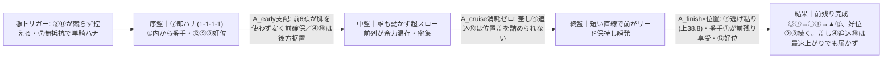
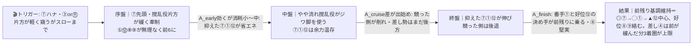
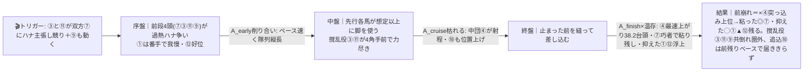

# 🏇 園田12R 神戸ビーフの郷JAみのり B1 4歳以上特別（2026/06/10 園田 ダート右1400m 稍重・前残り）分析

**モデル: scoring-model v5.0（論理ファースト・相変位再帰を因果骨格として使用）** ／ 使用観点: 5観点（E／AB／CD／FGHK／I）＋展開合成 ／ 出走 12頭
> 着順の並びは論理で決め、印で示す（%は出さない）。`score_race.py` は今回未実行（任意サニティ）。
> **確定材料の先取り**: 枠順確定・**馬場=稍重／当日バイアス=前残り（前内有利）確定**を §2-1/§2-2/§3 本文へ織り込み済み。netkeibaで取消・乗替なしを確認。当日のパドック・馬体重・参考R観察値のみ §0 に残す。

## 1. サマリ（結論）

- **予想本命 ◎**: **6-7 スマイルクラーク** — **園田1400巧者（場6-2-6-10・距1400 5-1-5-4）の本物の単騎逃げ**。前走も1-1-1-1で逃げて3着（1.0秒差）と崩れず、C1→B2→B1の上昇途上で勢い。当日**稍重・前残り（前内有利）確定**に脚質・コース適性が完全合致し、本線の超スロー単騎逃げでは前を支配。鞍上**田野豊三（2026 63勝/勝率13.5%）**好調。死角は③⑪と競り合えばオーバーペース自滅の目（伏線γδ）だけ。
- **対抗 ◯**: **1-1 フラッシュケリー** — **最内①＝前内有利の恩恵最大**。テン速2-2-2-2で⑦のすぐ後ろを取れる絶好調馬（1230連勝→1400で2着）。⑦が楽逃げなら番手から差なく差し込め、⑦が競られて甘くなれば抑えて運んだ分そのまま浮上＝**先行争いの内外どちらに転んでも残る全天候型**。
- **単穴 ▲**: **8-12 タンバブショウ** — **自己ベ1:30.3でメンバー最速・園田B1で3着連発の地力最上位**。好位先行で前残り向き。ただし**前走01/14→今回06/10で約5ヶ月の休み明け**＋大外8枠が最大の割引で、地力どおりなら勝ち負け・状態次第で凡走の振れ幅が大きい。
- **連下 △**: **6-8 ゼンダンスバシリ**（好位差し堅実・4歳上昇で前残り順行＝前で確実にまとめる）、**7-9 シャナオウ**（先行＋鞍上小牧太＝全国9位だが前走4角先頭→失速癖が天井）。
- **注意 ×（伏線の保険）**: **4-4 リリーオブザハート** — **上がり38.2のメンバー最速級**。前残り基調では届かないが、③⑪⑦が競り合う**前崩れ（伏線γδ）が来た時だけ突っ込む単穴の保険**。その他 ③ムキズ・⑪ブチエー（撹乱役＝前で競るが終盤止まる自滅サイド）、⑩ショートストップ（後方差し・超ハイのδ専用）、⑤②⑥（脚質・適性で逆風）。
- **最有力展開**: **本線 α 「⑦単騎・超スロー前残り」★★★**（鍵馬: ③⑪⑦）。対抗 **β 「⑦楽逃げ・スロー番手戦」★★**、伏線 **γ 「③⑪競り・前段過熱→前崩れ」★** ／ δ 「総崩れ・差し決着」★
- **展開を分ける一点**: **③ムキズ・⑪ブチエーが⑦に競りかけるか、控えるか。** 控えれば本線α／対抗β（前残り）に固定＝⑦◎①◯⑫▲。両者が引かず⑨も突つけば**伏線γ（前崩れ）へ跳ね、差し④が突っ込み・①⑦が残る**形へ。

> 馬券（何をどう買うか）はユーザー判断。本レポートは展開と着順の予測のみを提示する。市場（オッズ・人気）は一切参照していない。

## 0. 当日アップデート・ボード（当日更新枠 ⏱）

> ここには*分析時点で本当に未知のものだけ*を残す（枠・馬場バイアス＝前残り確定は §2/§3 へ反映済み）。

### 0-1. 当日の参考レース（バイアス採取用）
> **採用優先順位**: ダート（必須）＞ 同日・直前ほど重い ＞ 右回り ＞ 距離帯（1400/1230近辺）。

| R | 発走 | コース | 一致度 | 何を読むか |
|---|------|--------|:-----:|-----------|
| 本日園田の同日 ダ右1400R（4R/11R 等） | 当日特定 | 園田ダ右1400 | ★★★ | 逃げ・先行が本当に残るか／競り合いで前崩れが出るか・テン速馬が何番手まで取れるか |
| 本日園田の ダ右1230R（9R/10R 等） | 当日特定 | 園田ダ右1230 | ★★☆ | 決まり手と前残り度のみ流用（距離違いは割引） |

→ **観察結果（当日確定 2026/06/10）**: バイアス **前残り（前・内有利）＝ユーザー＆他レース調査で確定済**／馬場 **稍重**／決まり手（逃先差追）___／伸びる位置 ___
> 前残りは確定。残る観察は**「競っても前が残るか／競ると前崩れて差しが届くか」の一点**。前者なら本線α・対抗βを固定（⑦◎①◯⑫▲）、後者なら**伏線γを本線★★★へ格上げし④を引き上げ・撹乱役③⑪を消す**。

### 0-2. 馬場（当日確定）
| 項目 | 値 | 質の読み |
|------|----|----------|
| 馬場状態 | **稍重（想定・当日確認）** | 砂が湿りテンが速まる＝**前残りが一層強化**。差し・追込はさらに割引 |
| バイアス | **前残り（前・内有利・決まり手は逃先）＝確定** | 直線約200mと短く後方一気は構造的に届かない。逃げ連対42〜45%／追込連対6%の集計とも一致 |

> **「重」へ悪化したら**: 父エスポワールシチー⑦⑪・父サウスヴィグラス③など道悪パワー血統がさらに浮上、前残りはより極端化。逆に**「外差し・前止まり」へ転じたら**全パターンの leg_advantage が崩れ再合成が必要（§2-2 反証条件）。

### 0-3. パドック・返し馬・馬体重（注目馬・当日記入）
| 印 枠-馬番 馬名 | 馬体重(増減) | パドック/返し馬 | 気配 |
|------------|--------------|------------------|:----:|
| ◎ 6-7 スマイルクラーク | ___ (±__) | テンの行き脚・4/23取止後の馬体回復 | ↑/→/↓ |
| ◯ 1-1 フラッシュケリー | ___ (±__) | 連勝＆距離延長での上積み | ↑/→/↓ |
| ▲ 8-12 タンバブショウ | ___ (±__) | **約5ヶ月休み明けの仕上がり＝最重要・唯一にして最大の死角** | ↑/→/↓ |

### 0-4. その他当日情報（分析時点で未確定のものだけ）
- 当日発表の乗替／騎乗変更: ___（netkeibaで現状なし。出馬表記載の騎手で評価）
- 当日の取消・競走除外: ___（netkeibaで現状なし）
- 天候推移（朝→発走）: ___（稍重がさらに渋るか乾くか）

> ↑ §0-3 の▲⑫の気配が「↓（休み明け重め・腹張り）」なら**▲を割り引き△⑧⑨を引き上げ**。◎⑦の気配が「↓」なら本線αの信頼度が下がり**①を首位想定**へ。

## 2. 展開予想【成果物1】（STEP4a 展開合成）

> **検証契約**: 脚質別有利不利・隊列・各パターンの段階フローを馬番・符号・可能性ティアで固定。レース後に復元ペース層と照合し展開精度を独立採点する。

### 2-1. 脚質分類表（全馬・観点E証拠／確定枠を反映）

| 枠-馬番 | 馬名 | 騎手 | 脚質 | テン速 | 近走通過(1400中心) | 想定位置 |
|:--:|------|------|:--:|:--:|------|------|
| 6-7 | スマイルクラーク | 田野豊 | 逃(単騎ハナ最有力) | 速い | 1-1-1-1 / 1-1-1-1 | **ハナ〜先頭**（園田1400巧者で行き切る公算最大） |
| 3-3 | ムキズ | 佐々世 | 逃→失速(撹乱役) | 速い | 1-1-1-5 | テン前2〜3番手主張も終盤後退・9歳下降 |
| 8-11 | ブチエー | 永井孝 | 逃/先→甘い(撹乱役) | 速い | 1-1-4-6 | テン前々主張も粘れず・隊列を流す側 |
| 1-1 | フラッシュケリー | 下原理 | 番手〜好位先行 | 速い | 2-2-2-2 / 1-1-1-1(1230) | **2〜3番手の番手好位**（⑦のすぐ後ろ・最内） |
| 8-12 | タンバブショウ | 笹田知 | 好位先行 | 速い(休明けで未知) | 3-3-3-3 / 2-2-2-3 | 好位3〜4番手（大外＋5ヶ月明けで位置取り不確実） |
| 7-9 | シャナオウ | 小牧太 | 先行(4角先頭癖→失速) | 速い | 3-3-1-1 | 先行3〜4番手〜4角先頭（突つくと止まる） |
| 6-8 | ゼンダンスバシリ | 新庄海 | 好位差し(堅実) | 中〜速 | 4-5-3-3 | 好位5〜6番手・大崩れ少ない自在型 |
| 4-4 | リリーオブザハート | 小谷哲 | 中団差し(上がり最速級) | 遅め | 7-7-6-6 (上38.2) | 中団6〜7番手から差し（前崩れ待ち） |
| 7-10 | ショートストップ | 山本咲 | 後方差し | 遅い | 9-9-8-7 (上38.5) | 後方8〜9番手から追込（前崩れ待ち） |
| 5-5 | モイル | 井上幹 | 中団〜後方(決め手平凡) | 中〜遅 | 7-6-7-7 | 中後方7〜8番手・展開待ち |
| 2-2 | スピリトーゾ | 南部楓 | 後方一辺倒 | 遅い | 10-10-10-10 | 後方〜最後方・脚質逆風 |
| 5-6 | フォクシー | 塩津璃 | 中団(右回り園田未勝利) | 中 | 3-4-7-8(1230) | 中団も右0-0-0-9で位置取り確信度低 |

> 園田ダ右1400は**1角まで約377〜400mと長くテンで位置を作れる**一方、**直線は約200〜213mと短く差し・追込は届きにくい**（集計: 逃げ連対42〜45%・先行27%・差し15%・追込6%）。稍重＋前残り確定で前有利がさらに強化。枠は概ねフラット〜大外8枠やや有利だが、当日の生条件は「前・内有利」確定＝**最内①が枠の利最大、大外⑪⑫はテンで外を回されやや不利方向**。先行馬が前6頭（⑦③⑪①⑫⑧＋⑨）に密集し、**ハナ争いの過熱度がペース＝着順を決める**。

### 2-2. 展開パターン（複数・可能性ティア）

| id | パターン名 | 可能性 | 発動トリガー | 有利脚質（符号） | 浮上馬 | 沈む馬 |
|----|-----------|:-----:|--------------|------------------|--------|--------|
| α | ⑦単騎・超スロー前残り | 本線★★★ | ③⑪が⑦に競りかけず控える＝⑦無抵抗でハナ・誰も突つかず縦長にならない | 逃+2 先+2 差-2 追-2 | 7 1 12 | 4 10 2 |
| β | ⑦楽逃げ・スロー番手戦 | 対抗★★ | ⑦がハナ、③or⑪の片方が軽く窺うが本格的に競らない＝緩いがスローまで | 逃+2 先+1 差-1 追-2 | 7 1 12 | 4 10 |
| γ | ③⑪競り・前段過熱→前崩れ | 伏線★ | ③と⑪が双方⑦にハナ主張し競る＋⑨も早めに動く＝前段4頭雁行でオーバーペース | 逃-1 先0 差+2 追+1 | 4 1 7 | 3 11 9 |
| δ | 前段総崩れ・ハイペース差し決着 | 伏線★ | ⑦も引かず③⑪⑨＋①まで前段5頭が総力戦＝バイアスを覆す消耗戦 | 逃-2 先-1 差+2 追+2 | 4 10 1 | 3 11 9 |

> 可能性ティア = **本線★★★ / 対抗★★ / 伏線★**（%は使わない）。`有利脚質（符号）`と`浮上馬/沈む馬`は着順・通過順から検証できる**展開検証の正本**。
> **構造的偏り**: α＋β（前残り系）に厚く＝**前残りが基準**。差しが主役になるのは γ＋δ（③⑪が実際に競る）だけ＝当日前残り確定下では例外イベント。**⑦は α/β で1着・γ/δ でも粘り残し＝全パターン連対圏**ゆえ ◎。①は α/β で2番手・γ/δ でも抑えて浮上＝**全天候**で ◯。④は γ/δ でのみ主役＝伏線の保険。

#### 各パターンの段階フロー（序盤→能力→中盤→能力→終盤→能力→結果）

> mermaid は端末では描画されずコードのまま見える → 各図の直後に1行要約を併記。report.md を GitHub/プレビューで開けば図が出る。

**α ⑦単騎・超スロー前残り（本線★★★）**

> 1行要約: **⑦が無抵抗で単騎ハナ→超スローで前6頭が脚を温存→短い直線で前がそのまま、⑦粘り込み・番手①が続き⑫が好位から。後方は構造的に届かない**。

**β ⑦楽逃げ・スロー番手戦（対抗★★）**

> 1行要約: **⑦が楽に先頭で緩く流れ→抑えた⑦①⑫が余力温存→直線でそのまま伸び、競った撹乱役は甘くなる。差し④が拾えるのは3着まで**。

**γ ③⑪競り・前段過熱→前崩れ（伏線★）**

> 1行要約: **③⑪が⑦に競りかけ前段4頭が過熱→中盤で撹乱役が力尽き→止まった前を④が最速上がりで差し込み、粘った⑦と抑えた①⑫が残る。③⑪⑨は共倒れ**。

- **隊列（本線α）**: 序盤先頭 `⑦①` → 最終コーナー前方 `⑦①⑫⑨`
- **隊列（対抗β）**: 序盤先頭 `⑦⑪①` → 最終コーナー前方 `⑦①⑫⑧⑨`
- **隊列（伏線γ）**: 序盤先頭 `⑦③⑪` → 最終コーナー前方 `⑦①⑫④⑧`
- **馬場バイアス**: 前/内有利が基準（直線短く逃げ先行が止まりにくい）。当日確定の前残り稍重でさらに強化。後方の②⑩⑤と差しの④は構造的に届きにくい。
- **反証条件**: ③⑪が控え⑦単騎が確定すれば **α を本線★★★で固定**（⑦◎①◯⑫▲）。③と⑪の双方が明確にハナを主張し⑨も突つけば **γ を本線へ格上げ**（④を引き上げ・撹乱役③⑪⑨を消す）。過熱が極端で①まで前で攻防なら **δ（総崩れ・差し決着）** で④⑩天下。**⑫が休み明けでテンに置かれたら**全パターンで⑫の位置を1〜2列後退させ、空いた番手を⑧⑨が埋める。**馬場が「外差し」へ転換なら全面再合成**。

### 2-3. 当日修正（あれば）

> STEP6 で当日情報を受けた場合のみ記入。現時点で確定済みは「稍重・前残り」のみ（§2-2 に織り込み済）。
> 残る当日判断: ①§0-1 前半参考R（園田ダ1400/1230）で**「競っても前残り」か「競ると前崩れ」か** → 前者は α/β 固定、後者は **γ を本線★★★へ格上げし④首位・①引き上げ**。②§0-3 で**⑫タンバブショウの休み明けの気配** → 重ければ▲割引、◎⑦の気配が「↓」なら**①を首位想定**へ。

## （展開→着順の伝達）

本線α（⑦単騎・超スロー前残り）では、園田1400を知り尽くした ⑦ が無抵抗でハナを切り、超スローに落として誰にも脚を使わせない。短い直線（約200m）で前6頭がリードを保ったまま瞬発勝負になり、**逃げ粘りの ⑦ → そのすぐ後ろで前内有利を最も素直に享受する番手 ① → 好位から地力で詰める ⑫** の順。⑦が ◎ なのは、競られて前が崩れる伏線γ/δ でも「巧者ゆえ粘り残し」で連対圏を外しにくい**全パターン連対**だから。① が ◯ なのは、⑦が楽逃げでも番手から差なく詰められ、⑦が競られて甘くなれば抑えて運んだ分そのまま浮上する**内外どちらに転んでも残る位置取り**だから。④ を ×（保険）に置くのは、前残り基調では届かないが、③⑪が競って前崩れ（γ/δ）が現実化した瞬間だけ最速上がりで主役に回る**唯一の保険**だからで、印は低いが妙味は展開反転時に集中する。

## 3. 着順予想表【成果物2】（メイン出力・表が主役）

> **検証契約**: 並び（印 ◎◯▲△× と行順）＋各馬の展開感度・好材料・懸念点を固定。レース後に実着順と照合し、(a)並びの順位相関＝総合、(b)実現パターンの段階フローと展開感度が当たったか＝純粋な能力読み、を別個採点。**%は出さない**。

| 印 | 枠-馬番 | 馬名 | 騎手 | 展開感度 | 好材料 | 懸念点 |
|----|--------|------|-----------|---------|--------|--------|
| ◎ | 6-7 | スマイルクラーク | 田野豊 | **全パターン連対圏＝展開不問の軸**。本線α/対抗βで1着、伏線γ/δ(前崩れ)でも巧者ゆえ粘り残しで連対 | ・[D/E]園田1400巧者で**場6-2-6-10・距1400 5-1-5-4**。逃げ先行(1-1-1-1)で稍重・前残り(前内有利)に脚質×コースが完全合致 ・[B]近5走3-1-取-1-1と崩れ少なく前走も逃げて3着(1.0秒差)＝力負けでない ・[C]父エスポワールシチー＝地方ダの鬼・力の要る稍重得意で血統も合致 ・[K]田野豊三(2026 63勝/勝率13.5%/3連対36.8%)＝現役好調で先行意識が前残りと噛む | ・[E]③⑪と先手争いになればオーバーペースで自滅の余地(伏線γδ)＝単騎で行けるかが全て ・[A/I]C1→B2→今回B1の上昇途上で相手強化・57kg重め＝B1上位相手に終い甘くなる一戦も |
| ◯ | 1-1 | フラッシュケリー | 下原理 | **内外どちらに転んでも残る全天候型**。α/βで⑦の番手から2着、γ/δ(前崩れ)でも抑えて運んだ分そのまま浮上 | ・[E]**最内①＝前内有利の恩恵最大**。テン速2-2-2-2で⑦のすぐ後ろを取れ、前残りバイアスを最も素直に享受する位置 ・[B]1230を1-1-1-1/4-4-1-1で連勝→1400で2着＝近5走2-5-1-1-2と安定かつ勢い ・[C]父モーニン＝平均勝利距離1280mで1400ど真ん中・短縮素直に向く ・[K]下原理(2026 勝率.159/複勝.435)継続＝乗替リスクなし | ・[B/I]1400は2着止まり(1.1秒差)＝距離延長でワンランク上相手に詰め切れるか未証明 ・[A]自己ベ1:30.5は1230主体で作った時計＝1400専門組との純比較は割引 ・[I]C1→B2→B1の一気上昇で相手強化 |
| ▲ | 8-12 | タンバブショウ | 笹田知 | **地力どおりなら勝ち負け・状態次第で凡走の振れ幅大**。α/βで好位3着、休み明け響けば全パターンで後退 | ・[A]**自己ベ1:30.3でメンバー最速**・場4-2-6-8・距1400 3-2-4-5＝園田1400の地盤が厚く地力最上位 ・[B]近走3-3-2-3で園田B1相手に3着連発＝着差小さく相手強化に対応済み ・[C/E]父エピカリス＝地方ダ1400ど真ん中、好位先行(3-3-3-3)で前残りに脚質合致 | ・[G/H★最大]**前走01/14→今回06/10で約5ヶ月の休み明け**＝仕上がり・実戦勘が最大の不確定要素(地方の調整過程はweb皆無) ・[E/I]大外8枠で先行型はテンの外回りロス＝内有利の今日は枠が不利方向 ・[B]休み前最終戦が10着＝崩れた状態で長期離脱した経緯も気がかり |
| △ | 6-8 | ゼンダンスバシリ | 新庄海 | **前残り順行の堅実枠**。α/βで好位5〜6番手から4〜5着、前で確実にまとめる。γでも止まった前を拾って掲示板圏 | ・[B]近5走4-3-5-3で好位差し・掲示板付近を安定確保＝4歳上昇途上で伸びしろ ・[E]好位(3〜5番手)を取れる脚質で前残りバイアスに合致・上がり39.5で前で確実に脚を使う | ・[A]全3-2-5-18で勝ち切れず3着付近が多い＝決め手が一段足りない ・[C]父フィエールマン＝中長距離ステイヤー系で園田1400稍重のスピード勝負は血統本領外 ・[B]前々走10着など崩れもあり相手強化での取りこぼし |
| △ | 7-9 | シャナオウ | 小牧太 | **位置は前残り向きだが詰めが甘い**。α/βで先行3〜4番手まで、γ/δ(競る側)では真っ先に共倒れ | ・[K]**小牧太(2026 全国9位/勝率.278/複勝.565)＝鞍上強化が最大の好材料** ・[E/B]前走3-3-1-1で4角先頭まで上がる機動力＝前残りに脚質合致・複勝多い3-2-7-11 ・[A]距1400で先行して通用・上がり39.0と前で脚を使える | ・[B/I]**前走4角先頭→6着失速＝先頭に立つと最後持たない持続力不足**が直近で露呈 ・[C]父ヘンリーバローズ＝中距離型で砂深ダ短距離は適性外方向 ・[I]勝ち星伸びず複勝止まり・57kg減量なし |
| × | 4-4 | リリーオブザハート | 小谷哲 | **伏線専用の保険**。前残り基調(α/β)では最速上がりも届かず、③⑪⑦が競る前崩れ(γ/δ)が来た時だけ突っ込み主役 | ・[A]**上がり38.2-38.3とメンバー最速級の決め手**＝地力・末脚は上位、前走1着で上昇基調 ・[C]父ブリックスアンドモルタル＝短縮適性が高く1400短縮はプラス ・[K]小谷哲☆減量で実質53.0＝差し脚を生かす軽量 | ・[E/I]**中団差し・前崩れ歓迎タイプが当日前残り(前内有利・直線約200m)と真逆**＝前が止まらない限り届かない最大の減点 ・[C]母父Galileo(欧州芝)で前残り稍重ダの瞬発要らずの形は血統的に向かない |
| × | 3-3 | ムキズ | 佐々世 | **展開の撹乱役＝自身は沈むサイド**。⑦に競れば共倒れの火種、控えても9歳で終い甘い | ・[A/C]通算18勝・場6-2-6-22の実績豊富な9歳・父サウスヴィグラスで道悪パワーは血統適性 ・[E]1400は逃げて前々(1-1-1-5)＝当日前残りに脚質は合う | ・[B/I]**前走1400も1-1-1-5＝逃げて4角5番手まで後退**・近5走8-9-10と明確に下降(上り40.9) ・[I]距1400実績1-0-4-9＝勝ち切れず最後甘くなる取りこぼし型 |
| × | 7-10 | ショートストップ | 山本咲 | **超ハイのδ専用**。後方差しで前残り(α/β)は届かず、前段総崩れの極端なハイペースで初めて2着まで | ・[A]上がり38.5は④に次ぐメンバー上位の末脚＝地力・決め手は確か ・[B]近5走5-6-7-4-4と着順自体は安定圏で大崩れしない | ・[E/I]**後方差し(9-9-8-7)で前内有利・直線200mと真逆**＝前崩れ待ちの展開依存 ・[C]父ダノンバラード＝稍重&短距離が二重に逆風 ・[A]全8-10-8-50で勝率極端に低く詰めが甘い |
| × | 8-11 | ブチエー | 永井孝 | **撹乱役＝前で競るが終盤止まる**。ペースを流す側でγ/δの引き金、自身は粘れず後退 | ・[A]自己ベ1:30.4はメンバー上位級・距1400 4-3-6-18と経験豊富で複勝多い6-3-10-30 ・[C]父エスポワールシチーで道悪パワーは血統合致 | ・[B/I]**前走1-1-4-6＝逃げて4角で後退し甘い**・近走粘れず持続力不足が顕著 ・[E]大外8枠で逃げ先行型はテンで外を回され内有利の今日は枠が不利方向 |
| × | 5-5 | モイル | 井上幹 | 中団〜後方で前残りと不一致＝展開待ちだが上昇気配なし | ・[A]自己ベ1:30.7は数字上は中位以上、6歳で園田は走り慣れ | ・[B]近5走7-8-10-8-7と全て二桁絡みの凡走続き・決め手平凡(上り40.3) ・[A]場4-4-0-21で勝ち星0＝園田で勝ち切れない頭打ち |
| × | 2-2 | スピリトーゾ | 南部楓 | 後方一辺倒で前残りと真逆＝構造的に届かない | ・[B]前走2-2-2-3の前付けで3着と一変・▲減量で実質54.0 | ・[A/E]**通算2-5-4-44で勝ち味遠い後方型(10-10-10-10)**＝前残りバイアスと最悪の組合せ ・[A]自己ベ1:31.2で上位より見劣り・上り39.4と決め手平凡 |
| × | 5-6 | フォクシー | 塩津璃 | 右回り園田に致命的不適＝枠以前の問題 | ・[K]塩津璃★減量3kgで**最軽量51.0**＝斤量だけは大幅有利 | ・[D/I]**右0-0-0-9・園田場0-0-0-2＝右回り園田は未勝利で複勝圏もゼロ**＝適性ミスマッチ ・[B]近5走10-9-14-10-13と総崩れ・JRA左回り帰りで通用せず |

- **印**: ◎本命／◯対抗／▲単穴／△連下／×注意。並びと印だけで強弱を表す（%は出さない）。
- **観点タグ**: A指数 / B近走 / C血統 / D適性 / E展開 / F調教 / G馬体ローテ / H気配 / K騎手 / I リスク。

## 4. 観点別ハイライト（補足・表で拾い切れない横断）

- **A 指数/時計・B 近走**: 自己ベ1400は ⑫1:30.3＞⑪1:30.4＞①③1:30.5＞⑤1:30.7＞⑧⑩1:31.0＞⑨1:31.4＞⑦④1:31.5 と**僅差で時計だけでは差がつかない**＝脚質×当日バイアスが支配項。上昇途上＝⑦①(C1→B2→B1)・⑧⑨(4歳)・④。明確な下降/頭打ち＝③(9歳)・⑤②⑥。底を見せていないのは⑦(崩れ最少)、地力最上位は⑫(休み明けが変数)。
- **C 血統**: 園田ダ1400稍重・前残りの本場血統は**父エスポワールシチー(⑦⑪・地方ダの鬼/道悪パワー)・父サウスヴィグラス(③・短縮ど真ん中)・父エピカリス(⑫・地方ダ1400適性)・父モーニン(①・1400ど真ん中/短縮向き)**が好適。逆風は⑩ダノンバラード(稍重&短距離が二重に不向き)、⑧フィエールマン(中長距離ステイヤー)、⑨ヘンリーバローズ(砂深ダ適性外)、④母父Galileo(欧州芝で瞬発要らずの前残りに不向き)。
- **D 適性（コース構造）**: 園田1400は1角まで約377〜400m・直線約200mで**前有利が鉄板**（逃連対42〜45%／追込連対6%）。稍重前残り確定でさらに強化。前で立ち回れる⑦①⑫⑧⑨③⑪に追い風、後方の②⑩⑤と差しの④は二重不利。最内①が枠の利最大、大外⑪⑫はテン外回りのロス。
- **E 展開＋STEP4a 合成**（詳細§2）: 前段当事者は⑦③⑪の3頭＋準当事者⑨、番手好位に①⑫⑧。前残り系α+βに厚く＝前残りが基準、差し台頭γ+δは「③⑪が実際に競る」依存の例外。核心は**⑦が単騎で行けるか否か**の一点。
- **F/G/H 状態・K 騎手**: 最強鞍上は⑨の**小牧太(全国9位/.278・.565)**だが馬に失速癖、次いで⑦**田野豊三(63勝/13.5%)**が脚質と最も整合、①下原理(.159/.435)・⑫笹田知宏(27勝/10.5%)。**地方の調教・当日気配・馬体重はweb事前取得不能＝§0で当日補強**（特に⑫の5ヶ月休み明けの仕上がりが全評価の最大の弱点）。
- **I リスク**: 最大減点は②(後方一辺倒+地力薄)・⑥(右回り未勝利+左回り帰り)。次いで⑩(後方差し×前残り)・④(差し脚質×前残り)。本命級⑦①は前残り順行で減点最小、▲⑫は地力最上位を**約5ヶ月休み明け×大外**で割り引いた。

## 5. データの確かさ・補強のお願い

- **確信度が低かった点**: H 当日気配・パドック・馬体重（NAR・web取得不能で全馬空欄）／F 調教（取得不能）。特に**⑫タンバブショウの休み明けの仕上がりは裏取り不能＝確信度低**で、地力最上位を額面どおり評価できないため▲止まり。⑦の4/23取止の経緯（馬体面か）も未確認。乗替・取消はnetkeibaで現状なしを確認したが当日要再確認。
- **ユーザー補強推奨**: ①当日の前半 園田ダ1400/1230R の決まり手・伸び位置（§0-1）→「前残り維持」か「競ると前崩れ」かで α/β ⇄ γ のティアが確定（④の浮上有無が決まる）。②**⑫タンバブショウのパドック・馬体重（5ヶ月休み明けの状態）＝最大の死角**。③⑦③⑪陣営のテンの出方（③⑪が⑦に競りかけるか）＝展開の分岐点。
- **欠損・推定箇所**: コースバイアス・脚質別連対率は集計ソース（umameshi/keibajo.jp）でweb裏取り。各馬の時計・近走・通過順は貼付出馬表（正本）に全面依拠。血統適性は種牡馬傾向ベースの推論（NAR個別馬のweb情報が薄いため確信度中）。

## 6. 免責
予測であり的中を保証しない。賭けは自己責任で、馬券選択・実ベットは人間判断。市場は一切参照していない。
